## 1 前言

### 1.1 本文档说明

本文档主要以在华为云上部署，介绍从资源规划、配置开始，到部署<<< custom_key.brand_name >>>、运行的完整步骤

**说明：**

- 本文档以 **dataflux.cn** 为主域名示例，实际部署替换为相应的域名。

### 1.2 关键词

| **词条**   | **说明**                                                     |
| :--------- | :----------------------------------------------------------- |
| Launcher   | 用于部署安装 <<< custom_key.brand_name >>> 的 WEB 应用，根据 Launcher 服务的引导步骤来完成 <<< custom_key.brand_name >>> 的安装与升级 |
| 运维操作机 | 安装了 kubectl，与目标 Kubernetes 集群在同一网络的运维机器   |
| 安装操作机 | 在浏览器访问 launcher 服务来完成 <<< custom_key.brand_name >>> 引导安装的机器       |
| kubectl    | Kubernetes 的命令行客户端工具，安装在 **运维操作机** 上      |

### 1.3 部署步骤架构

[](https://docs.guance.com/deployment/img/23.install-step.png)

## 2 资源清单

???+ warning "注意"

     **1.** “**最低配置**” 只适合 POC 场景部署，只作功能验证，不适合作为生产环境使用。
    
     **2.** “**推荐配置**” 适合 InfluxDB 少于15 万时间线，Elasticsearch 少于 70 亿文档数（日志、链路、用户访问监测、事件等文档数总和）的数据量场景使用。
    
     **3.** 作为生产部署以实际接入数据量做评估，接入的数据量越多，InfluxDB、Elasticsearch 的存储与规格配置相应也需要越高。
    
     **4.** 如使用自建的 TDengine和OpenSearch ，需要加入到CCE节点池中。OpenSearch自建节点需要3个协调节点(4c8g)以及3个数据节点(8c32g)总共6个节点


| **资源**                  | **规格（最低配置）** | **规格（推荐配置）**   | **数量** | **备注**                                           |
| ------------------------- | -------------------- | ---------------------- | -------- |--------------------------------------------------|
| CCE                       | 标准托管集群版       | 标准托管集群版         | 1        | 版本：1.23                                          |
| CCE 节点池                | 4C8G（单系统盘80GB） | 8C16G（单系统盘120GB） | 4        | 部署华为云CCE托管版集群                                    |
|                           | 2C4G（单系统盘80GB） | 4C8G（单系统盘120GB）  | 2        | 部署 Dataway                                       |
| NAT 网关                  | 小型NAT网关          | 小型NAT网关            | 1        | CCE集群出网使用                                        |
| ELB                       | 共享型               | 共享型                 | 1        | 在 Kubenetes Ingress 前                            |
| RDS                       | 2C4G 50GB            | 4C8G 100GB（主备）     | 1        | MySQL 8.0                                        |
| Redis                     | 4G                   | 8G（标准主从版双副本） | 1        | 版本：6.0                                           |
| TDengine &#124; InfluxDB  | 4C16G 300GB          | 8C32G 500GB（集群版）  | 1        | TDengine(**自建**) 版本：2.6+ InfluxDB 版本：1.7.x       |
| Elasticsearch\|OpenSearch | 4C16G 1T（单节点）   | 16C64G 2T（3节点）     | 1        | Elasticsearch版本：7.10.2  OpenSearch（**自建**）版本：2.3 |
| 域名                      | -                    | -                      | 1        | 主域名需备案，一个主域名下的8个子域名                              |
| SSL 证书                  | 通配符域名证书       | 通配符域名证书         | 1        | -                                                |

## 3 基础设施部署

### 3.1 部署说明

**RDS、Redis、InfluxDB、Elasticsearch **按配置要求创建，创建到同一地域的同一个 **VPC** 网络下。

### 3.2 步骤一、二、三 CCE 服务创建

#### 3.2.1 步骤一 购买CCE集群

进入官网选择导航栏中的**产品**，选择**容器**，点击**云容器引擎 CCE**，选择CCE 集群创建。

- 必须与后文创建的 RDS、 InfluxDB、Elasticsearch 等资源同一地域
- 主要是根据自身情况选择**集群规模**，后面才会创建 **worker 节点**。

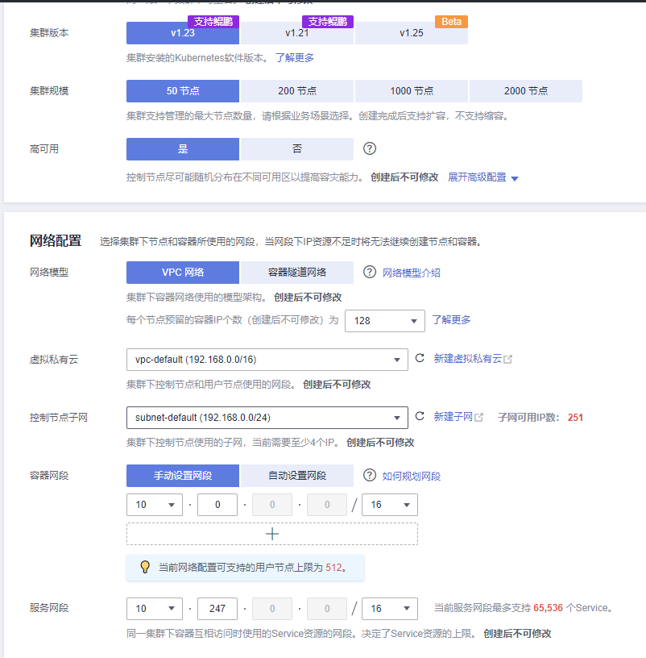

#### 3.2.2 步骤二 worker 节点配置

主要是选择 ECS 规格及数量，规格可以按配置清单要求来创建，或者按实际情况评估，但不可低于最低配置要求，数量至少3台，或3台以上，并且这里建议数据盘不要小于**100GiB**

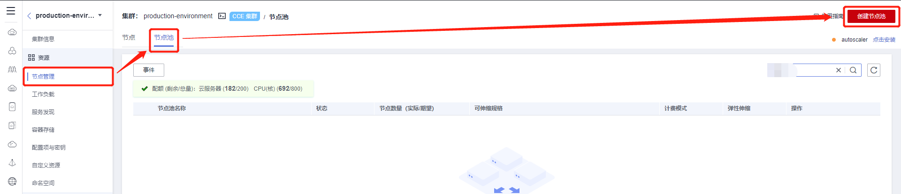

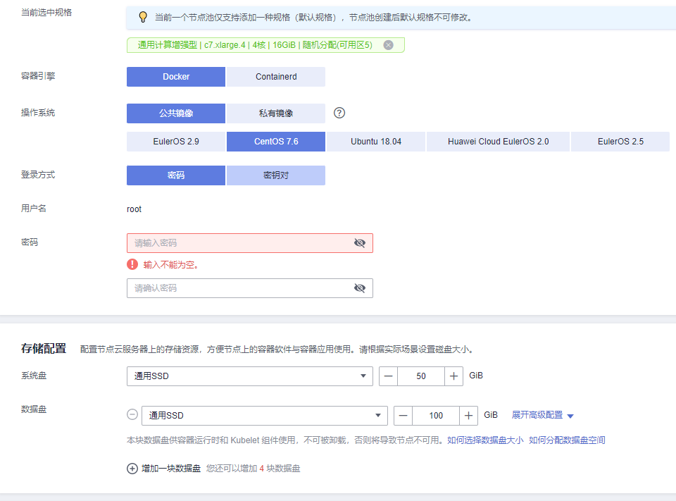

#### 3.2.3 步骤三 插件管理

everest和coredns插件已经在k8s集群购买时默认创建了，这里建议再添加以下2种插件进行安装。并且为了保证集群资源以及避免产生额外费用，建议删除 **ICAgent** 插件。

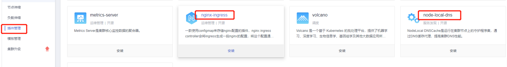

**安装 nginx-ingress 插件**

1）配置cpu及内存的资源限制

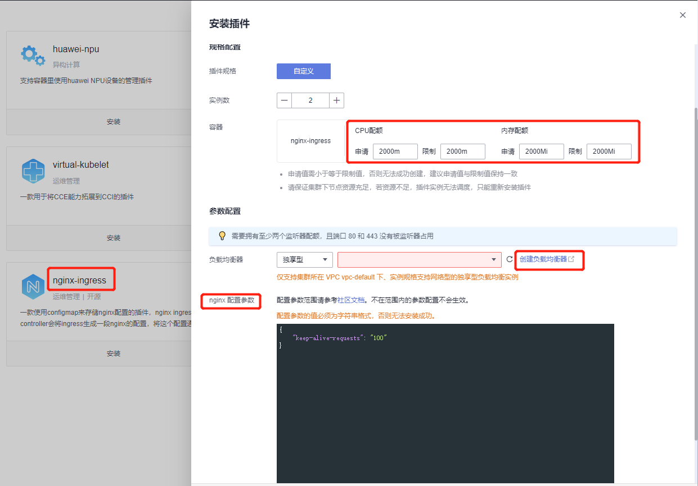

2）创建 负载均衡器 ELB

如果有需要可以选择独享型弹性负载均衡，本文选择共享型。注意：选择**弹性公网IP** 建议选择使用已有，新建一个按流量计费300Mbit/s带宽的IP。

- 独享型和共享型的区别请看以下链接

[https://support.huaweicloud.com/productdesc-elb/elb_pro_0004.html](https://support.huaweicloud.com/productdesc-elb/elb_pro_0004.html){:target="_blank"}

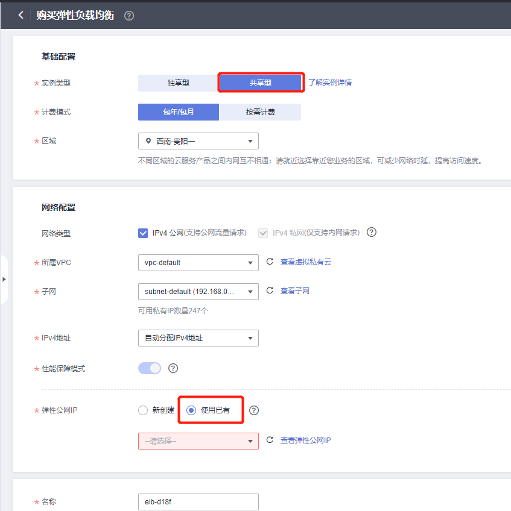

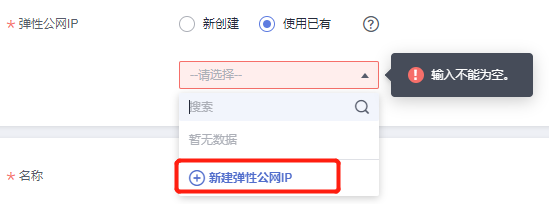

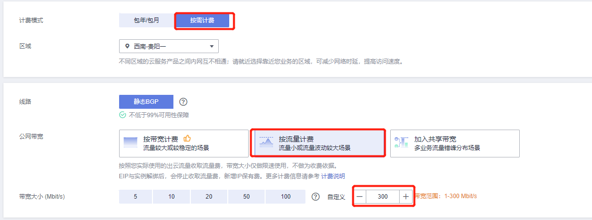

3）配置 **nginx-ingress** 插件关于nginx转发的内容

```shell
# 加入以下内容
{
	"allow-backend-server-header": "true",
	"client-header-buffer-size": "32k",
	"enable-underscores-in-headers": "true",
	"forwarded-for-header": "X-Forwarded-For",
	"generate-request-id": "true",
	"ignore-invalid-headers": "true",
	"keep-alive-requests": "100",
	"large-client-header-buffers": "4 32k",
	"proxy-body-size": "20m",
	"proxy-connect-timeout": "20",
	"reuse-port": "true",
	"server-tokens": "false",
	"ssl-protocols": "TLSv1 TLSv1.1 TLSv1.2 SSLv3",
	"ssl-redirect": "false",
	"use-gzip": "true",
	"worker-cpu-affinity": "auto"
}
```

**安装 node-local-dns 插件**

- 启用 DNS Config 注入功能

???+ warning "注意"
     命名空间需添加node-local-dns-injection=enabled标签，DNS cache功能方能够使用

**删除 ICAgent 插件**（可选）

选择**AOM 应用运维管理**，并卸载 **ICAgent 插件**，以及关闭日志超额继续采集日志和指标采集开关。

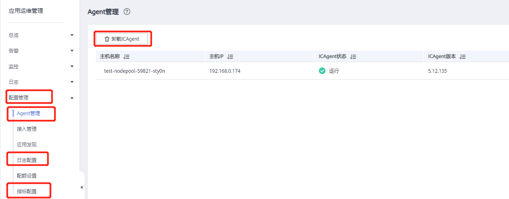

### 3.4 步骤四 缓存服务

- 可选择使用默认的内置缓存服务。 若不使用默认的内置缓存服务，请根据以下要求配置 Redis：
  - 分布式缓存服务（Redis 版本）。
  - Redis 版本：6.0，标准主从架构，支持双副本。
  - 配置 Redis 密码。
  - 将 CCE 自动创建的 ECS 内网 IP 添加至 Redis 白名单。

### 3.5 步骤五 InfluxDB

- 名称：云数据库 GaussDB(for influx)
- 版本：1.7
- 设置 InfluxDB 用户密码
- 将 CCE 自动创建的 ECS 内网 IP，添加到 InfluxDB 白名单

### 3.6 步骤六 Elasticsearch

- 名称：云搜索服务 CSS
- 版本：7.10.2
- 开启安全模式，方可设置管理员账户及密码
- 将 CCE 自动创建的 ECS 内网 IP，添加到 Elasticsearch 白名单

### 3.7 步骤七 RDS

- 名称：云数据库 RDS
- 版本：8.0，标准主备版
- 设置 MySQL root 用户密码
- 将 CCE 自动创建的 ECS 内网 IP，添加到 MySQL 白名单

## 4 kubectl安装及配置

### 4.1 安装kubectl

kubectl 是一个 kubernetes 的一个命令行客户端工具，可以通过此命令行工具去部署应用、检查和管理集群资源等。 我们的 Launcher 就是基于此命令行工具，去部署应用的，具体安装方式可以看官方文档：

[安装和配置kubectl](https://kubernetes.io/docs/tasks/tools/){:target="_blank"}

也可以点击集群，找到 **kubectl 点击查看**

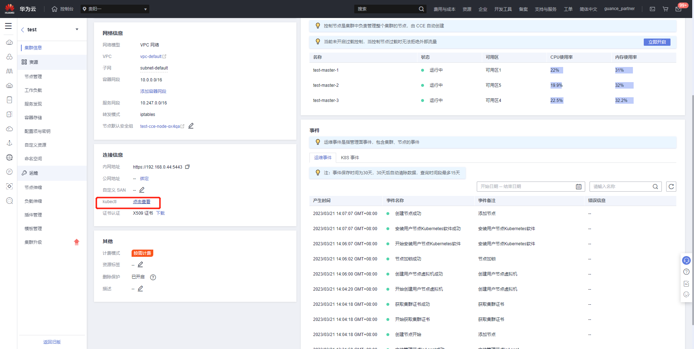

### 4.2 配置 kube config

选择 公网访问还是内网访问的kubeconfig，取决于你的运维操作机是否与集群内网联通。请根据下面的**使用场景**确定接入方式

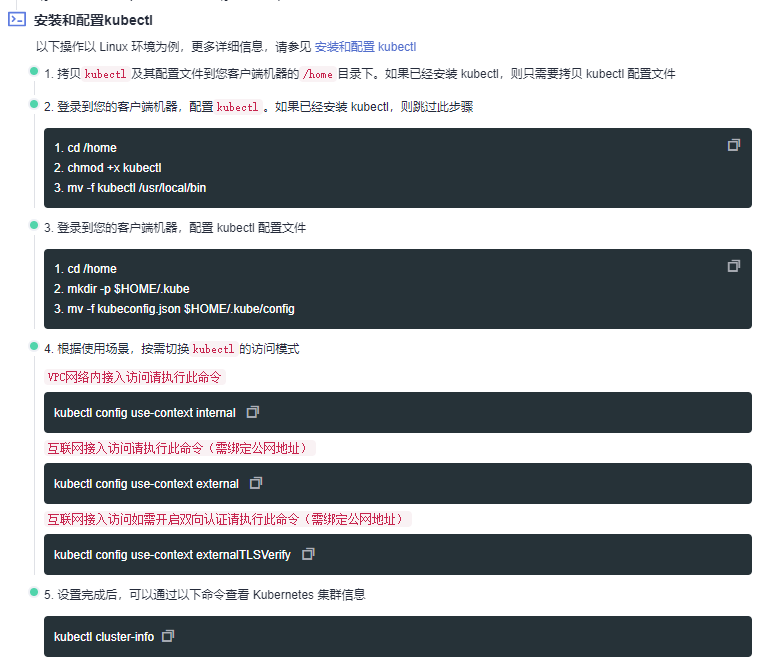

## 5 开始安装

操作完成后，可以参考手册 [开始安装](https://docs.guance.com/deployment/launcher-install/){:target="_blank"}
