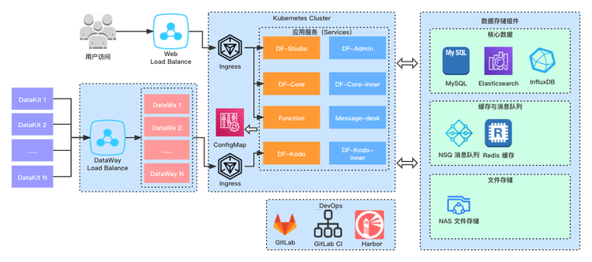
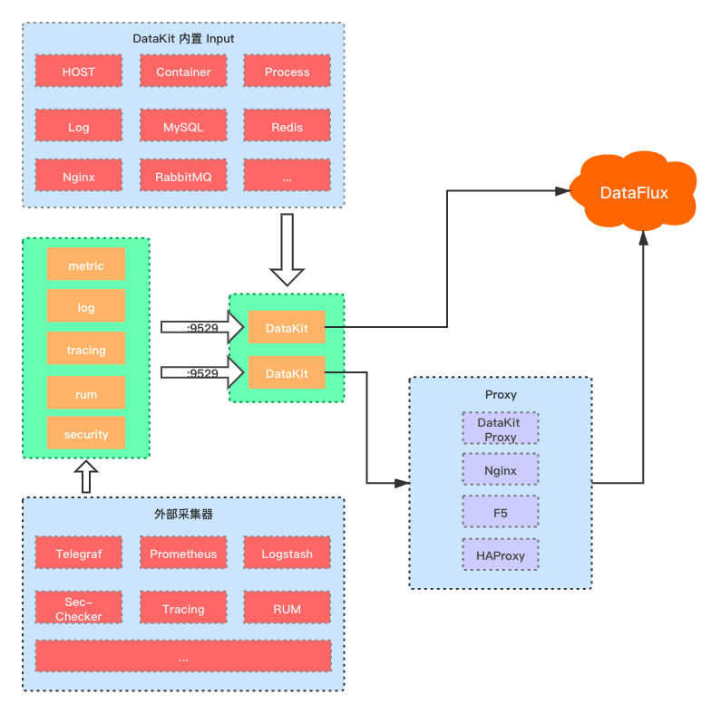
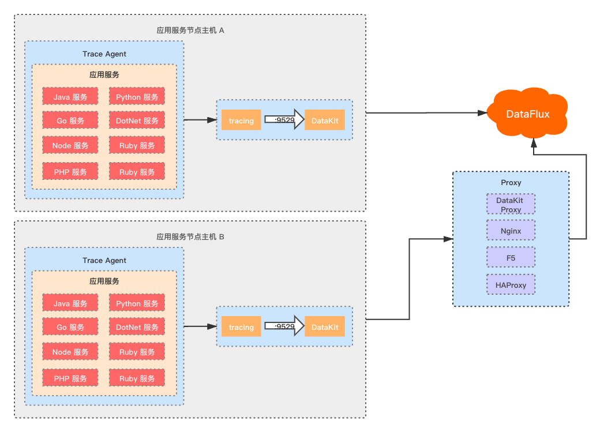
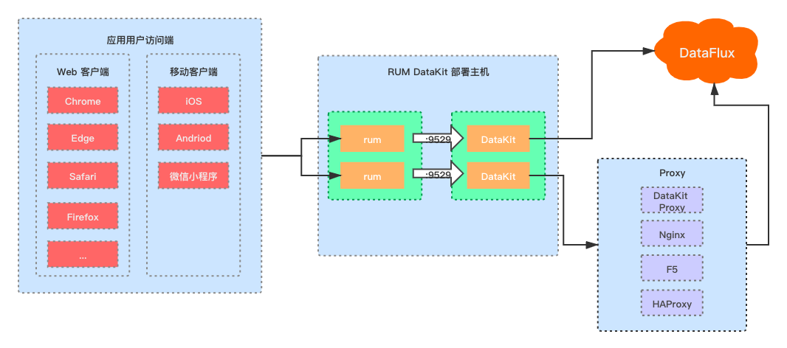

# 混合云部署方案
---

## 概述
“<<< custom_key.brand_name >>>” 分为 SaaS 服务版与私有部署版本两种。
SaaS 服务版本接入快速便捷，我们中心提供所有服务，客户侧只需要安装 DataKit 后开启需要的数据采集即可使用 “<<< custom_key.brand_name >>>” 的所有监测功能。对于部分较大型的应用集群监控、数据不便出内网等原因的客户，“<<< custom_key.brand_name >>>” 可以提供私有部署的版本。

## “<<< custom_key.brand_name >>>” 的部署实施
“<<< custom_key.brand_name >>>” 的部署实施分为三部分：1、 被监控对象的 DataKit 部署，以及数据采集实施；2、在 “<<< custom_key.brand_name >>>” 中对场景、视图、异常检测等的方案实施；3、如果使用私有部署版本的 “<<< custom_key.brand_name >>>”，还需要独立部署一套 “<<< custom_key.brand_name >>>”。

在被监控用户系统主机对象上安装 DataKit，开启相应的数据采集后，需要上报到 “<<< custom_key.brand_name >>>” 中心来对数据进行可视化洞察，指标、日志、链路、RUM 等的数据关联分析，异常检测等。“<<< custom_key.brand_name >>>” 中心可以选择使用 SaaS 版本，或者私有部署版本。
### SaaS 版 “<<< custom_key.brand_name >>>”
SaaS 版本的接入使用成本低、实施速度快（只需要在客户应用环境中安装并开启 DataKit）等特点，适合中小规模的应用集群监控。特点是前期投入成本底，按使用量计费，无前期资源投入。

DataKit 的具体实施方案可以参照后面的 "DataKit 部署方案" 章节。

### 私有部署版 “<<< custom_key.brand_name >>>”
对于较大体量、或者对系统与数据把控程度要求较高的客户，可以使用私有部署版本，独占资源使用。此种方式前期投入成本较高，前期需要一笔资源采购费用，以部署在阿里云上为例，年资源消耗费用至少在20 ~ 30 万（具体根据客户的数据总规模）。

### 私有部署架构

私有部署版 “<<< custom_key.brand_name >>>”，由我们负责为客户安装部署与后期维护升级，为了保证客户应用系统的安全，在 IT 资源的网络规划上，应当与被监测的用户应用服务集群做隔离，只允许被监测对象单向访问 “<<< custom_key.brand_name >>>” 资源，可以使用VPC 隔离、安全组隔离，甚至将 “<<< custom_key.brand_name >>>” 部署到独立的云账号等方式，这样可以有效保障用户系统的数据安全。

“<<< custom_key.brand_name >>>” 中心支持在各种不同的云上部署，也支持在线下主机上部署，由于各种云支持的云产品有所差异，以及不同客户环境在系统上的差异，在部署架构上，整个系统采用了云原生的微服务架构，使用 Kubernetes 作为整个系统的部署底座，保证系统的运行环境的一致性、消除系统差异性。

架构上，所有的用户系统的主机、应用日志、链路等数据都是由 DataKit 采集后，通过 DataWay 上报到 “<<< custom_key.brand_name >>>” 中心，如果采集数据量巨大，在单台 DataWay 无法承载的情况下，DataWay 支持集群化部署，进行水平扩展。

“<<< custom_key.brand_name >>>” 中心为了保证客户端上报数据平衡不堵塞，使用了 NSQ 消息队列（**无中心、节点自动注册和发现的开源消息系统**），所有数据先进入 NSQ 消息队列，Kodo 再排队消费数据，进行处理后将时序指标数据写入 InfluxDB  、日志文本类数据写入 Elasticsearch。

#### 在云上部署
“<<< custom_key.brand_name >>>” 的部署，优先推荐使用云上部署方案，云上部署所有需要的硬件资源，优先选用云厂商支持的云产品，因为云产品本身保证了基础设施的可靠性、稳定性与容灾性。

以阿里云为例，比如 Kubernetes 使用阿里云的 **容器服务 ACK**，InfluxDB 使用阿里云的**时序数据库 InfluxDB 版**云产品、Elasticsearch 使用阿里云的大数据云产品  **Elasticsearch**、MySQL 使用的是阿里云的**云数据库 RDS MySQL 版**、Redis 使用的是**云数据库 Redis 版**。

#### 线下主机上部署

“<<< custom_key.brand_name >>>” 也支持在线下主机上部署，所有的基础组件都需要自己搭建。“<<< custom_key.brand_name >>>” 中心的部署也必须基于 Kubernetes。

首先需要在线下主机部署 Kubernetes 集群，所有的 InfluxDB、Elasticsearch、MySQL、Redis 等基础组件，可以在 Kubernetes 集群中以容器方式部署，为了提高系统的稳定性，推荐方式与 “<<< custom_key.brand_name >>>” 部署在两个容器集群。

## DataKit 部署方案
DataKit 的部署实施都是独立于 “<<< custom_key.brand_name >>>” 中心的架构，数据接入的目标工作空间，不管是接入 SaaS 版  “<<< custom_key.brand_name >>>” 还是私有部署版本 “<<< custom_key.brand_name >>>”，都是没有差异的。
也就是说 DataKit 实施后，可以无缝切换目标 “<<< custom_key.brand_name >>>” 中心，只要更换数据网关地址即可。
### DataKit 基础架构

DataKit 支持三大主流平台： Linux、MacOS、WIndows，在被监控主机中安装上 DataKit，安装后默认已开启了主机的各项基础指标的采集，如：CPU、Mem、Disk、DiskIO、System 等，可以开启更多其他数据的采集，具体配置方法与采集源清单可查看文档 [采集源配置](../integrations/integration-index.md)。

DataKit 安装后，默认开启 9529 监听端口（默认监听端口可以在 datakit.conf 文件中进行修改），作为 HTTP 数据接入服务端口，Metric、Log、Tracing、RUM、Security 等各种外部采集源采集的数据，通过 9529 端口的 HTTP 接口地址到 DataKit 后，经过数据的清洗格式化，再上报到 “<<< custom_key.brand_name >>>” 中心。

### 链路追踪部署

DataKit 支持 Skywalking、Jaeger、Zipkin、ddTrace 等开源链路采集框架的数据接入，将链路采集框架的 agent 输出地址配置为 DataKit tracing 路由地址。

最佳部署方案是将 DataKit 部署在每一台应用服务器中，以便能更好的对应用服务的服务器主机指标、应用日志、syslog、应用服务链路数据等数据统一，进行关联分析。

### 用户访问监测部署

用户访问监测数据的接入方式可以查看文档 [用户访问监测](../real-user-monitoring/index.md)。

部署方式，需要在用户应用服务端部署一个 DataKit（RUM DataKit)，应用客户端引入相应各个端的 rum sdk，用户访问客户端的各种页面请求、资源请求、js 错误信息等数据通过 RUM DataKit 的预处理与格式化后，上传到 “<<< custom_key.brand_name >>>”。

### Kubernetes 部署

在云原生的微服务架构时代，大量的应用服务都采集微服务架构，Kubernetes 作为云原生的容器编排与调度工具，被越来越多的使用。DataKit 也支持容器化的方式来部署。

#### DaemonSet 方式

DataKit 在 kubernetes 中使用 DaemonSet 方式部署的两大优点：

1. 部署简单，同一个服务集群不管多庞大，无需每一台单独部署实施。
1. 配合 Kubernetes 集群的高可伸缩性，可以在自动扩容出来的节点主机上自动开启 DataKit，不需要手工干预。

### 无公网出口集群部署
在某些服务端场景下，并非所有服务服务主机都能出公网访问，对于这些无公网出口的主机上的 DataKit 无法直接将数据上报到 “<<< custom_key.brand_name >>>”。

可以在集群中另开一台有公网出口能力的主机作为 Proxy，集群内所有 DataKit 都经过此 Proxy 将数据上报到 “<<< custom_key.brand_name >>>”。

DataKit 本身也支持 Proxy 级联，可以在这台公网主机安装 DataKit 后开启 Proxy，将集群内的 DataKit 的数据地址都配置到此 Proxy DataKit，内网主机的各项监控数据通过此台有公网出口的 DataKit 将数据上报到 “<<< custom_key.brand_name >>>” 中心。

此外，也可以使用 Nginx、HAProxy、H5 等等 Proxy 方案，将内网数据通过 Proxy 后出公网。

