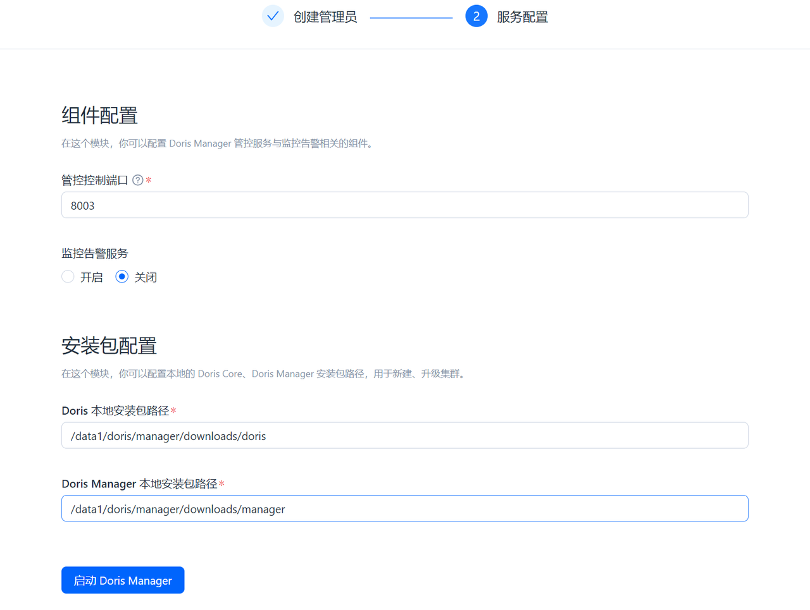
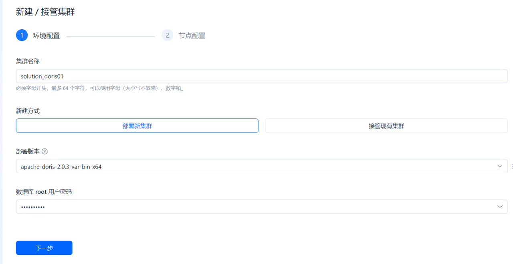
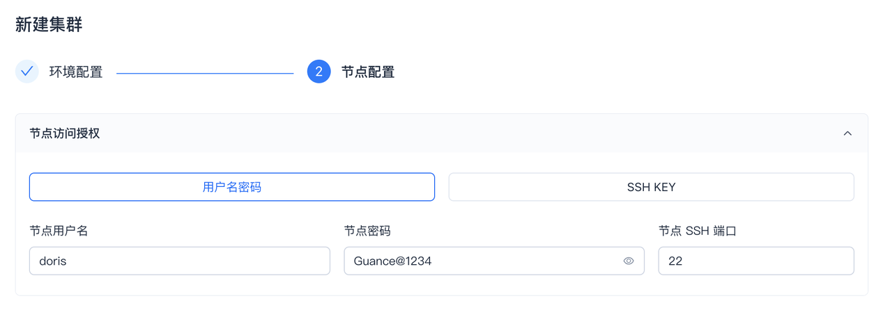
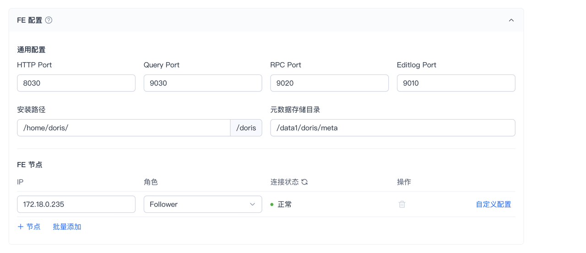
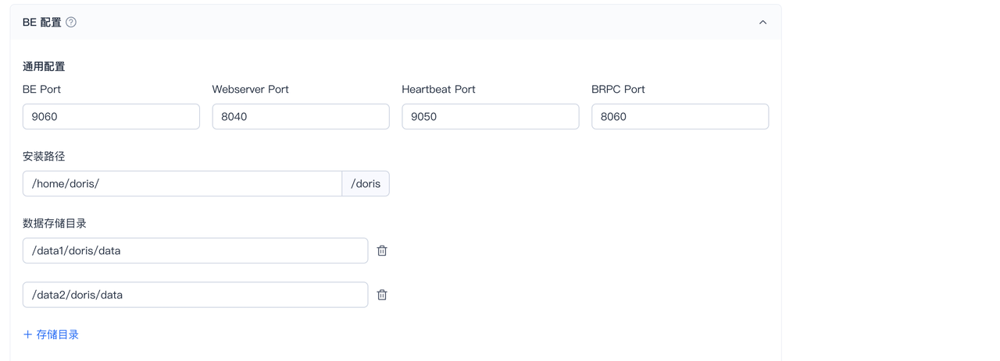
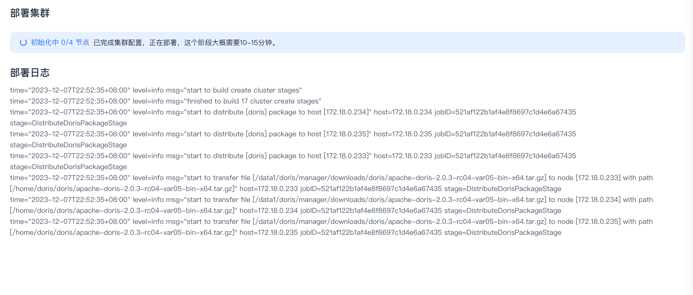
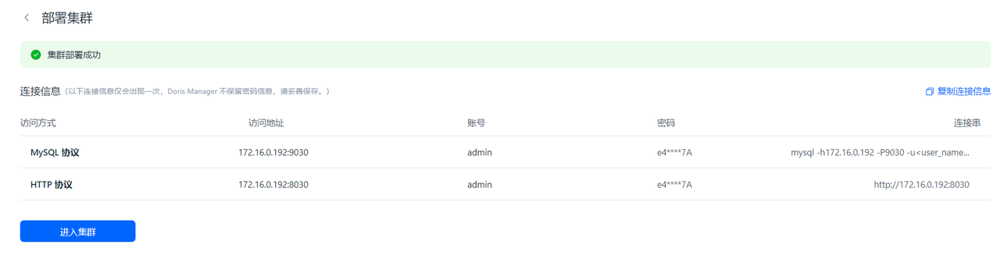
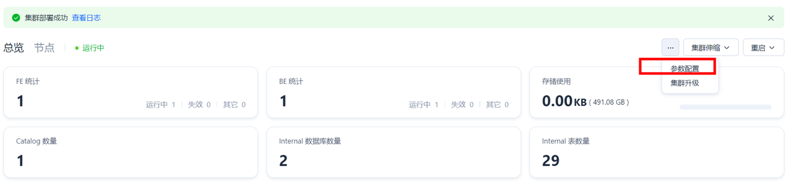
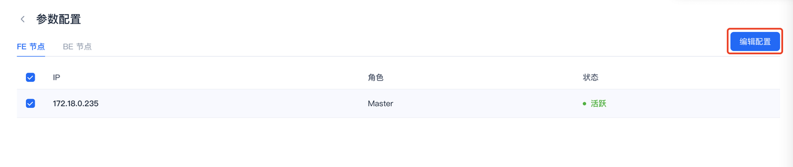

# Doris部署

???+ warning "注意"
     OpenSearch 和 Doris 二选一即可。

## 说明
### 组件说明
* Doris Manager：用于Doris集群的部署、升级、配置修改等
* Doris FE：主要负责用户请求的接入、查询解析规划、元数据的管理、节点管理相关工作
* Doris BE：主要负责数据存储、查询计划的执行
* guance-insert：接收行协议格式数据，积攒在本地（因为空间占用较低通常使用 tmpfs），批量写入Doris BE
* guance-select：将DQL查询翻译为SQL，多数查询使用Doris FE，少部分查询使用Doris BE Thrift接口
* VictoriaMetrics：存储索引级别的写入量指标，用于为采样查询等功能提供辅助性信息

### 服务器说明
通常情况使用以下三组机器，小集群也可混部，服务器系统OS最好是Ubuntu

* doris-fe：CPU 内存 1:2，一块 20GB 以上数据盘存元数据，可使用其中第一台部署Doris Manager
* doris-be：CPU 内存 1:8，以最大化磁盘吞吐为目标调整磁盘配置（个数）
* guancedb-logs：CPU 内存 1:2，可以主机或者容器部署；其中第一台需要一块数据盘部署VictoriaMetrics，用于存储一些Doris 元数据指标
* CPU 需要支持 AVX2 指令集
* 不能被其它机器抢占资源（CPU steal 不能过高）

### 网络说明
* Doris Manager通常部署在doris-fe-01服务器上部署，其所在机器需要能ssh与全部oris机器通信，需要访问其8004端口的网页
* guancedb-logs机器需要通过系统包管理工具（APT）安装supervisor
* 需要通过MySQL协议访问FE机器9030端口，通常是在Doris Manager所在机器安装mysql-client
* guancedb-logs机器需要访问: doris-fe机器的8030和9030端口;doris-be机器的8040和9060端口;guancedb-logs第一台的8428端口
* 提供的账号需要拥有s3存储桶的全部权限

### 部署说明
* s3 存储桶一旦配置不可修改。如需修改，只能清空数据，重新安装Doris集群
* Doris通过 **主机** 部署。无论是否有网络，都需要先将物料包放置到指定位置
* 自采购磁盘硬件做 RAID 不能为 RAID 0


| 类别           | 说明                                           |
|--------------|----------------------------------------------| 
| **主机上部署组件**  | be + fe + manager + guancedb-logs            | | 
| **部署前提条件**   | 1. 提供root密码并支持通过root ssh免密登录<br/>2. CPU架构支持 AVX2指令集 |

## 部署默认配置信息
| 类别          | 说明              |
|-------------|-----------------| 
| **主机部署**    | 参考下文 **主机部署说明** | |

???+ warning "主机部署说明"

    guancedb-logs机器只有单台，提供给<<< custom_key.brand_name >>>业务服务使用的地址为主机ip:8480/8481；
    
    guancedb-logs机器有多台：
    
    a. 能提供ELB能力，使用ELB监听多台guancedb-logs 8480/8481端口，业务服务使用地址为ELB ip:8480/8481；
    
    b. 无法提供ELB能力，可以在业务集群中创建service的方式，业务服务使用地址为：
    
    写入：internal-doris-insert.middleware:8480
    
    读取：internal-doris-select.middleware:8481
    
    参考以下yaml创建service

???- note "doris-service.yaml (单击点开)"
    ```yaml

    ---
    apiVersion: v1
    kind: Service
    metadata: 
      name: internal-doris-insert
      namespace: middleware
    spec:
      ports:
        - protocol: TCP
          port: 8480
          targetPort: 8480
    ---
    apiVersion: v1
    kind: Endpoints
    metadata:
      # 这里的 name 要与 Service 的名字相同
      name: internal-doris-insert
      namespace: middleware
    subsets:
      # 有几台guancedb-logs机器就写几台
      - addresses:
          - ip: 10.7.17.250
        ports:
          - port: 8480      
      - addresses:
          - ip: 10.7.17.251
        ports:
          - port: 8480
    
    ---
    apiVersion: v1
    kind: Service
    metadata: 
      name: internal-doris-select
      namespace: middleware
    spec:
      ports:
        - protocol: TCP
          port: 8481
          targetPort: 8481
    ---
    apiVersion: v1
    kind: Endpoints
    metadata:
      # 这里的 name 要与 Service 的名字相同
      name: internal-doris-select
      namespace: middleware
    subsets:
      # 有几台guancedb-logs机器就写几台
      - addresses:
          - ip: 10.7.17.250
        ports:
          - port: 8481      
      - addresses:
          - ip: 10.7.17.251
        ports:
          - port: 8481
    
    ```

## Doris 部署

### 前置准备
#### 下载物料包
安装工具包。安装包放置在fe-01机器上
```shell
https://static.<<< custom_key.brand_main_domain >>>/guancedb/guancedb-doris-deploy-latest.tar.gz
```

下载包解压后是SelectDB + manager 安装包。安装包放置在fe-01机器上，文件夹位置同inventory/doris-manager.vars.yaml中配置的路径
```shell
https://static.<<< custom_key.brand_main_domain >>>/guancedb/selectdb-latest.tar.gz
```

下载包解压后是GuanceDB安装包。 安装包放置在guancedb-logs所有机器上，文件位置同inventory/guancedb-logs-doris.vars.yaml中配置的路径
```shell
https://static.<<< custom_key.brand_main_domain >>>/guancedb/guancedb-cluster-linux-amd64-latest.tar.gz
```

下载包解压后是victoria-metrics + vmutils 安装包。安装包放置在guancedb-logs所有机器上，文件位置同inventory/guancedb-logs-doris.vars.yaml中配置的路径
```shell
https://static.<<< custom_key.brand_main_domain >>>/guancedb/vmutils-latest.tar.gz
```

#### 配置机器间免密登录
跳板机上(一般是在fe-01上)查看当前用户~/.ssh是否已存在公钥。如果没有生成过公钥，可通过执行下列命令生成并远程发送到其他角色的机器上
```shell
ssh-keygen -t rsa
ssh-copy-id -i ~/.ssh/id_rsa.pub  root@192.168.xxx.xxx
```
???+ warning "部署 check 点"
     
     校验 be 、fe 机器配置是否同一规格;
    
     be、fe 机器间网络互 ping 不超过 1ms;
    
     服务器提供的数据盘是否为裸盘（未进行分区格式化）。

### hosts文件准备
inventory 目录下需要 5 个 hosts 文件，分别为：

* doris-be.hosts.yaml
* doris-fe.hosts.yaml
* doris-manager.hosts.yaml
* guancedb-logs-doris.hosts.yaml
* guancedb-logs-doris-vm.hosts.yaml

每个host文件格式如下：

name 处格式必须为 xxx-doirs-fe-01 或 xxx-doris-be-01

```shell
clusters:
  - name: xxx
    hosts:
      - name: xxx-doris-be-01
        port: xxx
        host: xxx
        user: xxx
        vars:
          default_ipv4: xxx
      - name: xxx-doris-be-02
        port: xxx
        host: xxx
        user: xxx
        vars:
          default_ipv4: xxx

# name:          标记集群，可填poc或者prd
# hosts.name:    标记改服务器角色，可填写xxx-doris-be-01，xxx可以为poc或者prd
# hosts.port:    ssh端口，一般为22
# hosts.host:    ssh目标机器的ip
# hosts.user:    ssh目标机器的用户，一般为root
# vars.default_ipv4: be-01的ip地址
```
???+ warning "说明"

    一般manager同fe部署在一起，doris-manager.hosts.yaml内容同doris-fe.hosts.yaml，如果doris-fe.hosts.yaml里有多台fe主机，doris-manager.hosts.yaml内容只需要填写fe-01一台
    
    guancedb-logs-doris-vm.hosts.yaml内容同guancedb-logs-doris.hosts.yaml，如果guancedb-logs-doris.hosts.yaml里有多台主机，guancedb-logs-doris-vm.hosts.yaml只需填写一台

### 配置变量
修改 inventory/doris-manager.vars.yaml文件
```shell
clusters:
  - name: xxx
    vars:
      # 填机器上的 Doris 安装包路径；如 /root/packages/xxx.tar.gz
      doris_local_path: 
      # 填机器上的 Doris Manager 安装包路径；如 /root/packages/xxx.tar.gz
      manager_local_path:

      # 不使用冷存可以不填以下部分
      oss_endpoint:
      oss_bucket:
      # 可不填
      oss_region:
      # 使用云厂商对象存储时，通常不用填；使用自建的对象存储、endpoint 是 IP 时，需要填「path」 
      addressing_style:
```
修改 inventory/doris.vars.yaml文件
```shell
clusters:
  - name: xxx
    vars:
      # 副本数配置。测试环境可以配置为 1，生产环境建议配置 2 及以上
      replication_factor: 2
      # FE 机器内存 GB
      fe_host_mem_gb:
      # FE 机器数
      fe_num:
      # BE 机器数
      be_num:
      # BE 机器核数
      be_host_core_num:
      # BE 数据盘个数
      be_data_disk_num:
      # BE 单数据盘大小 GB
      be_data_disk_gb:
      # BE cgroup cpu 目录，根据下文查看支持 v1 还是 v2 ，填写对应地址
      be_cgroup_cpu_path: 
      # fe 自身日志保留时间
      fe_log_retention: 3d
      # FE 和 BE 机器的内网网段
      cidr: 
```
修改 inventory/guancedb-logs-doris.vars.yaml文件
```shell
  - name: xxx
    vars:
      # 版本号不在使用,置空
      version: ""
      # 填机器上安装包所在目录；如 /root/packages
      local_dir:
```
修改 inventory/secrets.yaml文件
```shell
clusters:
  - name: xxx
    vars:
      # 操作系统zyadmin用户密码，为符合安全要求，建议使用高强度密码
      os_zyadmin_password:
      # 操作系统doris用户密码，为符合安全要求，建议使用高强度密码
      os_doris_password:
      # root 数据库用户密码，建议使用高强度密码
      doris_root_password:
      # user_read 数据库用户密码，建议使用高强度密码
      doris_user_read_password:
      # 对象存储 access key，不使用冷存可以不填
      oss_ak:
      # 对象存储 secret key，不使用冷存可以不填
      oss_sk:
      # 用于自观测数据上报，是数组，通常只需要填写一个，可不填
      dataway_urls: []
      # 是否设置主机名，混部时需要设置为 false
      set_hostname: false
```
### 安装Python依赖包
```shell
pip3 install -r requirements.txt
```

### 部署Doris Manager
初始化机器，完成后需要检查磁盘挂载
```shell
python3 deployer.py -l clusrer_name -i 'inventory/doris-?e.*.yaml' -p playbooks/doris/initialize-machine.yaml
```
???+ warning "部署 check 点"
     
     服务器磁盘挂载是否正确;
    
     服务器 swap 是否永久关闭;
    
     服务器vm.max_map_count参数是否调整到2000000。

更新 Datakit 配置，用于上报自观测数据
```shell
python3 deployer.py -l cluster_name -i 'inventory/doris-?e.*.yaml' -p playbooks/doris/update-datakit.yaml
```

下载并启动 Doris Manager
```shell
python3 deployer.py -l cluster_name -i 'inventory/doris-manager.*.yaml' -p playbooks/doris/initialize-manager.yaml
```

配置 be 节点 cgroup

需要确定服务器支持 v1 还是v2 版本的cgroup

```shell
如果存在这个路径说明目前生效的是cgroup v1
ls /sys/fs/cgroup/cpu/

如果存在这个路径说明目前生效的是cgroup v2
ls /sys/fs/cgroup/cgroup.controllers
```

=== "cgroup v1"
	
	```shell
	# 创建服务文件
	sudo vi /etc/systemd/system/doris-cgroup-v1.service
	
	#文件内容
	[Unit]
	Description=Create Doris CGroup V1
	After=remote-fs.target
	
	[Service]
	Type=oneshot
	RemainAfterExit=yes
	ExecStart=/bin/bash -c '\
	    mkdir -p /sys/fs/cgroup/cpu/doris && \
	    mkdir -p /sys/fs/cgroup/memory/doris && \
	    chmod 770 /sys/fs/cgroup/cpu/doris && \
	    chmod 770 /sys/fs/cgroup/memory/doris && \
	    chown -R doris:doris /sys/fs/cgroup/cpu/doris && \
	    chown -R doris:doris /sys/fs/cgroup/memory/doris'
	
	[Install]
	WantedBy=multi-user.target
	# 重新加载 systemd 配置
	sudo systemctl daemon-reload
	# 开机启用服务
	sudo systemctl enable doris-cgroup-v1.service
	# 启动服务
	sudo systemctl start doris-cgroup-v1.service
	# 检查服务状态
	sudo systemctl status doris-cgroup-v1.service
	# 检查
	ls -l /sys/fs/cgroup/cpu/doris
	```

=== "cgroup v2"

	```shell
	# 创建服务文件
	sudo vi /etc/systemd/system/doris-cgroup-v2.service
	
	#文件内容
	[Unit]
	Description=Create Doris CGroup V2
	After=remote-fs.target
	
	[Service]
	Type=oneshot
	RemainAfterExit=yes
	ExecStart=/bin/bash -c '\
	    mkdir -p /sys/fs/cgroup/doris && \
	    chmod 770 /sys/fs/cgroup/doris && \
	    chown -R doris:doris /sys/fs/cgroup/doris && \
	    chmod a+w /sys/fs/cgroup/cgroup.procs'
	
	[Install]
	WantedBy=multi-user.target
	# 重新加载 systemd 配置
	sudo systemctl daemon-reload
	# 开机启用服务
	sudo systemctl enable doris-cgroup-v2.service
	# 启动服务
	sudo systemctl start doris-cgroup-v2.service
	# 检查服务状态
	sudo systemctl status doris-cgroup-v2.service
	
	# 验证
	ls -l /sys/fs/cgroup/doris
	cat /sys/fs/cgroup/cgroup.subtree_control
	```

### 部署Doris FE和BE

#### 创建Doris集群
访问地址：http://doris-fe-01:8004

**创建 Doris Manager 管理员账号**

**服务配置**

- 关闭监控告警服务
- Doris 本地安装包路径：/data1/doris/manager/downloads/doris
- Doris Manager 本地安装包路径：/data1/doris/manager/downloads/manager




**启动 Doris Manager**


**新建集群**

- 集群名称：客户简写_test/prd  例子：guance_prd
- 数据库 root 用户密码：填写 inventory/secrets.yaml 中的 doris_root_password



**节点配置**

- 节点用户名：doris
- 节点密码：填写 inventory/secrets.yaml 中的 os_doris_password



- FE 安装路径：/home/doris/
- FE 元数据存储目录：/data1/doris/meta




- BE 安装路径：/home/doris/
- BE 数据存储目录：每块数据盘对应填写一个输入框，/data1/doris/data、/data2/doris/data 等




**部署集群**



#### 配置Doris集群

修改分词配置，参数需要修改为集群名称
```shell
python3 deployer.py -l cluster_name -i 'inventory/doris-be.*.yaml' -p playbooks/doris/update-be.yaml
```
在doris-conf目录渲染 Doris 配置，检查doris-conf文件夹下是否有cluster_name-be.conf和cluster_name-fe.conf生成
```shell
python3 deployer.py -l cluster_name -i 'inventory/doris.vars.yaml' -p playbooks/doris/render-config.yaml
```
???+ warning "部署 check 点"

     配置文件中storage_path是否配置正确；
    
     配置文件中priority_networks配置是否正确。

修改 BE 配置：Doris Manager 集群页右上角「…」按钮 -> 「参数配置」 -> 全选 BE 节点 -> 右上角「编辑配置」 -> 粘贴刚生成的 be.conf -> 勾选「请确认……」 -> 「确定」




修改 FE 配置：Doris Manager 集群页右上角「…」按钮 -> 「参数配置」 -> 全选 FE 节点 -> 右上角「编辑配置」 -> 粘贴刚生成的 fe.conf -> 勾选「请确认……」 -> 「确定」



修改数据库配置
```shell
python3 deployer.py -l cluster_name -i 'inventory/doris-manager.*.yaml' -p playbooks/doris/exec-init-sql.yaml
```

本步骤中会配置s3存储桶，通过下列方式可以验证是否可上传文件到存储桶

fe机器上切换到root用户，登陆到集群中
```shell
mysql -uroot -h127.0.0.1 -P 9030
```
执行下方sql后在s3桶中查看default_resource文件夹中是否有前缀为result_的文件生成，如果没有文件生成，请检查权限
```shell
use information_schema;
SELECT * FROM files
INTO OUTFILE "s3://bucket_name/default_resource/result_"
FORMAT AS ORC
PROPERTIES(
    "s3.endpoint" = "https://xxx",
    "s3.access_key"= "your-ak",
    "s3.secret_key" = "your-sk"
);
```
???+ warning "部署 check 点"

     确定 s3 存储是否可以使用，且配置后无法更改；
    
     s3 endpoint地址必须为内网地址。

### 部署guance-insert、guance-select和VictoriaMetrics
初始化机器
```shell
python3 deployer.py -l cluster_name -i 'inventory/guancedb-logs-doris.*.yaml' -p playbooks/guancedb/initialize-machine.yaml 
```
部署VictoriaMetrics
```shell
 python3 deployer.py -l cluster_name -i 'inventory/guancedb-logs-doris-vm.*.yaml' -p playbooks/doris/init-victoria-metrics.yaml
```
部署 guance-insert 和 guance-select
```shell
python3 deployer.py -l cluster_name -i 'inventory/guancedb-logs-doris.*.yaml' -p playbooks/guancedb/update-config.yaml
```


### 检查集群状态

检查 VictoriaMetrics 状态，IP 为 guance-select 部署机器
```shell
guancedb-logs-doris-api-test -ip xxx -ip yyy -ip zzz
```
检查 Doris 组件
```shell
#检查组件
supervisorctl

#查看日志
/var/log/supervisor/guance-select-stderr.log 
```

