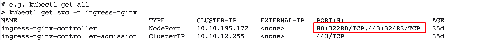

# Kubernetes Ingress 组件部署 {#kube-ingress}

## 简介

Nginx Ingress 是 Kubernetes Ingress 的一种实现。它通过 watch Kubernetes 集群的 Ingress 资源，将 Ingress 规则转换成 Nginx 的配置，让 Nginx 进行7层的流量转发。


## 前提条件

- 已部署 Kubernetes 集群，未部署可参考 [Kubernetes 部署](infra-kubernetes.md)
- （可选）已部署 Helm 工具，未部署可参考 [Helm 安装](helm-install.md) 

## 基础信息及兼容

|     名称     |                   描述                   |
| :------------------: | :---------------------------------------------: |
|     Ingress-nginx 版本     |                   1.3.0                   |
|      支持集群版本       |  1.18+  |
| Ingress-nginx 端口号 |                      32280                      |
|    是否支离线安装    |                       是                        |
|       支持架构       |                   amd64/arm64                   |


## 部署步骤

### 1、安装
Kubernetes Ingress  组件部署参考 [https://github.com/kubernetes/ingress-nginx](https://github.com/kubernetes/ingress-nginx)

=== "Helm"

    - Kubernetes > 1.18

      ```shell
      helm install ingress-nginx ingress-nginx \
          --repo https://pubrepo.<<< custom_key.brand_main_domain >>>/chartrepo/dataflux-chart \
          -n ingress-nginx --create-namespace
      ``` 

    - Kubernetes = 1.18

      ```shell
      helm install ingress-nginx ingress-nginx \
          --repo https://pubrepo.<<< custom_key.brand_main_domain >>>/chartrepo/dataflux-chart \
          --version 4.1.4 \
          -n ingress-nginx --create-namespace
      ``` 

      

=== "Yaml"

    - Kubernetes > 1.18

      下载 [ingress-nginx.yaml](ingress-nginx.yaml)

      执行以下命令安装：

      ```shell
      kubectl apply -f ingress-nginx.yaml
      ``` 
      
    - Kubernetes = 1.18

      下载 [ingress-nginx4.1.4.yaml](ingress-nginx4.1.4.yaml)

      执行以下命令安装：

      ```shell
      kubectl apply -f ingress-nginx4.1.4.yaml
      ``` 


   
### 2、验证部署

#### 2.1 查看 pod 状态
```shell
kubectl get pods -n ingress-nginx 
NAME                                        READY   STATUS    RESTARTS   AGE
ingress-nginx-controller-7bf6c446bf-b7bq7   1/1     Running   1          26d
```

#### 2.2 查询端口

获取 ingress-nginx NodePort 端口号

???+ warning "注意"

    Helm 和 Yaml 部署，NodePort 端口号可能不一样，如图，ingress-nginx NodePort 为 32280、32483。

```shell
kubectl get svc -n ingress-nginx
```



#### 2.3 创建测试服务
```shell
# 创建测试 deployment
kubectl create deployment ingress-test --image=nginx --port=80
# 创建测试 svc
kubectl expose deployment ingress-test --port=80 --target-port=80
# 创建测试 ingress
kubectl create ingress ingress-test --rule='foo.com/=ingress-test:80'
```

#### 2.4 测试

???+ warning "注意"

     `192.168.100.101` 为 Kubernetes 节点 IP

```shell
 curl -H 'Host:foo.com' 192.168.100.101:32280
```
成功结果：
```shell
<!DOCTYPE html>
<html>
<head>
<title>Welcome to nginx!</title>
<style>
html { color-scheme: light dark; }
body { width: 35em; margin: 0 auto;
font-family: Tahoma, Verdana, Arial, sans-serif; }
</style>
</head>
<body>
<h1>Welcome to nginx!</h1>
<p>If you see this page, the nginx web server is successfully installed and
working. Further configuration is required.</p>

<p>For online documentation and support please refer to
<a href="http://nginx.org/">nginx.org</a>.<br/>
Commercial support is available at
<a href="http://nginx.com/">nginx.com</a>.</p>

<p><em>Thank you for using nginx.</em></p>
</body>
</html>
```

#### 2.5 清理测试服务
```shell
kubectl delete deployment ingress-test
kubectl delete svc ingress-test
kubectl delete ingress ingress-test
```


## 卸载

=== "Helm"

    ```shell
    helm uninstall ingress-nginx  -n ingress-nginx 
    ``` 


=== "Yaml"

    ```shell
    kubectl delete -f ingress-nginx.yaml
    ``` 
