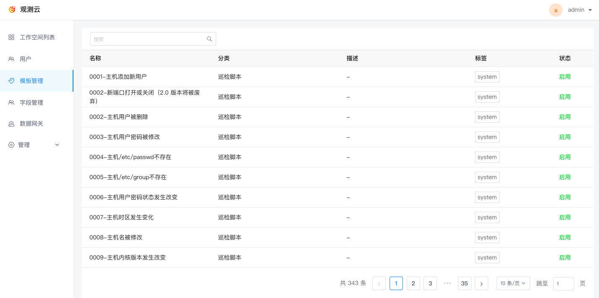

# 模板管理
---

模板管理页面支持查看和搜索观测云所有内置的模板项目，包括场景内置模板库、查看器模板库、内置视图、用户访问场景分析视图、监控器模板、安全巡检集成项目等等。

观测云支持在版本升级时，同步更新到最新的模板项目。

## 操作管理

- 您可直接根据分类或语言对模版进行筛选过滤；在搜索框，可直接输入关键词进行搜索定位；
- 点击批量操作，可批量删除选中的模版；也可直接点击模版右侧删除按钮进行操作；

- 点击导入，即可将各类自定义模版保存为工作空间级别，以便后续使用。

选择包含视图模板、监控器模板、自定义查看器模板、Pipeline 在内的任一模版分类，选定语言，上传格式为 json 文件格式的模版，点击确定即可。

**注意**：文件支持一次性上传多个。