## 域名访问修改成IP访问

### 1、修改相关服务的SVC配置

- 修改forethought-webclient Namespace 下的服务状态

```shell
kubectl patch svc  management-webclient -n forethought-webclient -p '{"spec": {"type": "NodePort"}}'
kubectl patch svc  front-webclient -n forethought-webclient -p '{"spec": {"type": "NodePort"}}'
kubectl patch svc  dataflux-doc -n forethought-webclient -p '{"spec": {"type": "NodePort"}}'
```

- 修改forethought-core Namespace 下的服务状态

```shell
kubectl patch svc  management-backend -n forethought-core -p '{"spec": {"type": "NodePort"}}'
kubectl patch svc  static-resource-nginx -n forethought-core -p '{"spec": {"type": "NodePort"}}'
kubectl patch svc  front-backend -n forethought-core -p '{"spec": {"type": "NodePort"}}'
```

- 修改func2 Namespace 下的服务状态

```shell
kubectl patch svc  server -n func2 -p '{"spec": {"type": "NodePort"}}'
```

> 获取到对应的svc NodePort的端口，并记录下来，后面要使用

### 2、修改相关服务的ConfigMap配置

- **浏览器登陆launcher界面**


- **修改forethought-webclient 关于后台管理的相关Configmap配置**

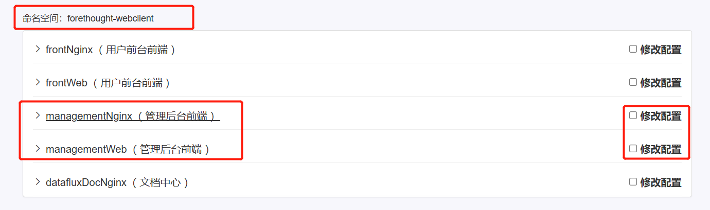

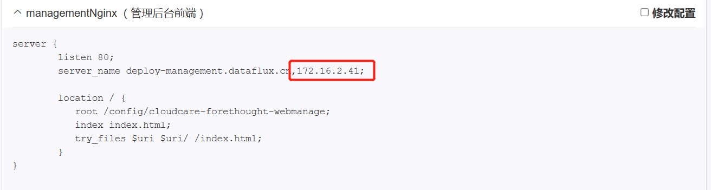

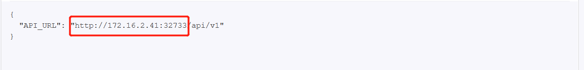

> 修改成forethought-core Namespace下的management-backend对应的主机IP+端口

- **修改forethought-webclient 关于主页的相关Configmap配置**

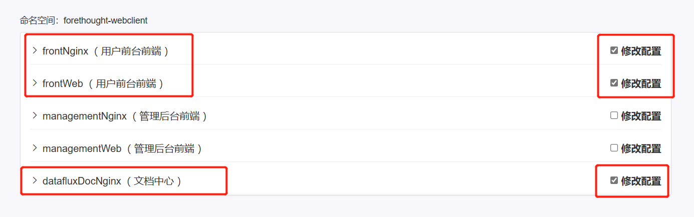

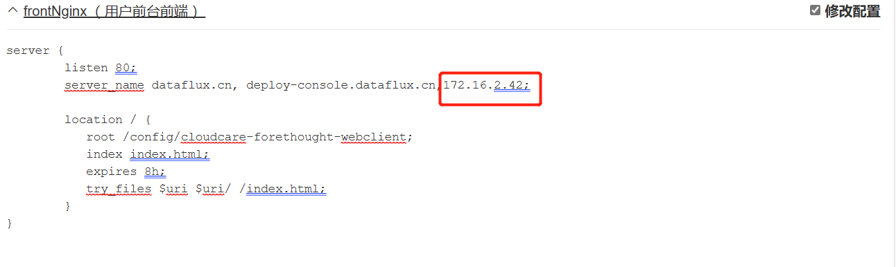

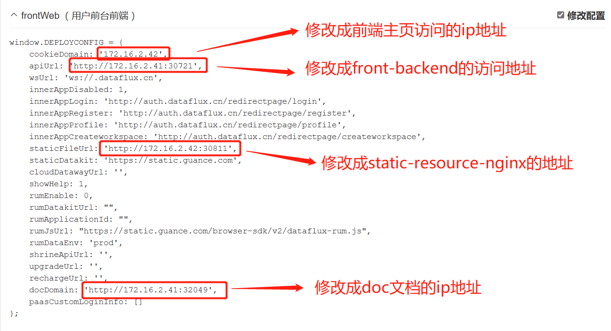

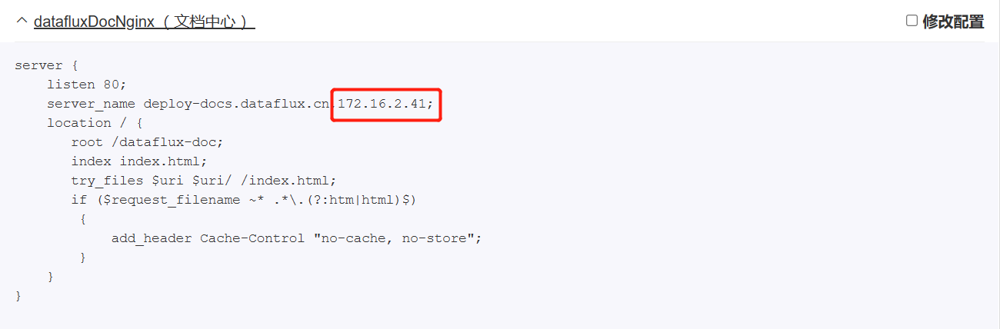

- **修改forethought-core关于主页的相关Configmap配置**

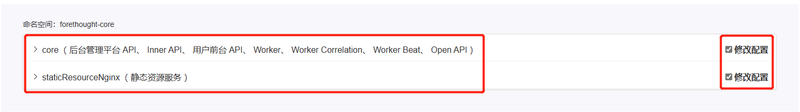

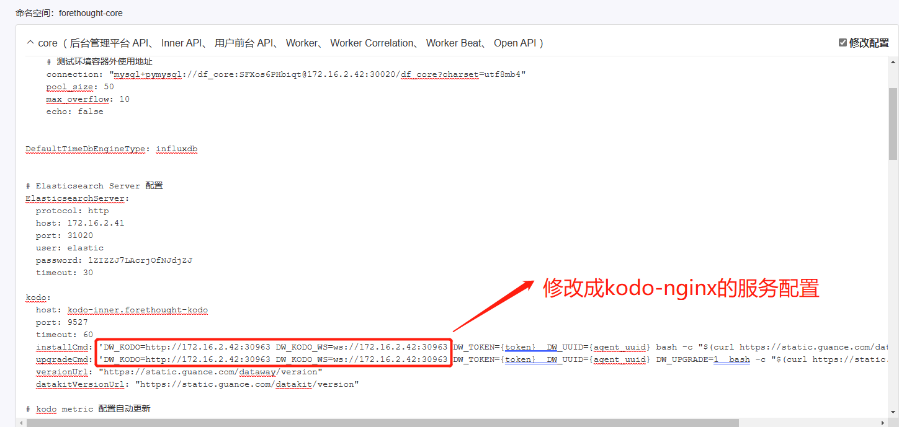

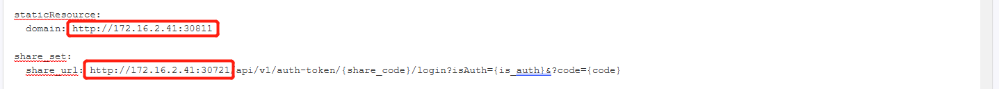

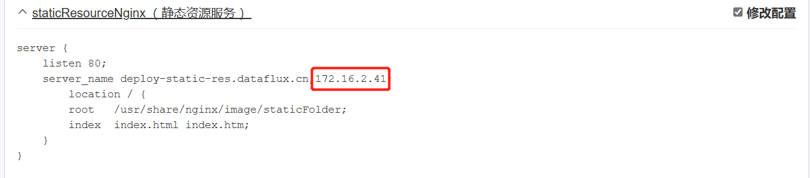

- **修改forethought-kodo中kodo-nginx的相关Configmap配置**

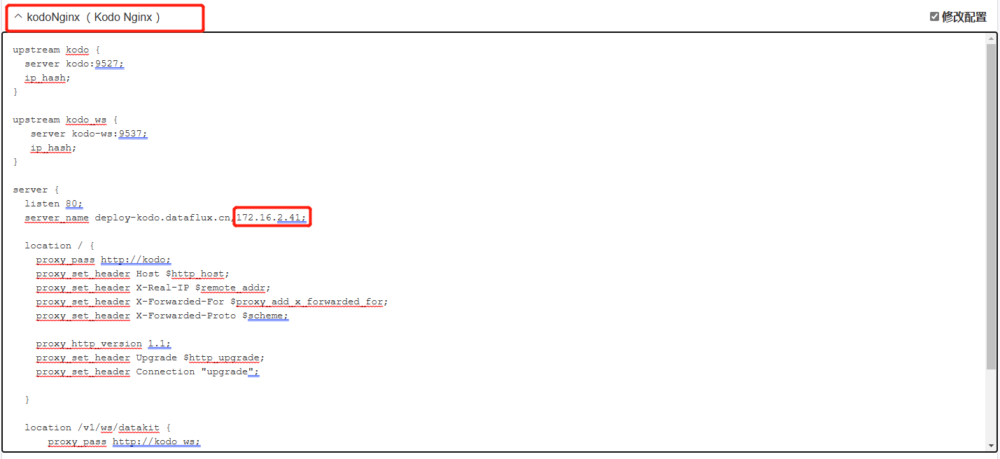

- **修改func2关于func中心的相关Configmap配置**

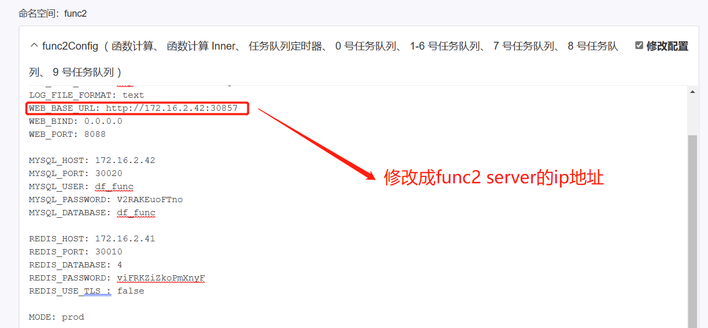

- **确认配置并修改，之后勾选重启服务，并在浏览器进行验证**


> 注：修改之后需等待几分钟，等待服务重启完毕后再进行访问
