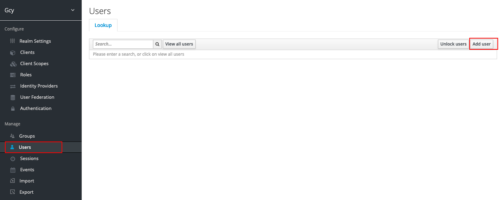

# 配置 Keycloak 用户和映射规则
---

## 简介

本文将介绍如何在 Keycloak 配置用户和映射规则，配置完成后即可以通过映射规则单点登录到<<< custom_key.brand_name >>>。

## 配置 Keycloak 用户 {#new}

1、在创建的 gcy 域，点击 **User**，点击 **Add user**。

2、输入 **Username** 和 **Email**，Email 为必填项，且需要和<<< custom_key.brand_name >>>后台管理配置的用户邮箱保持一致，用于匹配邮箱映射登录到<<< custom_key.brand_name >>>。

3、创建用户后，在 **Credentials** 中为用户设置密码。

## 配置映射规则 

Keycloak 用户添加完成后，为其配置映射规则有<u>两种方式</u>，一种是[为用户直接添加映射规则属性](#user)，另外一种是[添加该用户为用户组，再添加映射规则属性](#group)。

### 为用户添加映射规则属性 {#user}

在创建的 gcy 域，点击 **User**，选择需要添加映射规则的用户，在 **Attributes**，点击 **Add** 添加，如：

- Key：department
- Value：product

#### 配置 Keycloak 映射字段 {#config}

本步骤将创建 Client Scopes 并配置映射字段，用于<u>联动 Keycloak 和<<< custom_key.brand_name >>>之间的映射规则</u>。

1、在创建的 “gcy” 领域下，点击 **Client Scopes**，在右侧点击 **Create**。

2、在 **Add client scope** 填写需要配置映射的属性字段，如 “department”，点击 **Save**。

3、点击进入已创建好的 Key，如 “department”，在 **Mappers**，右侧点击 **Create** 创建映射。

4、在弹出的窗口 **Create Protocol Mappers**，按照以下内容填写完成后，点击 **Save**。

| 字段      | 说明                          |
| ----------- | ------------------------------------ |
| Name      | 填入映射属性字段，如 “department”。                          |
| Mapper Type      | 选择 “User Attribute”。                          |
| User Attribute      | 填入映射属性字段，如 “department”。                          |
| Token Claim Name      | 填入映射属性字段，如 “department”。                          |
| Claim JSON Type      | 选择 “String”。                          |

5、在 **Client**，点击已创建的 “Guance” 客户端。

6、点击进入，在 **Client Scopes > Setup**，把创建的 “department” 添加到右侧 **Assigned Default Client Scopes**。

#### 验证映射规则是否可用

以上步骤完成后，您可以通过 Keycloak 直接单点登录到<<< custom_key.brand_name >>>，查看是否已加入到对应的工作空间以及是否被赋予相应角色。

您也可以在 Keycloak 对映射规则进行验证：

配置完映射规则以后，在 **Client > Client Scopes > Evaluate > Generated User Info**，可查看映射规则是否可用。如下图，已存在配置的映射字段，如 “department”，则说明可以通过该字段进行映射登录。

#### 配置<<< custom_key.brand_name >>>管理后台映射规则

除配置 Keycloak 单点登录映射规则外，您还需在管理后台配置映射规则。两者配置完成后映射规则才能生效。

前往<<< custom_key.brand_name >>>部署版**管理后台 > [映射规则](./setting.md#mapping)** 进行配置。匹配到的账号会根据规则加入到工作空间并授予相应角色。

<!--

-->

#### 使用 Keycloak 账号单点登录<<< custom_key.brand_name >>>

所有配置完成后，即可[单点登录到<<< custom_key.brand_name >>>](keycloak-sso.md#5-keycloak)。

### 为用户组添加映射规则属性 {#group}

1、在创建的 gcy 域，点击 **Groups**，点击 **New**，创建一个新的用户组，如 “department”。

2、在 **Attributes**，点击 **Add** 添加，如：

- Key：department
- Value：product

3、在 **User > Groups**，点击 **Join**，为用户添加用户组。

4、[开始配置映射规则](#config)。