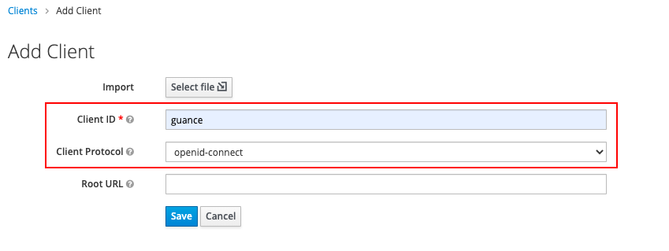
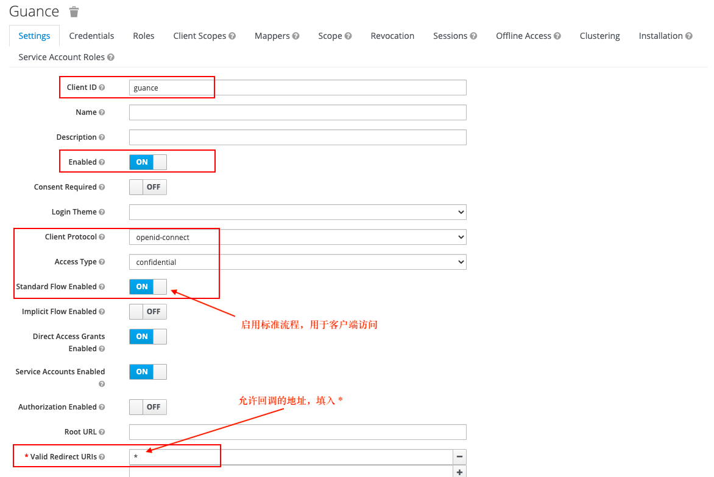
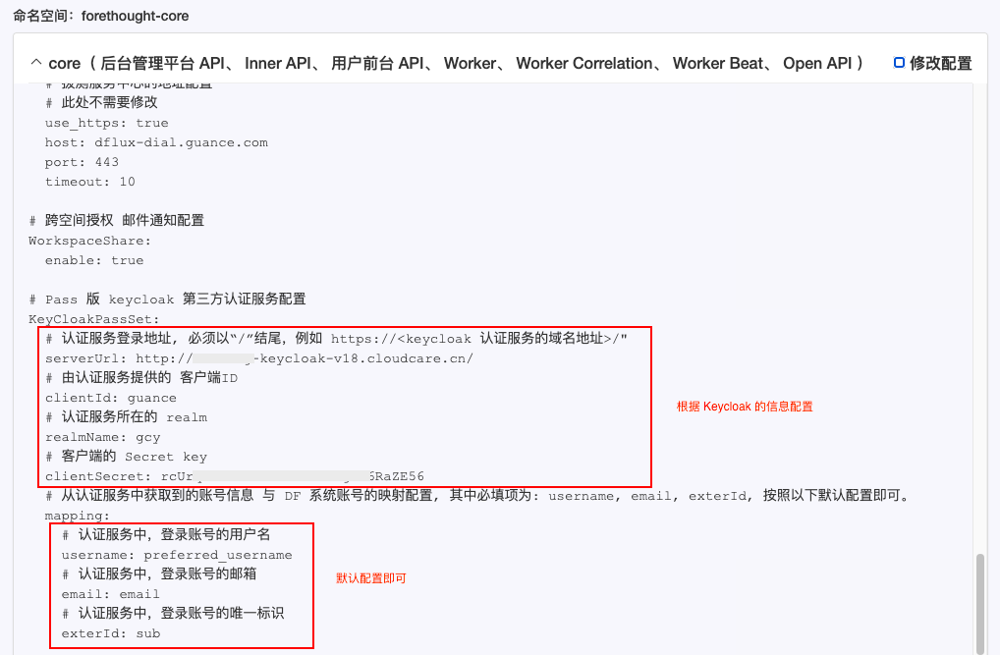
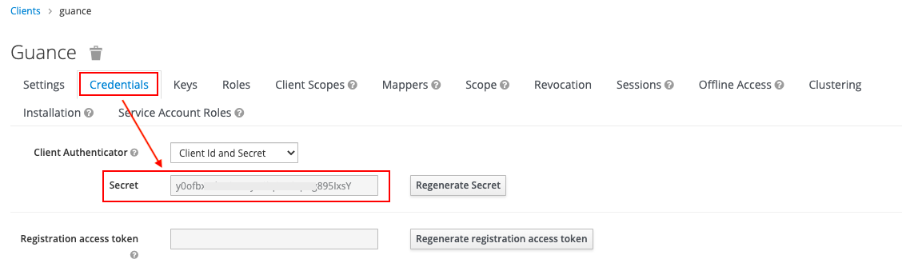
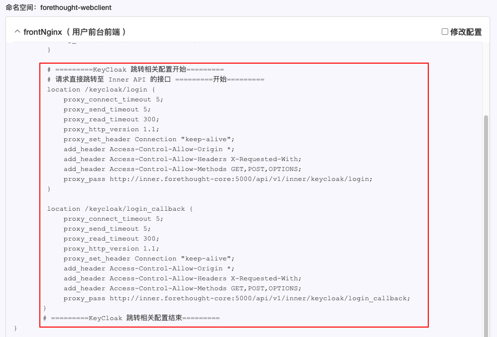
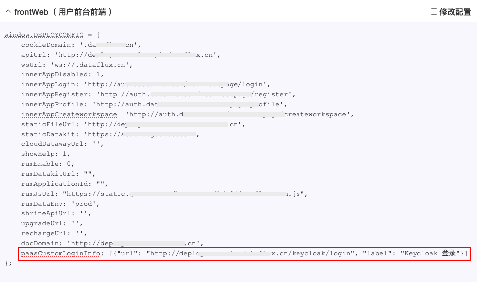
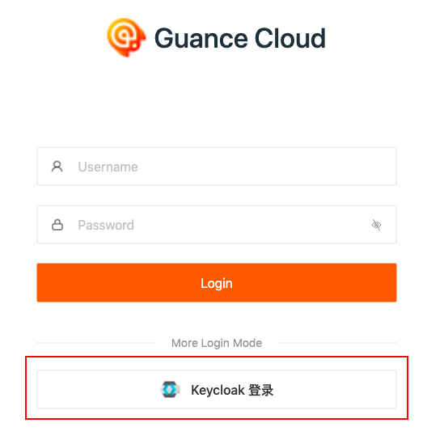
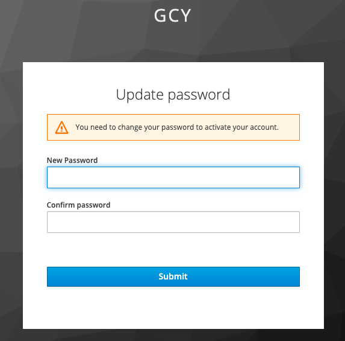
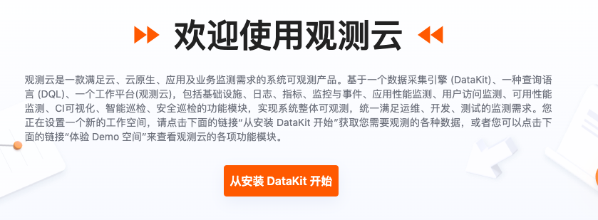

# Keycloak 单点登录（部署版）
---

## 简介

观测云部署版支持基于 OpenID Connect 和 OAuth 2.0 两种协议的单点登录方式。本文将以 Keycloak 登录为例进行讲解。

Keycloak 是一个开源的、面向现代应用和分布式服务的身份认证和访问控制的解决方案，观测云部署版基于 OpenID Connect 协议，实现企业 Keycloak 账户单点登录到观测云平台访问对应工作空间资源，无需另外创建企业/团队的观测云账号。

<font color=coral>**注意：**</font>本文适用于使用 OpenID Connect 协议，且 Keycloak 为 18.0.2 及以下的版本。

## 概念先解

| 名词      | 解释                          |
| ----------- | ------------------------------------ |
| Realm       | 领域，类似工作空间，用于管理用户、凭证、角色和用户组，领域之间相互隔离。  |
| Clients       | 客户端是可以请求 Keycloak 对用户进行认证的应用或者服务。 |
| Users    | 能够登录到系统的用户账号，需要配置登录邮箱以及 Credentials。 |
| Credentials      | 验证用户身份的凭证，可用于设置用户账号的登录密码。                          |
| Authentication      | 识别和验证用户的过程。                          |
| Authorization      | 授予用户访问权限的过程。                          |
| Roles      | 用于识别用户的身份类型，如管理员、普通用户等。                          |
| User role mapping      | 用户与角色之间的映射关系，一个用户可关联多个角色。                          |
| Groups      | 管理用户组，支持将角色映射到组。                          |


## 操作步骤 {#steps}

### 1、创建 Keycloak realm

> 注意：Keycloak 本身有一个主域（Master），我们需要创建一个新的领域（类似工作空间）。

1）在 Keycloak 管理控制台，点击 **Master > Add realm**。


2）在 **Add realm** 页面，在 **Name** 处输入领域名称，如 “gcy”，点击 **Create**，即可创建一个新的领域。


### 2、创建 Client 并配置 openid-connect 协议

> 注意：本步骤将创建 Keycloak 客户端并配置 openid-connect 协议，建立 Keycloak 和观测云之间的信任关系使之相互信任。

1）在新创建的 “gcy” 领域下，点击 **Client**，在右侧点击 **Create**。


2）在 **Add Client** 按照以下内容填写完成后，点击 **Save**。



Client 创建后，按照如下截图进行配置，点击 **Save**。

- Client Protocol：openid-connect
- Access Type：confidential
- Standard Flow Enabled：ON
- Direct Access Grants Enabled：ON
- Service Accounts Enabled：ON
- Valid Redirect URIs：*



### 3、[配置 Keycloak 用户](./keycloak-rule.md#new)


### 4、观测云 Launcher 配置 {#config}

1）在观测云 Launcher **命名空间：forethought-core > core** 中配置 Keycloak 的基本信息。

```

# OIDC 客户端配置(当该项配置中配置了 wellKnowURL 时, KeyCloakPassSet 配置项自动失效)
OIDCClientSet:
  # OIDC Endpoints 配置地址,即完整的 `https://xxx.xxx.com/xx/.well-known/openid-configuration` 地址.
  wellKnowURL:
  # 由认证服务提供的 客户端ID
  clientId:
  # 客户端的 Secret key
  clientSecret:
  # 认证方式，目前只支持 authorization_code
  grantType: authorization_code
  verify: false
  # 数据访问范围
  scope: "openid profile email address"
  # 认证服务器认证成功之后的回调地址
  innerUrl: "{}://{}/oidc/callback"
  # 认证服务认证成功并回调 DF 系统之后，DF系统拿到用户信息后跳转到前端中专页面的地址
  frontUrl: "{}://{}/tomiddlepage?uuid={}"
  # 从认证服务中获取到的账号信息 与 DF 系统账号的映射配置, 其中必填项为: username, email, exterId
  mapping:
    # 认证服务中，登录账号的用户名，必填，如果值不存在，则取 email
    username: preferred_username
    # 认证服务中，登录账号的邮箱，必填
    email: email
    # 认证服务中，登录账号的手机号字段名，选填
    mobile: phone_number
    # 认证服务中，登录账号的唯一标识， 必填
    exterId: sub
```

参考示例图：



以上示例图中的 “clientSecret:”，可在 **Client > Client ID（如 Guance） > Credentials** 中获取。



2）在观测云 Launcher **命名空间：forethought-webclient > frontNginx** 中配置跳转信息。

```
        # =========KeyCloak 跳转相关配置开始=========
        # 请求直接跳转至 Inner API 的接口 =========开始=========
        location /keycloak/login {
            proxy_connect_timeout 5;
            proxy_send_timeout 5;
            proxy_read_timeout 300;
            proxy_http_version 1.1;
            proxy_set_header Connection "keep-alive";
            add_header Access-Control-Allow-Origin *;
            add_header Access-Control-Allow-Headers X-Requested-With;
            add_header Access-Control-Allow-Methods GET,POST,OPTIONS;
            proxy_pass http://inner.forethought-core:5000/api/v1/inner/keycloak/login;
        }
         
        location /keycloak/login_callback {
            proxy_connect_timeout 5;
            proxy_send_timeout 5;
            proxy_read_timeout 300;
            proxy_http_version 1.1;
            proxy_set_header Connection "keep-alive";
            add_header Access-Control-Allow-Origin *;
            add_header Access-Control-Allow-Headers X-Requested-With;
            add_header Access-Control-Allow-Methods GET,POST,OPTIONS;
            proxy_pass http://inner.forethought-core:5000/api/v1/inner/keycloak/login_callback;
       }
       # =========KeyCloak 跳转相关配置结束=========
```

参考示例图：



3）在观测云 Launcher **命名空间：forethought-webclient > frontWeb** 中配置 Keycloak 用户登录观测云部署版的入口地址。

```
window.DEPLOYCONFIG = {
 
    ......
    paasCustomLoginInfo:[
        {url:"http://<观测云的部署域名>/keycloak/login",label:"Keycloak 登录"}
    ]
     
    ......
 
};
```

参考示例图：



4) 配置完成后，勾选更新的**修改配置**，并确认重启。


### 5、使用 Keycloak 账号单点登录观测云

所有配置完成后，即可使用单点登录到观测云。

1）打开观测云部署版登录地址，在登录页面选择 **Keycloak 单点登录**。



2）输入在 Keycloak 配置的邮箱地址。


3）更新登录密码。



4）登录到观测云对应的工作空间。

???+ warning

    - 若提示“当前账户未加入任何工作空间，请移步至管理后台将该账户添加到工作空间。”，则需要登录观测云管理后台为用户添加工作空间。

    > 更多详情可参考文档 [部署版工作空间管理](space.md)。
 
    

    在观测云管理后台为用户添加完工作空间后，用户即可开始使用观测云。



