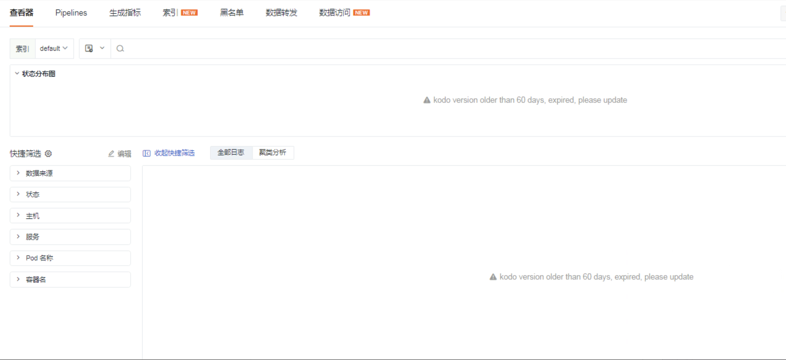

# 部署版kodo版本过期
---

## 说明
在{{{ custom_key.brand_name }}}1.93.173版本后，当页面报错kodo服务版本过期时，可以通过在服务中添加参数的方式继续使用{{{ custom_key.brand_name }}}。**但服务版本落后很多，无法使用新功能，
且在后续想使用新版本的时候，由于跨越版本过多，升级过程繁琐且容易出错，因此建议私有部署项目升级频率同SaaS迭代或最好不要和最新版本超过3个迭代。**

## 问题描述
在私有部署环境中，如果kodo服务版本与SaaS 现版本超过 180天，前端页面会抛错 **kodo version older than 60 days, expired, please update**,导致{{{ custom_key.brand_name }}}部分功能不可用。

## 问题解决
在服务中添加参数，并重启服务。
```shell
kubectl -n forethought-kodo edit deploy kodo
kubectl -n forethought-kodo edit deploy kodo-inner
```
添加以下参数
```yaml
          ...
          env:
            # 添加以下内容
            - name: KODO_DISABLE_EXPIRED_VESION_CHECKING
              value: "true"
```
编辑完成后观察 kodo、kodo-inner pod 是否已经重启。
