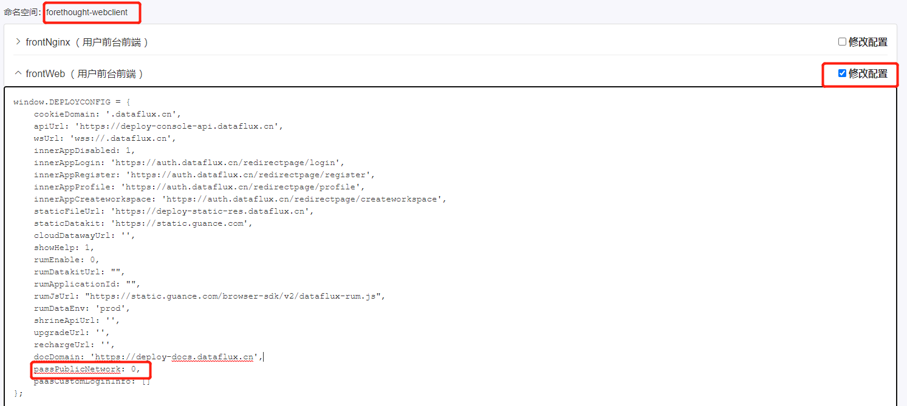
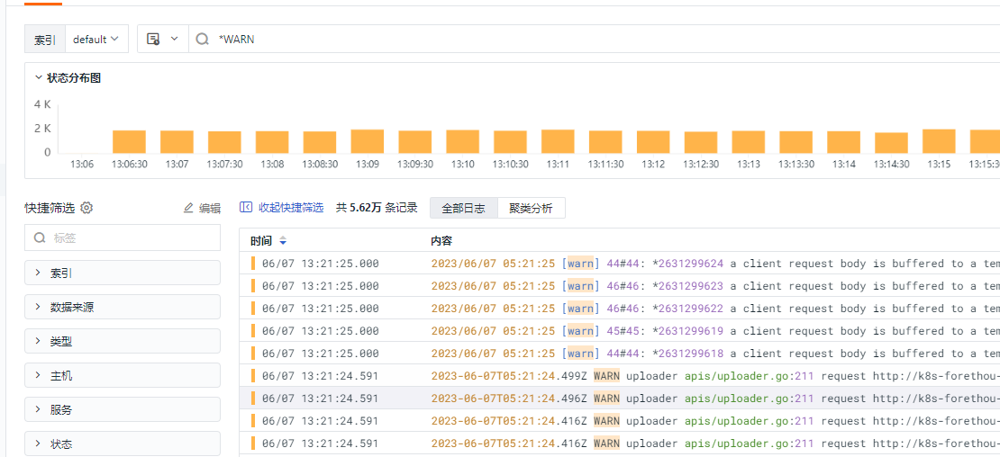
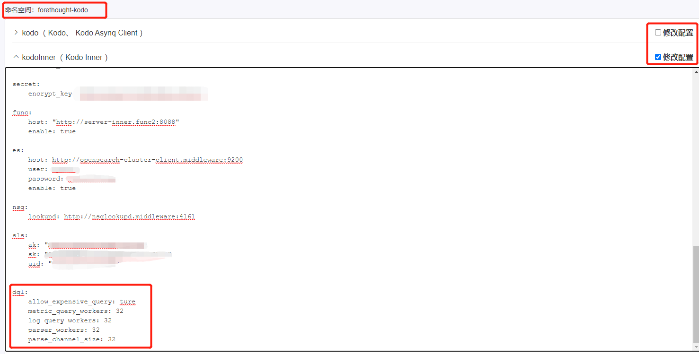

## 概述

本文档旨在通过 launcher 修改相关配置，为了更好的跟自身环境适配，达到优化相关配置和满足个性化配置的目的。

## launcher 操作步骤 

1、浏览器访问 launcher 控制台

2、选择右上角，进入**修改应用配置**界面

3、要修改对应的配置文件时，要**勾选修改配置**选项，即可被修改。

4、完成配置修改后，需要勾选页面底部右下角的 **修改配置后自动重启相关服务 **，再点击确认修改配置。

## 无公网环境需要做的配置

无公网环境配置是指，除了集群机器外，访问的机器也没有网络的情况。

**操作步骤**

选择 forethought-webclient Namespace 下的 frontWeb 配置，把 `passPublicNetwork` 修改为 **0** 。如果没有此字段，请自行添加上去。

如图所示：

## 左通配查询禁用启用

左通配查询是指，在控制台可以通过左 ***** 号进行匹配查询，包括日志、指标、dql语句等。默认情况下，左通配查询的开关是关闭的。

>  注意：左通配查询会消耗大量资源，造成日志引擎压力过大。开启前需自身进行一下评估，确保有实际使用需求再开启。

如图所示：

**操作步骤**

选择 forethought-kodo Namespace 下的 Kodo 和 Kodo Inner 配置，在 dql 模块下，把 `allow_expensive_query` 字段修改为 **true**。如果没有此字段，请自行添加上去。

如图所示：

