# Launcher 服务安装配置

## 产品简介
   用于部署安装 观测云 的 WEB 应用，根据 Launcher 服务的引导步骤来完成 观测云 的安装与升级

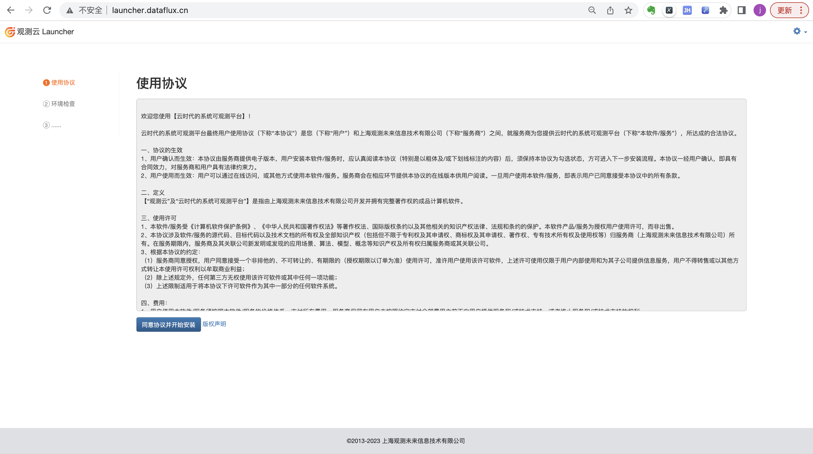

## 关键词

| **词条** | **说明** |
| --- | --- |
| Launcher | 用于部署安装 观测云 的 WEB 应用，根据 Launcher 服务的引导步骤来完成 观测云 的安装与升级 |
| 运维操作机 | 安装了 kubectl，与目标 Kubernetes 集群在同一网络的运维机器 |
| 安装操作机 | 在浏览器访问 launcher 服务来完成 观测云 引导安装的机器 |
| hosts 文件 | hosts文件是一个没有扩展名的系统文件。它的主要作用是保存域名与ip的映射关系。|


## 前提条件

[基础设施部署](basic-env-install.md#basic-install) 已部署完成。

## 1. Launcher 安装

???+ warning "注意"
     部署 Launcher，请确保您的rbac权限是 `cluster-admin` ，否则部署 Launcher 将会报错。
     如果是离线网络环境，可以参考[观测云离线包下载、导入](get-guance-images.md#offline-image)进行部署。


=== "Helm"

    - 安装
    
      ```shell
      helm install launcher launcher  --repo https://pubrepo.guance.com/chartrepo/launcher -n launcher \
        --create-namespace  \
        --set ingress.hostName=<Hostname>,storageClassName=<Stroageclass>
      ```
    
    ???+ warning "注意"
    
        `<Hostname>` 为 Launcher ingress 域名， `<Stroageclass>` 为存储类名称，可执行 `kubectl get sc` 获取。
    
        ```
        helm install launcher launcher  --repo https://pubrepo.guance.com/chartrepo/launcher -n launcher \
           --create-namespace  \
           --set ingress.hostName="launcher.dataflux.cn",storageClassName=df-nfs-storage        
        ```
       
    - Launcher 卸载
    
    ```shell
    helm uninstall launcher -n launcher
    ```
    
    ???+ warning "注意"
        Launcher 安装成功，非正常情况请勿卸载。


=== "YAML"

    - YAML 安装
    
       Launcher YAML 下载：https://static.guance.com/launcher/launcher.yaml
     
       将上面的 YAML 内容保存为 **launcher.yaml** 文件，放到**运维操作机**上，然后替换文档内的变量部分：
    
       - {{ launcher_image }} 替换为最新版的 Launcher 应用的镜像地址，可以在 [部署镜像](changelog.md) 文档中获取到最新版本的 Launcher 安装镜像地址
       - {{ domain }} 替换为主域名，如使用 dataflux.cn
       - {{ storageClassName }}替换为storage class name，如 alicloud-nas
    
       配置了默认storageclass 的资源会显示defalut 参考下图：
    
       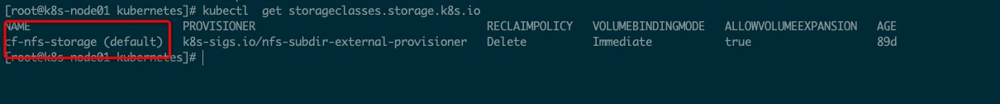
    
       在**运维操作机**上执行以下 **kubectl** 命令，在导入 **Launcher** 服务：
       ```shell
       kubectl apply -f ./launcher.yaml
       ```
    
    - YAML 卸载
    
      ```shell
      kubectl delete -f ./launcher.yaml
      ```
    
    ???+ warning "注意"
         Launcher 安装成功，非正常情况请勿卸载。

## 2. 解析 launcher 域名到 launcher 服务
因为 launcher 服务为部署和升级 观测云 使用，不需要对用户开放访问，所以域名不要在公网解析，可以在**安装操作机**上，绑定 host 的方式，模拟域名解析，在 /etc/hosts 中添加 **launcher.dataflux.cn** 的域名绑定

=== "云上基础设施部署"
    ???+ note "/etc/hosts"
         ```shell
         8.XX.176.XX  launcher.dataflux.cn
         ```
    - 如何获取 IP
      ```shell
      kubectl get svc -n kube-system
      ```
      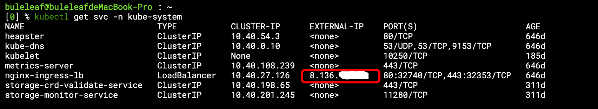

=== "自建基础设施部署"
    ???+ note "/etc/hosts"
     ```shell
     192.168.100.104   launcher.dataflux.cn
     ```

    - 如何获取 IP
    
      [部署代理](infra-kubernetes.md#agency-install)

## 3. 应用安装引导步骤 {#deploy-steps}
在**安装操作机**的浏览器中访问 **launcher.dataflux.cn**，根据引导步骤一步一步完成安装配置。
### 3.1 数据库配置

- 数据库连接地址必须使用内网地址
- 账号必须使用管理员账号，因为需要此账号去初始化多个子应用的数据库及数据库访问账号

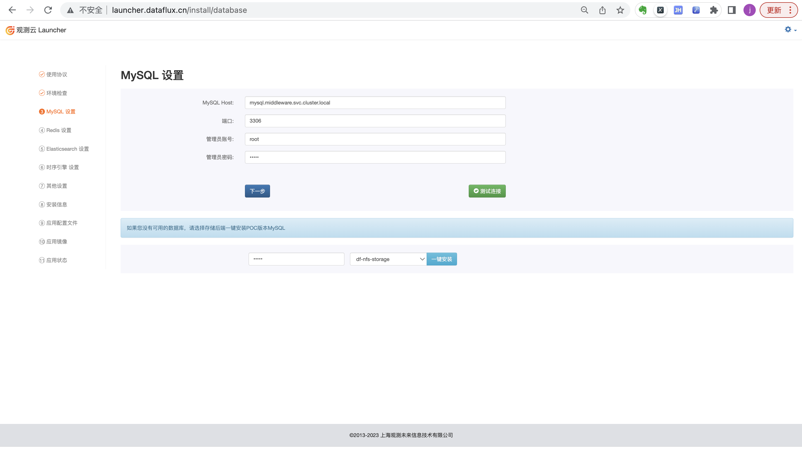

### 3.2 缓存服务 配置
- 可以选择不启用，若不启用，将使用默认的缓存服务。
- 若启用，请填写 Redis 连接地址，支持单机模式、代理模式以及主从模式的 Redis 集群版。


### 3.3 时序引擎配置

=== "GuanceDB"
     - 输入 GuanceDB 的 insert 和 select
          

=== "InfluxDB"
     - InfluxDB 链接地址必须使用内网地址
          - 账号必须使用管理员账号，因为需要使用此账号去初始化 DB 以及 RP 待信息
          


### 3.4 日志引擎配置

=== "OpenSearch"

     - 链接地址必须使用内网地址
     - 账号必须使用管理员账号

=== "ElasticSearch"
     - 链接地址必须使用内网地址
     - 账号必须使用管理员账号

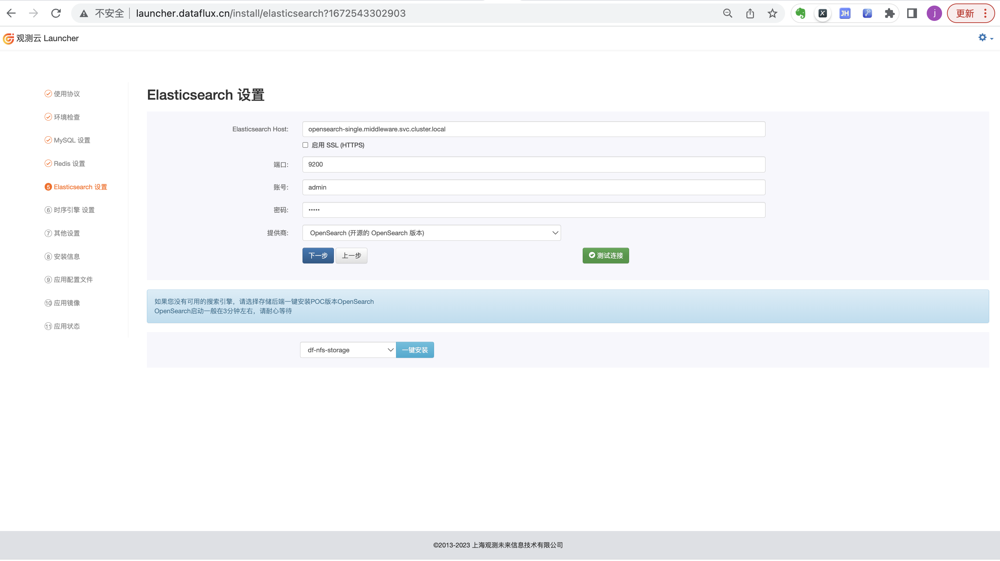

### 3.5 其他设置

- 观测云管理后台的管理员账号初始账号名与邮箱（默认密码为 **admin，**建议登录后立即修改默认密码）
- 集群节点内网 IP（会自动获取，需要确认是否正确）
- 主域名及各子应用的子域名配置，默认子域名如下，可根据需要修改：
   - dataflux 【**用户前台**】
   - df-api 【**用户前台 API**】
   - df-management 【**管理后台**】
   - df-management-api 【**管理后台 API**】
   - df-websocket 【**Websocket 服务**】
   - df-func 【**Func 平台**】
   - df-openapi 【OpenAPI】
   - df-static-res 【**静态资源站点**】
   - df-kodo 【**kodo**】

???+ warning "注意"

     df-kodo 服务可选择是否使用内网SLB，如 DataWay 与 kodo 是在同一个内网网络，安装时可选择使用内网。

- TLS 域名证书填写

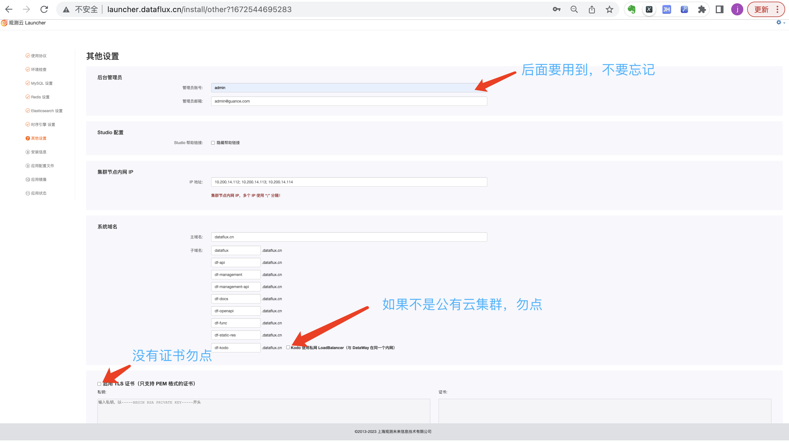

### 3.6 安装信息

汇总显示刚才填写的信息，如有信息填写错误可返回上一步修改

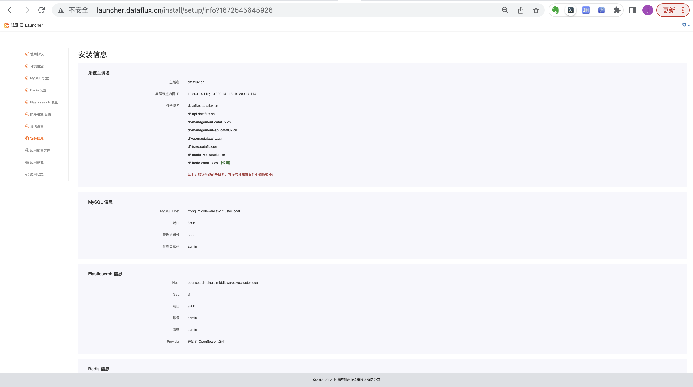

### 3.7 应用配置文件

安装程序会自动根据前面步骤提供的安装信息，初始化应用配置模板，但还是需要逐个检查所有应用模板，修改个性化应用配置，具体配置说明见安装界面。

确认无误后，提交创建配置文件。

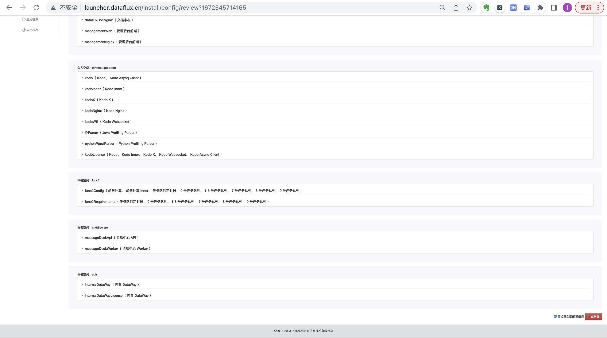

### 3.8 应用镜像

- 选择正确的**共享存储**，即你前面步骤中创建的 **storage class** 名称
- 应用镜像会根据你选的 **Launcher** 版本，自动填写无需修改，确认无误后开始 **创建应用**

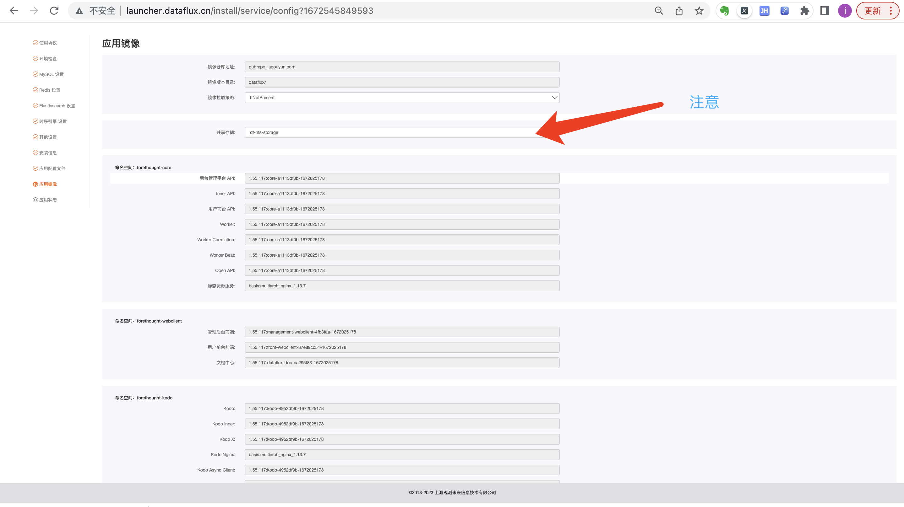

### 3.9 应用状态

此处会列出所有应用服务的启动状态，此过程需要下载所有镜像，可能需要几分钟到十几分钟，待全部服务都成功启动之后，即表示已安装成功。

**注意：服务启动过程中，必须停留在此页面不要关闭，到最后看到“版本信息写入成功”的提示，且没有弹出错误窗口，才表示安装成功！**

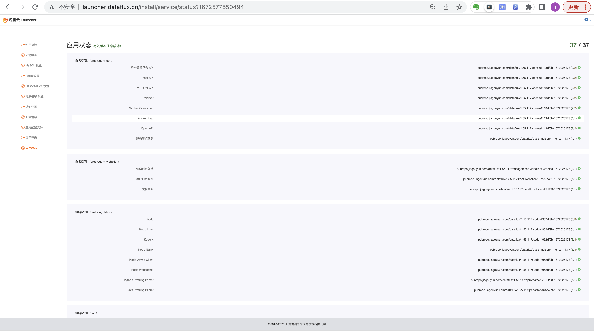

### 3.10 域名解析

将除 **df-kodo.dataflux.cn** 之外的其他所有子域名，都解析到 SLB 公网 IP 地址上 或 边缘节点 ingress 地址上：

- dataflux.dataflux.cn
- df-api.dataflux.cn
- df-management.dataflux.cn
- df-management-api.dataflux.cn
- df-openapi.dataflux.cn
- df-func.dataflux.cn
- df-static-res.dataflux.cn

<!-- === "云上基础设施部署"

    服务安装完成之后，集群会自动为 **kodo** 服务创建一个公网 SLB，可使用 kubectl get svc -n forethought-kodo  命令，查看到 kodo-nginx 服务的 EXTERNAL-IP，**df-kodo.dataflux.cn** 子域名区别单独解析到此 SLB 的公网 IP 上，如下图：
    
    
    
    该 SLB 需要配置 HTTPS 证书，所需证书需自行上传到 SLB 控制台，并修改 SLB 监听协议为七层 HTTPS，DataWay 默认上报数据选择 HTTPS 协议
    
    ???+ warning "注意"
         
         通过 SLB 接入服务的具体方式参阅：[https://www.alibabacloud.com/help/zh/doc-detail/86531.htm](https://www.alibabacloud.com/help/zh/doc-detail/86531.htm)
         编辑 kodo-nginx deploy 的 YAML文件，添加如下 annotations 内容：
         
         ```yaml
         service.beta.kubernetes.io/alibaba-cloud-loadbalancer-cert-id: 1642778637586298_17076818419_1585666584_-1335499667 ## 以实际控制台上的证书id为准 ##
         service.beta.kubernetes.io/alibaba-cloud-loadbalancer-force-override-listeners: '"true"'  ## 使用现有配置强制覆盖监听  ##
         service.beta.kubernetes.io/alibaba-cloud-loadbalancer-id: lb-k2j4h4nlg2vgiwi9jyga6   ## 负载均衡实例id ## （指定已存在的slb实例）
         service.beta.kubernetes.io/alibaba-cloud-loadbalancer-protocol-port: '"https:443"'  ## 协议类型 ##
         ```

=== "自建基础设施部署"

    由于本地部署 Kubernetes 集群无法使用 LoadBalancer 服务，所以需要使用 边缘节点 ingress。
     
    下载 [kodo-ingress.yaml](kodo-ingress.yaml) 并执行命令安装。
    ```shell
    kubectl apply -f kodo-ingress.yaml
    ```
    
    配置完成后可部署haproxy或nginx等服务在集群外的机器上进行域名代理，如何代理请阅读[部署代理](proxy-install.md) -->

## 4. 安装DataWay（可选） {#dataway-install}

您可以在部署成功后安装一个 DataWay，右上角点击设置，选择【安装数据网关】。

填写DataWay名称和绑定地址，点击【一键安装】，安装成功会伴随提示。
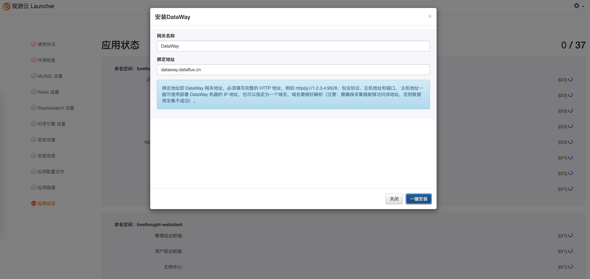
您也可以使用使用其他方式[安装DataWay](dataway-install.md)。


## 5. 安装完成后

部署成功后，可以参考手册 [如何开始使用](how-to-start.md) 

如果安装过程中发生问题，需要重新安装，可参考手册 [维护手册](faq.md)

## 6. 很重要的步骤！！！

经过以上步骤，观测云 都安装完毕，可以进行验证，验证无误后一个很重要的步骤，将 launcher 服务下线，防止被误访问而破坏应用配置，可在**运维操作机**上执行以下命令，将 launcher 服务的 pod 副本数设为 0：

```shell
kubectl patch deployment launcher \
-p '{"spec": {"replicas": 0}}' \
-n launcher
```