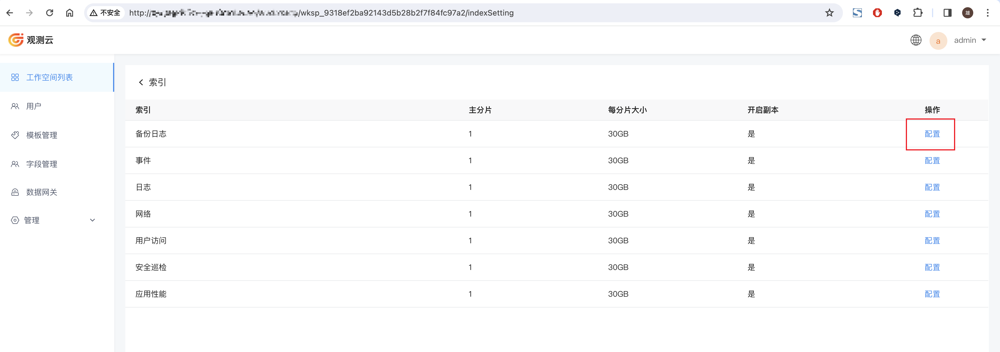
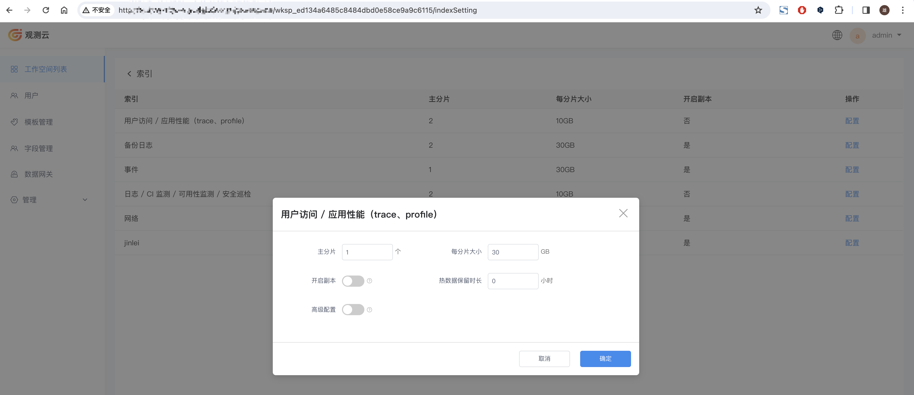

### 简介

本节介绍的是在后台管理中，如何管理空间索引配置

### 说明
观测云支持的存储引擎有Opensearch、Elasticsearch、Doris。接下来我们会对配置了这几种存储引擎的环境,如何管理空间索引配置做出说明

### 新空间配置索引默认配置
适用于当我们初次部署系统的时候，后续新增的空间想要自定义全局的空间索引配置，可以按照此方式操作。
在forethought-core这个namespace下，修改core这个configmap，添加以下内容
```yaml
WorkspaceDefaultesIndexSettings:
  number_of_shards: 1                       
  rollover_max_size: 30   
  number_of_replicas: 1 
  hot_retention: 24                
```

| **配置项** | **说明** | **默认值** | **建议值** |
|---------|  | --- |---------|
| number_of_shards    | 索引的主分片数 | 1 | 与Opensearch集群的data节点保持一致、Doris保持默认 |
| rollover_max_size   | 单个分片的大小 | 30 | 30 |
| number_of_replicas   | 是否开启索引副本 | 1 | 磁盘空间足够时建议开启 |
| hot_retention | 热数据保留的时间 | 24 | 磁盘空间充足的时候可配置更长时间保留时长，当ES无热温冷架构时，此配置不生效 |


添加完成后，重启forethought-core这个namespace下所有服务
### 存量空间更新索引默认配置
通过管理员用户登录到后台管理页面(后台管理页面地址，可以在 launcher右上角功能键-->域名处查看，复制management对应的地址即可)，找到想要修改默认保存策略的空间，点击
**索引配置**，进入到索引页面，点击**配置**对不同存储内容的索引进行配置。


#### 存储引擎为Opensearch or Elasticsearch
选择存储引擎为 Opensearch或者Elasticsearch 的空间配置时，有以下几个修改项


| **配置项** | **说明** | **默认值** | **建议值** |
|---------|  | --- |---------|
| 主分片     | 索引的主分片数 | 1 | 与Opensearch集群的data节点保持一致 |
| 每分片大小   | 单个分片的大小 | 30 | 30 |
| 开启副本   | 是否开启索引副本 | 否 | 开启时默认有1副本，磁盘空间足够时建议开启 |
| 热数据保留时长 | 热数据保留的时间 | 0 | 保持默认(当ES没热温冷架构时，此配置不生效) |
| 高级配置 | 对索引进行一些高级的配置 | 否 | 保持默认 |

#### 存储引擎为Doris
选择存储引擎为 Doris 的空间配置时，有以下几个修改项


| **配置项** | **说明** | **默认值** | **建议值** |
|---------|  | --- |---------|
| 开启副本 | 是否开启副本 | 否 | 磁盘空间足够时建议开启 |
| 热数据保留时长 | 热数据保留在磁盘中，超过热数据保留时长的数据会迁移到对象存储 | 24 | 磁盘空间充足的时候可配置更长时间保留时长 |


