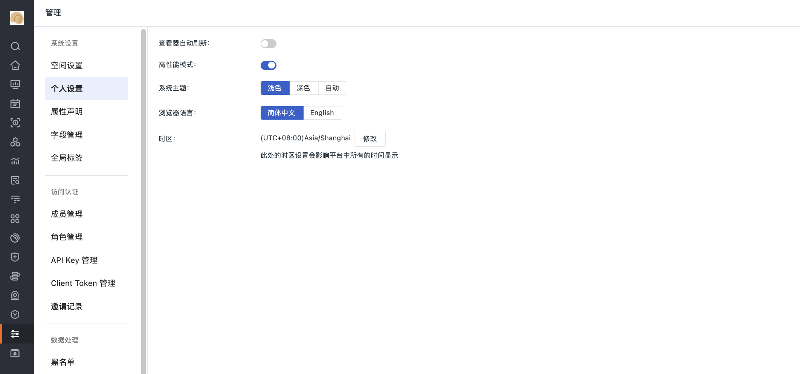

# 菜单管理 

---

进入管理后台 > 菜单管理，可对当前站点下所有工作空间的功能菜单进行管理。您可按需勾选功能目录，修改后，所有的改动都会同步至当前站点下的所有工作空间。

**注意**：如果此处选择隐藏头像，工作空间控制台 > 管理会新增**个人设置**的显示。可针对查看器自动刷新、高性能模式等配置项进行修改。

> 关于单个工作空间如何修改功能目录，可参考 [功能菜单管理](../management/settings/customized-menu.md)。