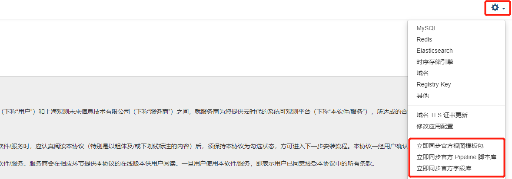

## 概述

部署之后，可能会出现模板不存在的情况，此文档在于能够帮助解决这类问题，完成视图模板初始化。

如下图所示：


## 同步命令

### 方案一 launcher 界面同步

浏览器登陆 launcher 管理界面 点击 **右上角配置** 选择以下内容进行同步



> 注：依次点击后，需耐心等待几分钟方可同步成功。如果上述方案没有成功，可以选择**方案二**来手动执行同步操作。

### 方案二 命令行执行

1、进入`forethought-core Namespace` 下的 `inner` 容器中

```shell
kubectl exec -ti -n forethought-core <inner_pod_name> -- /bin/bash
```

2、如需要修改查看器或视图等模板，请编辑 `/config/cloudcare-forethought-backend/data_package/dataflux-template` 目录中相应模板文件。

3、执行以下同步命令，会将数据包中的 模版等数据复制到 工作目录下，然后自动发送更新任务（从工作目录同步到数据库中）

```shell
curl 'http://0.0.0.0:5000/api/v1/inner/upgrade/tasks/execute_task_func' \
-H 'Content-Type: application/json' \
--data-raw $'{"script_name": "data_package_task", "func_name": "distribute_data_package", "funcKwargs": {"keys": ["dataflux_template"], "is_force": true}}' \
--compressed
```

