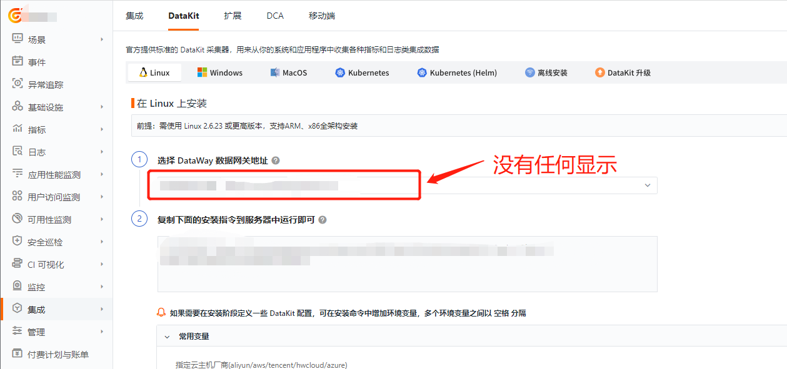
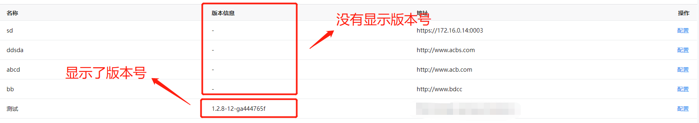

现象如下图所示：


### 排查思路

**假设1：后台管理界面没有显示版本号，安装好 DataWay 后，只有显示版本号才表示连接成功。**

如图所示：



1、首先查看 DataWay 的配置文件是否正确，是否配置对了正确的监听端口和工作空间 token信息。

2、查看 DataWay 服务是否正常运行，

```shell
kubectl get pods -n launcher
```

3、正常运行时有无报错

```shell
kubectl logs -f -n launcher <launcher_name>
```

4、部署的 kodo 服务是否异常，可通过查看 kodo 服务日志进行确认

- 先进入 kodo 服务的 pod 中

```shell
kubectl exec -ti -n forethought-kodo <kodo_pod_name> -- /bin/bash
```

- 然后进入到 /logdata 目录下查看 log 文件

```
cd /logdata
tail -f logs
```

5、查看 DataWay 服务是否能与 kodo 服务正常通信（包括 `dataway` 服务器并未在 `hosts` 中添加 `df-kodo` 服务的正确解析）

6、去 Studio 集成中查看 DataWay 列表是否正常

**假设2：后台管理界面显示了版本号，但在 Studio 集成中 DataKit 模块下的 DataWay 列表为空**

1、以上情况均已解决的情况下，出现了列表为空的问题。

2、如果之前部署过一次，可能是 Redis 缓存没有清空导致的。如果没有做持久存储，重启容器即可

```shell
kubectl delete pods -n middleware <redis_pod_name>
```
3、还有一种可能是，复制粘贴时导致的格式错误，导致系统工作空间的 token 找不到，可以再复制一遍 token，进入 vim 命令行 使用"/" 来查看格式问题。

