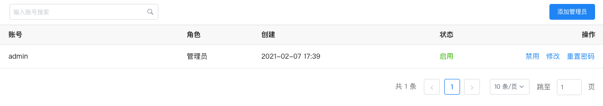
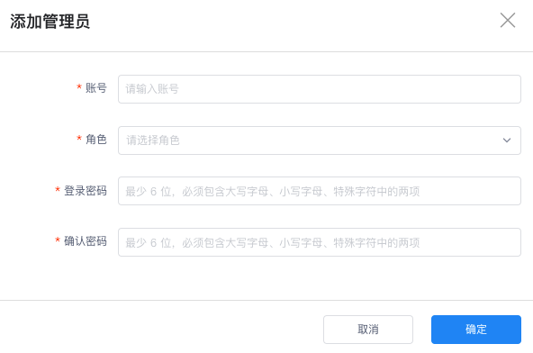
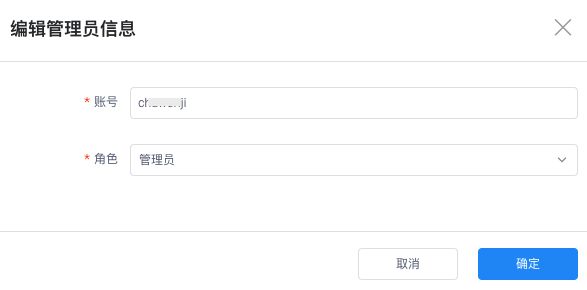
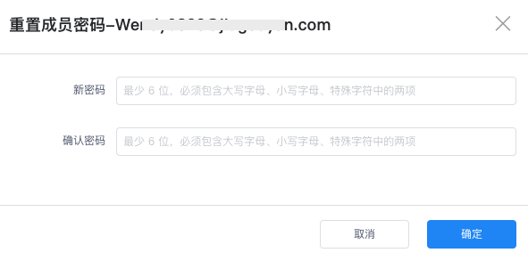
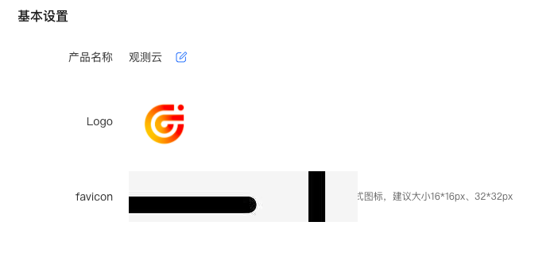
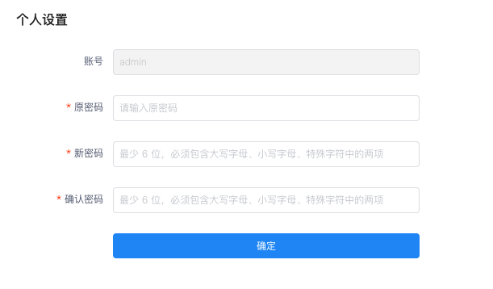

# 管理
---

## 管理员

在**设置 > 管理员**页面，可搜索、添加、修改、禁用/启用所有管理员的账户。

管理员账户角色目前分为两种：<u>管理员和开发者</u>：

-  管理员：拥有所有管理权限，能够登陆管理后台和DataFlux f(x) 开发平台；   
-  开发者：只能登陆 DataFlux f(x) 开发平台。 

### 添加管理员

在**设置 > 管理员**页面，点击右上角**添加管理员**，在弹出的对话框中，填入管理员账号信息、选择角色权限、输入密码，点击确定即可添加新的管理员。

### 修改

在**设置 > 管理员**页面，点击账号右侧的**修改**，进入**编辑管理员信息**页面。可修改管理员账号和角色权限。

### 重置密码

在**设置 > 管理员**页面，点击**重置密码**即可对该管理员账号的密码进行修改。

### 禁用/启用成员

在设置 > 管理员页面，点击账号右侧的**禁用**、**启用**即可对该管理员进行账户状态的切换。

**注意**：当前登录的账号一旦被禁用，登录账号信息失效，自动退出管理后台，在重新启用之前，将无法登录到管理后台。

## 基本信息

在观测云管理后台**设置 > 基本信息**页面，可对产品名称、Logo 以及对浏览器展示图标进行自定义设置。

<!--

-->

## 个人设置

在**设置 > 个人设置**页面，可修改当前登录账号的密码。

## 映射规则 {#mapping}

观测云部署版支持 OpenID Connect/OAuth 2.0/LDAP 三种协议应用接入的单点登录，并为该类登录账号配置映射规则。开启映射后，可为企业员工动态分配访问权限，员工可根据被分配的角色权限来访问观测云。

???+ warning "当单点登录账号被设置为工作空间拥有者，需注意："

    该账号在此工作空间的角色固定为拥有者，**不受映射规则匹配影响**。反之则按照实际映射规则匹配角色访问工作空间。

    

> 除在管理后台配置映射规则外，您还需[配置 Keycloak 单点登录映射规则](./keycloak-rule.md)。两者配置完成后映射规则才能生效。

<!--
### 拥有者角色映射

支持为单点登录的账号动态分配【拥有者】的角色。进入**映射规则 > 拥有者角色映射**，输入属性字段、属性值、角色分配的目标工作空间，点击确定即可成功添加【拥有者】角色映射。
-->

### 应用范围

在**管理 > 映射规则**，针对映射规则应用范围，可选择**仅首次登录有效**和**全局有效**：

:material-numeric-1-circle: 仅首次登录有效

当您选择启用选择该选项后，使用单点登录的用户账号若为首次登录，则根据映射规则动态分配将其加入到工作空间并赋予角色。

**注意**：已经加入登录过的 SSO 成员账号不受映射规则影响。

:material-numeric-2-circle: 全局有效

当您选择启用选择该选项后，使用单点登录的用户账号将被剥夺其当前所在工作空间中的角色，并根据身份提供商断言侧提供的属性字段和属性值匹配映射规则动态分配角色。若未匹配到映射规则，则用户账号将被剥夺所有角色，且不允许登录访问观测云工作空间。

**注意**：用户的每一次登录都需要走动态加入工作空间和分配角色流程；一旦在管理后台删除对应的映射规则，则用户对应的工作空间视为不可访问。

   
:material-numeric-3-circle: 不启用：使用单点登录的用户将继续拥有之前分配给他们账号的角色，该角色不受身份提供商侧断言更改影响。

### 添加映射

配置映射规则后，管理后台将根据对应的映射关系将成员添加到对应工作空间并赋予对应的角色。在**管理 > 映射规则**，点击**添加映射**。

在新建映射的对话框中，输入需要映射的**属性字段**及其**属性值**，选择**角色**，点击**保存**。

| 字段      | 描述                          |
| ----------- | ------------------------------------ |
| 属性字段/属性值       | 在映射配置的属性字段及属性值，必须和 IdP 的账号上配置的属性字段及属性值保持一致，映射才能验证成功，验证成功后，会在 IdP 账号登录时为账号赋予映射对应的角色权限。  |
| 工作空间      | 管理后台里所有的工作空间。 |
| 角色   | 观测云支持四种默认成员角色 **Owner**、**Administrator**、**Standard** 和 **Read-only**，您也可以在 **[角色管理](../management/role-management.md)** 创建新的角色，并为角色赋予权限范围，满足不同用户的权限需要。 |

### 搜索/编辑/删除映射角色

- 搜索：支持通过工作空间、角色、属性字段、属性值对配置的映射角色进行筛选查看；
- 编辑/删除：支持点击右侧**编辑/删除**按钮重新修改已配置的映射角色，修改后不影响当前正在登录的账户角色和权限，只会影响后续登录的用户账号。

## 操作审计 {#audit}

进入**管理 > 操作审计**，您可以查看所有的审计事件。

### 时间控件

在默认状态下，自动列出所有的审计事件，您可以添加时间范围做进一步筛选过滤。

选中日期区间后，则根据所选时间范围列出期间内所有的审计事件。默认开始时间 `00:00:00`，默认结束时间 `23:59:59`。

- 选定时间范围后，点击**选择时间**，即可自定义时间范围；  
- 点击**清空**则清除时间筛选条件。

### 搜索 & 导出

| 操作      | 说明                          |
| ----------- | ------------------------------------ |
| 搜索 :octicons-search-16:    | 您可以根据审计事件标题、描述内容进行搜索。                          |
| 导出 :octicons-gear-24:      | 点击按钮即可导出当前审计事件 CSV 文件。                          |

### 审计事件详情页

点击列表内某条特定事件，即可展开其详情页。在详情页内，您可以查看该条审计事件的属性及内容。

## 工作空间审计事件 {#audit}

可查看所有工作空间的审计事件。

您可基于工作空间或时间范围进行事件筛选，或直接输入相关标题和描述进行搜索定位：

## 安全设置 {#security}

### 密码轮换策略

为进一步提高管理后台的安全性，观测云部署版提供密码轮换策略。在默认状态下，**密码轮换策略**为**不启用**。

您可按需选择密码有效周期：3 个月、6 个月、12 个月；默认关闭。

**注意**：密码到期前 7 天，每天会向您发送管理后台密码到期提醒邮件。您可在邮件内重置密码，新密码与当前使用密码不能重复。

### 登录状态管理 {#login-status}

观测云支持对前台用户统一设置登录会话保持时间，关闭时，前台工作空间内的成员可自由配置会话保持时间；开启后，成员将不能自由修改，统一遵照这里的设定。

在**登录保持时间**，点击**修改**默认的登录会话保持时间，包括无操作登录会话保持时间和登录会话最大保持时间。设置以后，超时登录会话会失效。

- 无操作登录会话保持时间：支持设置范围 30 ～ 1440 分钟，默认为 180 分钟；
- 登录会话最大保持时间：支持设置范围 1 ～ 7 天，默认为 7 天。

### 控制台/管理后台 MFA 安全认证 {#mfa}

观测云工作空间与管理后台均提供强制双因子 MFA 安全认证管理，帮助在账号用户名和密码之外再额外增加一层安全保护。开启 MFA 认证后，您在登录时需要进行二次校验，从而帮助您提高账户的安全性。

- 默认：成员可以使用任何身份验证器 APP 完成 MFA 绑定和身份验证；
- 自定义：成员需通过指定 APP 完成 MFA 绑定和身份验证，该方式需要通过 DataFlux Func 实现。自定义 MFA 模式下，用户解绑 MFA 时，同步解绑观测云侧该账号的 MFA。

### 告警通知独立发送 {#alarm}

观测云支持监控器检测结果在告警不聚合模式下，配置**告警通知独立发送**。

在告警通知不聚合模式下，告警事件会按照每 20 秒时间间隔合并为一封通知发送至对应通知对象。支持`开启/关闭`告警通知独立发送，配置告警通知是否合并成一条发送。开启此配置后，每 20 秒时间间隔内的每条事件都会发送一条告警通知。

### 事件链接免登查看 {#link}

支持告警通知内置的跳转链接通过公开分享的形式查看。可配置**事件链接免登录查看**，开启此配置后，所有工作空间发送的告警通知内置的事件链接都可以免登访问。关闭后，所有历史发送的免登链接查看权限都将失效。

### 登录方式管理 {#login-method}

目前当前支持通过本地账号、LDAP 账号、OIDC 这 3 种登录方式进入观测云控制台。点击**修改**，即可管理用户账号的登录渠道。

- 本地账号：即通过[注册观测云](../billing/commercial-register.md)产生的账号；
- [LDAP 账号](./ldap.md)；
- OIDC：即通过 OpenID Connect 协议进行单点登录，可参考：
    
    - [Keycloak](./keycloak-sso.md)
    - [Azure Active Directory](./azure-ad-pass.md)

