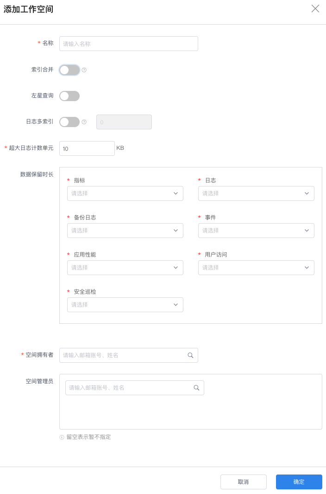
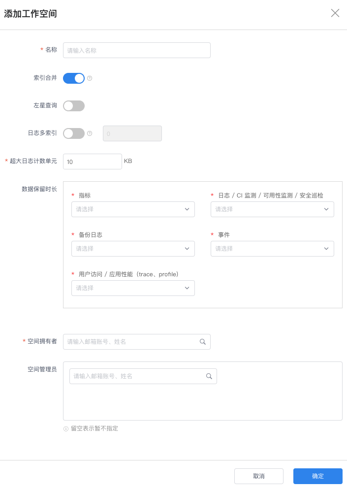

# 工作空间管理
---

工作空间基于多用户设计，可隔离不同单元数据。

## 新建工作空间

在工作空间列表，点击右上角**新建工作空间**。

### 空间信息

1. 输入工作空间名称；    

2. 选择工作空间语言；

3. 选择工作空间拥有者：拥有工作空间最高操作权限；    
4. 按需输入针对该工作空间的描述。

### 主存储引擎

自动列出数据存储引擎。

若您不选择数据存储引擎，则数据会保存到观测云主存储引擎内。

### 数据保存策略

即当前工作空间的数据保留时长。包含**指标、日志（`default` 索引日志）、数据转发-默认存储、事件、应用性能-链路、应用性能-Profile、用户访问、会话重放、安全巡检**。

除各数据类型对应的存储时长，还可选择设置自定义保存时长（<= 1800 天）。

???+ warning "配置超长存储时长注意事项："

    1. OpenSearch 或 Elasticsearch 集群配置超长的数据保留时长，除了需要预估存储空间的用量，还需要预估索引分片的数量；
    2. OpenSearch 或 Elasticsearch 集群，对于索引的分片数量默认限制是每节点 1000 分片，即假如是 3 节点的集群，分片数最大不要超过 3000 个；
    3. 分片计算方法，比如您某一个工作空间的日志索引配置是 2 副本、3 分片，每分片最大 30GB，每日的数据量大致是打满 2 个索引（即总共 180GB），数据保留 200 天，总共产生的分片数计算公式：索引副本数 * 每日索引数 * 每索引分片数 * 数据保留天数 = 2 * 2 * 3 * 200 = 2400 个分片；
    4. 如果有多个工作空间，需要将多个空间的索引分片数累加起来，同时还需要将其他数据类型的索引分片估算在内。

### 其他 {#others}

<!--
6、索引合并：采集的数据根据数据类型不同会创建不同的索引，索引越多数据存储量越大，为了节约数据存储空间，可开启工作空间的索引合并；    

- 索引合并开启，该工作空间按照指标、日志/CI 监测/可用性监测/安全巡检、备份日志、事件、用户访问/应用性能（trace、profile）创建对应的数据索引；    
  
*示例：索引合并开启状态下添加工作空间：*

- 索引合并关闭，该工作空间按照指标、日志、备份日志、事件、应用性能、用户访问、安全巡检创建对应的数据索引； 

**示例：索引合并关闭状态下添加工作空间：*

???+ warning "注意"

    - 若您选择了存储类型，则不支持开启**索引合并**操作；         
    - 调整索引合并，工作空间的对应旧索引及历史数据即将做删除操作，删除后数据将无法恢复。     
-->

1. 左星查询：即确定新创建的工作空间是否支持左星查询；

2. 自定义映射规则：启用该配置后，对应工作空间可以[自定义映射规则](./custom-mapping.md)。工作空间的自定义映射规则优先级大于管理后台的映射规则。

    **注意**：若您在管理后台配置与工作空间内的映射规则有重合配置，则该成员角色为管理后台和工作空间分配角色合集。

3. 自定义日志索引：开启后，允许该工作空间创建多个索引策略用于保存日志；

4. 超大日志计数单元：用于设置超大日志的计数单元，可根据设置的计数单元拆分成多条日志进行计费；

5. 查询数量上限：针对不同用户的工作空间的查询数量进行定制化限制，避免因查询数据量过大导致集群查询性能低，影响产品使用体验。设置查询上限数量后，超出的需要通过再次查询才能得出。

## 管理工作空间

### 筛选 

通过**主存储引擎**、**业务**两个筛选项，快速筛选定位工作空间。

### 搜索

工作空间列表页面可查看所有工作空间的基本信息，您可按空间名称关键字进行搜索查找。

### 索引配置 {#index}

即针对当前工作空间的所有索引模板作**主分片**、**分片大小**、**副本分片**的调整。

点击数据类型右侧的**配置**按钮，支持自定义配置该数据类型的 “主分片” 、“分片大小”、“热数据保存时长”、支持是否“开启副本”以及“高级配置”。 

其中，**在火山引擎底座下**，链路、日志和自定义日志索引的存储策略包括：

- 标准存储：配置热数据；
- 低频存储：标准存储时长 7 天及以上可进行配置；
- 归档存储：标准存储时长 30 天及以上可进行配置。

**注意**：

- 开启副本后，默认会给索引分片创建一份冗余的副本；

- 开启高级配置后，支持修改索引 mapping 模板配置，包含分词等相关参数修改。

### 数据上报限制 {#report-limit}

为满足工作空间内同角色的需要，通过配置数据上报限制，基于“天”的维度判断某个类型数据是否触发阈值，一旦触发阈值，后续上报的数据将无法写入到数据库中，并做丢弃处理，从而节约资源使用成本。

如图，您可针对指标、网络（主机数量）、日志条数、应用性能 Trace 数量、应用性能 Profile 条数、用户访问 PV 数量和可用性拨测次数进行限制的配置。

**注意**：

- `0` 表示对应的数据全部都丢弃不做写入，无上限；

- 指标、网络数据因为统计维度是时间线和网络，所以不存在数量的限制，只有开启数据写入限制和不限制两种模式。

### 查看成员

点击进入对应的工作空间成员页面，可以查看到该工作空间下的所有成员基本信息。

您可进行搜索、修改角色、删除等操作。

**注意**：一个工作空间只能有一个拥有者，修改其他成员为拥有者，原拥有者降级为管理员。

#### 添加用户

1. 点击进入添加页面；
2. 选择成员；
3. 设置角色权限；
4. 点击确定。

**注意**：此处可添加成员为系统内已存在的成员，若为系统新成员，需在[**用户 > 添加用户**](./user.md#add)页面中添加成功后，再返回此处进行操作。

### 修改/删除成员

点击即可修改该工作空间配置或是直接删除该工作空间。

## 删除工作空间

点击删除工作空间后，用户将无法登录到该工作空间，数据将不再上报。

观测云不会立即作数据及配置的清理，会为您保留七天的缓冲，以免误删带来的不必要麻烦。