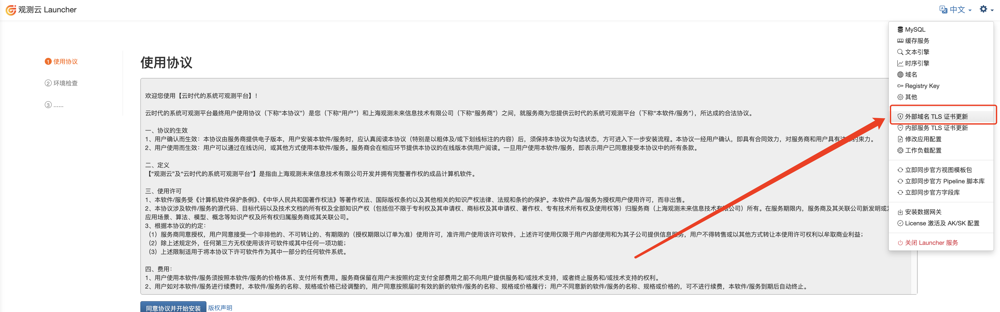
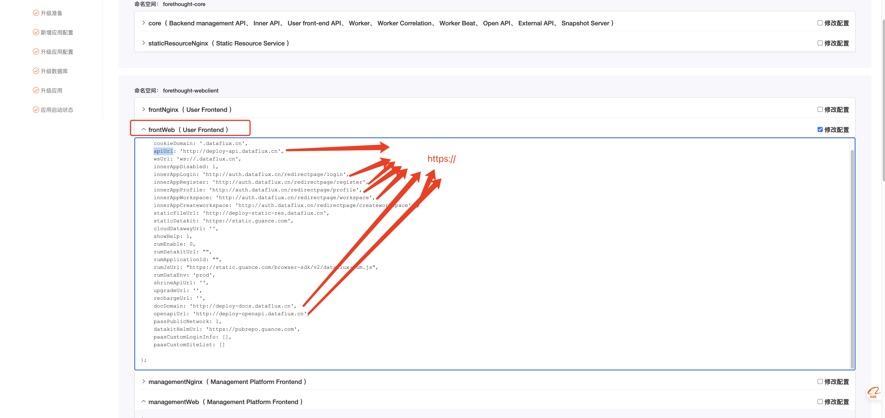
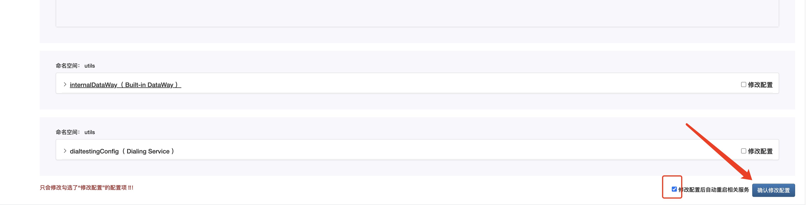

# 切换 HTTPS 访问


## 简介

本文只介绍如何将已部署的{{{ custom_key.brand_name }}}从 http 访问修改为支持 https。

## 前提条件

- 操作前请验证 SSL 证书的有效性和 Ingress 插件支持 https 的功能 
- 已部署完{{{ custom_key.brand_name }}}并正常访问
- {{{ custom_key.brand_name }}}集群权限
- {{{ custom_key.brand_name }}} Launcher 页面

## 影响范围

{{{ custom_key.brand_name }}} Studio  有短暂的无法访问。

## 操作步骤

### 步骤一：Launcher 修改域名和证书名称

- 打开 Launcher 右上角的设置
- 点击「外部域名 TLS 证书更新」
- 添加证书信息，更新 TLS 证书。




- 验证

以 `dataflux.cn` 为列：

```shell
kubectl get secret -A  | grep dataflux.cn

forethought-core              dataflux.cn                                            kubernetes.io/tls                     2      8d
forethought-kodo              dataflux.cn                                            kubernetes.io/tls                     2      8d
forethought-webclient         dataflux.cn                                            kubernetes.io/tls                     2      8d
func2                         dataflux.cn                                            kubernetes.io/tls                     2      8d
middleware                    dataflux.cn                                            kubernetes.io/tls                     2      8d
utils                         dataflux.cn                                            kubernetes.io/tls                     2      8d

```

### 步骤二：Ingress 添加 tls

- 可以执行以下脚本备份命令：

```shell
NAMESPACE="forethought-core forethought-kodo forethought-webclient func2 middleware utils launcher"

for i in $NAMESPACE;
do
  for ing in $(kubectl get ing -n $i -o jsonpath='{.items[*].metadata.name}');
  do
  filename=ing-$i-$ing.yaml
  kubectl get ing $ing -n $i -o yaml > $filename
  done
done

```

- 执行以下脚本修改地址：

???+ warning "注意"
      需要替换 `SecretName` 的变量，为你的域名的 secret name。

```shell
SecretName="dataflux.cn"

NAMESPACE="forethought-core forethought-kodo forethought-webclient func2 middleware utils launcher"

for i in $NAMESPACE; do
  for ing in $(kubectl get ing -n $i -o jsonpath='{.items[*].metadata.name}'); do
    # 检查 Ingress 是否已经配置了 TLS
    TLS_EXISTS=$(kubectl get ing "$ing" -n "$i" -o jsonpath='{.spec.tls}')

    if [ -z "$TLS_EXISTS" ]; then
      # 提取当前 Ingress 的 hosts
      HOSTS=$(kubectl get ing "$ing" -n "$i" -o jsonpath='{.spec.rules[*].host}')

      # 使用 kubectl patch 命令更新每个 Ingress
      kubectl patch ingress "$ing" -n "$i" --type='json' -p="[
        {
          \"op\": \"add\",
          \"path\": \"/spec/tls\",
          \"value\": [
            {
              \"hosts\": [$HOSTS],
              \"secretName\": \"$SecretName\"
            }
          ]
        }
      ]"
      echo "Updated Ingress $ing in namespace $i to use HTTPS."
    else
      echo "Ingress $ing in namespace $i already has HTTPS configured. Skipping."
    fi
  done
done

```

### 步骤三：修改{{{ custom_key.brand_name }}}前端配置

- 打开 Launcher 右上角的设置
- 点击「修改应用配置」
- 修改 「命名空间： forethought-webclient」-「frontWeb（ User Frontend ）」和 「 managementWeb（ Management Platform Frontend ）」，将 http 改为 https






## 回滚方法

- 改回修改前端配置
- 执行备份 Ingress Yaml

```shell
ls ing*.yaml | xargs -n 1 kubectl apply -f
```

