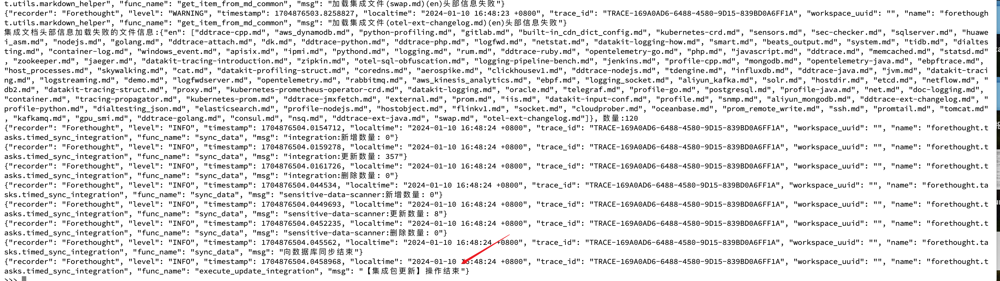

### 简介

本节介绍的是如果想要在不升级<<< custom_key.brand_name >>>版本的情况下，离线环境需要手工更新 视图模板包、指标字典、官方 Pipeline 包等，如何手工操作。

### 离线环境如何更新视图模版包

1. 下载最新的视图模版包：[https://gitee.com/dataflux/dataflux-template](https://gitee.com/dataflux/dataflux-template)
需要下载master分支的模版包，下载成功后会得到一个**dataflux-template-master.zip**文件
2. 将下载的文件上传到容器持久化存储目录中，路径为：forethought-core命名空间-->inner容器-->/config/cloudcare-forethought-backend/sysconfig/staticFolder/
3. 将上传的文件替换之前的staticFolder里的内容
```shell
cd /config/cloudcare-forethought-backend/sysconfig/staticFolder
unzip dataflux-template-master.zip
# 初次部署由于不存在dataflux-template，不需要执行mv操作。使用过程中需要更新模版时则要执行mv操作。
# mv dataflux-template dataflux-template-bak
mv dataflux-template-master dataflux-template
```
4. 进入到python环境。路径为: forethought-core命名空间-->inner容器-->/config/cloudcare-forethought-backend
```shell
python
```
5. 执行python命令
```python
from forethought.tasks.timed_sync_integration import execute_update_integration 
execute_update_integration()
```
6. 看到如下提示，表示导入成功


### 离线环境如何更新指标字典 json
1. 下载最新的指标字典 JSON 文件：[https://<<< custom_key.static_domain >>>/datakit/measurements-meta.json](https://<<< custom_key.static_domain >>>/datakit/measurements-meta.json)
2. 在路径为：forethought-core命名空间-->inner容器-->/config/cloudcare-forethought-backend/sysconfig/staticFolder/metric的文件夹下新建metric_config.json文件，将链接中的内容粘贴进去

### 离线环境如何更新官方 Pipeline 库
1. 下载最新的指标字典 JSON 文件：[https://<<< custom_key.static_domain >>>/datakit/internal-pipelines.json](https://<<< custom_key.static_domain >>>/datakit/internal-pipelines.json)
2. 在路径为：forethought-core命名空间-->inner容器-->/config/cloudcare-forethought-backend/sysconfig/staticFolder的文件夹下新建 internal-pipelines.json文件，将链接中的内容粘贴进去