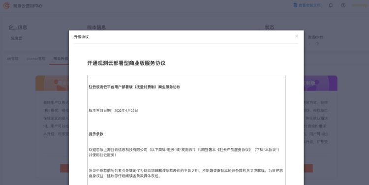
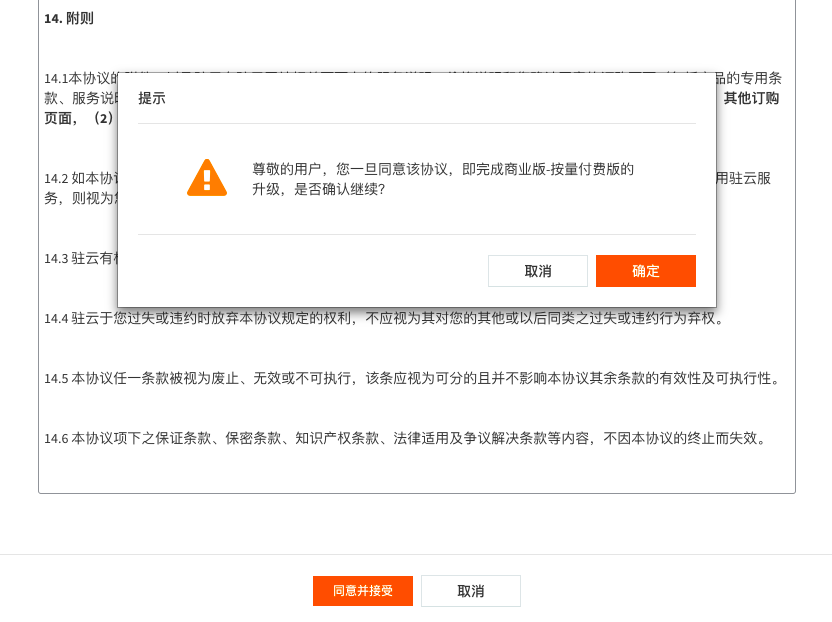
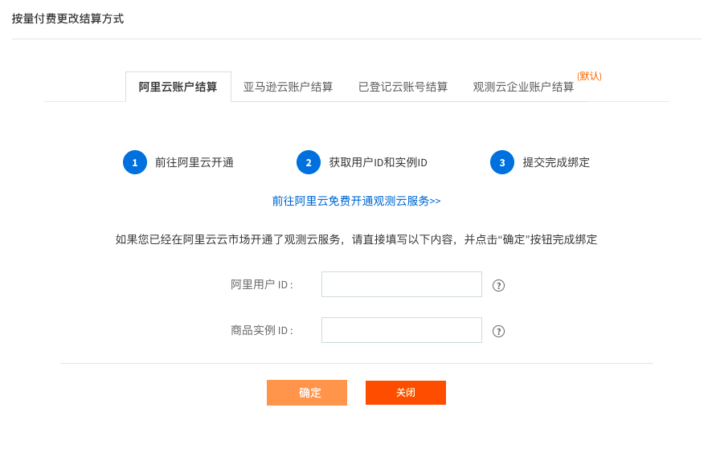
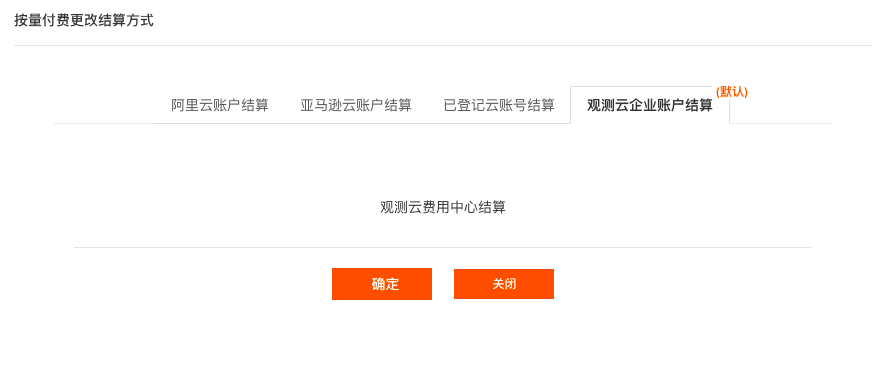
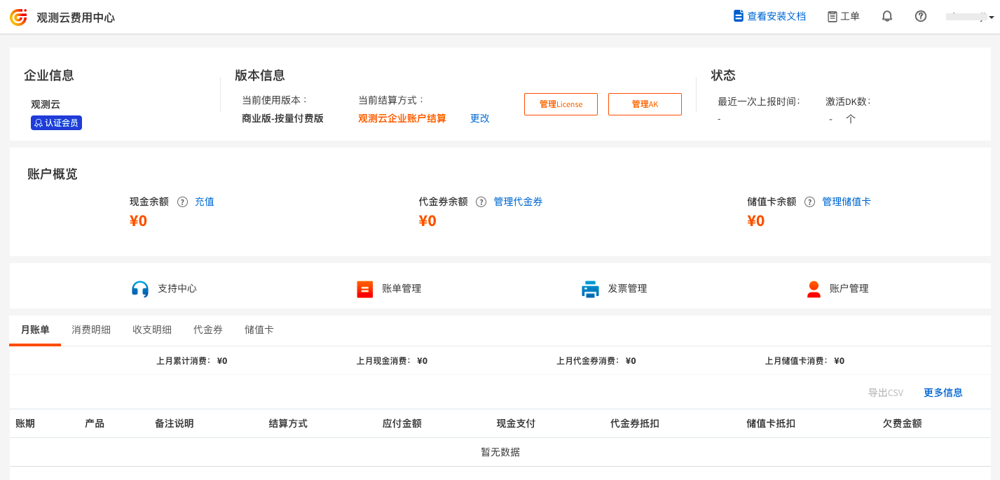
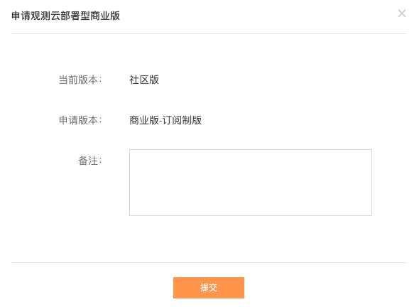
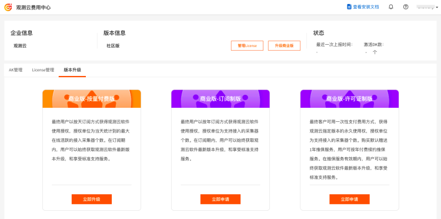
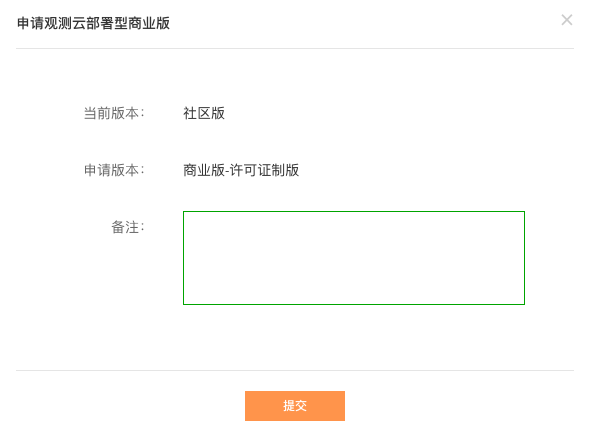

# 升级商业版
---

观测云体验版为老师、学生、云计算爱好者等社区用户提供一个简单易得又功能完备的产品化本地部署平台。您可以免费申请并下载试用，搭建您自己的观测云平台，体验完整的产品功能。

观测云体验版支持升级到商业版，商业版分成订阅制版、许可证制版和按量付费版。

## 升级到按量付费版

观测云体验版升级到商业按量付费版以后，会按 DK 安装数量进行收费。DK（DataKit）是观测云的实时数据采集器，需部署到用户自己的 IT 环境中进行数据采集。一个 DK 为 5 元/天，若上报数据的 DK 小于 20 个，按照 20 个 DK 进行收费。

### 选择升级版本

在[观测云费用中心](https://boss.guance.com/#/signin)，点击“升级商业版”，在“版本升级”，选择“商业版-按量付费版”，点击“立即升级”。

### 同意升级协议

仔细查看开通观测云部署行商业版服务协议。

在协议末端，点击“同意并接受”，并在弹出对话框点击“确定”。
注意：协议一旦同意，即表明您已经了解并同意协议的内容。

### 选择付费方式

同意升级协议，完成“商业版-按量付费版”的升级后，需要选择按量付费结算方式，目前观测云支持三种结算方式：

- 观测云企业账户：直接在观测云费用中心账户充值进行结算；
- 阿里云账户：直接通过阿里云账户充值进行结算；
- 亚马逊云账户：直接通过AWS账户充值进行结算。

选择“观测云企业账户结算”方式。点击“确定”。

### 生成 License {#get_license}

选完结算方式以后，返回观测云费用中心，进入**管理 License > 创建 License**。License 创建完成后，点击“复制”，把 License 复制到粘贴板。

**注意**：版本未升级到付费版本前，最大 DK 数固定为 50。升级后即可增加最大 DataKit 数量限制。

### 激活商业版

打开观测云 Launcher，在右上角设置，点击 “License 激活及 AK/SK 配置”。

在观测云 Launcher 的“观测云激活”对话框中，更新 License 激活商业版。

**注意**：

1. 若未激活 License，暂无法查询数据。

2. 数据网关地址后面的 **`**?token={}**`**原样保留，不要移除，不需要写具体的 token，**`**{}**`**只是个占位。

### 注意事项

在[观测云费用中心](https://boss.guance.com/#/signin)升级账号到“商业版-按量付费版”以后，观测云会提供 7 天的免费使用期限，您可以在这期间激活体验版为商业版，即在观测云 Launcher 的“观测云激活”对话框中，替换商业版 License 来激活商业版。

- 若 7 天内您未激活商业版，您在[观测云费用中心](https://boss.guance.com/#/signin)的账号会自动降级到体验版的账号；  
- 若 7 天后您激活了商业版，观测云按照“商业版-按量付费版”的计费方式进行收费，您在[观测云费用中心](https://boss.guance.com/#/signin)的账号会自动升级到商业版账号。

## 升级到订阅制版

在[观测云费用中心](https://boss.guance.com/#/signin)，点击“升级商业版”，在“版本升级”，选择“商业版-订阅制版”，点击“立即申请”。

<!--

-->
在“备注”信息填写您的需求、联系方式等，观测云客户经理会联系升级事宜。
<!-- 

-->
## 升级到许可证制版
在[观测云费用中心](https://boss.guance.com/#/signin)，点击“升级商业版”，在“版本升级”，选择“商业版-许可证制版”，点击“立即申请”。
<!--

-->
在“备注”信息填写您的需求、联系方式等，观测云客户经理会联系升级事宜。
<!--

-->