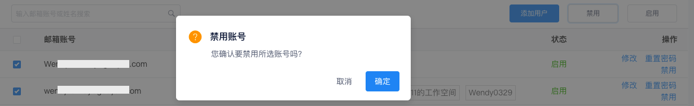

# 用户管理
---

观测云后台管理系统支持对所有工作空间成员进行统一管理。

## 添加用户 {#add}

1. 在**用户**页面，点击右上角**添加用户**。

2. 在弹出的对话框中，填入成员信息，点击**确定**即可添加新的用户。

## 管理用户

1. 点击用户所属的**工作空间**，即可进入工作空间成员管理。

2. 禁用/启用成员：点击账号右侧的**禁用**、**启用**即可切换该成员的账户状态；支持批量修改。

3. 点击**重置密码**即可修改该工作空间成员的密码。

4. 点击账号右侧的**修改**，进入编辑成员信息页面。可修改用户的邮箱、姓名和联系电话；还可添加/修改/删除用户的所属工作空间即对应角色。

### 删除用户 {#delete}

在删除账号时，若该账号在某工作空间为拥有者角色，则需要先移除该角色：

在当前账号为非拥有者的前提下，即可完成删除操作：

???+ warning "删除账号的注意事项："

    1. 可针对本地账号和单点登录账号做删除操作；
    2. 单点登录账号被删除后，相同账号若通过单点登录入口登录，账号会被重新创建。
