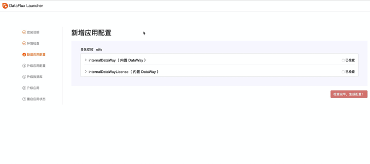
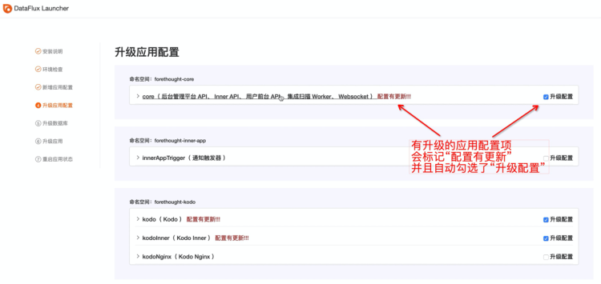
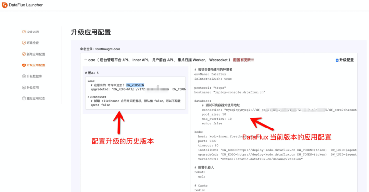
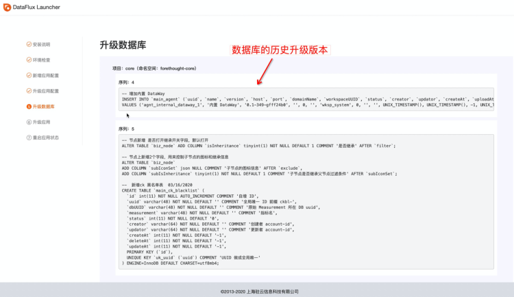
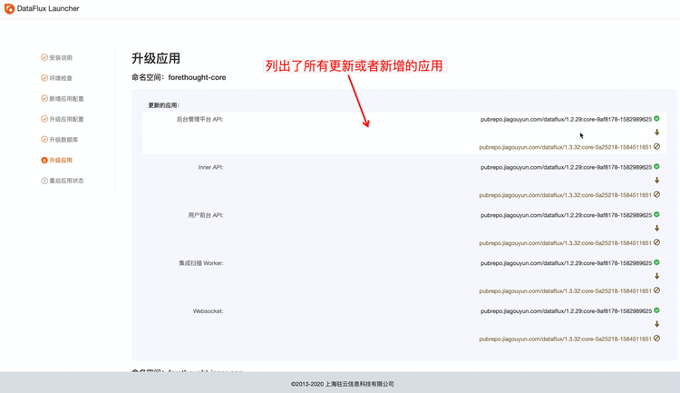
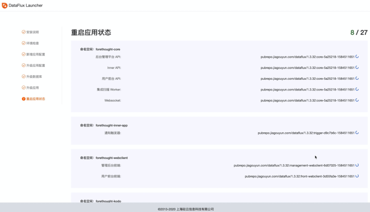

# 版本升级安装
---

## 1 升级安装
### 1.1 Launcher 服务升级

升级 观测云，首先第一步是升级 **Launcher** 服务，获取到需要升级的目标版本的 **Launcher** 服务镜像，最新版 Launcher 镜像地址可查看文档  [本部署镜像](changelog.md) ，在**运维操作机**上执行以下命令，升级 **Launcher**：
```shell
$ kubectl patch deployment launcher -p '{"spec": {"template": {"spec": {"containers": [{"image": "{{ Launcher 镜像地址 }}", "name": "launcher"}]}}}}' -n launcher
```

执行以下命令，将 **launcher** 副本上设置为 1：

```shell
kubectl scale deployment -n launcher --replicas=1  launcher
```

或

```shell
kubectl patch deployment launcher -p '{"spec": {"replicas": 1}}' -n launcher
```

### 1.2 升级应用

在**安装操作机**的浏览器上访问 **launcher.dataflux.cn**，根据安装引导步骤完成 观测云 的升级。

#### 1.2.1 新增应用配置

**launcher** 自动检测当前的 观测云 版本，到目标升级版本之间，新增加的应用配置，并列出，根据配置模板，修改相应的值后，点击“检查完毕，生成配置”。




#### 1.2.2 升级应用配置

- **launcher** 自动检测当前的 DataFlux 版本，到目标升级版本之间，有更新的应用配置，根据列出的更新内容，修改相应的值。



- 展开标记有 **配置有更新** 的配置项，左侧列出了需要升级的历史版本，右侧是应用当前的配置，根据左侧的配置升级描述，在右侧修改配置内容。



- 同时也可以修改未标记**配置有更新**的应用配置，勾选**升级配置**选项后，可以修改配置。
- 确认所有配置修改完毕后，点击 **确认升级配置** 按钮升级配置。

#### 1.2.3 升级数据库

**launcher** 自动检测当前的 DataFlux 版本，到目标升级版本之间，有数据库升级的应用，并列出每个版本的数据库升级内容，点击**确认升级**：



#### 1.2.4 升级应用

**launcher** 自动检测当前的 观测云 版本，到目标升级版本之间，有升级或者是新增加的应用，并显示当前版本与目标升级版本的镜像版本对比，点击**确认升级应用**：



#### 1.2.5 应用启动状态

显示所有更新或者新增加的应用启动状态，等全部启动完毕，即完成了此版本 观测云 的升级安装。



**注意：服务重启过程中，必须停留在此页面不要关闭，到最后看到“版本信息写入成功”的提示，且没有弹出错误窗口，才表示升级成功！**

### 1.3 很重要的步骤！！！

升级完成后，进行升级后的验证，验证无误后一个很重要的步骤，将 launcher 服务下线，防止被误访问而破坏应用配置，可在**运维操作机**上执行以下命令，将 launcher 服务的 pod 副本数设为 0：

```shell
kubectl scale deployment -n launcher --replicas=0  launcher
```

或

```shell
kubectl patch deployment launcher -p '{"spec": {"replicas": 0}}' -n launcher
```
