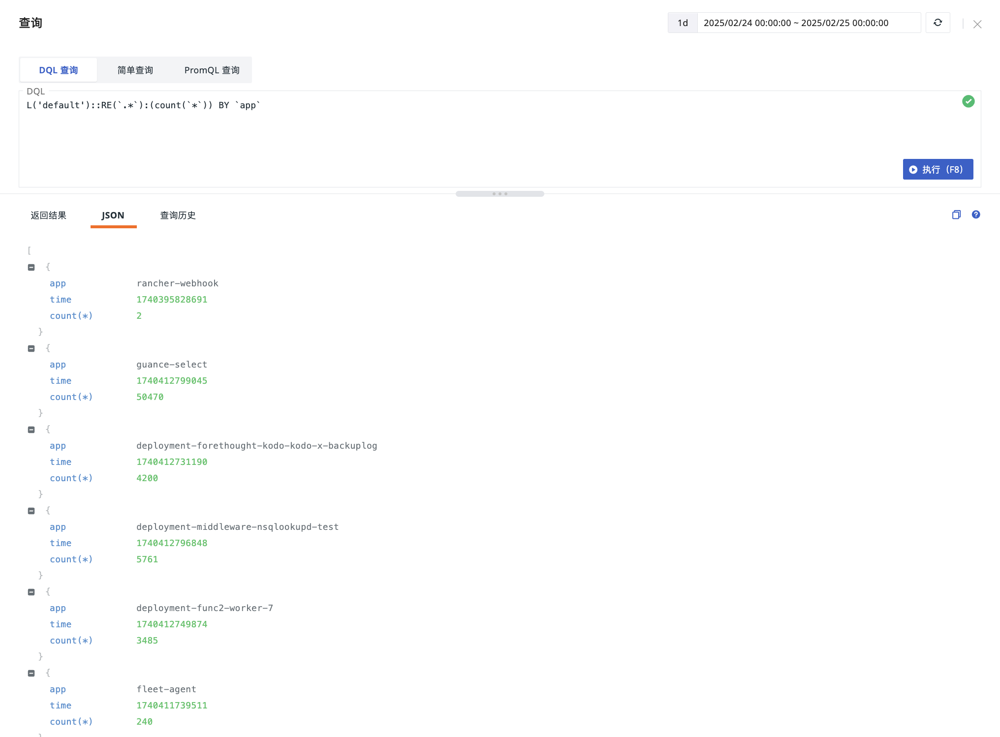
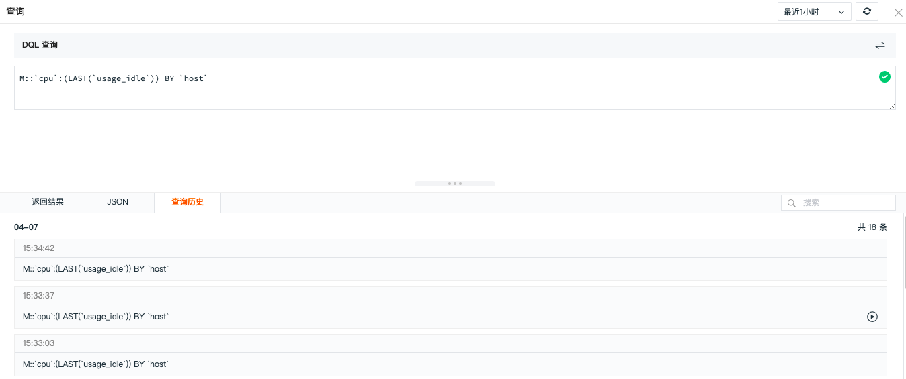
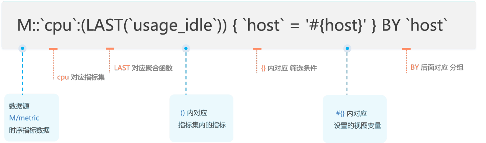
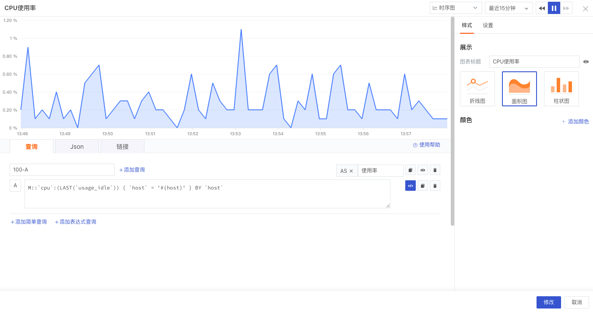
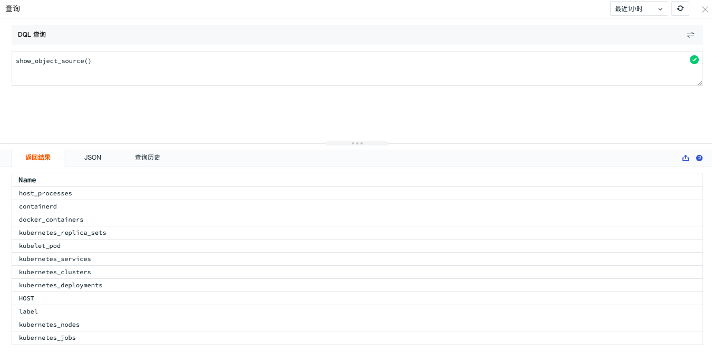
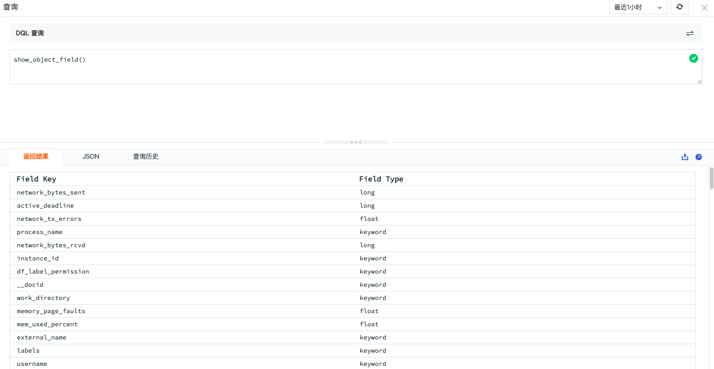
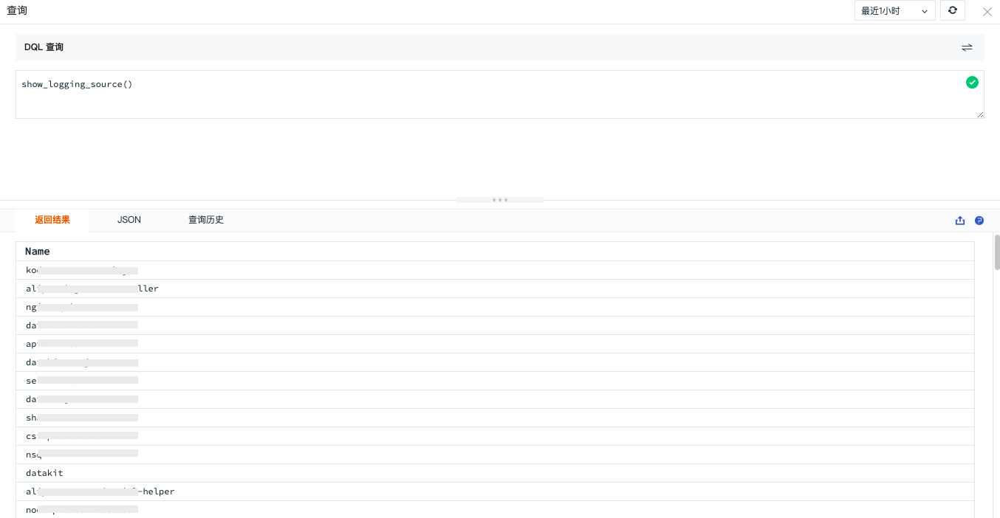
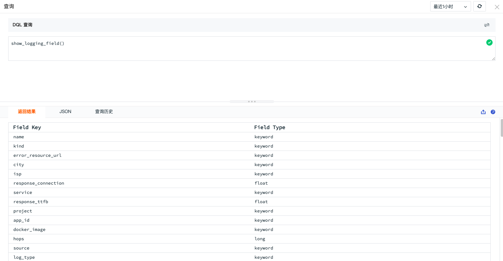

# DQL 查询
---

击{{{ custom_key.brand_name }}}控制台的**快捷入口 > 查询工具**即可打开查询查看器，或者您可以通过快捷键 `Alt+Q` 或 `option+Q` 直接打开查询工具。


> 点击 **DQL 查询**右侧的 **[简单查询](../scene/visual-chart/chart-query.md#simple)**、**[PromQL 查询](../scene/visual-chart/chart-query.md#promql)** 按钮即可切换查询方式。


## 相关操作

### 返回结果

在 DQL 查询窗口输入查询语句，点击**执行**，即可在**返回结果**查看查询结果。

查询结果将以表格形式展示，系统默认返回最多 2,000 条数据。您还可以将这些数据导出为 CSV 文件。

**注意：**在使用 DQL 查询语句时，可通过 [slimit](define.md#slimit) 参数来控制返回查询结果数量。


### JSON

查询结果支持以 JSON 格式查看。若 DQL 查询返回错误结果，错误信息将直接在 JSON 中提示。



### 查询历史

查询历史支持按日查看最近 7 天内的 100 条查询历史数据，并支持对查询语句进行模糊搜索。



点击查询历史数据右侧的执行按钮 :octicons-play-16:，即可直接展示对应的查询语句及其结果。


## DQL 语法

DQL 查询遵循如下的语法范式，各个部分之间的相对顺序不能调换，从语法角度而言，`data-source` 是必须的（类似于 SQL 中的 `FROM` 子句），其它部分都是可选的。

> 更多 DQL 语法介绍可参考文档 [DQL 定义](../dql/define.md)。

```
namespace::
	data-source
	target-clause
	filter-clause
	time-expr
	by-clause
	limit-clause
	offset-clause
	slimit-clause
	soffset-clause
```

### <u>示例说明</u>

下面是一个简单的示例，通过 DQL 查询时序指标集 cpu 的字段 `usage_idle` (CPU空闲率)，以 host 来过滤筛选，同时以 host 来分组显示结果。其中 `#{host}` 是在{{{ custom_key.brand_name }}}仪表板设置的视图变量，用于过滤筛选。



把上面的语句应用到{{{ custom_key.brand_name }}}场景仪表版的图表查询中，下图结合表达式查询和 DQL 查询，展示最近 15 分钟 CPU 使用率。



## DQL 函数

DQL 查询除了可以在场景仪表板中使用以外，我们还可以通过 DQL 函数来查询 DataKit 采集的各种数据，如数据来源、字段、标签等。

### SHOW 函数

SHOW 函数用于展示各类数据。若对通过 DataKit 采集的数据来源、字段、标签等没有清晰的了解，可以在 DQL 查询查看器通过 SHOW 函数来查询。

下面通过 SHOW 函数查询“对象”和“日志”的来源、字段等数据。

> 更多函数介绍可参考文档 [DQL 函数](../dql/funcs.md) 以及 [DQL 外层函数](../dql/out-funcs.md)。

#### show_object_source()

展示 `object` 数据的指标集合。



#### show_object_field()

展示对象的 `fileds` 列表。



#### show_object_label()

展示对象包含的标签信息。


#### show_logging_source()

展示日志数据的指标集合。



#### show_logging_field()

展示指定 `source` 下的所有 fileds 列表。




## 时间查询 {#query_time}

在 DQL 查询语句中可以指定 `[today]`、`[yesterday]`、`[this week]`、`[last week]`、`[this month]`、`[last month]` 时间参数。

today：今日 0 点到当前时间；

yesterday：昨日 0 点到今日 0 点；

this week：本周一 0 点到当前时间；

last week：上周一 0 点到本周一 0 点；

this month：本月 1 号 0 点到当前时间；

last month：上月 1 号 0 点到本月 1 号 0 点；

### 写法示例


查询今天 0 点截止到现在的数据，没有时间间隔，返回一个数据点：

```
M::cpu:(avg(`useage`)) [today]
```


如：查询今天 0 点截止到现在的数据，以 5 分钟时间间隔返回聚合数据点：

```
M::cpu:(avg(`usage`)) [today:5m]

```

表达式计算内还可以支持查询两个不同时间段的数据做最终的结果计算。表达式里如果有多个不同的时间参数定义，如子查询 A 与子查询 B 语句中分别定义时间参数为 `[today]` 和 `[yesterday]`，最终数据返回值的时间将按照查询时的 `now()` 时间做填充，最终返回一个数据。


如果表达式里定义了时间间隔，且存在多个查询时间的时间点不一致的情况，如子查询 A 与子查询 B 语句中分别定义时间参数为 `[today:5m]` 和 `[yesterday:5m]`。此时数据点的时间对不上，无法进行加减乘除，{{{ custom_key.brand_name }}}会默认返回值为空。


