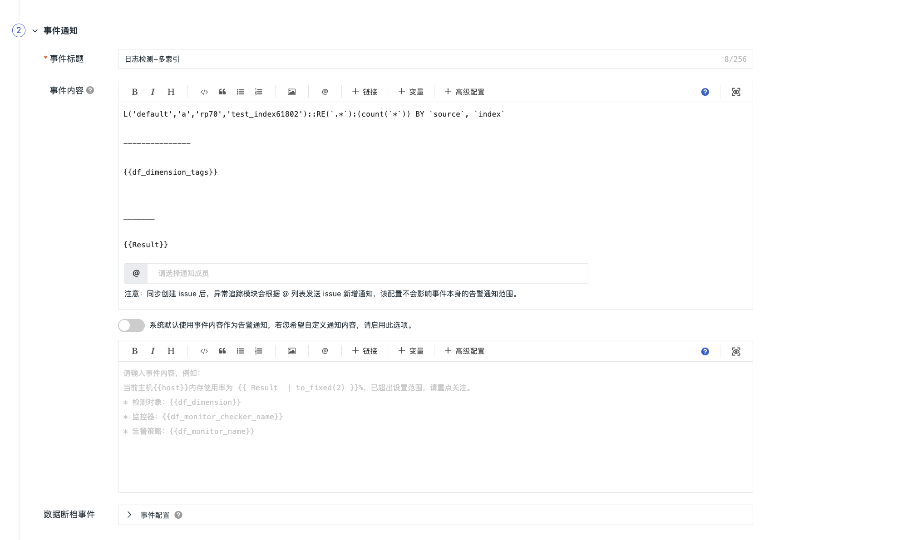

# 事件
---

<<< custom_key.brand_name >>>提供全面的事件管理和审计平台，支持实时监控与统一查询多来源事件数据。通过事件聚合和关联，可快速定位异常并高效分析数据。

在**事件**这一功能模块下，您可以通过监控器、智能巡检、SLO 等功能模块监控系统异常和服务质量下降等问题。**所有监控活动的结果都会生成事件记录**，并将这些事件汇集到事件分析模块中，以便进行深入分析和处理。这种一站式的方法确保了您能够全面掌握系统的健康状况，并及时响应可能出现的任何问题。

## 事件来源

- 满足[监控器](../monitoring/monitor/monitor-rule.md#content)和[智能监控](../monitoring/intelligent-monitoring/index.md)配置规则而触发的告警事件；
- 基于配置的[智能巡检](../monitoring/bot-obs/index.md)和 [SLO](../monitoring/slo.md) 触发的全部告警事件；
- 系统操作产生的[审计事件](../management/operation-audit.md)；
- 通过 [OpenAPI](../open-api/keyevent/create.md) 写入的自定义事件。

## 查看事件记录

- [查看器 > 未恢复事件查看器](./event-explorer/unrecovered-events.md)：展示当前工作空间最近 48 小时内未恢复的事件（`df_status !=ok`）；   
- [查看器 > 所有事件查看器](./event-explorer/event-list.md)：汇总所有来源的事件，包括监控器、智能巡检、SLO、审计事件和 OpenAPI 自定义事件；   
- [智能监控](./inte-monitoring-event.md)：包含所有满足智能监控规则触发的事件。

## 事件内容

以监控器规则触发的事件为例，事件内容主要基于[新建规则 > 事件通知](../monitoring/monitor/monitor-rule.md#notice)处填写的信息。

如下图，将事件标题定义为 `日志检测-多索引`，事件内容包含 DQL 查询语句和变量，系统会根据实际监测数据生成并展示最终结果。

规则监测到异常后，可在事件 > 事件详情中查看相关事件内容。

### 事件字段说明 {#fields}

最终的事件记录会包含以下字段：

| 
字段
                   | 说明                                                         |
| :--------------------- | :----------------------------------------------------------- |
| `date` / `timestamp`   | 产生时间。单位秒                                             |
| `df_date_range`        | 时间范围。单位秒                                             |
| `df_check_range_start` | 检测范围开始时间。单位秒                                     |
| `df_check_range_end`   | 检测范围结束时间。单位秒                                     |
| `df_issue_start_time`  | 本轮首次故障发生的时间。单位秒                               |
| `df_issue_duration`    | 本轮故障的持续时间，单位秒（从 `df_issue_start_time` 开始到本事件） |
| `df_source`            | 事件来源。包括 monitor, user, system, custom, audit          |
| `df_status`            | 事件状态。包括 ok, info, warning, error, critical, nodata, nodata_ok, nodata_as_ok, manual_ok |
| `df_sub_status`        | 事件细节状态（作为 `df_status` 的补充）                        |
| `df_event_id`          | 事件唯一 ID                                                  |
| `df_title`             | 标题                            |
| `df_message`           | 描述                                 |

- 当 `df_source = monitor` 时，额外存在以下字段：

| 
字段
                           | 说明                                                         |
| :----------------------------- | :----------------------------------------------------------- |
| `df_dimension_tags`            | 检测纬度标签，如`{"host":"web01"}`                           |
| `df_monitor_id`                | 告警策略 ID                                                  |
| `df_monitor_name`              | 告警策略名                                                   |
| `df_monitor_type`              | 所属类型：自定义监控事件为 `custom`，SLO 事件为 `slo`，智能巡检事件固定为 `bot_obs` |
| `df_monitor_checker`           | 执行函数名，如：`custom_metric` 等                           |
| `df_monitor_checker_sub`       | 检测阶段：在数据断档检测阶段产生的为 `nodata`，在正常检测阶段产生的为 `check` |
| `df_monitor_checker_id`        | 监控器 ID                                                    |
| `df_monitor_checker_name`      | 监控器名称                                                   |
| `df_monitor_checker_value`     | 事件产生时的异常值                                           |
| `df_monitor_checker_value_dumps`     | 事件产生时的异常值（JSON 序列化） 方便使用方通过反序列化获取原始值                                           |
| `df_monitor_checker_value_with_unit`     | 事件产生时的异常值（最优单位）            |
| `df_monitor_checker_ref`       | 监控器关联，只和检测配置的 DQL 语句关联的字段              |
| `df_monitor_checker_event_ref` | 监控器事件关联，只和 `df_dimension_tags` 和 `df_monitor_checker_id` 关联的字段 |
| `df_monitor_ref_key`           | 自建巡检的关联 Key，用于和自建巡检对应                       |
| `df_fault_id`     | 本轮故障 ID，取值为首次故障事件的 `df_event_id`                      |
| `df_fault_status`     | 本轮故障状态，为 `df_status`、`df_sub_status` 的冗余字段，标记是否为 OK，取值如下： ok：正常 fault：故障          |
| `df_fault_start_time`     | 本轮故障开始的时间。               |
| `df_fault_duration`     | 本轮故障的持续时间，单位秒（从 `df_issue_start_time` 开始到本事件）          |
| `df_event_detail`              | 事件检测详情                                                 |
| `df_event_report`              | 智能监控报告数据                                       |
| `df_user_id`                   | 手工恢复时，操作者用户 ID                                    |
| `df_user_name`                 | 手工恢复时，操作者用户名                                     |
| `df_user_email`                | 手工恢复时，操作者用户邮箱                                   |
| `df_crontab_exec_mode`                 | 执行模式，可选值。 <li>自动触发（即定时执行）`crontab`  <li> 异步调用（即手工执行）`manual` |
| `df_site_name`                | 当前<<< custom_key.brand_name >>>站点名                                   |
| `df_workspace_name`                | 所属工作空间名                                   |
| `df_workspace_uuid`                | 所属工作空间 UUID                             |
| `df_label`                | 监控器标签，在监控器中指定的标签会存入此字段 UUID                             |
| `df_alert_policy_ids`                | 告警策略 ID（列表）                            |
| `df_alert_policy_names`                | 告警策略名称（列表）                             |
| `df_matched_alert_policy_rules`                | 告警策略名称及所有匹配的规则名（列表）                             |
| `df_channels`                | 事件所属的异常追踪频道列表                             |
| `df_at_accounts`                | @账号信息                             |
| `df_at_accounts_nodata`                | @账号信息（数据断档）                             |
| `df_message_at_accounts`                | 故障告警消息中的 `@用户` 详细信息列表                             |
| `df_nodata_message_at_accounts`                | 数据断档告警消息中的 `@用户` 详细信息列表       |
| `df_workspace_declaration`                | 工作空间的属性声明       |
| `df_matched_alert_members`                | 选择按成员发送时，所有匹配的告警通知成员信息列表       |
| `df_matched_alert_upgrade_members`                | 选择按成员发送时，所有匹配的告警升级通知成员信息列表       |
| `df_matched_alert_member_groups`                | 选择按成员发送时，所有匹配的成员组名       |
| `df_charts`                | 当监控器配置中添加图表后，且本告警事件需要发送消息时，追加的图表信息       |
| `df_alert_info`                | 记录告警通知信息       |
| `df_is_silent`                | 事件是否被静默，取值为字符串 `"true"` / `"false"`       |
| `df_sent_target_types`                | 本事件已发送的，不重复的告警通知对象类型列表       |

- 当 `df_source = audit` 时，额外存在以下字段：

| 字段            | 说明                           |
| :-------------- | :----------------------------- |
| `df_user_id`    | 操作者用户 ID                  |
| `df_user_name`  | 操作者用户名                   |
| `df_user_email` | 操作者用户邮箱                 |
| {其他字段}      | 根据具体审计数据需求的其他字段 |

- 当 `df_source = user` 时，额外存在以下字段：

| 字段            | 说明                             |
| :-------------- | :------------------------------- |
| `df_user_id`    | 创建者用户 ID                    |
| `df_user_name`  | 创建者用户名                     |
| `df_user_email` | 创建者用户邮箱                   |
| {其他字段}      | 根据用户操作而产生事件的其他字段 |

## 更多阅读

- [ :fontawesome-solid-arrow-right-long: &nbsp; **事件数据分流实践：基于 Dataway Sink 的实现方案**](./event_data_sharding.md)

