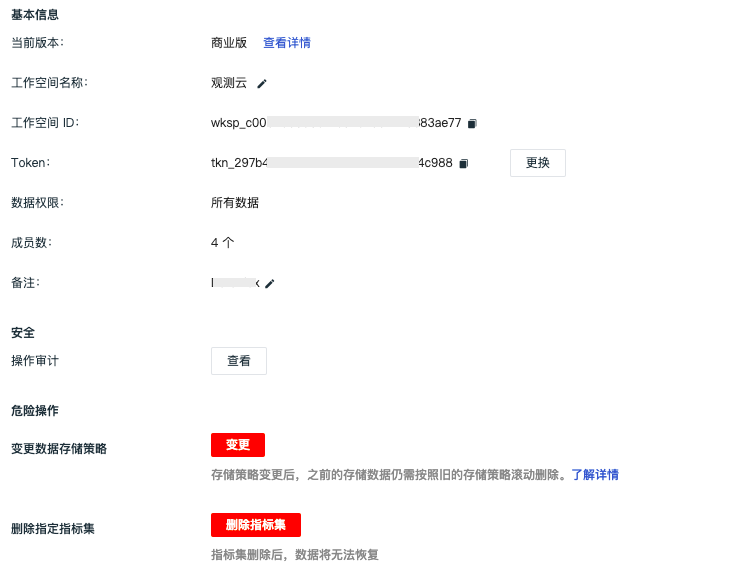

# 工作空间相关
---

## 什么是工作空间？

工作空间基于多用户设计，可隔离不同单元数据。如：一个企业不同部门之间统计的数据也不相同，业务部门有CRM系统，IT部门有IT监控系统，人事部门有OA系统。每个系统都可作为一个工作空间观测其基础设施及系统数据，可邀请不同成员加入不同的工作空间，进行数据统计分析。 

## 如何创建工作空间？

[注册](https://auth.guance.com/register) 完观测云账号以后，系统会默认为您创建一个工作空间，并赋予“拥有者”权限。如需要创建其他工作空间，您可以在观测云工作空间，点击左下角头像后，选择「创建工作空间」，输入名称及描述即可。详情可参考文档 [空间管理](../management/space-management.md)。 

## 如何邀请/添加他人加入工作空间?

工作空间拥有者或者管理员登录到需要邀请他人的观测云工作空间，进入「管理」-「成员管理」，点击「邀请成员」输入被邀请人邮箱进行添加。详情可参考文档 [成员管理](../management/member-management.md)。 

## 一个成员可以加入多个工作空间吗？

可以，一个成员可以同时属于多个工作空间。

## 工作空间共有几种角色权限？

观测云目前支持四种成员身份，分别为“拥有者”、“管理员”、“标准成员”和“只读成员”。更多详情可参考文档 [权限管理](../management/data-authorization.md)。

## 如何退出或解散工作空间？

点击左下角头像进入「空间管理」，选择想要退出或解散的空间点击「下拉选项」选择「退出」或「解散」即可。

注意：仅拥有者具有解散工作空间的权限。 

## 工作空间的名称可以修改吗？

观测云工作空间拥有者和管理员可直接登录到观测云工作空间后，进入「管理」-「基本设置」，即可修改工作空间名称。 
