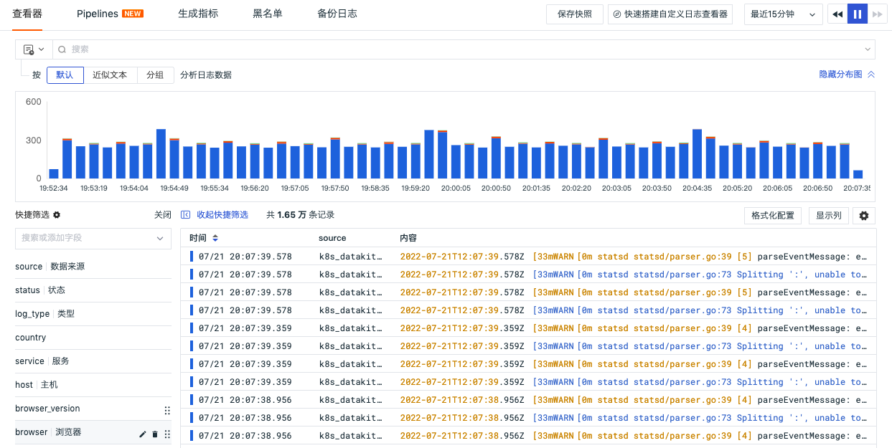

# 查看器的强大之处
---

观测云的查看器可以在基础设施、事件、日志、应用性能监测、用户访问监测、CI 可视化、可用性监测、安全巡检等功能模块内使用。作为数据可观测的重要工具之一，查看器提供多种搜索和筛选方式，并支持以组合的方式搭配使用获取最终数据结果。本文将详细介绍查看器功能，帮助您快速、精准地检索数据，定位故障问题。

## 搜索 {#search}

### 文本搜索 {#text}

搜索一般由<u>术语</u>和<u>运算符</u>两部分组成。支持通配符查询，`*` 表示匹配 0 或多个任意字符，`?` 表示匹配 1 个任意字符；若要将多个术语组合到一个复杂查询中，可以使用[布尔运算符](#bool)（AND/OR/NOT）连接。其中查看器搜索使用的是 [query_string()](../../dql/funcs.md#query_string) 查询语法

术语可以是单词或者短语。比如：

- 单个单词：guance；  
- 多个单词：guance test；（等同于 guance AND test） 
- 短语："guance test"； (使用双引号可以将一组单词转换为短语) 

<u>搜索查询示例：</u>


### JSON 搜索 {#json}

<font color=coral>**使用前提**</font>：
1. 支持的站点有 `中国区 1（杭州）`、`中国区 3（张家口）`、以及 `中国区 4（广州）`
2. 工作空间在 `2022年6月23日` 后创建
3. 日志查看器中使用。

默认对 `message` 的内容进行精确检索，同时需要 `message` 是 JSON 格式，其他格式的日志内容不支持该检索方式。搜索格式为： `@key:value`，若为多层级 JSON 可用 “.” 承接，即 `@key1.key2:value`，如图所示。


<u>JSON 搜索示例：</u>

```
message 信息如下：
{
    __namespace:tracing,
    cluster_name_k8s:k8s-demo,
    meta:{    
        service:ruoyi-mysql-k8s,
        name:mysql.query,
        resource:select dict_code, dict_sort, dict_label, dict_value, dict_type, css_class, list_class, is_default, status, create_by, create_time, remark 
                from sys_dict_data
 }
}

# 查询 cluster_name_k8s = k8s-demo
@cluster_name_k8s:k8s-demo     // 精准匹配
@cluster_name_k8s:k?s*        // 模糊匹配

# 查询 meta 下 service = ruoyi-mysql-k8s
@meta.service:ruoyi-mysql-k8s   // 精准匹配
@meta.service:ruoyi?mysql*   // 模糊匹配
```

## 筛选 {#filter}

在查看器中，可针对 `字段名` 和 `字段值` 进行筛选查询数据。

**注意**：筛选跟搜索的最大区别是输入内容中是否存在 <u>: 冒号间隔符</u>，若存在则判断作为筛选过滤条件，若不存在即为搜索条件。

### 运算符说明 {#operator}

不同类型的字段支持的运算符有差异，如下所示：

- 字符串字段运算符：`=` `≠` `wildcard` `not wildcard` `exist` `not exist`；
- 数值字段运算符：`=` `≠` `>` `>=` `<` `<=` `[xx TO xx]` `exist` `not exist`。


| 运算符      | 描述                  |
| ----------- | ---------------- |
| `=`      | 等于，示例：`attribute:value`                   |
| `≠`      | 不等于，示例：`-attribute:value`               |
| `wildcard`      | 包含，需结合通配符进行模糊查询，示例：`attribute:*value*`         |
| `not wildcard`      | 不包含，需结合通配符进行反向模糊查询，示例：`attribute:*value*`    |
| `exist`      | 存在，筛选出存在指定字段的数据，示例：`attribute:*`                  |
| `not exist`      | 不存在，筛选出不存在指定字段的数据，示例：`-attribute:*`        |
| `>`      | 大于，示例：`attribute:>value`                |
| `>=`      | 大于等于，示例：`attribute:>=value`                  |
| `<`      | 小于，示例：`attribute:<value`                  |
| `<=`      | 小于等于，示例：`attribute:<=value`               |
| `[xx - xx]`      | 区间，示例：`attribute:[1 - 100]`               |

### Wildcard 说明{#wildcard}

支持 `*` 或 `?` 通配查询, `*` 表示匹配 0 或多个任意字符，`?` 表示匹配 1 个任意字符。

```
值：guanceyun

# 仅使用后缀*匹配，此场景适用于某个值前缀的字符串固定精确，后半部动态变化的情况
attribute:guance*    // * 匹配 yun

# 仅使用 ? 匹配，此场景适用于仅存在个别固定位置字符动态更新情况
attribute:gua?ceyun   // ? 匹配 n

# ? * 叠加使用
attribute:gua?ce*   // ? 匹配 n ,* 匹配 yun

# * 混合使用
attribute:gua*e*   // 第一个 * 匹配 nc ,第二个 * 匹配 yun
```

## 特殊字符检索处理 {#character}

在查看器中部分字符具有特殊意义，例如 `空格` 用于分隔多个单词，所以若检索的内容中包含以下字符需要做特殊处理：`空格` `:` `"` `“` `\` `(` `)` `[` `]` `{` `}` `!`

处理方式有两种

### 方式一：将文本变成短语

???+ warning 

    - 在文本两侧加`"`双引号，可以将文本变为短语
    - 此写法下双引号的内容会作为一个整体发起匹配搜索，通配符不会生效；  
    - 若文本中含有 `\` `"`，该方式检索不到，请使用 “方式二”查询

举例说明：检索的字段名 `cmdline`, 字段值 `nginx: worker process`

- 搜索

```
"nginx: worker process"   //检索成功，精准匹配单词
```

```
"nginx * process"   //检索失败，因为双引号中 * 不会被认为是通配符
```

- 筛选

```
cmdline:"nginx: worker process"   //检索成功，精准匹配单词
```

```
cmdline:"nginx: worker*"  //检索失败，因为双引号中 * 不会被认为是通配符
```

### 方式二：对字符进行转义

???+ warning 
  
    - 只需要在特殊字符前加一个`\`反斜杠
    - 若检索的文本中本身有 `\` ，搜索和筛选对应的处理方式不同：搜索需要在字符前再加三个`\`反斜杠进行转义；筛选只需要加一个 `\` 反斜杠即可

举例说明：检索的字段名 `cmdline`, 字段值 `
E:\software_installer\vm\vmware-authd.exe` 

- 搜索

```
E\:\\\\software_installer\\\\vm\\\\vmware-authd.exe     //检索成功，精准匹配单词
```

```
E\:\\\\software_installer*exe     //检索成功，通配符模糊匹配
```

- 筛选

```
cmdline:E\:\\software_installer\\vm\\vmware-authd.exe    //检索成功，精准匹配单词
```

```
cmdline:E\:\\software_installer*exe    //检索成功，通配符模糊匹配
```

## 布尔运算符 {#bool}

支持以 `AND/OR/NOT` 的形式进一步<u>组合关联搜索与筛选</u>。


| 逻辑关系 | 描述                                    | 备注 |
| -------- | --------------------------------- | --- |
| a AND b  | 取前后查询结果交集 | 搜索、筛选条件间默认使用 AND 做连接。其中 `AND` 可以用 `空格`，即 `a` AND `b` = `a` `b`。   |
| a OR b   | 取前后查询结果并集        | 返回结果需包含 a 或者 b 的任意一个关键字。示例：`a` OR `b:value`  |
| NOT c    | 排除当前查询结果          | NOT 多用于搜索写法，筛选处排除逻辑使用 `≠` 代替。 |

## 搜索/筛选注意事项

### 分组

使用括号 `()` 提高数据查询条件的优先级，即查询中若存在 `()` 选中部分搜索、筛选条件则 `()` 内的查询逻辑优先执行。`()` 内部的查询优先级仍然按照 `NOT > AND > OR` 执行。

### 手写模式

支持切换搜索框至「手写模式」
本次手写模式上线覆盖所有查看器（仪表板/自定义查看器除外），新模式下支持 UI 交互添加搜索、筛选条件和手写模式自由切换，不会针对模式切换前的内容做任何变更，真正实现 UI 和手写输入的实时切换还原。


## 分析模式 {#analysis}

在查看器分析栏，支持基于数据进行多维度聚合查询分析统计，以反映出数据在不同的维度下，不同时间的分布特征与趋势。观测云支持多种数据图表分析方式，包括时序图、排行榜、饼图和矩形树图。还可选择不同的时间间隔显示数据。

目前支持基于不同的筛选字段进行聚合查询，时序图和饼图的查询默认显示 slimit 20；排行榜和矩形树图默认显示 top 20。

**数据显示说明：**

- 数据点：数据点是指数据值所在的坐标点。时序图的折线图和面积图将依据所您所选择的时间范围自动聚合为数据点，数据点数量不超过 360 个点；柱状图的数据点数量不超过 60 个；  
- 数据范围：数据范围指每一个数据点的取值范围，即以当前数据点的坐标点向前推送至上一个数据点的坐标点为间隔范围，取该范围内数据的值。


## 快捷筛选 {#quick-filter}

### 自定义筛选字段

在查看器中支持编辑**快捷筛选**添加新的**筛选字段**。支持两种配置方式：<u>空间级筛选项和个人级筛选项</u>。

在快捷筛选支持预设字段，新添加的字段默认为字段管理中的字段类型，若字段管理中没有，则默认为文本格式。

=== "空间级筛选项"

    由管理员/拥有者进行配置，点击快捷筛选旁的 :fontawesome-solid-gear:，即可配置空间级筛选项，支持新增字段、编辑字段别名、调整字段顺序、删除字段。

    **注意**：空间级筛选项，工作空间所有成员可以查看，但普通成员和标准成员不支持编辑、删除、移动位置。

    

=== "个人级筛选项"

    所有成员都可以配置基于本地浏览器的快捷筛选项，点击快捷筛选右侧的 :material-pencil:，即可配置个人级筛选项，支持新增字段、编辑字段别名、调整字段顺序、删除字段。

    **注意**：个人级筛选项，仅当前个人可查看，工作空间其他成员无法查看。

    

### 操作说明

=== "全选"

    默认状态下，所有快捷筛选项的标签值全部勾选，表示未进行任何筛选。

=== "清空筛选"

    点击快捷筛选项右上角的**清空筛选**按钮取消该标签的值筛选，即恢复全选。

=== "取消/选中"

    点击快捷筛选项标签值前面的复选框，可以**取消**或**选中**该值，默认状态下取消勾选前面复选框，表示反选该值，继续取消勾选其他复选框，表示为反向多选。

    

=== "仅选中此项/取消选中"

    点击标签值所在行，表示正向单选此值**仅选中此项**，继续勾选其他值的复选框，表示为正向多选；当正向单选了某个值时，再次点击该值所在行**取消选中**，取消全部筛选。

    

=== "正选&反选"

    若某个标签同时有正选和反选两种状态，则在快捷筛选中该标签置灰不可操作。

    

=== "快捷筛选项搜索"

    当快捷筛选项超过 10 个标签字段，支持按照**字段名**或者**显示名**进行模糊搜索。

    

=== "字段值搜索"

    若快捷筛选项超过 10 个字段属性值，支持输入文本进行实时搜索，支持点击模糊匹配和反向模糊匹配进行筛选。

    

=== "字段值数量统计排名 {#top5}"

    点击快捷筛选项右上角的 :fontawesome-solid-gear: ，选择**查询值 TOP 5**，可查看当前筛选项排在前五名的字段属性值统计数量百分比。在排行榜，支持通过鼠标悬停查看数量统计，支持点击**正向筛选**、**反向筛选**按钮，以 `key:value` 的形式对当前排名的字段属性值进行数据筛选查询。

    

=== "添加/移除显示列"

    点击快捷筛选项右上角的 :fontawesome-solid-gear: ，可**添加 / 移除显示列**，自定义添加的个人级筛选项字段支持编辑显示名和删除字段。

    

=== "持续时间"

    若在查看器的快捷筛选包括 `持续时间` 的字段，您可以手动调整最大/最小值来进行查询分析。注意事项如下：

    - 快捷筛选的**持续时间**默认进度条最小值、最大值为链路数据列表里最小和最大的持续时间；  
    - 支持拖动进度条调整最大/最小值，输入框中的值同步变化；  
    - 支持手动输入最大/最小值，按回车键或点击输入框外进行过滤搜索；  
    - 输入不规范时输入框变红，不进行搜索，正确格式：纯“数字”或“数字+ns/μs/ms/s/min”；  
    - 若没有输入单位进行搜索，默认直接在输入的数字后面填入 "s" 然后进行过滤搜索；  
    - 若手动输入单位，则直接进行搜索。

    

## 筛选历史 {#filter-history}

观测云支持在**筛选历史**查看筛选、搜索历史，且能应用于当前工作空间不同的查看器。

- 打开筛选历史：支持通过点击查看器上方搜索栏右侧的图标，或者直接通过快捷键 `(Mac OS: shift+cmd+k / Windows: shift+ctrl+k)` 快速打开筛选历史；  
- 收起筛选历史：点击关闭按钮 `x` 或者使用 `esc` 按键可收起筛选历史。


**注意**：筛选历史仅支持在本地浏览器查看当前用户的筛选、搜索条件。


### 操作说明

在查看器筛选历史最多查看 100 条筛选、搜索条件，支持通过键盘上下切换键（↑ ↓），切换选择筛选、搜索条件，点击键盘 `enter` 可添加到筛选。

- 固定到筛选：鼠标放在筛选历史，可通过右侧 “固定到筛选” 按钮置顶筛选、搜索条件；
- 添加到筛选：点击筛选、搜索条件，即可添加到查看器进行筛选，支持多选；
- 取消筛选：添加到筛选后，再次点击筛选、搜索条件，即可取消筛选；  


- 在不同查看器应用筛选历史：当您在**日志 > 查看器**浏览了 `-source: default` 筛选历史（如上图），可在链路等其他查看器的筛选、搜索直接使用。


## 自动刷新 {#refresh}

为快速获得实时的查看器数据，观测云在查看器内提供刷新功能。您可进行以下操作：

- 停止自动刷新时，支持点击 :octicons-sync-24: 手动刷新；


- 开启自动刷新时：  
    - 支持选择自动刷新时间，包含 5s/10s/30s/1m/5m/30m/1h；默认选中 30s；  
    - 支持点击 :octicons-sync-24: 手动刷新。


**注意**：此处的刷新功能的设置与[查看器自动刷新](#auto-refresh)互不冲突。

## 时间控件 {#time}

观测云支持通过时间控件控制当前查看器的数据展示范围，用户可以手动输入时间范围，或快速选择当前查看器的内置时间范围，或通过自定义设置时间范围。

### 手动输入时间范围

时间控件默认支持区间显示，支持点击时间控件查看手动输入时间范围的格式，包括**动态时间**和**静态时间**，输入完成后回车或者点击任意空白区域即可按照输入的时间范围筛选查看对应的数据。


=== "动态时间"

    动态时间范围支持秒、分、时、天 4 种单位，如 1s、1m、1h、1d 等，如下图所示输入 20m。

    

    回车即可返回时间范围为最近 20 分钟，即查看器展示最近 20 分钟的数据。

    

=== "日期静态时间"

    日期标准时间格式支持以下多种写法，时间格式精确到秒级，间隔符 `~` 、`-` 、`,` 前后允许有空格输入，逗号必须是英文逗号。

    - `2022/08/04 09:30:00~2022/08/04 10:00:00` 
    - `2022/08/04 09:30:00-2022/08/04 10:00:00` 
    - `2022/08/04 09:30:00,2022/08/04 10:00:00` 

    点击时间控件，可直接输入和修改标准时间格式，回车后按照当前的时间范围展示对应的数据。

    

=== "时间戳静态时间"

    时间戳范围支持以下多种写法，时间戳支持到毫秒级输入，间隔符 `~` 、`-` 、`,` 前后允许有空格输入，逗号必须是英文逗号。

    - `1659576600000~1659578400000` 
    - `1659576600000-1659578400000` 
    - `1659576600000,1659578400000` 

    点击时间控件，按如下图所示输入开始和结束时间戳。

    

    回车即可返回时间范围，并按照此时间范围筛选出对应的数据在查看器展示。

    

=== "注意事项"

    - 若格式不符合输入要求，则无法返回正确的时间范围，如开始时间晚于结束时间、不符合 `时:分:秒` 的格式输入等。

    

    - 时间控件的提示框和文本输入框实时联动，若输入的时间范围超过 4 位数时（包括时间区间、绝对时间和时间戳），时间控件提示框显示 `-` 。

    

    回车后显示时间范围。

    

### 快捷筛选时间范围

您可以在时间控件点击**更多**快速选择对应的时间范围进行数据查看。时间控件中预设了多种快捷筛选时间范围，包括下拉列表的 “最近 15 分钟、最近 1 小时、最近 1 天等” 和动态时间的 “30s、45m、3d 等”。


鼠标放在动态时间上，即可和输入框内容进行实时联动，点击即可查看对应时间范围的数据内容。


### 自定义时间范围

除了预设的时间范围以外，您可以在时间控件点击**自定义时间**选择时间范围，包括日期和具体的时间，点击**应用**，即可按照自定义的时间范围进行数据筛选。

???+ warning 

    - 自定义时间范围的开始和结束时间需按照 `时:分:秒` 的格式输入，如 `15:01:09`；  
    - 自定义时间范围的开始时间不能晚于结束时间；  
    - 自定义时间范围的查询记录可在**自定义时间查询历史**中查看，最多支持最近 20 条历史绝对时间记录查看，点击任意历史记录，即可快速筛选查看对应的数据内容。


### URL 的时间范围 {#url}

除了时间控件提供的时间范围选择以外，观测云还支持在浏览器的 URL 中直接修改当前工作空间查看器的 `time` 参数的时间范围进行数据查询，支持秒、分、时、天 4 种单位，如 time=30s、time=20m、time=6h、time=2d 等，如下图所示在浏览器修改 `time=2h` ，查看器展示最近 2 小时的数据。

???+ warning 

    - 每种单位只能独立使用，不可组合；  
    - 当选择或者在浏览器输入的时间范围大于等于 1d ，查看器自动停止播放模式。


### 锁定时间范围 {#fixed}

观测云支持在时间控件通过点击 :octicons-pin-24: 锁定图标，设置固定的查询时间范围，设置完成后，所有的查看器/仪表板均默认显示当前的时间范围。

如下图所示，若锁定时间为 “最近 45 分钟”，则所有的的查看器/仪表板均按照当前锁定时间查询显示 “最近 45 分钟” 的数据。


### 设置时区 {#zone}

观测云支持在**时间控件**设置当前显示时区，从而切换到对应的工作空间时区查看数据。


进入**时间控件 > 时区设置**，在**修改时区**窗口：

- 默认显示 “浏览器时间”，即本地浏览器检测到的时间；      
- 在拥有者或管理员设置 “[工作空间时区](../../management/index.md#workspace)” 后，成员可选择配置好的工作空间时区。


???+ warning 

    - 仅当前工作空间的 Owner 及 Administrator 拥有**工作空间时区**配置权限；  

    - 设置新的时区后，您当前账号所在的所有工作空间均按照设置后的时区进行显示，请谨慎操作。

您也可以在 **[账号管理](../../management/account-management.md#zone)** 进行修改。


### 查看器自动刷新 {#auto-refresh}

在观测云工作空间，点击**账号**，可开启 / 关闭**查看器自动刷新**。

- 开启：查看器的数据按照时间控件的默认数据刷新时间 30 秒进行自动刷新，如选择最近 15 分钟，按照 30 秒刷新一次显示最近 15 分钟的数据；  
- 关闭：查看器的时间控件进入时关闭 30 秒自动刷新，如选择最近 15 分钟，即显示该15分钟绝对时间的内容数据且不再自动刷新，可点击 :fontawesome-solid-play: 按钮刷新查看最近 15 分钟的数据。

**注意**：查看器自动刷新仅对本地浏览器生效。


点击**暂停**按钮，退出实时数据刷新模式，锁定当前时间范围为绝对时间。

例如：时间范围选择了“最近 15 分钟”，那么当点击 :fontawesome-solid-pause: 按钮后，查看器的时间范围整体向前调节为 15 分钟。


## 显示列 {#columns}

查看器支持选择显示行数来展开查看日志 Message 数据：

- 支持点击**显示列**自定义添加、编辑、删除、拖动显示列； 
- 支持通过键盘上下切换键（↑ ↓ ）选择添加显示列； 
- 支持在**显示列**进行关键字搜索； 
- 支持在**显示列**自定义显示列作为预设字段，后续通过 Pipeline 切割字段并上报数据后可直接显示上报的数据。


### 时间列 {#time-column}

若查看器存在时间列，您可以在显示列配置下直接勾选：


### 添加显示列

在查看器显示列，支持输入字段进行匹配搜索，默认选中搜索到的第一个字段，支持通过键盘上下切换键（↑ ↓ ）选择添加显示列。


若输入的字段不存在，支持通过 “分割线” 进行区分，并提示**创建并添加**显示列，创建后作为预设字段，后续通过 Pipeline 切割字段并上报数据后可直接显示上报的数据。


### 操作说明

在查看器列表，当鼠标放在显示列上时，可点击显示列的 :fontawesome-solid-gear: ，您可以对显示列进行以下操作。

| 操作      | 描述                          |
| ----------- | ------------------------------------ |
| 升 / 降序      | 按照升序或降序排列显示当前字段的值。                          |
| 向左 / 右移动列      | 对当前显示列往左或往右移动，若不支持移动列，则不显示该操作。                          |
| 向左 / 右添加列      | 基于当前列往左或者往右添加新的显示列，支持搜索，若不支持添加列，则不显示该操作。                          |
| 替换列      | 在当前位置替换当前显示列，支持搜索，若不支持替换列，则不显示该操作。                          |
| 添加到快捷筛选      | 若左侧快捷筛选无当前显示列，点击即可添加该显示列作为新的快捷筛选项，点击该快捷筛选项的 :fontawesome-solid-gear: 按钮可移除该显示列。                          |
| 添加到分组      | 基于当前显示列作为分组字段，显示分组查看器的内容。                          |
| 移除列      | 移除当前显示列。                          |


若显示列的内容显示不完整，支持把鼠标放在显示列右侧分割线上双击分割线，即可展开该列的内容，如下图的 `source` 列。


## 保存快照 {#snapshot}

您可以对当前展示的数据进行搜索和筛选、选择时间范围、增加查看列等操作，然后点击查看器左上角的快照小图标，点击**保存快照**即可保存当前查看器所展示的数据内容。

> 更多快照使用详情，可参考 [快照](./snapshot.md)。


## 导出 {#export}

在查看器，您可以对当前展示的数据进行搜索和筛选、选择时间范围、增加查看列等操作，然后点击查看器右侧的 :fontawesome-solid-gear: ，导出当前查看器所展示的数据内容。您可以**导出到 CSV 文件**、**导出到仪表板**以及**导出到笔记**进行数据查看和分析。


如果需要导出某条数据，打开该条数据详情页，点击右上角 :material-tray-arrow-up: 图标即可。


## 图表 {#chart}

- 图表导出：在查看器图表，您可以通过鼠标悬浮至图表，点击**导出**即可导出或复制图表到仪表板、笔记进行展示和分析；
- 图表时间间隔：在查看器图表，您可以选择图表的时间间隔查看对应的图表数据。


