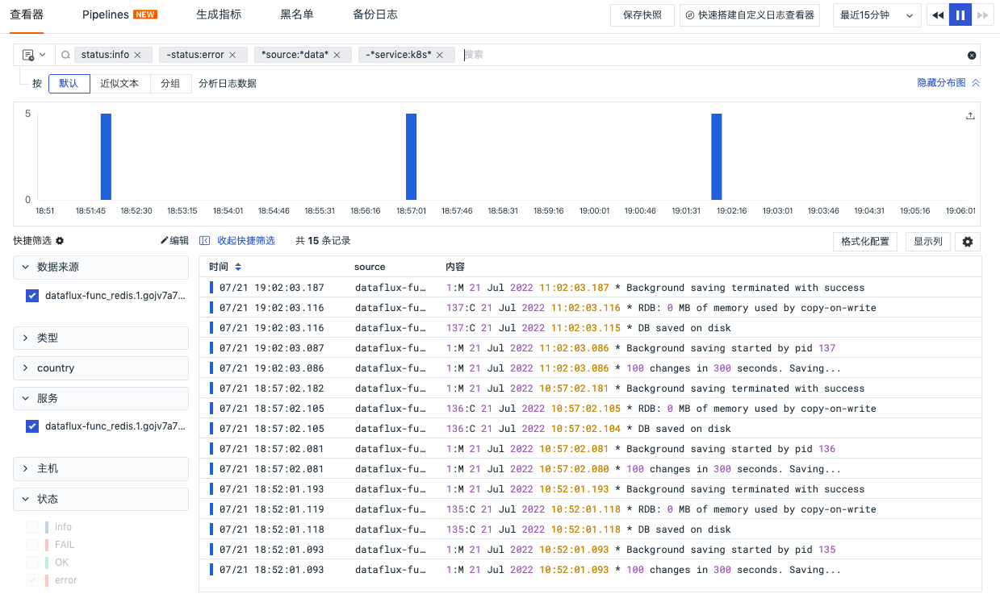
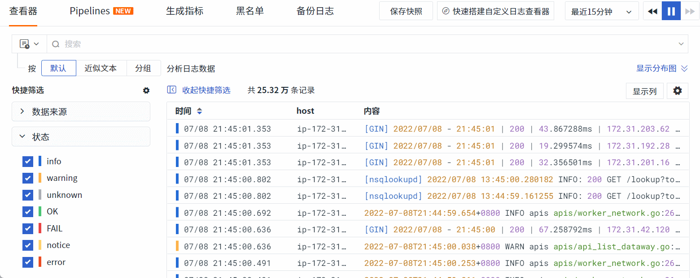
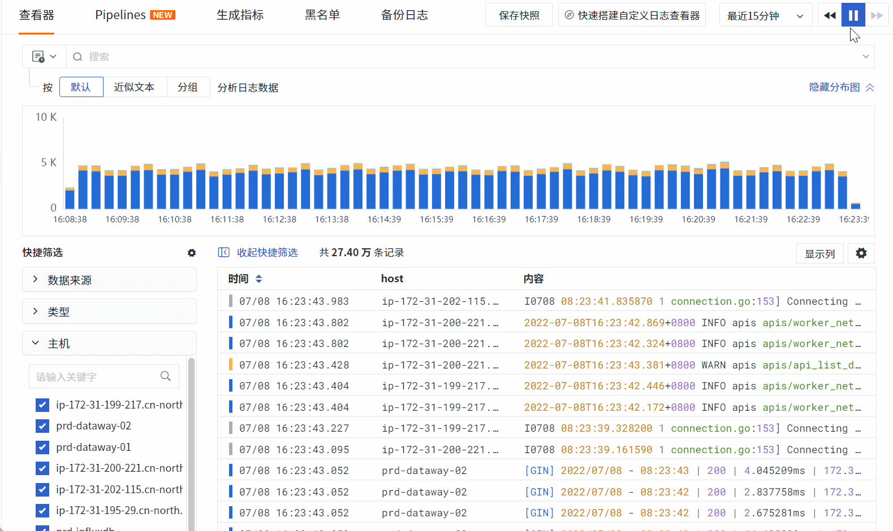
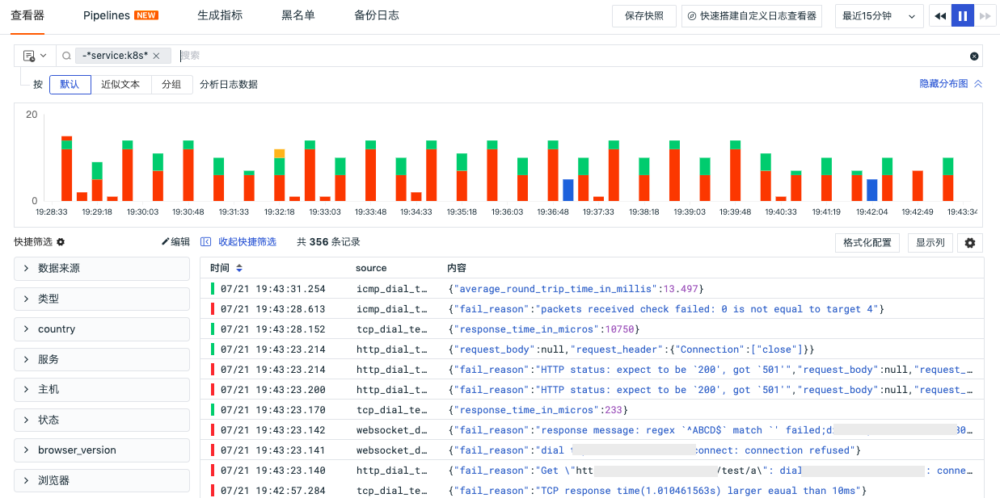
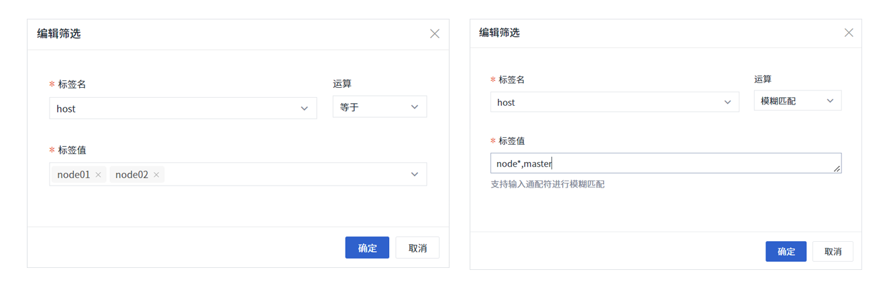
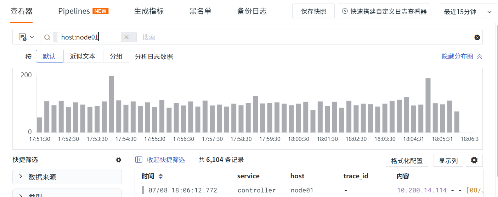

# 查看器的强大之处
---

观测云的查看器包括基础设施、事件、日志、应用性能监测、用户访问监测、CI、可用性监测、安全巡检等。查看器提供多种搜索和筛选方式，自定义选择时间范围，数据显示列添加、升降序查看、导出等功能，帮助您快速、精准的检索数据，定位故障问题。

## 搜索说明 {#search}

### 关键字搜索

查看器中支持在搜索栏输入关键字进行检索，查询结果中会对输入的关键字高亮显示，如下图所示。


### 通配符搜索

查看器中支持输入通配符进行模糊匹配搜索，如在日志搜索栏输入 `global*` ，返回关键字中含“global” 的日志数据， global 后面可以是任意数目的字符，如图所示。


### 关联搜索

查看器中支持按照 AND/OR/NOT 逻辑进行关联搜索，可以与通配符搜索联合使用。

| 逻辑关系 | 说明                                                         |
| -------- | ------------------------------------------------------------ |
| a AND b  | 返回结果需同时包含a和b，输入的关键字越多，数据匹配的范围就越精准。其中`AND`可以用 `空格` 或者 ` , `代替，即 `a,b` = `a b` = `a AND b` |
| a OR b   | 返回结果需包含 a 或者 b 的任意一个关键字                     |
| NOT c    | 返回结果需要不包含关键字 c                                   |


###  JSON 搜索 {#json}

>前提： 工作空间需要在 `2022年6月23日` 后创建，JSON 搜索功能目前仅支持日志查看器使用。

- 默认对 message 的内容进行精确检索，同时需要 message 是 json 格式，其他格式的日志内容不支持该检索方式。
- Json 搜索格式为： `@key:value`，若为多层级 json 可用 “.” 承接，即`@key1.key2:value`，如图所示。


### DQL 搜索 {#dql}

> 前提：DQL 搜索功能目前仅支持日志查看器使用。

在日志查看器，您可以通过点击搜索栏的切换小图标  ，切换到 DQL 手动输入查询模式，支持自定义输入筛选条件和搜索条件。

- 筛选条件：支持 `and / or`  任意组合，支持使用 `()` 括号表示执行搜索的优先级，支持 `=` 、`!=` 等操作符；
- 搜索条件：支持使用 DQL 函数 `query_string()` 字符串查询，如输入 `message = query_string()` 对日志内容进行搜索。

更多 DQL 语法可参考文档 [DQL 定义](../../dql/define.md) 。

***示例说明***

**示例 1 ：**

```json
source = nginx and status != OK
```

在本示例中，对日志的来源和状态进行筛选，需要注意的是**筛选的字段值（value）要区分大小写**，返回的结果如下：


**示例 2 ：**

```json
message = query_string("debug OR 200" )
```

在本示例中，对日志的内容进行进行查询搜索，支持对日志字段（key）进行 `AND` / `OR` 多种条件组合查询，更多说明可参考 DQL 函数 [query_string()](../../dql/funcs.md#query_string) 。本示例返回结果如下：


**示例 3 ：**

```json
source in ['kube-controller-manager','http_dial_testing'] and (status != 'unknown' or host != 'izbp152ke14timzud0du15z') and message = query_string('500')
```

在本示例中，对日志的来源、状态、主机以及内容进行了搜索和筛选，返回的结果如下：

- 日志状态不等于 `unknown` 或者主机不等于 `izbp152ke14timzud0du15z` ；
- 日志来源仅限于 `kube-controller-manager` 和 `http_dial_testing` ；
- 日志内容需要包括 `500` 的关键字；


### 字段筛选 {#filter}

在查看器中，可针对 `标签/属性` 进行值的筛选，支持六种筛选方式，分别为：正向筛选、反向筛选、模糊匹配、反向模糊匹配、存在和不存在。

- 可通过点击下拉进行筛选，或按规定的格式手动输入标签内容，按回车键进行筛选。
- 多个字段筛选，如正选、反选、模糊匹配、反向模糊匹配分别放在四个标签下拉中，每个标签之间都为 `and` 关系。
- 若某个标签同时有正选和反选两种状态，则在快捷筛选中该标签置灰不可操作。



=== "正向筛选"

    通过 `key:value` 的形式进行正向筛选搜索，例如：在日志查看器中搜索 `status:error` ，即返回所有状态属于 error 的日志数据。

    

=== "反向筛选"

    通过 `-key:value` 的形式进行反向筛选搜索。例如：在日志查看器中搜索 `-status:info` ，即返回所有状态 **不等于** info 的日志数据。

    

    *手动输入标签内容进行反选*

    

=== "模糊匹配"

    通过 `*key:value` 的形式进行模糊匹配（Wildcard Matching）搜索，value 中可书写通配符进行值匹配。例如：在日志查看器中搜索 `*host:prd-*` ，即返回所有主机名以 `prd-` 开头日志数据。

    > 注意：模糊匹配查询中若存在针对值 左* 匹配时容易导致查询超时，请谨慎使用

    

    *手动输入标签内容进行模糊匹配*

    

=== "反向模糊匹配"

    通过 `-*key:value` 的形式进行反向模糊匹配（Not Wildcard Matching）搜索，value 中可书写通配符进行值匹配。例如：在日志查看器中搜索 `-*service:k8s*` ，即返回所有服务不以 `k8s` 开头日志数据。支持手动输入标签内容进行反向模糊匹配。

    

=== "存在"

    通过 `key:*` 的形式进行字段存在（Exist）搜索，例如：在日志查看器中搜索 `service:*` ，即返回所有存在服务字段的日志数据。

    

=== "不存在"

    通过 `-key:*` 的形式进行字段不存在（Not Exist）搜索，例如：在日志查看器中搜索 `-service:*` ，即返回所有不存在服务字段的日志数据，从下图可以看出不包含服务的日志总共 396 条记录，数据来源于可用性监测的日志数据。

    


=== "数字运算符筛选"

    通过 `key:运算符value` 的形式进行搜索，运算符包括 `等于、大于等于、小于等于、大于、小于、不等于` 。例如：在用户访问监测 View 查看器中搜索 `loading_time>=2s` ，即返回所有加载时间大于等于 2 秒的 View 数据。

   

    支持通过运算符区间筛选，如下图所示。

    

=== "编辑筛选"

    已选标签支持如下两种编辑方式：

    **1.单击标签：**
    
    在弹出的对话框中可对筛选条件进行修改。运算方式如下：  

    - `等于`：即正向筛选，支持下拉选择标签值，或手动输入标签值按回车键确定；
    - `不等于`：即反向筛选，支持下拉选择标签值，或手动输入标签值按回车键确定；
    - `模糊匹配`：即 Wildcard Matching ，支持输入通配符进行模糊匹配搜索，多个值之间用 “,” 分隔开
    - `模糊不匹配`：即 Not Wildcard Matching ，支持输入通配符进行模糊不匹配搜索，多个值之间用 “,” 分隔开
    - `存在`：即 Exist ，支持搜索返回存在筛选字段的所有数据
    - `不存在`：即 Not Exist ，支持搜索返回不存在筛选字段的所有数据
    - `数字运算符`：即 `等于、大于等于、小于等于、大于、小于、不等于`  ，支持区间筛选，多个数值之间用 “,” 分隔开

    > 注意：label 标签不支持弹窗编辑。

    

    

    **2.双击标签：**
    
    可对单个筛选条件进行手输编辑，不能同时修改多个。如下所示：

    - [key:value] 单选标签

    

    - [key:xx项] 多选标签

    

## 分析模式说明 {#analysis}

在查看器分析栏，支持基于 **1-3 个标签**进行多维度分析统计，以反映出数据在不同的维度下，不同时间的分布特征与趋势。观测云支持多种数据图表分析方式，包括时序图、排行榜、饼图和矩形树图。

**数据显示说明**

- 数据点：数据点是指数据值所在的坐标点。时序图的折线图和面积图将依据所您所选择的时间范围自动聚合为数据点，数据点数量不超过360个点；柱状图的数据点数量不超过60个。
- 数据范围：数据范围指每一个数据点的取值范围，即以当前数据点的坐标点向前推送至上一个数据点的坐标点为间隔范围，取该范围内数据的值。


## 快捷筛选说明 {#quick-filter}

### 自定义筛选字段

在查看器中支持编辑「快捷筛选」添加新的「筛选字段」。支持两种配置方式：空间级筛选项和个人级筛选项。

> 在快捷筛选支持预设字段，新添加的字段默认为字段管理中的字段类型，若字段管理中没有，则默认为文本格式

=== "空间级筛选项"

    由管理员/拥有者进行配置，点击快捷筛选旁的「设置」按钮，即可配置空间级筛选项，支持新增字段、编辑字段别名、调整字段顺序、删除字段。

    > 注意：空间级筛选项，工作空间所有成员可以查看，但普通成员和标准成员不支持编辑、删除、移动位置。

    

=== "个人级筛选项"

    所有成员都可以配置基于本地浏览器的快捷筛选项，点击快捷筛选右侧的「编辑」，即可配置个人级筛选项，支持新增字段、编辑字段别名、调整字段顺序、删除字段。

    > 注意：个人级筛选项，仅当前个人可查看，工作空间其他成员无法查看。

    

### 操作说明

=== "全选"

    默认状态下，所有快捷筛选项的标签值全部勾选，表示未进行任何筛选。

=== "清空筛选"

    点击快捷筛选项右上角的「清空筛选」按钮取消该标签的值筛选，即恢复全选。

=== "取消/选中"

    点击快捷筛选项标签值前面的复选框，可以「取消」或「选中」该值，默认状态下取消勾选前面复选框，表示反选该值，继续取消勾选其他复选框，表示为反向多选。

    

=== "仅选中此项/取消选中"

    点击标签值所在行，表示正向单选此值「仅选中此项」，继续勾选其他值的复选框，表示为正向多选；当正向单选了某个值时，再次点击该值所在行「取消选中」，取消全部筛选。

    

=== "正选&反选"

    若某个标签同时有正选和反选两种状态，则在快捷筛选中该标签置灰不可操作。

    

=== "快捷筛选项搜索"

    当快捷筛选项超过 10 个标签字段，支持按照「字段名」或者「显示名」进行模糊搜索。

    

=== "字段值搜索"

    若快捷筛选项超过 10 个字段属性值，支持输入文本进行实时搜索，支持点击模糊匹配和反向模糊匹配进行筛选。

    

=== "字段值数量统计排名 {#top5}"

    点击快捷筛选项右上角的「设置」按钮，选择「查询值 TOP 5」，可查看当前筛选项排在前五名的字段属性值统计数量百分比。在排行榜，支持通过鼠标悬停查看数量统计，支持点击「正向筛选」、「反向筛选」按钮，以 `key:value` 的形式对当前排名的字段属性值进行数据筛选查询。

    

=== "添加/移除显示列"

    点击快捷筛选项右上角的「设置」按钮，可「添加 / 移除显示列」，自定义添加的个人级筛选项字段支持编辑显示名和删除字段。

    

=== "持续时间"

    若在查看器的快捷筛选包括“持续时间”的字段，您可以手动调整最大/最小值来进行查询分析。注意事项如下：

    - 快捷筛选的「持续时间」默认进度条最小值、最大值为链路数据列表里最小和最大的持续时间
    - 支持拖动进度条调整最大/最小值，输入框中的值同步变化
    - 支持手动输入最大/最小值，"按回车键"或"点击输入框外"进行过滤搜索
    - 输入不规范时输入框变红，不进行搜索，正确格式：纯“数字”或“数字+ns/μs/ms/s/min”
    - 若没有输入单位进行搜索，默认直接在输入的数字后面填入"s"然后进行过滤搜索
    - 若手动输入单位，则直接进行搜索

    

## 筛选历史说明 {#filter-history}

观测云支持在「筛选历史」保存查看器 `key:value` 的搜索条件历史，应用于当前工作空间不同的查看器，如在日志查看器保存了「筛选历史」，可直接在链路等其他查看器直接使用。

- 打开筛选历史：支持通过点击查看器右下角的展开小图标，或者直接通过快捷键（ Mac OS: shift+cmd+k / Windows: shift+ctrl+k ）快速打开筛选历史；
- 收起筛选历史：点击关闭按钮 `x` 或者使用 `esc` 按键可收起筛选历史。

> 注意：筛选历史仅支持在本地浏览器保存当前用户的搜索条件。


### 操作说明

在查看器筛选历史最多保存 100 条搜索条件，支持通过键盘上下切换键（↑ ↓ ），切换选择搜索条件，点击键盘 `enter` 可添加到筛选。

- 固定到筛选：鼠标放在筛选历史，可通过右侧“固定到筛选”按钮置顶搜索条件；
- 添加到筛选：点击搜索条件，即可添加到查看器进行筛选，支持多选；
- 取消筛选：添加到筛选后，再次点击搜索条件，即可取消筛选。


- 在不同查看器应用筛选历史：在日志查看器保存了筛选历史，可直接在链路等其他查看器直接使用。


## 时间控件说明 {#time}

观测云支持通过时间控件控制当前查看器的数据展示范围，用户可以手动输入时间范围，或快速选择当前查看器的内置时间范围，或通过自定义设置时间范围。

### 手动输入时间范围

时间控件默认支持区间显示，支持点击时间控件查看手动输入时间范围的格式，包括「动态时间」和「静态时间」，输入完成后「回车」或者「点击任意空白区域」即可按照输入的时间范围筛选查看对应的数据。


=== "动态时间"

    动态时间范围支持秒、分、时、天 4 种单位，如 1s、1m、1h、1d 等，如下图所示输入 20m。

    

    「回车」即可返回时间范围为最近 20 分钟，即查看器展示最近 20 分钟的数据。

    

=== "日期静态时间"

    日期标准时间格式支持以下多种写法，时间格式精确到秒级，间隔符 `~` 、`-` 、`,` 前后允许有空格输入，逗号必须是英文逗号。

    -  `2022/08/04 09:30:00~2022/08/04 10:00:00` 
    -  `2022/08/04 09:30:00-2022/08/04 10:00:00` 
    -  `2022/08/04 09:30:00,2022/08/04 10:00:00` 

    点击时间控件，可直接输入和修改标准时间格式，「回车」后按照当前的时间范围展示对应的数据。

   

=== "时间戳静态时间"

    时间戳范围支持以下多种写法，时间戳支持到毫秒级输入，间隔符 `~` 、`-` 、`,` 前后允许有空格输入，逗号必须是英文逗号。

    - `1659576600000~1659578400000` 
    - `1659576600000-1659578400000` 
    - `1659576600000,1659578400000` 

    点击时间控件，按如下图所示输入开始和结束时间戳。

    

    「回车」即可返回时间范围，并按照此时间范围筛选出对应的数据在查看器展示。

    

=== "注意事项"

    - 若格式不符合输入要求，则无法返回正确的时间范围，如开始时间晚于结束时间、不符合 `时:分:秒` 的格式输入等。

    

    - 时间控件的提示框和文本输入框实时联动，若输入的时间范围超过 4 位数时（包括时间区间、绝对时间和时间戳），时间控件提示框显示 `-` 。

    

    回车后显示时间范围。

    

### 快捷筛选时间范围

您可以在时间控件点击「更多」快速选择对应的时间范围进行数据查看。时间控件中预设了多种快捷筛选时间范围，包括下拉列表的“最近15分钟、最近1小时、最近1天等”和动态时间的“30s、45m、3d等”。


鼠标放在动态时间上，即可和输入框内容进行实时联动，点击即可查看对应时间范围的数据内容。


### 自定义时间范围

除了预设的时间范围以外，您可以在时间控件点击「自定义时间」选择时间范围，包括日期和具体的时间，点击「应用」，即可按照自定义的时间范围进行数据筛选，。

???+ attention 

    - 自定义时间范围的开始和结束时间需按照 `时:分:秒` 的格式输入，如 `15:01:09` 。
    - 自定义时间范围的开始时间不能晚于结束时间。
    - 自定义时间范围的查询记录可在「自定义时间查询历史」中查看，最多支持最近 20 条历史绝对时间记录查看，点击任意历史记录，即可快速筛选查看对应的数据内容。


### URL 的时间范围 {#url}

除了时间控件提供的时间范围选择以外，观测云还支持在浏览器的 URL 中直接修改当前工作空间查看器的 `time` 参数的时间范围进行数据查询，支持秒、分、时、天 4 种单位，如 time=30s、time=20m、time=6h、time=2d 等，如下图所示在浏览器修改 `time=2h` ，查看器展示最近 2 小时的数据。

???+ attention 

    - 每种单位只能独立使用，不可组合
    - 当选择或者在浏览器输入的时间范围大于等于 1d ，查看器自动停止播放模式。


### 锁定时间范围 {#fixed}

观测云支持在时间控件通过点击锁定图标，设置固定的查询时间范围，设置完成后，所有的查看器/仪表板均默认显示当前的时间范围。


### 设置时区 {#zone}

观测云支持在时间控件设置当前显示时区，您也可以在「[账号管理](../../management/account-management.md#zone)」进行修改，默认提供 `（UTC+08:00）北京` 时区。


### 查看器自动刷新

在观测云工作空间，点击「账号」，可开启 / 关闭 「查看器自动刷新」。

- 开启：查看器的数据按照时间控件的默认数据刷新时间 30 秒进行自动刷新，如选择最近 15 分钟，按照 30 秒刷新一次显示最近 15 分钟的数据
- 关闭：查看器的时间控件进入时关闭 30 秒自动刷新，如选择最近 15 分钟，即显示该15分钟绝对时间的内容数据且不再自动刷新，可点击「播放」按钮刷新查看最近 15 分钟的数据。

> 注意：查看器自动刷新仅对本地浏览器生效。


点击「暂停」按钮，退出实时数据刷新模式，锁定当前时间范围为绝对时间。

> 例如：时间范围选择了“最近 15 分钟”，那么当点击「暂停」按钮后，查看器的时间范围整体向前调节为 15 分钟


## 显示列说明 {#columns}

查看器支持选择显示行数来展开查看日志 Message 数据，支持点击「显示列」自定义添加、编辑、删除、拖动显示列，支持通过键盘上下切换键（↑ ↓ ）选择添加显示列，支持在「显示列」进行关键字搜索，支持在「显示列」自定义显示列作为预设字段，后续通过Pipeline切割字段并上报数据后可直接显示上报的数据。


### 添加显示列

在查看器显示列，支持输入字段进行匹配搜索，默认选中搜索到的第一个字段，支持通过键盘上下切换键（↑ ↓ ）选择添加显示列。


若输入的字段不存在，支持通过“分割线”进行区分，并提示“创建并添加”显示列，创建后作为预设字段，后续通过 Pipeline 切割字段并上报数据后可直接显示上报的数据。


### 操作说明

在查看器列表，当鼠标放在显示列上时，可点击显示列的「设置」按钮，支持对显示列进行升序、降序、向左移动列、向右移动列、向左添加列、向右添加列、替换列、添加到快捷筛选、添加到分组、移除列等操作。

- 升 / 降序：按照升序或降序排列显示当前字段的值
- 向左 / 右移动列：对当前显示列往左或往右移动，若不支持移动列，则不显示该操作
- 向左 / 右添加列：基于当前列往左或者往右添加新的显示列，支持搜索，若不支持添加列，则不显示该操作
- 替换列：在当前位置替换当前显示列，支持搜索，若不支持替换列，则不显示该操作
- 添加到快捷筛选：若左侧快捷筛选无当前显示列，点击即可添加该显示列作为新的快捷筛选项，点击该快捷筛选项的「设置」按钮可移除该显示列。
- 添加到分组：基于当前显示列作为分组字段，显示分组查看器的内容
- 移除列：移除当前显示列


若显示列的内容显示不完整，支持把鼠标放在显示列右侧分割线上「双击分割线」，即可展开该列的内容，如下图的`source`列。


## 保存快照说明 {#snapshot}

在指标、日志、事件、应用性能监测、用户访问监测、云拨测、安全巡检等查看器，您可以对当前展示的数据进行搜索和筛选、选择时间范围、增加查看列等操作，然后点击查看器左上角的「快照」小图标，点击「保存快照」即可保存当前查看器所展示的数据内容，支持在历史快照中对保存的快照进行“分享快照”、“复制快照链接”和“删除快照”等操作。更多快照使用详情，可参考文档 [快照](../../management/snapshot.md) 。


## 导出说明 {#export}

在查看器，您可以对当前展示的数据进行搜索和筛选、选择时间范围、增加查看列等操作，然后点击查看器右侧的「设置」按钮，导出当前查看器所展示的数据内容。支持「导出到 CSV 文件」、「导出到仪表板」以及「导出到笔记」进行数据查看和分析。


## 图表说明 {#chart}

- 图表导出：在查看器图表，您可以通过鼠标悬浮至图表，点击「导出」按钮即可导出或复制图表到仪表板、笔记进行展示和分析；
- 图表时间间隔：在查看器图表，您可以选择图表的时间间隔查看对应的图表数据。


