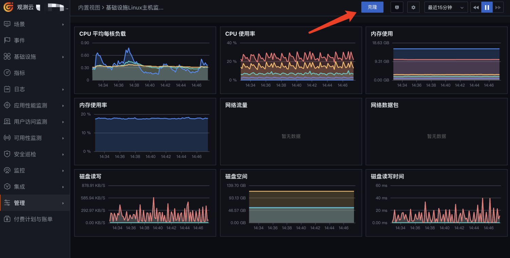

# 自定义仪表板
---

## 概述

仪表板可以帮助您快速定位到系统出现问题的原因，所以创建的仪表板是您自己要知道这个仪表板需要帮助您解决什么的问题，从需要解决的问题角度出发，去构建一个仪表板。 本指南可以帮助您如何快速构建仪表板。

## 前置条件

您需要先创建一个[观测云账号](https://www.guance.com)，并在您的主机上[安装 DataKit](../../datakit/datakit-install.md)，开启相关集成的运行，进行数据采集。

## 前言

创建仪表板前，您首先需要明确创建这个仪表板的目的。一个好的仪表板可以帮助您的团队专注在正确的事上。制作一个仪表板，我们需要去挖掘团队最需要去关注、最经常要使用的信息，将这些信息归纳整理成一个个仪表板。尤其是影响 SLO、SLI 相关的明细，是每一个优秀团队都需要的仪表板。

仪表板按用途分，可以分为**统计仪表板**和**执行仪表板**。

- **统计仪表板 **比如资源消耗情况、业务统计信息等，可以让您实时掌握需要关注的一些统计类信息。

- **执行仪表板 **是帮助您的团队去解决问题，将需要持续存在并需要持续追踪的问题构建成的仪表板，并逐步完善它，比如每个服务的自身指标观测仪表板。

## 开箱即用的仪表板

观测云提供了大量开箱即用的仪表板，比如对于基础设施类，您可以直接使用开箱即用的仪表板：

1. 进入“管理” > “内置视图”，可以搜索到您开启的集成对应的仪表板，比如 MySQL、Redis 等。
1. 点击某一个“内置视图”上的“查看”，打开这个仪表板，查看是否有显示您开启的这个集成的数据。

## 创建一个仪表板

### 从现有仪表板复制

要快速创建一个仪表板，您可以从一个现存的类似仪表板复制一个出来，然后进行少量的修改或扩展，变成一个新的仪表板，比如在在“场景” > "仪表板"列表页面，找到一个您需要的类似的仪表板，进入仪表板后，在右上角的齿轮图标中找到“复制仪表板”：

对这个复制出来的仪表板进行的任何修改，不会影响原**仪表板**。

### 从内置视图中克隆

要快速创建一个仪表板，您可以从一个现存的类似仪表板复制一个出来，然后进行少量的修改或扩展，变成一个新的仪表板，比如在**内置视图**中，找到某个内置集成视图，点击“**查看**”按钮打开视图，可以在打开的视图页面右上解看到“**克隆**”按钮：

克隆后，您可以在“**场景**” > “**仪表板**”列表中看到您刚刚克隆出来的“**仪表板**”，点击进入这个仪表板，可以在这个仪表板的基础上进行添加、修改或扩展它，来满足您团队的需要。对这个克隆出来的仪表板进行的任何修改，不会影响原**内置视图**。

### 创建新的仪表板

您也可以选择全新创建一个仪表板，在“**场景**” > “**仪表板**” 页面的左上角，有一个“**新建仪表板**”按钮，点击可以创建一个新的仪表板，此处也可以选择一个“内置视图”，以这个内置视图为模板创建一个新的仪表板出来，效果等同上述的“**从内置视图中克隆**”，也可以创建一个空白的“**仪表板**”，从零开始构建一个“**仪表板**”。

### 对仪表板进行编辑

点击某一个“仪表板”进入，点击右上角的“编辑”按钮，来对这个“**仪表板**”进行编辑，您可以：

1. 从顶部的“**图表库**”拖动一个图表到合适的位置，在这个“**仪表板**”上进行添加新图表。
1. 编辑一个现有的图表，可以修改这个图表的标题、样式配置、数据查询配置等。
1. 删除一个不需要的图表。
1. 您可以去其他仪表板或者当前仪表板复制一个图表，然后当前仪表板中按 Ctrl + V（Mac 上为 Command + V）进行粘贴，创建一个新的图表，也可以从当前仪表板中直接“**克隆**”一个图表。
1. 鼠标点中某个图表的标题栏，将他拖动到您认为合适的位置。

图表的“**编辑**”、“**删除**”、“**复制**”、“**克隆**”等功能都集中在图表右上角的下拉菜单中。

## 添加图表并以最合适的方式显示数据

当您确定了在这个仪表板上要显示指标数据后，您需要考虑的是这些指标数据可以以一种什么样的形式来最优方式来显示。您可以尝试使用各种[图表类型](../../scene/visual-chart/index.md)、[查询方式](../../scene/visual-chart/chart-query.md)、[函数](../../scene/visual-chart/chart-query.md)、[聚合方式](../../scene/visual-chart/chart-query.md)，来将数据最优化方式显示。

在“**仪表板**”上添加“**视图变量**”，以满足您在一个“**仪表板**”上查看不同对象的数据展示。比如您在“**仪表板**”不添加了各种主机指标信息的图表，但您的系统中有10台主机，所以您需要创建一个“**主机**”视图变量，并在各个主机相关图表中引用它，那么您就可以通过切换这个视图变量的值，来显示不同主机的信息。

### 各种图表的使用

我们的图表组件库中有丰富的图表组件可以在“**仪表板**”中使用： 

- **时序图：**用于显示时序指标信息，时序图横坐标永远是时间维度，表示根据时间走势指标值的变化情况。比如主机的CPU、内存等指标值，这些采集器持续采集并上报的值，可以以时序图的形式展示出每个时间点当时的情况。展现形式可以选择使用“**折线图**”、“**面积图**”、“**柱状图**”中的一种。
- **对象列表图：**以列表形式展示您的基础设施，包括 **主机、容器、进程 **等基础设施对象，也可以是**自定义对象**。
- **概览图：**用于显示统计性的信息
- **告警统计图：**展示当前产生的不同等级的告警统计信息。
- **文本、图象、视频：**丰富您的仪表板，可以添加多种类型的资源到当前仪表板，比如也可以用于解释当前仪表板的用途等。
- **表格图：**用标签作为分组聚合展示指标值，以表格列表的方式展示数据，比如按主机聚合显示主机的CPU、内存等指标值。
- **排行榜：**以排序方式展示，比如 CPU 使用率最高的主机、磁盘空余量最少的主机、访问量最大的 View 等。
- **SLO：**在仪表板中显示您的 SLO 信息，显示您当前 SLO 目标值，以及周期内剩余额度等。

可以在这里，查看其他更多的[图表](../../scene/visual-chart/index.md)及使用方式。

## 其他

### 如何更好的组织仪表板上的图表

一个仪表板上可以包含很多个图表，如何有条理的组织这些图表，以便更方便准确的使用仪表板。

原则上，您可以将图表按照重要优先级程度依上而下排列。但这首先要根据不同图表的用途进行归类分组，您可以在仪表板上添加一个“**分组**”（在**图表库**中），那么这个“**分组**”以下的图表都会归到这个分组内，以便您可以折叠这个分组，将更多的关注点放到其他图表上。

你可以灵活使用“**文本**”图表组件，在适当的位置添加“**文本**”图表组件来解读说明这一片区域的图表意义或者注意事项。

在图表的布局设计上，要让看的人在一屏区域内能看到更多的信息，所以图表布局上要紧凑，不要空泛，将相关意义的图表放在同一区域。

### 如何在仪表板上使用链接

您可以通过两种方式在仪表板上添加链接：

1. 添加“**文本**”图表，**“文本**”图表中可以添加 Markdown 文本，在文本中可以添加链接。
1. 在图表的设置中添加自定义链接，可以在自定义链接中使用模板变量，可以将您点击的内容信息传递到目标链接，以便目标页面可以根据您点击的内容展示不同的数据。

### 分享图表

您可以在图表右上角的下拉菜单中“**分享**”这个图表，创建这个图表的“**分享**”链接，可以让外部的人查看到这个图表。

### 分享仪表板 
我们不能直接对仪表板进行分享，但是我们可以将仪表板保存为“**快照**”，然后对这个快照进行分享。

