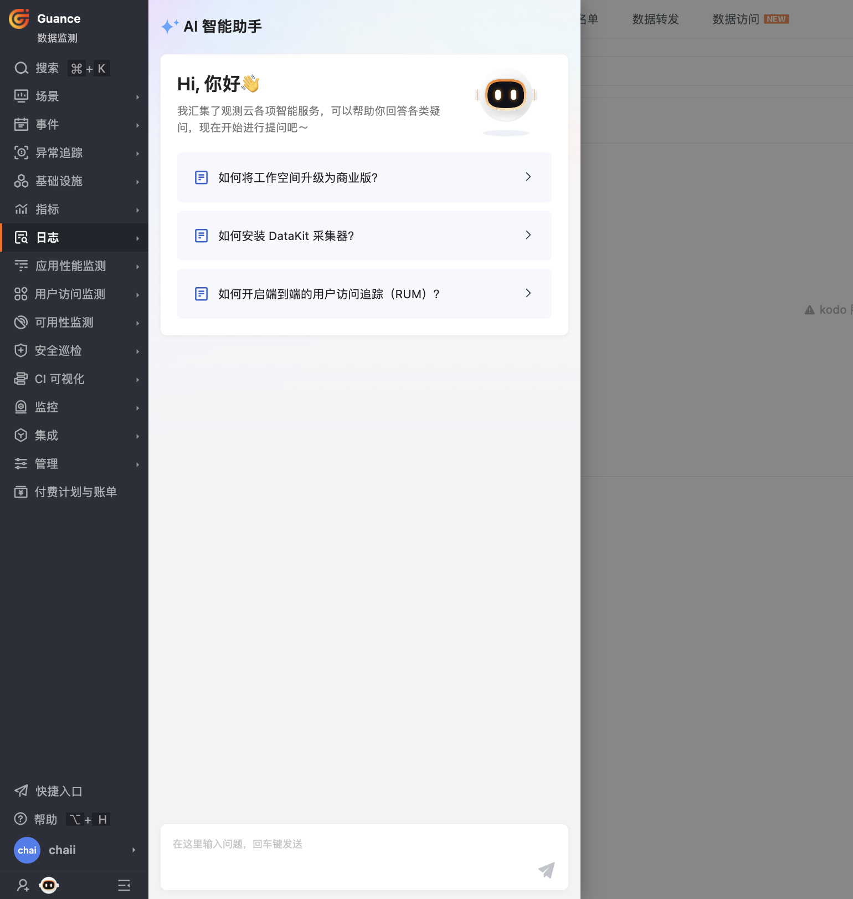
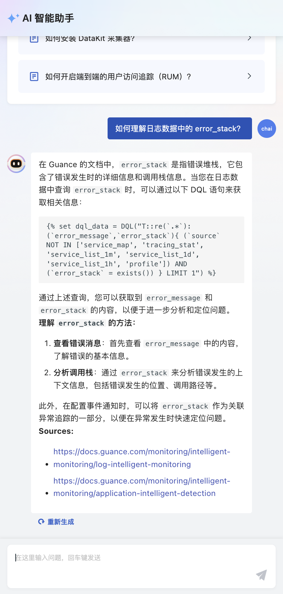

# AI 智能助手
---

在您使用观测云平台的过程中，可能会遇到需要解决的各种技术难题和操作疑问。为了确保您能够获得即时的支持，观测云开发了先进的 AI 智能助手，它旨在作为一个全天候的技术支持伙伴，随时准备解答您的咨询。通过自然语言处理和机器学习技术，AI 智能助手能够提供尽量精准的解答，并在与您的互动中不断优化其响应算法，以增强答案的相关性和准确性。我们的目标是确保您在使用观测云时，能够无缝地获取所需的信息，从而提升您的工作效率和体验。

进入观测云控制台，点击 AI 智能助手图标，即可展开聊天框开启对话。

输入您想了解的问题，AI 智能助手会竭力为您解答：

如果您不满意这次回答，点击**重新生成**按钮即可。