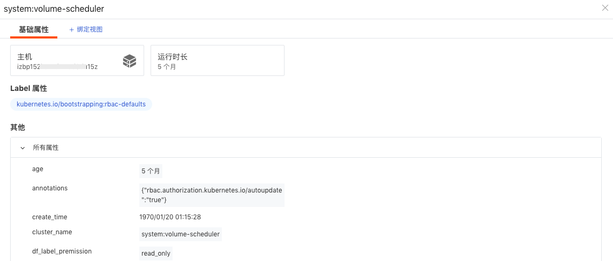

# 容器

---

容器数据采集成功后会上报到控制台，进入**基础设施 > 容器**，您可以查看到工作空间内容器各种对象的数据信息。

## 查看器

容器数据有两种查看和分析模式，通过切换页面左上角 :octicons-list-unordered-24: 和 :material-hexagon-multiple-outline:，您可以查看：

- [容器对象列表](#object)；
- [容器蜂窝图](#distribution)。

### 容器对象列表 {#object}

针对当前工作空间<u>最近十分钟内</u>采集的容器对象数据，您可以以集合形式进行查看，并进一步对容器数据进行查询与分析；还可为容器设置标签，通过标签筛选展示相同标签的容器列表。

- **[Containers](#containers)**：可查看工作空间内采集的全部 Containers 信息；

- **Kubernetes 集合**：可查看工作空间内采集的 Pods、Services、Deployments、Clusters、Nodes、Replica Sets、Jobs、Cron Jobs、Daemonsets 信息。

#### 查询与分析 

- 时间控件：容器对象列表支持查看<u>最近十分钟内</u>采集的数据。通过 :material-refresh: 按钮可以刷新至当前时间范围，重新获取数据列表。

- [搜索与筛选](../getting-started/function-details/explorer-search.md)：在查看器搜索栏，支持关键字搜索、通配符搜索等多种搜索方式；支持通过 `标签/属性` 进行值的筛选，包括正向筛选、反向筛选等多种筛选方式。

- [快捷筛选](../getting-started/function-details/explorer-search.md#quick-filter)：在快捷筛选进行编辑，添加新的筛选字段。添加完成后，可以选择其字段值进行快捷筛选。

- [自定义显示列](../getting-started/function-details/explorer-search.md#columns)：可通过**显示列**自定义添加、编辑、删除、拖动显示列。

- [分析模式](../getting-started/function-details/explorer-search.md#analysis)：支持基于 <u>1-3 个标签</u>进行多维度分析统计，以反映出数据在不同维度下的分布特征，支持多种数据图表分析方式，包括排行榜、饼图和矩形树图。

- 排序：点击列表菜单，如：CPU 使用率、MEM 使用率，您可以基于选中的标签进行升降排序。        

- 数据导出：查看器右上角的 :material-cog: 图标，您可以：
    
    - 导出到 CSV 文件：保存当前列表为 CSV 文件到本地； 
    - 导出到仪表板：保存当前列表为**可视化图表**到指定**仪表板**；
    - 导出到笔记：保存当前列表为**可视化图表**到指定**笔记**。

如果需要导出某条数据，打开该条数据详情页，点击右上角 :material-tray-arrow-up: 图标即可。    

#### Containers {#containers}

支持查看工作空间内采集的全部容器信息，包括容器名称、相关主机、运行状态、CPU 使用率、MEM 使用率等。

##### 详情页

点击列表某条对象可划出详情页查看容器的详细信息，包括容器状态、容器名称、容器 ID、容器镜像、容器所关联的主机、Pod、日志、进程和 Label 属性。

##### Label 属性 {#label}

随容器信息默认自动上传。容器标签添加后，可在容器对象列表通过添加的标签筛选展示容器列表。

##### 关联分析 {#association-analysis}

观测云支持对每一个基础设施对象进行关联分析，在容器对象的详情页，除了容器的基本信息，您还可以一站式地了解关联对应容器的的指标、主机、Pods、日志、进程等，更快更全面地监测容器运行情况。

=== "指标"

    您可以实时监测<u>最近 24 小时内</u>容器的性能状态，可选择不同的时间范围进行查看。点击右上角图标，可在内置视图对绑定的容器视图进行自定义编辑保存。

    **注意**：若容器关联字段 `service`、`project`、`namespace`，则可以在容器详情查看该三个字段对应的视图。

=== "主机"

    您可以查看相关主机（关联字段：`host`）的基本信息和<u>在选定时间组件范围内</u>的性能指标状态。

    **注意**：在容器详情中查看相关主机，需要匹配字段 `host`，否则无法在容器详情查看到相关主机的页面。

    - 属性视图：包括主机的基本信息、集成运行情况，若开启云主机的采集，还可查看云厂商的信息；  
    
    - 指标视图：可查看默认 24 小时内，相关主机的 CPU、内存等性能指标视图。点击**打开该视图**至[内置视图](../scene/built-in-view/bind-view.md)，可通过克隆的方式对主机视图进行自定义修改，并作为用户视图保存，用户视图可通过绑定在容器详情页查看。
    
    另外，通过点击容器详情页的标签**主机**，您可以进行以下操作：
    
    | 操作 | 说明 |
    | --- | --- |
    | 筛选字段值 | 即添加该字段至查看器，查看与该字段相关的全部数据。 |
    | 反向筛选字段值 | 即添加该字段至查看器，查看除了该字段以外的其他数据。 |
    | 添加到显示列 | 即添加该字段到查看器列表进行查看。 |
    | 复制 | 即复制该字段至剪贴板。 |
    | 查看相关日志 | 即查看与该主机相关全部日志。 |
    | 查看相关容器 | 即查看与该主机相关全部容器。 |
    | 查看相关进程 | 即查看与该主机相关全部进程。 |
    | 查看相关链路 | 即查看与该主机相关全部链路。 |
    | 查看相关巡检 | 即查看与该主机相关全部巡检数据。 |
    
    

=== "日志"

    您可以查看与该容器相关的<u>最近 1 小时</u>的日志及日志数量，并对这些相关日志进行关键字搜索、多标签筛选和时间排序等。     

    - 如需查看更详细的日志信息：可点击日志内容跳转到对应日志详情页面，或点击跳转至**日志**查看与该主机相关的全部日志；        
  
    - 如需查看更多的日志字段或更完整的日志内容：可通过关联日志查看器**显示列**自定义调整“最大显示行数”、“显示列”。  
  
    **注意**：为了更流畅的用户查询体验，观测云默认即时保存用户在**日志**的浏览设置（包括“最大显示行数”、“显示列”），以使**关联日志**与**日志**保持一致。然而，在**关联日志**进行的自定义调整，在退出页面后不做保存。

=== "关联 Pods"

    您可以查看相关 Pods（关联字段：`pod_name`）的基本信息和<u>在选定时间组件范围内</u>的性能指标状态。

    **注意**：在容器详情中查看相关 Pods，需要匹配字段 `pod_name`，否则无法在容器详情查看到相关 Pods 的页面。

#### Pods {#pods}

通过左上角的对象 **Pods**，您可以查看空间内留存的全部 Pods 的信息，包括 Pods 名称、运行状态、重启次数、启动时间等。

##### Pods 详情页

点击列表某条对象可划出详情页查看 Pods 的详细信息，包括运行状态、Pods 名称、所属的节点 Node、Label 属性、关联指标、关联容器、关联日志、YAML 文件、网络连接状态、关联服务器运行状态以及关联 kubernetes。

通过点击标签**主机**，您可以对该主机相关的日志、容器、进程、链路、巡检等数据进行查询。

| 操作 | 说明 |
| --- | --- |
| 筛选字段值 | 即添加该字段至查看器，查看与该字段相关的全部数据。 |
| 反向筛选字段值 | 即添加该字段至查看器，查看除了该字段以外的其他数据。 |
| 添加到显示列 | 即添加该字段到查看器列表进行查看。 |
| 复制 | 即复制该字段至剪贴板。 |
| 查看相关日志 | 即查看与该主机相关全部日志。 |
| 查看相关容器 | 即查看与该主机相关全部容器。 |
| 查看相关进程 | 即查看与该主机相关全部进程。 |
| 查看相关链路 | 即查看与该主机相关全部链路。 |
| 查看相关巡检 | 即查看与该主机相关全部巡检数据。 |

##### Label 属性

**Label 属性**随 Pods 信息默认自动上传。已有的 Pods 标签，可在 Pods 对象列表通过快捷筛选展示相同标签的 Pods 数据。

##### 关联分析

观测云支持对每一个基础设施对象进行关联分析，在 Pods 对象的详情页，您不仅能够了解 Pods 的基本信息，还可以一站式关联对应 Pods 的指标、容器、日志、网络、主机等，更快更全面的监测 Pods 运行情况。

Kubernetes 日志/事件：点击 Kubernetes 日志/事件可查看 `namespace`、`source`、`kind`、`name` 关联的对应数据。

点击右上角时间控件，可自定义时间范围筛选数据。

#### Services

通过左上角的对象 **Services**，您可以查看空间内留存的全部 Services 的信息，包括 Services 名称、服务类型、Cluster IP、External IP、运行时长等。

##### Services 详情页

点击列表某条对象可划出详情页查看 Services 的详细信息，包括名称、基础信息、Label 属性、YAML 文件等。

**注意**：若 Services 关联字段 `namespace`，则可以在 Services 详情页查看该字段对应的指标视图。

##### Label 属性

**Label 属性**随 Services 信息默认自动上传。已有的标签，可在 Services 对象列表通过快捷筛选展示相同标签的 Services 数据。

##### kubernetes 事件

点击 kubernetes 事件可查看 `namespace`、`source`、`kind`、`name` 关联的对应数据。

点击右上角时间控件，可自定义时间范围筛选数据。

#### Deployments

通过左上角的对象 **Deployments**，您可以查看空间内留存的全部 Deployments 的详尽信息，包括 Deployments 名称、可用副本、已升级副本、准备就绪、运行时长等。

##### Deployments 详情页

点击列表某条对象可划出详情页查看 Deployments 的详细信息，包括名称、基础信息、Label 属性和其他字段属性。支持查看关联的日志、Replica Set、Pods、网络数据以及关联 kubernetes。

**注意**：若 Deployments 关联字段 `namespace`，则可以在 Services 详情页查看该字段对应的指标视图。

##### Label 属性

**Label 属性**随 Deployments 信息默认自动上传。已有的标签，可在 Deployments 对象列表通过快捷筛选展示相同标签的 Deployments 数据。

##### 关联分析 

=== "YAML"

    支持查看 Deployments 对应的 YAML 文件。在基础设施 Deployments 的详情页，点击 **YAML** ，即可查看对应的 YAML 文件。

=== "日志"

    通过详情页下方的**日志**，您可以查看与该 Deployments 相关的<u>最近 1 小时</u>的日志及日志数量，并对这些相关日志进行关键字搜索、多标签筛选和时间排序等。

    - 如您需查看更详细的日志信息：可点击日志内容跳转到对应日志详情页面，或点击跳转至**日志**查看与该主机相关的全部日志;
    
    - 如需查看更多的日志字段或更完整的日志内容：可通过关联日志查看器**显示列**自定义调整“最大显示行数”、“显示列”。
    
    **注意**：为了更流畅的用户查询体验，观测云默认即时保存用户在**日志**的浏览设置（包括“最大显示行数”、“显示列”），以使**关联日志**与**日志**保持一致。然而，在**关联日志**进行的自定义调整，在退出页面后不做保存。

=== "Pods"

    支持查看 Deployments 对应 Pods 的准备状态、重启次数、运行时长等，点击 Pods 或点击跳转按钮至 Pods 查看与本 Deployments 相关的全部 Pods。

=== "Replica Set"

    支持查看 Deployments 对应 Replica Sets 的准备状态、运行时长等，点击 Replica Sets 或点击跳转按钮至 Replica Sets 查看与本 Deployments 相关的全部 Replica Set。

=== "网络"

    Deployments 网络支持查看 Deployments 之间的网络流量。支持基于 IP/端口查看源 IP 到目标 IP 之间的网络流量和数据连接情况，通过可视化的方式进行实时展示，帮助企业实时了解业务系统的网络运行状态，快速分析、追踪和定位问题故障，预防或避免因网络性能下降或中断而导致的业务问题。
    
    Deployments 网络数据采集成功后会上报到观测云控制台，您可以在**基础设施 > 容器 > Pods**详情页中的**[网络](network.md)**，查看当前 Deployments 的网络性能监测数据信息。

=== "kubernetes 日志/事件"

    点击 kubernetes 日志/事件点击 kubernetes 事件可查看 `namespace`、`source`、`kind`、`name` 关联的对应数据。

    点击右上角时间控件，可自定义时间范围筛选数据。

    

#### Clusters

通过左上角的对象 **Clusters**，您可以查看空间内留存的全部 Clusters 的信息，包括 Clusters 名称、运行时间、kubernetes 注释等。

##### Clusters 详情页

点击列表某条对象可划出详情页查看 Clusters 的详细信息，包括名称、基础属性信息、Label 属性和其他字段属性。

##### Label 属性

**Label 属性**随 Clusters 信息默认自动上传。已有的标签，可在 Clusters 对象列表通过快捷筛选展示相同标签的 Clusters 数据。

#### Nodes

通过左上角的对象 **Nodes**，您可以查看空间内留存的全部 Nodes 的信息，包括 Nodes 名称、状态、版本、运行时间。

##### Nodes 详情页

点击列表某条对象可划出详情页查看 Nodes 的详细信息，包括名称、基础属性信息、Label 属性和其他字段属性。支持查看关联的 Pods 数据。

其中，点击 kubernetes 事件可查看 `namespace`、`source`、`kind`、`name` 关联的对应数据。右上角时间控件支持自定义时间范围筛选数据。

##### Label 属性

**Label 属性**随 Nodes 信息默认自动上传。已有的标签，可在 Nodes 对象列表通过快捷筛选展示相同标签的 Nodes 数据。

#### Replica Sets

通过左上角的对象 **Replica Sets**，您可以查看空间内留存的全部 Replica Sets 的详尽信息，包括 Replica Sets 名称、运行时间长，集群等。

##### Replica Sets 详情页

点击列表某条对象可划出 Replica Sets 详情页查看 Replica Sets 的信息，包括名称、基础属性信息、 Label 属性和其他字段属性。支持查看关联的 Pods 数据。

**注意**：若 Replica Sets 关联字段 `namespace`，则可以在 Services 详情页查看该字段对应的指标视图。

其中，点击 kubernetes 事件可查看 `namespace`、`source`、`kind`、`name` 关联的对应数据。右上角时间控件支持自定义时间范围筛选数据。

##### Label 属性

**Label 属性**随 Replica Sets 信息默认自动上传。已有的标签，可在 Replica Sets 对象列表通过快捷筛选展示相同标签的 Replica Sets 数据。

#### Jobs

通过左上角的对象 **Jobs**，您可以查看空间内留存的全部 Jobs 的信息，包括 Jobs 名称、并行数量、活跃数、运行时间等。

##### Jobs 详情页

点击列表某条对象可划出详情页查看 Jobs 的详细信息，包括名称、基础属性信息、Label 属性和其他字段属性。

##### Label 属性

**Label 属性**随 Jobs 信息默认自动上传。已有的标签，可在 Jobs 对象列表通过快捷筛选展示相同标签的 Jobs 数据。

#### Cron Jobs

通过左上角的对象 **Cron Jobs**，您可以查看空间内留存的全部 Cron Jobs 的信息，包括 Cron Jobs 名称、运行日程、是否暂停、Jobs 活跃数量、运行时间等。

##### Cron Jobs 详情页

点击列表某条对象可划出详情页查看 Cron Jobs 的详细信息，包括名称、基础属性信息、 Label 属性和其他字段属性。

其中，点击 kubernetes 事件可查看 `namespace`、`source`、`kind`、`name` 关联的对应数据。右上角时间控件支持自定义时间范围筛选数据。

##### Label 属性

**Label 属性**随 Cron Jobs 信息默认自动上传。已有的标签，可在 Cron Jobs 对象列表通过快捷筛选展示相同标签的 Jobs 数据。

#### Daemonsets

通过左上角的对象 **Daemonsets**，您可以查看空间内留存的全部 Daemonsets 信息，默认显示 Daemonsets 名称、期望节点数、更新节点数、准备就绪节点数、运行时长等。

##### Daemonsets 详情页 {#daemonsets}

点击列表某条对象可划出详情页查看 Daemonsets 更新节点数、准备就绪节点数和其他字段属性。

其中，点击 kubernetes 事件可查看 `namespace`、`source`、`kind`、`name` 关联的对应数据。右上角时间控件支持自定义时间范围筛选数据。

##### Label 属性

**Label 属性**随 Daemonsets 信息默认自动上传。已有的标签，可在 Daemonsets 对象列表通过快捷筛选展示相同标签的 Daemonsets 数据。

#### Statefulset {#statefulset}

通过左上角的对象 **Statefulset**，您可以查看空间内留存的全部 Statefulset 信息，默认显示 Statefulset 名称、集群、命名空间、运行时长、已准备副本数、正在运行副本数和期望副本数。

##### Statefulset 详情页 

点击列表某条对象可划出详情页查看 Statefulset 关联的已准备副本数、运行时长和其他字段属性。

其中，点击 kubernetes 事件可自动查看 `source`、`involved_kind`、`involved_namespace`、`involved_name` 关联的对应数据。右上角时间控件支持自定义时间范围筛选数据。

#### Persistent Volumes {#persistent-volumes}

通过左上角的对象 **Persistent Volumes**，您可以查看空间内留存的全部 Persistent Volumes 信息，默认显示 Persistent Volumes 名称、集群、命名空间、可用数、空闲节点和容量。

##### Persistent Volumes 详情页 

点击列表某条对象可划出详情页查看 Persistent Volumes 关联的 Pod 名称和可用空间。

<!--
其中，点击 kubernetes 事件可自动查看 `source`、`involved_kind`、`involved_namespace`、`involved_name` 关联的对应数据。右上角时间控件支持自定义时间范围筛选数据。

-->

### 蜂窝图 {#distribution}

在**基础设施 > 容器**，切换查看器至容器蜂窝图时，您可以对工作空间的 **Containers** 和 **Kubernetes > Pods** 数据以蜂窝图形式进行查看。

- **Containers** 蜂窝图：可快速查看容器指标值【CPU 使用率、MEM 使用率、CPU 使用率（标准化）和 MEM 使用率（标准化）】的大小，并分析不同项目、不同服务、不同主机、不同镜像下的容器性能状态；

- **Pods** 蜂窝图：可快速查看 Pods 的重启次数，并分析不同项目、不同服务、不同主机、不同 Nodes 名称、不同命名空间下的 Pods 性能状态。

| 操作      | 说明                 |
| ----------- | ---------------- |
| [搜索和筛选](../getting-started/function-details/explorer-search.md)      |                  |
| 分析      | 您可以通过添加一个或多个分组标签重新组合 Containers/Pods 对象。                 |
| 填充      | 您可以自定义选择填充指标，填充指标值的大小将决定填充的图例颜色。包含 CPU 使用率、MEM 使用率、CPU 使用率（标准化）和 MEM 使用率（标准化）四种指标填充方式。                 |
| 自定义区间      | 您可以通过 **图例设置** 开启自定义图例范围。图例的颜色将依据图例的最大和最小值等分为 5 个区间，每个区间将自动对应五个不同的颜色。                 |
| 鼠标悬停      | 悬停鼠标至容器对象，可查看容器名称、CPU 使用率、MEM 使用率、CPU 使用率（标准化）和 MEM 使用率（标准化）。                 |

## 分析看板 {#analyse}

在**基础设施 > 容器**，可切换查看器至**分析看板**。

分析看板将 Kubernetes 集合相关的概览图表同时展示在同一界面，通过多维度数据分析构建数据洞察场景。借助视图切换、时间控件、集群名称/命名空间过滤等方式全面监控不同容器集合的数据指标。

### 切换

默认查看工作空间 Kubernetes 总览视图，支持下拉切换查看其他对象相关分析看板：

- **Kubernetes 总览视图**：可查看 Kubernetes 集群下的总览系统视图；

- **Kubernetes Services 监控视图**：可查看 Kubernetes 集群下的 Services 相关的系统视图；

- **Kubernetes Nodes 监控视图**：可查看 Kubernetes 集群下的 Nodes 相关的系统视图；

- **Kubernetes Pods 监控视图**：可查看 Kubernetes 集群下的 Pods 相关的系统视图；

- **Kubernetes Event 监控视图**：可查看 Kubernetes 集群下的容器相关的事件，包括 Warnning 事件、事件 Top 10 等相关信息；支持查看事件详情信息，包括节点不可用、节点重启、节点 OOM、镜像拉取失败、卷挂载失败、调度失败等异常事件的统计视图。

**注意**：支持与系统视图同名的内置视图（用户视图）优先显示。

## 更多阅读

- [ :fontawesome-solid-arrow-right-long: &nbsp; 视图](../scene/built-in-view/index.md)

- [ :fontawesome-solid-arrow-right-long: &nbsp; 仪表板](../scene/dashboard.md)

