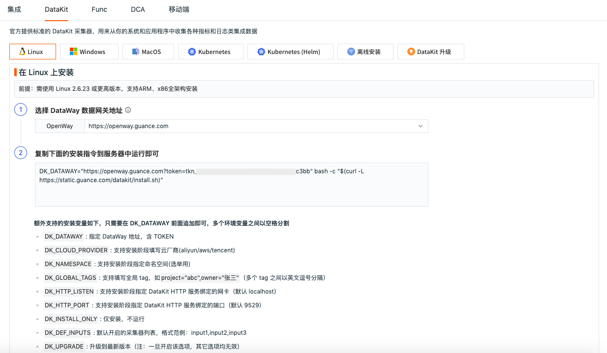
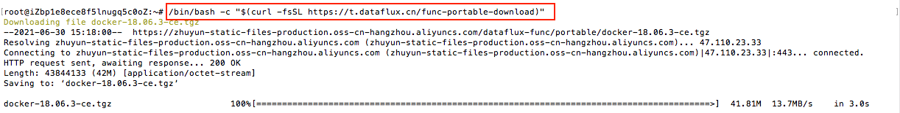
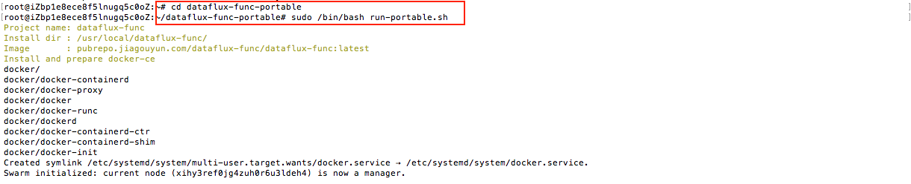
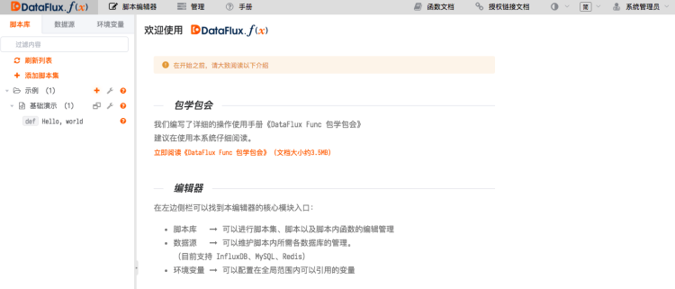
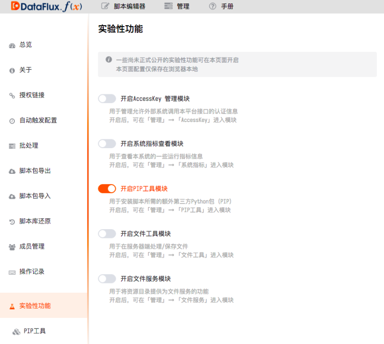
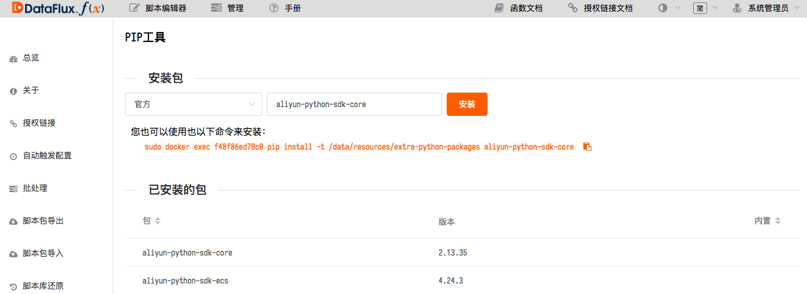
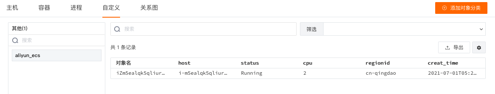

# 自定义对象数据上报
---


自定义对象数据上报需要先安装并连通 DataKit 和 DataFlux Func，再通过 DataFlux Func 上报数据到 DataKit，最终 DataKit 上报数据到观测云工作空间。


## 安装 DataKit

在到观测云工作空间，依次点击**集成 > DataKit**，选择 DataKit 安装方式，见如下信息，然后复制**安装指令**在主机执行。



打开命令行终端工具，登录到主机，执行复制的**安装指令**，安装完成后会提示 `Install Success`。

> [了解更多 DataKit 使用入门](../../datakit/datakit-service-how-to.md)。

## 安装 DataFlux Func

在观测云工作空间，依次点击**集成 > 扩展**，根据如下步骤在命令行终端工具进行安装 Func。


1、下载携带版；   



2、自动部署脚本安装；



3、安装完成后，可在浏览器输入 `http://服务器IP地址:8088` ，点击**保存并初始化数据库**进行初始化。


> 更多 Func 安装，可参考[快速开始](https://func.guance.com/doc/quick-start/)。

## 连接 DataFlux Func 和 DataKit

在使用 DataFlux Func 向 DataKit 写入数据之前，首先要确保连通性。因此，在 DataKit 安装完成后，需要调整配置，允许 DataFlux Func 连接。

1、打开 DataKit 配置：`sudo vim /usr/local/datakit/conf.d/datakit.conf`；

2、将 `http_listen = "localhost:9529"` 修改为 `http_listen = "0.0.0.0:9529"`；


3、重启 DataKit；

```
sudo datakit --restart
```

> 更多详情，可参考[连接并操作 DataKit](https://func.guance.com/doc/practice-connect-to-datakit/)。

## 上报自定义对象数据

DataFlux Func 和 DataKit 连通以后，可以在 DataFlux Func 中撰写函数来完成上报自定义对象数据。

> 关于 DataFlux Func 函数调用的接口说明，可参考 [DataKit API](../../datakit/apis.md)；   
> 
> 关于 DataFlux Func 如何写入数据到 DataKit 的说明，可参考[通过 DataKit 写入数据](https://func.guance.com/doc/practice-write-data-via-datakit/)。

## 示例说明

下面的示例主要以阿里云产品为例，说明如何通过 DataFlux Func 上报自定义对象数据。

**前提条件**：已经完成 DataKit 和 DataFlux Func 安装及连通。

1、在浏览器输入 `http://服务器IP地址:8088`，输入账号和密码，可在初始化时配置，默认为 `admin/admin`。


2、登录到 DataFlux Func 以后就可以在**脚本编辑器**添加脚本。



3、DataFlux Func 支持通过 Python 撰写脚本上报数据。在开始添加脚本之前，需要先安装阿里云的 Python SDK。

1）在 DataFlux Func **管理 > 实验性功能 > 开启 PIP 工具模块**。



2）在**PIP 工具**模块，点击打开 [阿里云的 Python SDK](https://help.aliyun.com/document_detail/53090.html?spm=a2c4g.11186623.6.556.3533694ccdcH5B) 的网址，复制 `aliyun-python-sdk-core` 进行安装。



4、安装完阿里云的Python SDK以后，点击进入**脚本编辑器 > 添加脚本集**。


根据 [DataKit API](../../datakit/apis.md) 文档获取上报 API 接口和撰写上报数据到 DataFlux 的脚本，根据 [阿里云 API](https://next.api.aliyun.com/product/Ecs) 文档撰写获取阿里云产品基本信息的字段。

脚本写完以后，可以点击右上角的**执行**，查看是否可以正常执行代码。


脚本代码参考如下，可以按照上图中的提示替换相关内容。

```
from aliyunsdkcore.request import CommonRequest
from aliyunsdkcore.client import AcsClient
import requests
import json
import time

#推送数据到DF
def pushdata(data):
    params = (
        ('token', 'tokn_bW47smmgQpoZxxxxxxx'),
    )
    response = requests.post('http://服务器IP地址:9529/v1/write/custom_object', params=params, data=data)
    print(response.status_code, response.text)

#主函数
@DFF.API('custom_object')
def main():
    # 1.初始化SDK
    client = AcsClient(
        'LTAI5t6d3sRh3xxxxxxxx',  # your-access-key-id
        'CHdrce2XtMyDAnYJxxxxxxxxxxxxxx',  # your-access-key-secret
        'cn-qingdao',  # your-region-id
    )
    request = CommonRequest()
    request.set_accept_format('json')
    request.set_domain('ecs.aliyuncs.com')
    request.set_method('POST')
    request.set_version('2014-05-26')
    request.set_action_name('DescribeInstances')
    request.add_query_param('RegionId', 'cn-qingdao')
    response = json.loads(client.do_action_with_exception(request))
    for i in response["Instances"]["Instance"]:
        data = ''' aliyun_ecs,name=%s,host=%s instanceid="%s",os="%s",status="%s",creat_time="%s",publicip="%s",regionid="%s",privateip="%s",cpu=%s,memory=%s %s''' %(
            i['HostName'], 
            i['InstanceId'], 
            i['InstanceId'], 
            i['OSType'],
            i['Status'], 
            i['CreationTime'], 
            i['PublicIpAddress']['IpAddress'],
            i['RegionId'], 
            i['NetworkInterfaces']['NetworkInterface'][0]['PrivateIpSets']['PrivateIpSet'][0]['PrivateIpAddress'],
            i['Cpu'],
            i['Memory'], 
            int(time.time()))
        print(data)
        pushdata(data)
```

5、DataFlux Func 脚本配置完成执行后，即可在观测云工作空间**基础设施 > 自定义**中查看上报的数据。



6、若需要定时执行脚本任务，可在 **DataFlux Func > 管理 > 自动触发配置**创建定时上报任务。


