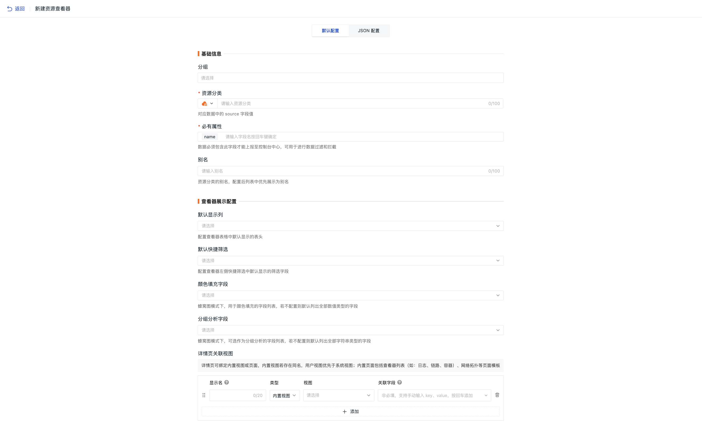
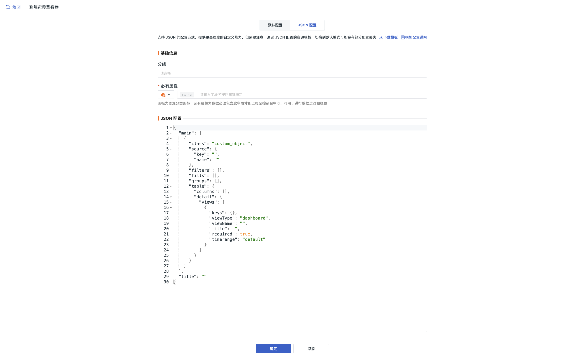

# 资源目录
---

除了主机、容器、进程以外，您可以通过创建自定义的资源，结合属性、关联视图、JSON 文本等配置，通过 DataKit API 和 DataFlux Func，向<<< custom_key.brand_name >>>上报任意数据，包括云厂商的云资源数据、企业的各种业务数据、以及其他任意需要观测的数据，最终在前端控制台的自定义资源查看器进行统一可视化管理和关联分析。

通过针对不同的资源分类创建符合数据特性的查看器模板，数据接入到控制台后会优先应用[已创建的模板](#start)。您可以通过该查看器模版进行资源目录数据的查看与分析。若未匹配到，则应用官方模板库中的模板。

**注意**：

1. 无论是否为资源创建查看器模板，都**不影响**数据的上报和接收；
2. 模板中支持配置“必有属性”，数据必须包含此字段才会接收，可用于进行数据过滤和拦截。

## 数据上报

**前提**：安装 DataKit 和 DataFlux Func。

添加完资源目录分类以后，即可进行自定义数据上报。通过 DataFlux Func 上报数据到 DataKit，最终通过 DataKit 上报数据到<<< custom_key.brand_name >>>工作空间。

> 具体操作过程，可参考 [资源目录数据上报](data-reporting.md)。

**注意**：

1. **必有属性**中的自定义字段，均为数据上报时的必填字段，若上报的数据缺失必填字段，该数据将无法上报到<<< custom_key.brand_name >>>工作空间；       
2. 若上报的数据类型与定义的字段数据类型不符，该数据无法上报到<<< custom_key.brand_name >>>工作空间。如：在 DataFlux Func 中定义了字段类型是字符型，上报的时候数据类型为整型，该数据将无法上报到<<< custom_key.brand_name >>>工作空间；   
3. 资源目录离线 48 小时后会做清除处理。  

## 创建资源查看器 {#create}

您可以通过以下方式创建一个查看器：

:material-numeric-1-circle: 自定义新建：点击后直接进入新建页面。

:material-numeric-2-circle: 导入查看器模版：导入模版后再进行编辑修改。

### 开始配置 {#start}

#### 默认配置

1. 按需选择是否需要将资源分组；
2. 定义进行资源目录数据上报时的资源分类名称；
3. 必有属性：即数据中必须包含的字段；默认添加对象的 `name` 字段。若上报的数据中不包含您设置的字段，最终将不会上报到<<< custom_key.brand_name >>>，从而过滤不规范数据；
4. 输入资源分类的别名，配置后列表中优先展示为别名；
5. 查看器展示配置：
    - 默认显示列：即配置查看器表格中默认显示的表头；
    - 默认快捷筛选：即查看器左侧快捷筛选中默认显示的筛选字段；
    - 详情页关联视图：定义视图显示名、选择视图、按需填入关联字段，从而绑定内置视图或页面；
    - 颜色填充字段：蜂窝图模式下，用于颜色填充的字段列表，若不配置则默认列出全部数值类型的字段；
    - 分组分析字段：蜂窝图模式下，可选作为分组分析的字段列表，若不配置则默认列出全部字符串类型的字段
6. 点击确定。

**注意**：

- 此处的内置视图包含所有的视图；若存在同名，用户视图优先于系统视图；
- 内置页面包括查看器列表（如：日志、链路、容器）、网络拓扑等页面模板。

#### JSON 配置

当从默认配置切换到 JSON 配置，若选择：

- 是：将当前所填写内容自动带入到 JSON 配置中；
- 否：进入 JSON 模式后仅会提供基础配置。

1. 按需选择是否需要将资源分组；
2. 添加必有属性；
3. 按需修改 JSON 配置；
4. 点击确定。

## 资源分类

在页面左侧的资源分类列表中，您可以进行以下操作：

- 在搜索栏，输入资源名称进行快速定位；
- 点击 :material-dots-vertical: 按钮：
    - 对现有的对象分类进行**修改**或**导出**；
    - [删除](#delete)该查看器模版；
    - 将该资源分类添加至二级菜单，便于查看。
- 点击收放按钮，可收起资源分类，满足页面显示偏好。
- 添加分组：即为资源查看器归类。添加完成后，点击单个资源右侧按钮可将当前资源移至目标分组。
    - 点击组别右侧按钮，可修改该分组的名称；
    - 可删除分组，并按需选择“仅删除分组”还是“同步删除分组下的所有查看器模板”。

**注意**：添加字段后，原有对象数据不变，后上报的数据则必须包含新增的字段。

### 删除 {#delete}

此处的删除查看器模板操作并不会删除数据。若数据仍继续上报，会自动应用默认查看器模板。

如果想彻底删除数据，您可前往**管理 > 删除资源目录**进行删除操作。

- 指定资源目录分类：仅删除所选对象分类下的数据，不会删除索引；     
- 所有资源目录：删除所有资源目录数据及索引。   

**注意**：

1. 仅 Owner 和 Administrator 可进行删除操作；
2. 所有资源目录一旦删除，上报到基础设施自定义的所有数据及索引全部会被删除且无法恢复，所有设置的资源目录分类数据需要重新上报，每天限制 5 次删除所有资源目录操作。

### 跨工作空间查询 {#cross_workspace}

选择账号关联的所有工作空间，实现跨空间查询资源列表数据。

## 资源目录查看器

以列表或蜂窝图的形式对资源目录进行查看分析。

### 快捷筛选 {#filter}

您可以为资源目录添加筛选项。

**注意**：空间级筛选项仅当前工作空间 Owner 和 Administrator 可以添加。

1. 点击**添加空间级筛选项**按钮；
2. 搜索或直接在下拉框中添加字段；
3. 点击确定。

> 更多详情，可参考 [查看器快捷筛选](../../getting-started/function-details/explorer-search.md#quick-filter)。

### 详情页

资源目录数据上报后，点击右侧查看器资源目录列表中的名称，即可划出详情页查看该对象的详细信息，包括对象名称、扩展属性、关联视图等。

#### 基础属性

可查看该资源目录数据附带的所有属性字段。

#### 关联视图

即设置绑定或者删除内置视图（系统视图、用户视图）到基础设施资源目录详情页面。

**注意**：绑定内置视图前，需要确认所[绑定内置视图](../../scene/built-in-view/bind-view.md)中的视图变量是否存在与该资源目录相关的字段，如 `host`。

## 更多阅读

- [ :fontawesome-solid-arrow-right-long: &nbsp; **查看器的强大之处**](../../billing-center/workspace-management.md#workspace-lock)

