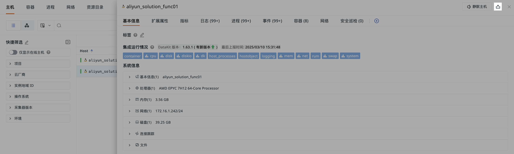

# 主机
---

主机数据采集完成后，自动同步至<<< custom_key.brand_name >>>管理控制台。在主机查看器，可查看所有已采集的主机数据。

控制台提供两种专业分析视图（通过左上角视图 tab 切换选择）：

- **主机对象列表**：展示当前工作空间内所有主机近 2 天的指标数据，包括主机名称/标签、CPU 使用率、内存使用率和 CPU 负载，帮助用户查看主机运行状态。

- **主机拓扑图**：可视化呈现主机集群动态拓扑结构，提供操作系统类型、DataKit 版本、云厂商、和部署区域等指标分析维度，并支持跨层级拓扑钻取，便于用户进行主机关系分析。

## 管理主机

### 数据排序

在主机对象列表，可对指标数据进行升降排序：

**注意**：由于数据入库存在延迟，该指标并非实时更新。系统每 5 分钟统计一次最近 15 分钟的平均值，因此最终数据可能会存在一定的偏差。

### 仅显示在线主机 {#online}

点击“仅显示在线主机”按钮，可以快速列出最近 10 分钟内有数据上报的主机。

???+ warning "注意"

    - 如果主机数据断档超过 10 分钟，CPU 使用率、MEM 使用率、CPU 负载将显示为 `-`；
    - 若主机超过 24 小时没有数据上报，该主机将从列表中移除。

### 时间控件 {#time}

在查看器右上角，可选择不同时间范围的主机数据，包括：

- 最近 2 小时
- 最近 6 小时
- 最近 1 天
- 最近 2 天

## 主机详情 {#details}

在主机对象列表中点击主机名，侧滑出的主机详情页可查看该主机的基本信息、扩展属性、关联信息及绑定视图。

### 静默主机 {#mute}

可用于暂时忽略特定主机的告警通知，以减少干扰、集中处理重要任务，如已知的临时性问题或维护期间。

1. 在主机详情页，点击**静默主机**；
2. 选择静默时间类型；
3. 点击确定。

配置完成后，回到主机列表，被静默的主机会显示静默标识。在静默时间内，您不会收到该主机的告警通知，相关告警事件将自动存入事件管理。您可以在**监控 > [静默管理](../monitoring/silent-management.md)**中查看所有静默主机。

> 更多详情，可参考 [告警设置](../monitoring/alert-setting.md)。

如需取消静默，可直接在主机详情中点击“取消静默”，或在“监控 > 静默管理”中操作。

### 导出数据

如果需要导出某条主机数据，点击右上角 :material-tray-arrow-up: 图标即可。

### 主机标签 {#label}

在多主机管理环境下，可为每台主机自定义标签。基于属性标签，最终数据归类筛选查询。

1. 点击**标签**右侧编辑按钮；

2. 在下拉列表选择标签，或直接回车添加标签；

3. 添加完成后，保存。

**注意**：标签配置完成后，需要等待 1-5 分钟后生效。

### 基本信息

在主机详情页的基本信息，您可以为该主机添加[主机标签](#label)、查看集成运行情况、系统信息以及云厂商信息。

#### 集成运行情况

**集成运行情况**展示了该主机安装的 DataKit 版本信息和相关的采集器运行情况，运行情况共有两种状态：

- 正常运行状态的采集器，默认展示为 ”浅蓝色“；

- 发生错误的采集器，默认展示为 “红色” 且支持点击查看错误信息。

同时，带视图符号 :fontawesome-solid-chart-simple: 的采集器支持查看监控视图：

#### 系统信息

主机详情页展示主机的系统信息，涵盖主机名称、操作系统、处理器、内存、网络、磁盘、连接跟踪和文件等方面。

#### 云厂商信息

对于配置了[云同步](../integrations/hostobject.md#cloudinfo)的云主机，主机详情页还提供以下信息：云平台、实例名、实例 ID、实例规格、地域、可用区、创建时间、网络类型、付费类型和 IP 地址等。

### 扩展属性

您可以查看相关主机的全部属性。支持通过字段名或值做搜索过滤，缩小查看范围。

Hover 至对应字段的值，可显示其原始格式。

### 关联分析

<<< custom_key.brand_name >>>支持对每一个基础设施对象进行关联分析，除了主机的基本信息，您还可以一站式地了解主机对应的指标、日志、进程、事件、容器、网络、安全巡检等，更快更全面地监测主机运行情况。

#### 绑定内置视图 {#view}

除此处系统默认展示的视图外，还可以绑定用户视图。

1. 进入内置视图绑定页面；
2. 查看默认关联字段。可选择保留或删除字段，还可添加新的 `key:value` 字段；
3. 选择视图；
4. 完成绑定后，在主机对象详情中可查看所绑定的内置视图。并通过点击跳转按钮 :material-arrow-right-top-bold: 至对应的内置视图页面。

**注意**：若当前数据不包含绑定视图的关联字段，则详情页不显示该视图，反之则显示。

点击跳转按钮 :material-arrow-right-top-bold:，可进入对应的内置视图页面。

<!--

=== "指标"

    您可实时监控主机<u>最近 24 小时内</u>的性能状态，包括 CPU 负载、内存使用等。

    

=== "日志"

    您可以查看与该主机相关的<u>最近 1 小时</u>的日志及日志数量。
     
    **注意**：为了更流畅的用户查询体验，<<< custom_key.brand_name >>>默认即时保存用户在日志的浏览设置（包括“最大显示行数”、“显示列”），以使**关联日志**与日志保持一致。然而，在关联日志进行的自定义调整，在退出页面后不做保存。

    

    > 更多页面操作，可参考 [日志查看器](../logs/explorer.md)。

=== "进程"

    您可以查看与该主机相关的<u>最近 10 分钟</u>的进程及进程数量。
    
    

=== "事件"

    您可以查看与该主机相关的<u>最近 1 小时</u>的告警事件（关联字段：`host`）。
    
    

=== "容器"

    您可以查看<u>最近 10 分钟内</u>与该主机相关的全部容器数据。
    
    

=== "安全巡检"

    您可以查看<u>最近 1 天内</u>与该主机相关的安全巡检数据。

    

=== "网络"

    主机网络支持查看主机之间的网络流量。支持基于服务端、客户端查看源主机到目标之间的网络流量和数据连接情况，通过可视化的方式进行实时展示，帮助企业实时了解业务系统的网络运行状态，快速分析、追踪和定位问题故障，预防或避免因网络性能下降或中断而导致的业务问题。
    
    主机网络数据采集成功后会上报到<<< custom_key.brand_name >>>控制台，您可以通过**基础设施 > 主机**详情页中的网络，以**拓扑**、**总览**两种形式查看主机的网络性能监测数据信息。
    
    > 更多详情，可参考 [网络](network.md)。

    

-->

