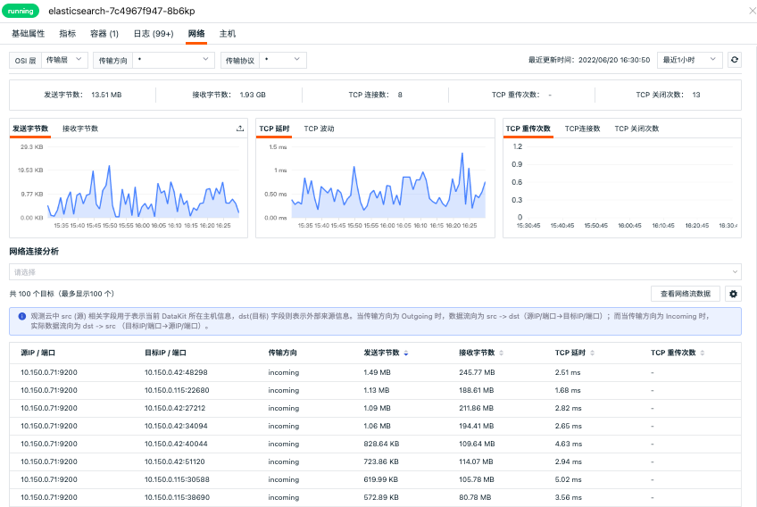
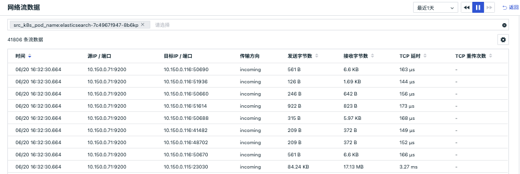
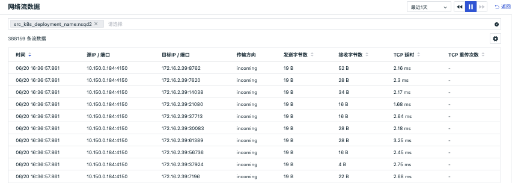

# 网络
---

## 简介

网络支持查看主机/容器 Pod 之间的网络流量。支持基于 IP/端口查看源 IP 到目标 IP 之间的网络流量和数据连接情况，通过可视化的方式进行实时展示，帮助企业实时了解业务系统的网络运行状态，快速分析、追踪和定位问题故障，预防或避免因网络性能下降或中断而导致的业务问题。

## 前提条件

你需要先创建一个 [观测云账号](https://auth.guance.com/register?channel=帮助文档)，并在你的主机上 [安装 DataKit](../datakit/datakit-install.md)，开启 [eBPF 采集器](../integrations/host/ebpf.md)。

## 主机网络

### 主机拓扑图

在「基础设施」-「网络」，选择「主机」，即可查看主机网络分布情况。在「主机网络 Map」，您能够可视化查询当前工作空间主机与主机之间的网络流量，快速分析不同主机之间的 TCP延迟、TCP波动、TCP重传次数、TCP建连次数以及 TCP关闭次数。

- 时间控件：默认获取最近 48 小时的数据且不支持自动刷新，需手动点击刷新获取新的数据；
- 搜索和筛选：您可以快速基于关键词模糊匹配搜索主机名称；或基于筛选 Tag 标签显示主机节点及其关联关系。
- 填充：您可以通过「填充」自定义填充主机节点，填充值的大小及自定义区间将决定填充的主机节点颜色。支持选择 TCP延迟、TCP波动、TCP重传次数、TCP建连次数以及 TCP关闭次数多种填充指标。
- 主机节点：
   - 主机节点的图标分成普通主机和云主机，云主机显示为云服务厂商的 Logo；
   - 主机节点边缘颜色根据填充的字段数值及自定义区间显示对应区段的颜色；
   - 主机节点之间通过连线表示网络流量，连线为双向曲线，显示源主机到目标主机的incoming / outgoing方向的流量；
   - 主机节点大小的显示根据当前节点的入向流量大小，确定节点的尺寸大小；
   - 主机节点粗细的显示根据获取节点的出入向流量数据大小，确定连线的粗细。
- 自定义区间：您可以开启「自定义区间」为选择的填充指标自定义图例颜色区间范围。图例的颜色将依据图例的最大值和最小值等分为 5 个区间，每个区间将自动对应五个不同的颜色，不在数据区间范围内的连线和节点置灰显示。	
- 鼠标悬停：悬停鼠标至主机对象节点，可查看发送字节数、接收字节数、TCP延迟、TCP波动、TCP重传次数、TCP建连次数以及 TCP关闭次数。

注意：若目标主机不在当前工作空间但是目标域名存在且目标域名的端口小于 10000 ，则目标域名会在拓扑图中显示。

### 主机网络详情

主机网络支持查看主机之间的网络流量。支持基于 IP/端口查看源主机到目标之间的网络流量和数据连接情况，通过可视化的方式进行实时展示，帮助企业实时了解业务系统的网络运行状态，快速分析、追踪和定位问题故障，预防或避免因网络性能下降或中断而导致的业务问题。

主机网络数据采集成功后会上报到观测云控制台，在「基础设施」-「网络」-「主机」，点击查看网络详情，您可以查看到工作空间内全部网络性能监测数据信息。

注意：

- 目前仅支持 Linux 系统，且除 CentOS 7.6+ 和 Ubuntu 16.04 以外，其他发行版本需要 Linux 内核版本高于 4.0.0。
- 主机网络流量数据默认保存最近48小时，免费版默认保存最近24小时；
- 在主机详情页点击进入「网络」，时间控件默认获取最近 15 分钟的数据且不支持自动刷新，需手动点击刷新获取新的数据；
- 目前支持基于 TCP、UDP 协议的网络性能监测。配合 incoming 和 outgoing ，分成 6 种组合选择：
  - incoming + 不区分协议
  - incoming + tcp 协议
  - incoming + udp 协议
  - outgoing + 不区分协议
  - outgoing + tcp 协议
  - outgoing + udp 协议

#### 参数说明

| 参数         | 说明                                     | 统计方式               |
| ------------ | ---------------------------------------- | ---------------------- |
| IP/端口      | 目标基于IP+端口做聚合，最多返回100条数据 | 按 IP/端口分组统计     |
| 发送字节数   | 源主机发送给目标字节数                   | 所有记录发送字节数求和 |
| 接受字节数   | 源主机接收目标的字节数                   | 所有记录接收字节数求和 |
| TCP 延时     | 源主机到目标的TCP延时                    | 平均值                 |
| TCP 波动     | 源主机到目标的TCP延时波动                | 平均值                 |
| TCP 连接数   | 源主机到目标的TCP连接数                  | 总和                   |
| TCP 重传次数 | 源主机到目标的TCP重传次数                | 总和                   |
| TCP 关闭次数 | 源主机到目标的TCP关闭次数                | 总和                   |

#### 网络连接分析

“观测云”支持查看网络连接数据，包括源IP/端口、目标IP/端口、发送字节数、接收字节数、TCP延时、TCP重传次数等。同时，您还可以通过"设置"按钮自定义显示字段，或针对连接数据添加筛选条件，筛选所有字符串类型的keyword字段。如若您需要查看更详细网络连接数据，点击该数据即可查看其对应的网络流数据。

**注意**：自定义显示字段变更需要基于用户层级，非全局保存

#### 网络流数据

“观测云”支持查看网络流数据，每30s自动刷新一次，默认展示最近2天数据，包括时间、源IP/端口、目标IP/端口、源主机、传输方向、协议等。同时，您还可以通过"设置"按钮自定义显示字段，或针对网络流数据添加筛选条件，筛选所有字符串类型的keyword字段。如若您需要查看关联的网络流数据，点击该数据即可查看对应主机、传输方向、协议等相关字段对应的其他网络流数据。

#### 网络 48 小时回放

在链路网络，支持点击时间控件选择查看 48 小时网络数据回放。

- 时间范围：默认查看该链路前后 30 分钟的数据，若是当前发生的链路，默认查看最近 1 小时的数据；
- 支持任意拖动时间范围查看对应的网络流量；
- 拖动后，查询的是历史网络数据；
- 拖动后，点击「播放」按钮或刷新页面，回到查看「最近 1 小时」的网络数据。

## Pod 网络

### Pod 拓扑图

在「基础设施」-「网络」，选择「Pod」即可查看 Pod 网络分布情况。在「Pod 网络 Map」，您能够可视化查询当前工作空间 Pod 与 Pod 之间的网络流量，快速分析不同 Pod 之间的 TCP延迟、TCP波动、TCP重传次数、TCP建连次数、TCP关闭次数、发送字节数、接收字节数、每秒请求数、错误率以及平均响应时间。

- 时间控件：默认获取最近 15 分钟的数据且不支持自动刷新，需手动点击刷新获取新的数据；
- 搜索和筛选：你可以快速基于关键词模糊匹配搜索 Pod 名称；或基于筛选标签显示 Pod 及其关联关系。
- 填充：你可以通过「填充」自定义填充主机节点，填充值的大小及自定义区间将决定填充的主机节点颜色。支持选择 TCP延迟、TCP波动、TCP重传次数、TCP建连次数、TCP关闭次数、发送字节数、接收字节数、每秒请求数、错误率以及平均响应时间等七层网络填充指标。
- Pod 节点：
   - Pod 节点边缘颜色根据填充的字段数值及自定义区间显示对应区段的颜色；
   - Pod 节点之间通过连线表示网络流量，连线为双向曲线，显示源 Pod 到目标 Pod 的incoming / outgoing方向的流量；
   - Pod 节点大小的显示根据当前节点的入向流量大小，确定节点的尺寸大小；
   - Pod 节点粗细的显示根据获取节点的出入向流量数据大小，确定连线的粗细。
- 自定义区间：你可以开启「自定义区间」为选择的填充指标自定义图例颜色区间范围。图例的颜色将依据图例的最大值和最小值等分为 5 个区间，每个区间将自动对应五个不同的颜色，不在数据区间范围内的连线和节点置灰显示。	
- 鼠标悬停：悬停鼠标至 Pod 节点，可查看发送字节数、接收字节数、TCP延迟、TCP波动、TCP重传次数、TCP建连次数、TCP关闭次数、发送字节数、接收字节数、每秒请求数、错误率以及平均响应时间。

### Pod 网络详情

Pod 网络支持查看 Pod 之间的网络流量。支持基于 IP/端口查看源 IP 到目标 IP 之间的网络流量和数据连接情况，通过可视化的方式进行实时展示，帮助企业实时了解业务系统的网络运行状态，快速分析、追踪和定位问题故障，预防或避免因网络性能下降或中断而导致的业务问题。

Pod 网络数据采集成功后会上报到观测云控制台，在「网络」-「Pod」，点击查看网路详情，您可以查看到工作空间内全部 Pod 网络性能监测数据信息。

注意：

- 目前仅支持 Linux 系统，且除 CentOS 7.6+ 和 Ubuntu 16.04 以外，其他发行版本需要 Linux 内核版本高于 4.0.0。
- Pod 网络流量数据默认保存最近48小时，免费版默认保存最近24小时；
- 在 Pod 详情页点击进入「网络」，时间控件默认获取最近 15 分钟的数据且不支持自动刷新，需手动点击刷新获取新的数据；

#### TCP、UDP 协议

Pod 网络支持基于 TCP、UDP 协议的网络性能监测。配合 incoming 和 outgoing ，分成 6 种组合选择：

   - incoming + 不区分协议
   - incoming + tcp 协议
   - incoming + udp 协议
   - outgoing + 不区分协议
   - outgoing + tcp 协议
   - outgoing + udp 协议

##### 参数说明

| 参数         | 说明                                     | 统计方式               |
| ------------ | ---------------------------------------- | ---------------------- |
| IP/端口      | 目标基于IP+端口做聚合，最多返回100条数据 | 按 IP/端口分组统计     |
| 发送字节数   | 源主机发送给目标字节数                   | 所有记录发送字节数求和 |
| 接受字节数   | 源主机接收目标的字节数                   | 所有记录接收字节数求和 |
| TCP 延时     | 源主机到目标的TCP延时                    | 平均值                 |
| TCP 波动     | 源主机到目标的TCP延时波动                | 平均值                 |
| TCP 连接数   | 源主机到目标的TCP连接数                  | 总和                   |
| TCP 重传次数 | 源主机到目标的TCP重传次数                | 总和                   |
| TCP 关闭次数 | 源主机到目标的TCP关闭次数                | 总和                   |

##### 网络连接分析

观测云支持查看 Pod 网络连接数据，包括源IP/端口、目标IP/端口、发送字节数、接收字节数、TCP延时、TCP重传次数等。同时，你还可以通过"设置"按钮自定义显示字段，或针对连接数据添加筛选条件，筛选所有字符串类型的关键字。若你需要查看更详细网络连接数据，点击该数据或“查看网络流数据”即可查看其对应的网络流数据。

#### HTTP 协议

Pod 网络支持基于 HTTP 协议的七层网络性能监测。

##### 参数说明

| 参数           | 说明                                                         | 统计方式 |
| -------------- | ------------------------------------------------------------ | -------- |
| 请求数         | 时间范围内，当前 Pod 的总请求数                              | 总和     |
| 平均每秒请求数 | 时间范围内，当前 “Pod 总请求数 / 请求的总耗时”               | 平均值   |
| 平均响应时间   | 时间范围内，当前 Pod 响应时间                                | 平均值   |
| 错误数         | 时间范围内，当前 Pod 的请求错误数，即 status_code 字段值为 4xx,5xx 的总和 | 总和     |
| 错误率         | 时间范围内，当前 Pod 的 “请求错误数 / 总请求数” 的值         | 百分比   |

##### 网络连接分析

观测云支持查看 Pod 网络请求数、错误数、错误率可视化图表趋势，支持查看 Pod 网络连接分析，包括源IP/端口、目标IP/端口、状态码、请求方式、响应时间等。同时，你还可以通过"设置"按钮自定义显示字段，或针对连接数据添加筛选条件，筛选所有字符串类型的关键字。若你需要查看更详细网络连接数据，点击该数据或“查看网络流数据”即可查看其对应的网络流数据。

##### 查看网络流数据

观测云支持查看网络流数据，每 30s 自动刷新一次，默认展示最近 1 天数据，包括时间、源IP/端口、目标IP/端口、状态码、请求方式、响应时间等。同时，您还可以通过"设置"按钮自定义显示字段，或针对网络流数据添加筛选条件，筛选所有字符串类型的关键字。

## Deployment 网络

### Deployment 拓扑图

在「基础设施」-「网络」，选择「Deployment」即可查看 Deployment 网络分布情况。在「Deployment 网络 Map」，您能够可视化查询当前工作空间 Deployment 之间的网络流量，快速分析不同 Deployment 之间的 TCP延迟、TCP波动、TCP重传次数、TCP建连次数、TCP关闭次数、发送字节数、接收字节数、每秒请求数、错误率以及平均响应时间。

- 时间控件：默认获取最近 15 分钟的数据且不支持自动刷新，需手动点击刷新获取新的数据；
- 搜索和筛选：你可以快速基于关键词模糊匹配搜索 Deployment 名称；或基于筛选标签显示 Deployment 及其关联关系。
- 填充：你可以通过「填充」自定义填充主机节点，填充值的大小及自定义区间将决定填充的主机节点颜色。支持选择 TCP延迟、TCP波动、TCP重传次数、TCP建连次数、TCP关闭次数、发送字节数、接收字节数、每秒请求数、错误率以及平均响应时间等七层网络填充指标。
- Deployment 节点：
   - Deployment 节点边缘颜色根据填充的字段数值及自定义区间显示对应区段的颜色；
   - Deployment 节点之间通过连线表示网络流量，连线为双向曲线，显示源 Deployment 到目标 Deployment 的incoming / outgoing方向的流量；
   - Deployment 节点大小的显示根据当前节点的入向流量大小，确定节点的尺寸大小；
   - Deployment 节点粗细的显示根据获取节点的出入向流量数据大小，确定连线的粗细。
- 自定义区间：你可以开启「自定义区间」为选择的填充指标自定义图例颜色区间范围。图例的颜色将依据图例的最大值和最小值等分为 5 个区间，每个区间将自动对应五个不同的颜色，不在数据区间范围内的连线和节点置灰显示。	
- 鼠标悬停：悬停鼠标至 Deployment 节点，可查看发送字节数、接收字节数、TCP延迟、TCP波动、TCP重传次数、TCP建连次数、TCP关闭次数、发送字节数、接收字节数、每秒请求数、错误率以及平均响应时间。

### Deployment 网络详情

Deployment 网络支持查看 Deployment 之间的网络流量。支持基于 IP/端口查看源 IP 到目标 IP 之间的网络流量和数据连接情况，通过可视化的方式进行实时展示，帮助企业实时了解业务系统的网络运行状态，快速分析、追踪和定位问题故障，预防或避免因网络性能下降或中断而导致的业务问题。

Deployment 网络数据采集成功后会上报到观测云控制台，您可以在「网络」-「Deployment」，点击查看网络详情，查看当前 Deployment 的网络性能监测数据信息。

注意：

- 目前仅支持 Linux 系统，且除 CentOS 7.6+ 和 Ubuntu 16.04 以外，其他发行版本需要 Linux 内核版本高于 4.0.0；
- Deployment 网络流量数据默认保存最近48小时，免费版默认保存最近24小时；
- 在 Deployment 详情页点击进入「网络」，时间控件默认获取最近 15 分钟的数据且不支持自动刷新，需手动点击刷新获取新的数据；

#### TCP、UDP 协议

Deployment 网络支持基于 TCP、UDP 协议的网络性能监测。配合 incoming 和 outgoing ，分成 6 种组合选择：

   - incoming + 不区分协议
   - incoming + tcp 协议
   - incoming + udp 协议
   - outgoing + 不区分协议
   - outgoing + tcp 协议
   - outgoing + udp 协议

##### 参数说明

| 参数         | 说明                                     | 统计方式               |
| ------------ | ---------------------------------------- | ---------------------- |
| IP/端口      | 目标基于IP+端口做聚合，最多返回100条数据 | 按 IP/端口分组统计     |
| 发送字节数   | 源主机发送给目标字节数                   | 所有记录发送字节数求和 |
| 接受字节数   | 源主机接收目标的字节数                   | 所有记录接收字节数求和 |
| TCP 延时     | 源主机到目标的TCP延时                    | 平均值                 |
| TCP 波动     | 源主机到目标的TCP延时波动                | 平均值                 |
| TCP 连接数   | 源主机到目标的TCP连接数                  | 总和                   |
| TCP 重传次数 | 源主机到目标的TCP重传次数                | 总和                   |
| TCP 关闭次数 | 源主机到目标的TCP关闭次数                | 总和                   |

##### 网络连接分析

观测云支持查看 Deployment 网络连接数据，包括源IP/端口、目标IP/端口、发送字节数、接收字节数、TCP延时、TCP重传次数等。同时，你还可以通过"设置"按钮自定义显示字段，或针对连接数据添加筛选条件，筛选所有字符串类型的关键字。若你需要查看更详细网络连接数据，点击该数据或“查看网络流数据”即可查看其对应的网络流数据。

#### HTTP 协议

Pod 网络支持基于 HTTP 协议的七层网络性能监测。

##### 参数说明

| 参数           | 说明                                                         | 统计方式 |
| -------------- | ------------------------------------------------------------ | -------- |
| 请求数         | 时间范围内，当前 Pod 的总请求数                              | 总和     |
| 平均每秒请求数 | 时间范围内，当前 “Pod 总请求数 / 请求的总耗时”               | 平均值   |
| 平均响应时间   | 时间范围内，当前 Pod 响应时间                                | 平均值   |
| 错误数         | 时间范围内，当前 Pod 的请求错误数，即 status_code 字段值为 4xx,5xx 的总和 | 总和     |
| 错误率         | 时间范围内，当前 Pod 的 “请求错误数 / 总请求数” 的值         | 百分比   |

##### 网络连接分析

观测云支持查看 Pod 网络请求数、错误数、错误率可视化图表趋势，支持查看 Pod 网络连接分析，包括源IP/端口、目标IP/端口、状态码、请求方式、响应时间等。同时，你还可以通过"设置"按钮自定义显示字段，或针对连接数据添加筛选条件，筛选所有字符串类型的关键字。若你需要查看更详细网络连接数据，点击该数据或“查看网络流数据”即可查看其对应的网络流数据。

##### 查看网络流数据

观测云支持查看网络流数据，每 30s 自动刷新一次，默认展示最近 1 天数据，包括时间、源IP/端口、目标IP/端口、状态码、请求方式、响应时间等。同时，您还可以通过"设置"按钮自定义显示字段，或针对网络流数据添加筛选条件，筛选所有字符串类型的关键字。

## 关联分析

您可以点击主机/Pod/Deployment 图标进行关联查询，支持查看上下游、网络详情、 主机/Pod/Deployment 详情、关联日志、关联链路以及关联事件。

### 查看上下游

在基础设施网络，点击主机/Pod/Deployment 图标，点击“查看上下游”，即可查看当前节点的上下游节点关联。

点击左上角“返回总览”可返回到原网络 Map，在搜索框进行搜索或筛选可过滤关联的上下游节点，根据搜索或筛选的结果显示匹配的关联上下游节点。

