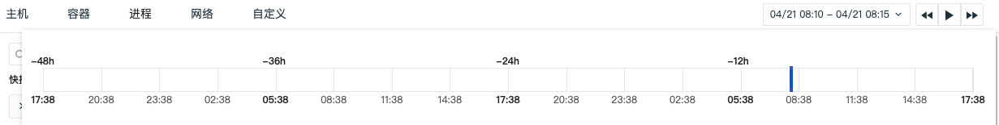

# 进程
---

进程数据采集成功后会上报到观测云控制台，在**基础设施**的**进程**，您可以查看当前工作空间内**最近 10 分钟**的全部进程数据信息。

## 查询与分析

进入**进程**查看器，观测云支持您通过搜索关键字，添加标签筛选，排序等方式查询进程数据。

- 时间控件：进程列表支持查看<u>最近十分钟内</u>采集的进程数据，通过播放按钮可以刷新至当前时间范围，重新获取数据列表。点击时间范围可查看进程回放：

    - 拖动后，刷新暂停，时间显示为：[开始时间-结束时间]，查询的时间范围为 5 分钟；

    - 拖动后，查询的是历史进程数据；

    - 拖动后，点击播放按钮或刷新页面，回到查看最近 10 分钟的进程。

- [搜索与筛选](../getting-started/function-details/explorer-search.md)：在查看器搜索栏，支持关键字搜索、通配符搜索等多种搜索方式；支持通过 `标签/属性` 进行值的筛选，包括正向筛选、反向筛选等多种筛选方式。

- [快捷筛选](../getting-started/function-details/explorer-search.md#quick-filter)：在快捷筛选进行编辑，添加新的筛选字段。添加完成后，可以选择其字段值进行快捷筛选。

- [自定义显示列](../getting-started/function-details/explorer-search.md#columns)：可通过**显示列**自定义添加、编辑、删除、拖动显示列。

- 排序：Hover 至列表菜单，点击“ :fontawesome-solid-sort: 排序” 可以基于选中的标签进行升降排序。

- [分析模式](../getting-started/function-details/explorer-search.md#analysis)：支持基于 <u>1-3 个标签</u>进行多维度分析统计，以反映出数据在不同维度下的分布特征，支持多种数据图表分析方式，包括排行榜、饼图和矩形树图。

- 数据导出：查看器右上角的 :material-cog: 设置图标，支持导出当前对象列表数据到 CSV 文件或场景仪表板和笔记。

    - 导出到 CSV 文件：保存当前列表为 CSV 文件到本地；

    - 导出到仪表板：保存当前列表为**可视化图表**到指定**仪表板**；

    - 导出到笔记：保存当前列表为**可视化图表**到指定**笔记**。

如果需要导出某条数据，打开该条数据详情页，点击右上角 :material-tray-arrow-up: 图标即可。

## 进程详情页

点击进程列表中的进程名称，即可划出详情页查看进程对象的详细信息，包括进程所属的对象、Label 属性、其他扩展属性，以及关联的指标、日志、主机、网络等。

### 关联分析

观测云支持对每一个进程进行关联分析。在进程的详情页，除了进程的基本信息，您还可以一站式地了解<u>对应进程的指标、日志、主机、网络等，更快更全面地监测进程运行情况</u>。

#### 主机查询

点击进程详情页的主机标签，您可以对与进程关联的主机的相关数据进行查询。

| 操作 | 说明 |
| --- | --- |
| 筛选字段值 | 即添加该字段至查看器，查看与该字段相关的全部数据。 |
| 反向筛选字段值 | 即添加该字段至查看器，查看除了该字段以外的其他数据。 |
| 添加到显示列 | 即添加该字段到查看器列表进行查看。 |
| 复制 | 即复制该字段至剪贴板。 |
| 查看相关日志 | 即查看与该主机相关全部日志。 |
| 查看相关容器 | 即查看与该主机相关全部容器。 |
| 查看相关进程 | 即查看与该主机相关全部进程。 |
| 查看相关链路 | 即查看与该主机相关全部链路。 |
| 查看相关巡检 | 即查看与该主机相关全部巡检数据。 |

#### 关联指标/日志/主机

在详情页下方，切换内容标签您可以：

=== "指标"

    您可以实时监控<u>最近 24 小时内</u>进程的性能状态，包括 CPU 使用率、内存使用率、打开的文件数等。

    **注意**：进程指标数据默认不自动开启采集，需要手动配置进程采集器开启进程指标的采集。进程指标数据开启采集后，下图中的指标才会展示数据。

    >关于开启方式，可参考 [进程](../datakit/host_processes.md)

=== "日志"

    您可以查看与该进程相关的<u>最近 1 小时</u>的日志及日志数量，并对这些相关日志进行关键字搜索、多标签筛选和时间排序等。

    - 如需查看更详细的日志信息：可点击日志内容跳转到对应日志详情页面，或点击跳转至**日志**查看与该主机相关的全部日志；
 
    - 如需查看更多的日志字段或更完整的日志内容：可通过关联日志查看器**显示列**自定义调整“最大显示行数”、“显示列”。
    
    **注意**：为了更流畅的用户查询体验，观测云默认即时保存用户在**日志**的浏览设置（包括“最大显示行数”、“显示列”），以使**关联日志**于**日志**保持一致。然而，在**关联日志**进行的自定义调整，在退出页面后不做保存。

=== "主机"

    您可以查看相关主机（关联字段：`host`）的基本信息和<u>在选定时间组件范围内</u>的性能指标状态。

    ???+ warning "字段 `host`"
    
        在进程详情中查看相关主机，需要匹配字段 `host`，否则无法在进程详情查看到相关主机的页面。

        - 属性视图：包括主机的基本信息、集成运行情况，若开启云主机的采集，还可查看云厂商的信息；
  
        - 指标视图：可查看默认 24 小时内，相关主机的 CPU、内存等性能指标视图。点击**打开该视图**至[内置视图](../scene/built-in-view/bind-view.md)，可通过克隆的方式对主机视图进行自定义修改，并作为用户视图保存，用户视图可通过绑定在进程详情页查看。

=== "网络"

    网络支持查看主机、Pod、Deployment 和 Service 之间的网络流量。进程网络数据采集成功后会上报到观测云控制台，在**基础设施 > 进程**详情页中的**网络**，您可以查看基于主机或者进程服务的网络数据。

#### 绑定内置视图

观测云支持自定义绑定内置视图到查看器。点击绑定内置视图，即可为当前主机详情页添加新的视图。您可以自定义进程对象的相关内容，并创建绑定关系。

**注意**：[绑定内置视图](../scene/built-in-view/bind-view.md)前，需要确认所绑定内置视图中的视图变量是否存在与该进程相关的字段，如 `process_id`。

<!--
### 进程网络

网络支持查看主机、Pod、Deployment 和 Service 之间的网络流量。进程网络数据采集成功后会上报到观测云控制台，在**基础设施 > 进程**详情页中的**网络**，您可以查看基于主机或者进程服务的网络数据。

???+ warning

    - 目前仅支持 Linux 系统，且除 CentOS 7.6+ 和 Ubuntu 16.04 以外，其他发行版本需要 Linux 内核版本高于 4.0.0；
  
    - 主机/进程服务网络流量数据默认保存最近 48 小时，体验版默认保存最近 24 小时；
  
    - 在进程详情页点击进入**网络**，时间控件默认获取最近 15 分钟的数据且不支持自动刷新，需手动点击刷新获取新的数据；
   
    - 目前支持基于 TCP、UDP 协议的网络性能监测。配合 incoming 和 outgoing，分成 6 种组合选择：  
       
        - incoming + 不区分协议     
        - incoming + tcp 协议   
        - incoming + udp 协议 
        - outgoing + 不区分协议     
        - outgoing + tcp 协议     
        - outgoing + udp 协议     

#### 参数说明

| 参数 | 说明 | 统计方式 |
| --- | --- | --- |
| IP/端口 | 目标基于 IP+端口做聚合，最多返回100条数据 | 按 IP/端口分组统计 |
| 发送字节数 | 源主机/进程服务发送给目标字节数 | 所有记录发送字节数求和 |
| 接受字节数 | 源主机/进程服务接收目标的字节数 | 所有记录接收字节数求和 |
| TCP 延时 | 源主机/进程服务到目标的 TCP 延时 | 平均值 |
| TCP 波动 | 源主机/进程服务到目标的 TCP 延时波动 | 平均值 |
| TCP 连接数 | 源主机/进程服务到目标的 TCP 连接数 | 总和 |
| TCP 重传次数 | 源主机/进程服务到目标的 TCP 重传次数 | 总和 |
| TCP 关闭次数 | 源主机/进程服务到目标的 TCP 关闭次数 | 总和 |

#### 网络连接分析

观测云支持在进程详情页查看网络连接数据，包括源 IP/端口、目标IP/端口、发送字节数、接收字节数、TCP 延时、TCP 重传次数等。

同时，您还可以通过**设置**按钮自定义显示字段，或针对连接数据添加筛选条件，筛选所有字符串类型的 `keyword` 字段。如若您需要查看更详细网络连接数据，点击该数据即可查看其对应的网络流数据。

**进程网络连接分析**：

在进程详情页的网络，选择视图为 “Pid”，可查看进程服务之间的网络连接情况。

**主机网络连接分析**：

在进程详情页的网络，选择视图为 “Host”，可查看主机之间的网络连接情况。

#### 48 小时网络数据回放

在进程网络，支持点击时间控件选择查看 48 小时网络数据回放。

- 时间范围：默认查看该日志前后 30 分钟的数据，若是当前发生的日志，默认查看最近 1 小时的数据；

- 支持任意拖动时间范围查看对应的网络流量；
 
- 拖动后，查询的是历史网络数据；

- 拖动后，点击播放按钮或刷新页面，回到查看最近 1 小时的网络数据。

#### 网络流数据

观测云支持在进程详情页查看网络流数据，每 30s 自动刷新一次，默认展示最近 2 天数据，包括时间、源 IP/端口、目标 IP/端口、源主机、传输方向、协议等。

同时，您还可以通过**设置**按钮自定义显示字段，或针对网络流数据添加筛选条件，筛选所有字符串类型的 `keyword` 字段。如若您需要查看关联的网络流数据，点击该数据即可查看对应主机、传输方向、协议等相关字段对应的其他网络流数据。

-->