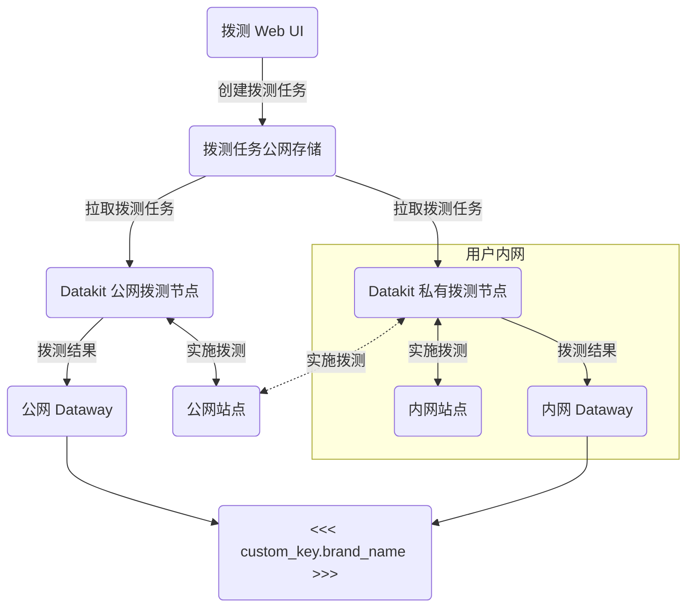

:fontawesome-brands-linux: :fontawesome-brands-apple: :material-kubernetes: :material-docker:

---

该采集器是网络拨测结果数据采集，所有拨测产生的数据，上报<<< custom_key.brand_name >>>。

## 配置 {#config}

<!-- markdownlint-disable MD046 -->
=== "主机安装"

    私有拨测节点部署，需在 [<<< custom_key.brand_name >>>页面创建私有拨测节点](../usability-monitoring/self-node.md)。创建完成后，将页面上相关信息填入 `conf.d/network/dialtesting.conf` 即可：

    进入 DataKit 安装目录下的 `conf.d/network` 目录，复制 `dialtesting.conf.sample` 并命名为 `dialtesting.conf`。示例如下：
    
    ```toml
        
    [[inputs.dialtesting]]
      # We can also configure a JSON path like "file:///your/dir/json-file-name"
      server = "https://<<< custom_key.dial_server_domain >>>"
    
      # [require] node ID
      region_id = "default"
    
      # if server are <<< custom_key.dial_server_domain >>>, ak/sk required
      ak = ""
      sk = ""
    
      # The interval to pull the tasks.
      pull_interval = "1m"
    
      # The timeout for the HTTP request.
      time_out = "30s"
    
      # The number of the workers.
      workers = 6
    
      # Collect related metric when job execution time error interval is larger than task_exec_time_interval
      task_exec_time_interval = "5s"
     
      # Stop the task when the task failed to send data to dataway over max_send_fail_count.
      max_send_fail_count = 16
    
      # The max sleep time when send data to dataway failed.
      max_send_fail_sleep_time = "30m"
    
      # The max number of jobs sending data to dataway in parallel. Default 10.
      max_job_number = 10
    
      # The max number of job chan. Default 1000.
      max_job_chan_number = 1000
    
      # Disable internal network task.
      disable_internal_network_task = true
    
      # Disable internal network cidr list.
      disabled_internal_network_cidr_list = []
    
      # Custom tags.
      [inputs.dialtesting.tags]
      # some_tag = "some_value"
      # more_tag = "some_other_value"
      # ...
    ```

    配置好后，[重启 DataKit](../datakit/datakit-service-how-to.md#manage-service) 即可。

=== "Kubernetes"

    可通过 [ConfigMap 方式注入采集器配置](../datakit/datakit-daemonset-deploy.md#configmap-setting) 或 [配置 ENV_DATAKIT_INPUTS](../datakit/datakit-daemonset-deploy.md#env-setting) 开启采集器。

    也支持以环境变量的方式修改配置参数（需要在 ENV_DEFAULT_ENABLED_INPUTS 中加为默认采集器）：

    - **ENV_INPUT_DIALTESTING_ENV_INPUT_DIALTESTING_DISABLE_INTERNAL_NETWORK_TASK**
    
        是否允许内网地址/服务的拨测。默认不允许
    
        **字段类型**: Boolean
    
        **采集器配置字段**: `disable_internal_network_task`
    
        **示例**: `true`
    
        **默认值**: `false`
    
    - **ENV_INPUT_DIALTESTING_ENV_INPUT_DIALTESTING_DISABLED_INTERNAL_NETWORK_CIDR_LIST**
    
        禁止拨测的 CIDR 地址列表
    
        **字段类型**: List
    
        **采集器配置字段**: `disabled_internal_network_cidr_list`
    
        **示例**: `["192.168.0.0/16"]`
    
        **默认值**: `-`
    
    - **ENV_INPUT_DIALTESTING_ENV_INPUT_DIALTESTING_ENABLE_DEBUG_API**
    
        禁止拨测调试接口（默认禁止）
    
        **字段类型**: Boolean
    
        **采集器配置字段**: `env_input_dialtesting_enable_debug_api`
    
        **示例**: `false`
    
        **默认值**: `false`

---

???+ attention

    目前只有 Linux 的拨测节点才支持「路由跟踪」，跟踪数据会保存在相关指标的 [`traceroute`](dialtesting.md#fields) 字段中。
<!-- markdownlint-enable -->

### 拨测节点部署 {#arch}

以下是拨测节点的网络部署拓扑图，这里存在两种拨测节点部署方式：

- 公网拨测节点：直接使用<<< custom_key.brand_name >>>在全球部署的拨测节点来检测 **公网** 的服务运行情况。
- 私网拨测节点：如果需要拨测用户 **内网** 的服务，此时需要用户自行部署 **私有** 的拨测节点。当让，如果网络允许，这些私有的拨测节点也能部署公网上的服务。

不管是公网拨测节点，还是私有拨测节点，它们都能通过 Web 页面创建拨测任务。



## 日志 {#logging}


### `http_dial_testing`

- 标签


| Tag | Description |
|  ----  | --------|
|`city`|The name of the city|
|`country`|The name of the country|
|`datakit_version`|The DataKit version|
|`dest_ip`|The IP address of the destination|
|`df_label`|The label of the task|
|`internal`|The boolean value, true for domestic and false for overseas|
|`isp`|ISP, such as `chinamobile`, `chinaunicom`, `chinatelecom`|
|`method`|HTTP method, such as `GET`|
|`name`|The name of the task|
|`node_name`|The name of the node|
|`owner`|The owner name|
|`proto`|The protocol of the HTTP, such as 'HTTP/1.1'|
|`province`|The name of the province|
|`status`|The status of the task, either 'OK' or 'FAIL'|
|`status_code_class`|The class of the status code, such as '2xx'|
|`status_code_string`|The status string, such as '200 OK'|
|`url`|The URL of the endpoint to be monitored|

- 指标列表


| Metric | Description | Type | Unit |
| ---- |---- | :---:    | :----: |
|`config_vars`|The configuration variables of the task|string|-|
|`fail_reason`|The reason that leads to the failure of the task|string|-|
|`message`|The message string which includes the header and the body of the request or the response|string|-|
|`response_body_size`|The length of the body of the response|int|B|
|`response_connection`|HTTP connection time|float|μs|
|`response_dns`|HTTP DNS parsing time|float|μs|
|`response_download`|HTTP downloading time|float|μs|
|`response_ssl`|HTTP ssl handshake time|float|μs|
|`response_time`|The time of the response|int|μs|
|`response_ttfb`|HTTP response `ttfb`|float|μs|
|`seq_number`|The sequence number of the test|int|count|
|`status_code`|The response code|int|-|
|`success`|The number to specify whether is successful, 1 for success, -1 for failure|int|-|
|`task`|The raw task string|string|-|


### `tcp_dial_testing`

- 标签


| Tag | Description |
|  ----  | --------|
|`city`|The name of the city|
|`country`|The name of the country|
|`datakit_version`|The DataKit version|
|`dest_host`|The name of the host to be monitored|
|`dest_ip`|The IP address|
|`dest_port`|The port of the TCP connection|
|`df_label`|The label of the task|
|`internal`|The boolean value, true for domestic and false for overseas|
|`isp`|ISP, such as `chinamobile`, `chinaunicom`, `chinatelecom`|
|`name`|The name of the task|
|`node_name`|The name of the node|
|`owner`|The owner name|
|`proto`|The protocol of the task|
|`province`|The name of the province|
|`status`|The status of the task, either 'OK' or 'FAIL'|

- 指标列表


| Metric | Description | Type | Unit |
| ---- |---- | :---:    | :----: |
|`config_vars`|The configuration variables of the task|string|-|
|`fail_reason`|The reason that leads to the failure of the task|string|-|
|`message`|The message string includes the response time or fail reason|string|-|
|`response_time`|The time of the response |int|μs|
|`response_time_with_dns`|The time of the response, which contains DNS time|int|μs|
|`seq_number`|The sequence number of the test|int|count|
|`success`|The number to specify whether is successful, 1 for success, -1 for failure|int|-|
|`task`|The raw task string|string|-|
|`traceroute`|The json string fo the `traceroute` result|string|-|


### `icmp_dial_testing`

- 标签


| Tag | Description |
|  ----  | --------|
|`city`|The name of the city|
|`country`|The name of the country|
|`datakit_version`|The DataKit version|
|`dest_host`|The name of the host to be monitored|
|`df_label`|The label of the task|
|`internal`|The boolean value, true for domestic and false for overseas|
|`isp`|ISP, such as `chinamobile`, `chinaunicom`, `chinatelecom`|
|`name`|The name of the task|
|`node_name`|The name of the node|
|`owner`|The owner name|
|`proto`|The protocol of the task|
|`province`|The name of the province|
|`status`|The status of the task, either 'OK' or 'FAIL'|

- 指标列表


| Metric | Description | Type | Unit |
| ---- |---- | :---:    | :----: |
|`average_round_trip_time`|The average time of the round trip(RTT)|float|μs|
|`average_round_trip_time_in_millis`|The average time of the round trip(RTT), deprecated|float|ms|
|`config_vars`|The configuration variables of the task|string|-|
|`fail_reason`|The reason that leads to the failure of the task|string|-|
|`max_round_trip_time`|The maximum time of the round trip(RTT)|float|μs|
|`max_round_trip_time_in_millis`|The maximum time of the round trip(RTT), deprecated|float|ms|
|`message`|The message string includes the average time of the round trip or the failure reason|string|-|
|`min_round_trip_time`|The minimum time of the round trip(RTT)|float|μs|
|`min_round_trip_time_in_millis`|The minimum time of the round trip(RTT), deprecated|float|ms|
|`packet_loss_percent`|The loss percent of the packets|float|-|
|`packets_received`|The number of the packets received|int|count|
|`packets_sent`|The number of the packets sent|int|count|
|`seq_number`|The sequence number of the test|int|count|
|`std_round_trip_time`|The standard deviation of the round trip|float|μs|
|`std_round_trip_time_in_millis`|The standard deviation of the round trip, deprecated|float|ms|
|`success`|The number to specify whether is successful, 1 for success, -1 for failure|int|-|
|`task`|The raw task string|string|-|
|`traceroute`|The `json` string fo the `traceroute` result|string|-|


### `websocket_dial_testing`

- 标签


| Tag | Description |
|  ----  | --------|
|`city`|The name of the city|
|`country`|The name of the country|
|`datakit_version`|The DataKit version|
|`df_label`|The label of the task|
|`internal`|The boolean value, true for domestic and false for overseas|
|`isp`|ISP, such as `chinamobile`, `chinaunicom`, `chinatelecom`|
|`name`|The name of the task|
|`node_name`|The name of the node|
|`owner`|The owner name|
|`proto`|The protocol of the task|
|`province`|The name of the province|
|`status`|The status of the task, either 'OK' or 'FAIL'|
|`url`|The URL string, such as `ws://www.abc.com`|

- 指标列表


| Metric | Description | Type | Unit |
| ---- |---- | :---:    | :----: |
|`config_vars`|The configuration variables of the task|string|-|
|`fail_reason`|The reason that leads to the failure of the task|string|-|
|`message`|The message string includes the response time or the failure reason|string|-|
|`response_message`|The message of the response|string|-|
|`response_time`|The time of the response|int|μs|
|`response_time_with_dns`|The time of the response, include DNS|int|μs|
|`sent_message`|The sent message |string|-|
|`seq_number`|The sequence number of the test|int|count|
|`success`|The number to specify whether is successful, 1 for success, -1 for failure|int|-|
|`task`|The raw task string|string|-|


### `multi_dial_testing`

- 标签


| Tag | Description |
|  ----  | --------|
|`city`|The name of the city|
|`country`|The name of the country|
|`datakit_version`|The DataKit version|
|`df_label`|The label of the task|
|`internal`|The boolean value, true for domestic and false for overseas|
|`isp`|ISP, such as `chinamobile`, `chinaunicom`, `chinatelecom`|
|`name`|The name of the task|
|`node_name`|The name of the node|
|`owner`|The owner name|
|`province`|The name of the province|
|`status`|The status of the task, either 'OK' or 'FAIL'|

- 指标列表


| Metric | Description | Type | Unit |
| ---- |---- | :---:    | :----: |
|`config_vars`|The configuration variables of the task|string|-|
|`fail_reason`|The reason that leads to the failure of the task|string|-|
|`last_step`|The last number of the task be executed|int|-|
|`message`|The message string which includes the header and the body of the request or the response|string|-|
|`response_time`|The time of the response|int|μs|
|`seq_number`|The sequence number of the test|int|count|
|`steps`|The result of each step|string|-|
|`success`|The number to specify whether is successful, 1 for success, -1 for failure|int|-|
|`task`|The raw task string|string|-|


### `traceroute` {#traceroute}

`traceroute` 是「路由跟踪」数据的 JSON 文本，整个数据是一个数组对象，对象中的每个数组元素记录了一次路由探测的相关情况，示例如下：

```json
[
    {
        "total": 2,
        "failed": 0,
        "loss": 0,
        "avg_cost": 12700395,
        "min_cost": 11902041,
        "max_cost": 13498750,
        "std_cost": 1129043,
        "items": [
            {
                "ip": "10.8.9.1",
                "response_time": 13498750
            },
            {
                "ip": "10.8.9.1",
                "response_time": 11902041
            }
        ]
    },
    {
        "total": 2,
        "failed": 0,
        "loss": 0,
        "avg_cost": 13775021,
        "min_cost": 13740084,
        "max_cost": 13809959,
        "std_cost": 49409,
        "items": [
            {
                "ip": "10.12.168.218",
                "response_time": 13740084
            },
            {
                "ip": "10.12.168.218",
                "response_time": 13809959
            }
        ]
    }
]
```

**字段描述：**

| 字段       | 类型          | 说明                        |
| :---       | ---           | ---                         |
| `total`    | number        | 总探测次数                  |
| `failed`   | number        | 失败次数                    |
| `loss`     | number        | 失败百分比                  |
| `avg_cost` | number        | 平均耗时(μs)                |
| `min_cost` | number        | 最小耗时(μs)                |
| `max_cost` | number        | 最大耗时(μs)                |
| `std_cost` | number        | 耗时标准差(μs)              |
| `items`    | Item 的 Array | 每次探测信息(详见下面 `items` 字段说明) |

**`items` 字段说明**

| 字段            | 类型   | 说明                        |
| :---            | ---    | ---                         |
| `ip`            | string | IP 地址，如果失败，值为 `*` |
| `response_time` | number | 响应时间(μs)                |

## 拨测采集器自身指标采集 {#metric}

拨测采集器会暴露 [Prometheus 指标](../datakit/datakit-metrics.md)，如果需要上报这些指标至<<< custom_key.brand_name >>>，可以通过 [DataKit 采集器](dk.md) 进行采集，相关配置参考如下：

```toml
[[inputs.dk]]
  ......

  metric_name_filter = [
  
  ### others...
  
  ### dialtesting
  "datakit_dialtesting_.*",

  ]

  ......

```
