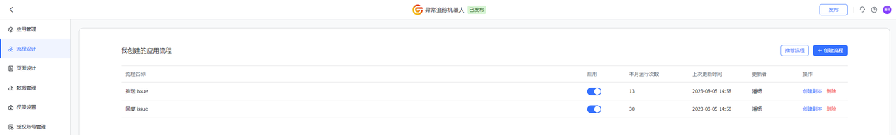
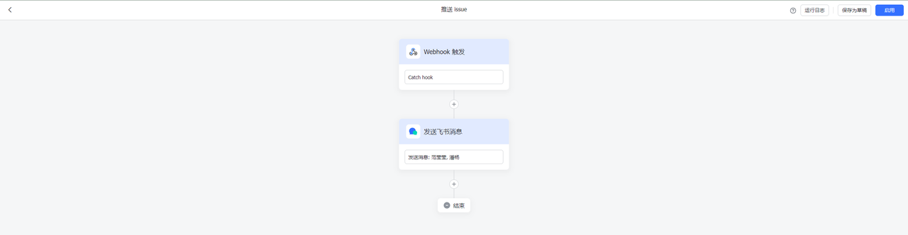
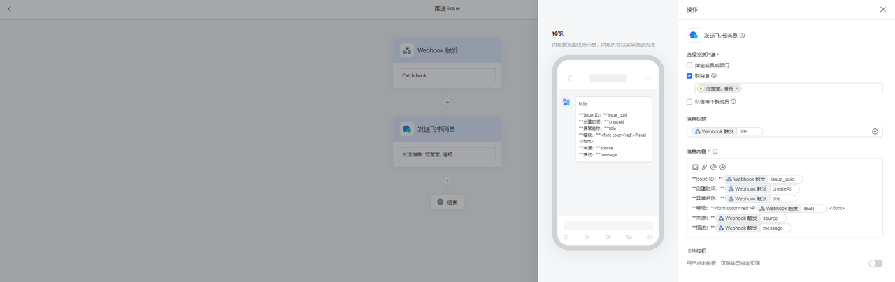
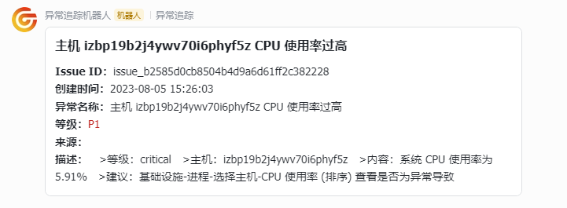
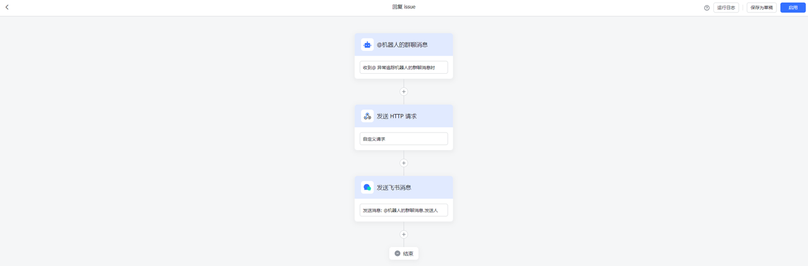
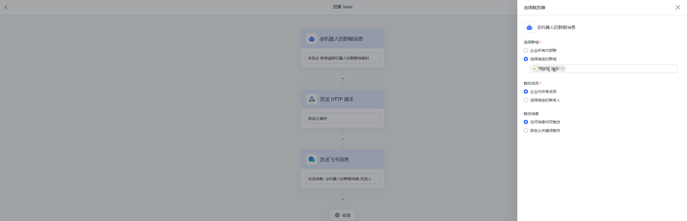
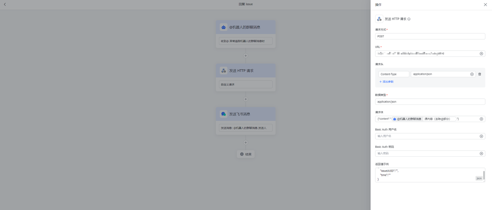
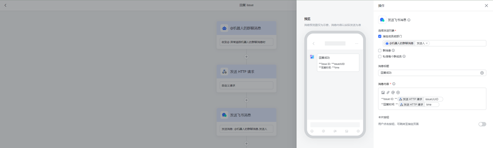
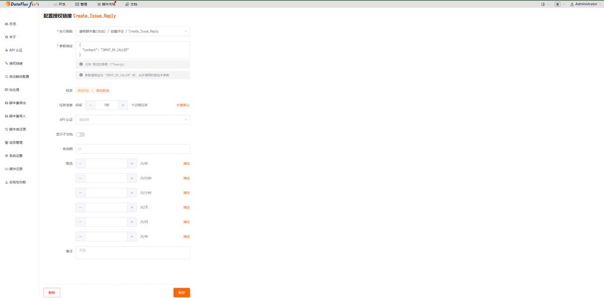
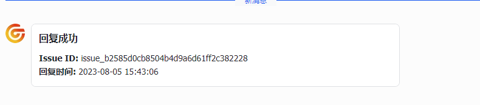

<!-- markdownlint-disable MD025 -->
# 飞书与异常追踪联动
<!-- markdownlint-enable -->

为方便更加及时可方便的获取异常追踪中的新 Issue，我们可以通过在内部群中创建一个飞书、钉钉或者企业微信的机器人来接受异常追踪中的新 Issue 的提醒，或者是新回复的提醒，这样可以帮助我们及时处理 Issue，我们也可以通过 @机器人的这种方式来快速进行 Issue 回复来提高我们的异常处理效率


## 配置 {#config}

### 准备工作

1. 获取观测云需要跟踪 Issue 工作空间的 [API Key](https://docs.guance.com/management/api-key/)
2. 创建一个[飞书机器人助手应用](https://www.feishu.cn/hc/zh-CN/articles/495678957203-如何使用机器人应用)
3. 部署一个 [Dataflux Func 观测云特别版](https://func.guance.com/#/)


### 部署流程

#### 编写飞书机器人收取 Issue 信息规则

由于飞书不直接提供 outgoing 这种连续对话方式的机器人应用，所以需要我们通过多个机器人应用流程来实现类似的对话功能。



首先我们要有一个收取 issue 信息的流程来捕获新 issue 或新回复信息



我们通过 Webhook 作为流程触发条件，当我们监听脚本发现有新 issue 记录或者回复时就可以通过调用飞书的 webhook 来触发机器人的消息推送流程了


我们可以通过配置 Webhook 触发器将我们 Issue 中的一些参数捕获作为机器人发送飞书消息的入参



我们可以通过 markdown 的方式来编写我们想要呈现的消息样式，同时引用我们上面在 webhook 中配置的参数来呈现消息

#### 编写监听脚本

在做好收取 Issue 的规则配置后，我们需要在已经安装配置好的 Dataflux Func 中编写获取新消息并通过 webhook 发送到飞书机器人的脚本。

首先我们需要引入一些常量，比如获取新 Issue 的 OpenAPI 地址、 API Key 等

```Python
import requests
import time
import json
from datetime import datetime, timedelta

# 增量 1 分钟, 获取 1 分钟前的时间
one_minute_ago = datetime.now() - timedelta(minutes=1)
one_minute_ago_time = int(one_minute_ago.timestamp())
# 当前时间戳
current_time = int(time.time())
# 飞书 webhook
feishu_webhook_url = "https://www.feishu.cn/flow/api/trigger-webhook/6af60259bd9691a0fd1xxxxxxx"
# 观测云 OpenAPI 地址
base_url = 'https://openapi.guance.com'
channel_list_url = base_url + '/api/v1/channel/quick_list'
issue_list_url = base_url + '/api/v1/issue/list'
# 观测云 API key
df_api_key = '5K3IcvtWbSZ2inxxxxxxxxxxx'
```

再引入了我们需要的常量后我们需要两个方法来完成新 issue 的获取，首先第一步我们要了解异常追踪的展示逻辑，在异常追踪模块中所有的 issue 都会被频道管理，但是所有新建的 issue 都会出现在**全部**的频道中，所以首先我们需要一个方法获取所有的频道列表来找出我们要监听的**全部频道**  

```Python
# 获取频道列表
def get_channel_list(df_api_key, channel_list_url):
    # 要发送的参数
    params = {
        'DF-API-KEY': df_api_key,
        'Content-Type': 'application/json;charset=UTF-8'
    }

    try:
        # 发送 GET 请求
        response = requests.get(channel_list_url, headers=params)

        # 检查响应状态码
        if response.status_code == 200:
            # 解析 JSON 响应（如果适用）
            channel_list = response.json()["content"]
            channels = []
            # 处理响应数据
            # print("Response:", data)
            for channel in channel_list:
                data = {
                    "id": channel["id"],
                    "name": channel["name"],
                    "uuid": channel["uuid"]
                }
                channels.append(data)
            return channels
        else:
            print("Request failed with status code:", response.status_code)

    except requests.exceptions.RequestException as e:
        print("Request error:", e)
```

再获取到我们需要的频道 Channel_UUID 后我们就可以通过频道 ID 来查找当前频道中的新增 Issue 了，同时我们获取到新 issue 后可以同时发送给我们的飞书机器人的 webhook

```Python
# 获取 issue 列表并发送飞书消息
def get_issue_list_to_feishu(df_api_key, issue_list_url, channelUUID, feishu_webhook_url):
    # 要发送的参数
    headers = {
        'DF-API-KEY': df_api_key,
        'Content-Type': 'application/json;charset=UTF-8'
    }

    body = {
        'channelUUID': channelUUID,
        'startTime': one_minute_ago_time,
        'endTime': current_time,
    }

    try:
        # 发送 GET 请求
        response = requests.post(issue_list_url, headers=headers, data=json.dumps(body))

        # 检查响应状态码
        if response.status_code == 200:
            # 解析 JSON 响应（如果适用）
            issue_lists = response.json()['content']
            if len(issue_lists):
                for issue in issue_lists:
                    headers = {
                        'Content-Type': 'application/json',
                    }
                    data = {
                        "issue_uuid": issue["uuid"],
                        "title": issue["name"],
                        "level": issue["level"],
                        "source": issue["resource"],
                        "message": issue["description"],
                        "createAt": datetime.fromtimestamp(issue["createAt"]).strftime('%Y-%m-%d %H:%M:%S')
                    }
                    try:
                        response = requests.post(feishu_webhook_url, headers=headers, data=json.dumps(data))
                        response.raise_for_status()
                        print("Message sent successfully to Feishu")
                    except requests.exceptions.HTTPError as errh:
                        print(f"Http Error: {errh}")
                    except requests.exceptions.ConnectionError as errc:
                        print(f"Error Connecting: {errc}")
                    except requests.exceptions.Timeout as errt:
                        print(f"Timeout Error: {errt}")
                    except requests.exceptions.RequestException as err:
                        print(f"OOps: Something Else {err}")
        else:
            print("Request failed with status code:", response.status_code)

    except requests.exceptions.RequestException as e:
        print("Request error:", e)
```

最后我们需要一个可以配置定时任务的主方法，来完成获取新 Issue 的任务可以自动执行

```Python
# 主方法
@DFF.API('获取issue发送到飞书')
def main():
    channel_list = get_channel_list(df_api_key, channel_list_url)
    print(f"channel_list: {channel_list}")
    for channel in channel_list:
        if channel["name"] == "default":
            get_issue_list_to_feishu(df_api_key, issue_list_url, channel["uuid"], feishu_webhook_url)
```

再完成脚本编写后我们需要在 【管理 / 自动触发配置】中为我们刚刚编写的脚本创建自动触发任务，将执行函数选为我们最后编写的**主方法: 获取 issue 发送到****飞书**即可，同时将 Crontab 配置为每分钟执行一次后，点击保存即可完成任务的创建了。

#### 在飞书中收取新 issue 并配置回复流程

在配置好任务后我们就可以点击执行来立即触发一次任务，或当有新 issue 时自行触发。

当异常追踪中有新 Issue 时我们就可以在我们配置了机器人应用的飞书群中获取到新 Issue 提醒了。



这时我们要想对本条 Issue 记录行回复评论的时候就需要我们配置另外一条飞书机器人应用的回复 Issue 规则了



那这条规则的触发条件就是当我们需要进行 Issue 消息的回复时 @机器人的动作触发时，我们可以配置在指定群主中生效该规则，也可以配置指定的触发词等条件



在配置好机器人触发规则后我们需要创建我们回复消息的规则，由于需要拆解我们回复消息中的 IssueID 所以我们需要一个 API 服务作为中转，再向 OpenAPI 发送添加评论请求



> 由于原消息会带上 @机器人 所以在选择参数时要选择**源消息(去除@部分)**

我们可以通过填写 API 的返回示例来验证我们添加评论是否成功



当发送评论成功后我们可以通过上面获取的返回参数，来给消息发送者发送消息成功发送的通知

#### 编写中转发送评论脚本

由于需要对发送的消息进行解析，所以我们需要在 Dataflux Func 中利用授权链接功能来创建一个 API 服务，在收取到消息解析后向 OpenAPI 发送新增评论的请求，同时添加返回的 `Json` 结构方便对消息成功的确认。

```Python
import requests
import time
import json
from datetime import datetime, timedelta


# 观测云 API key
df_api_key = '5K3IcvtWbSZ2in4ujU07xxxxxxxxxx'
# 观测云 OpenAPI 地址
base_url = 'https://openapi.guance.com'
create_issue_reply_url = base_url + '/api/v1/issue/reply/create'


@DFF.API('Create_Issue_Reply')
def create_issue_reply(content):
    print(f"conntent: {content}")
    param_list = content.split('#')
    issueUUID = param_list[1]
    content = param_list[2]
    # 要发送的参数
    headers = {
        'DF-API-KEY': df_api_key,
        'Content-Type': 'application/json;charset=UTF-8'
    }

    body = {
        'issueUUID': issueUUID,
        'content': content,
        'extend': {}
    }

    try:
        # 发送 GET 请求
        response = requests.post(create_issue_reply_url, headers=headers, data=json.dumps(body))
        print("repsonse: ",response.json())
        # 检查响应状态码
        if response.status_code == 200:
            # 解析 JSON 响应（如果适用）
            result = response.json()['content']
            return {
                "issueUUID": issueUUID,
                "time": datetime.fromtimestamp(result["updateAt"]).strftime('%Y-%m-%d %H:%M:%S')
            }
        else:
            print("Request failed with status code:", response.status_code)

    except requests.exceptions.RequestException as e:
        print("Request error:", e)
```

在编写好 API 脚本后我们需要通过【管理 / 授权链接】配置开启 API 服务来作为飞书 webhook http 请求的接收端



由于我们需要中转解析参数，所以再 @机器人发送消息时需要按照指定规则才可以成功将消息发送成功，这里的采用的方式是 `#issueUUID#消息内容`  的方式来进行的，当获取到正确的参数后就可以将回复内容发送到 OpenAPI


当消息成功发送后我们可以从我们自己配置的返回结构中获取数据进行通知



同时也可以在 Studio 中查看我们回复的消息内容
