<!-- markdownlint-disable MD025 -->
# 华为云ASM链路追踪 TO 观测云
<!-- markdownlint-enable -->

华为云的ASM的链路追踪数据输出到观测云，进行查看、分析。

## 配置 {#config}

### 准备工作
使用ASM前提，需要购买了CCE集群，部署了 `datakit` 的 [`daemonset`](https://docs.guance.com/datakit/datakit-daemonset-deploy/)。


### ASM的创建
服务网格 =》购买网格 =》基础版
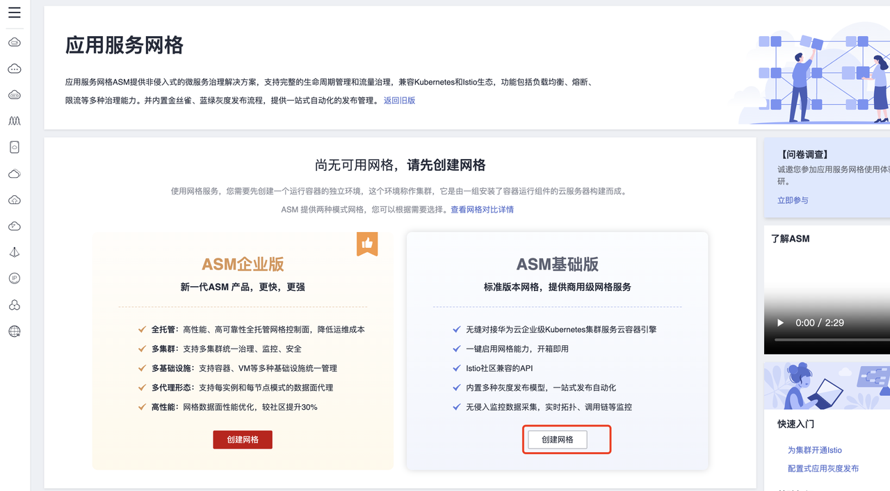

网格名称、选择 `istio` 版本、选择集群版本和 `istio` 的控制节点、直接提交即可


大约需要1~3分钟后，安装完成后的页面如下

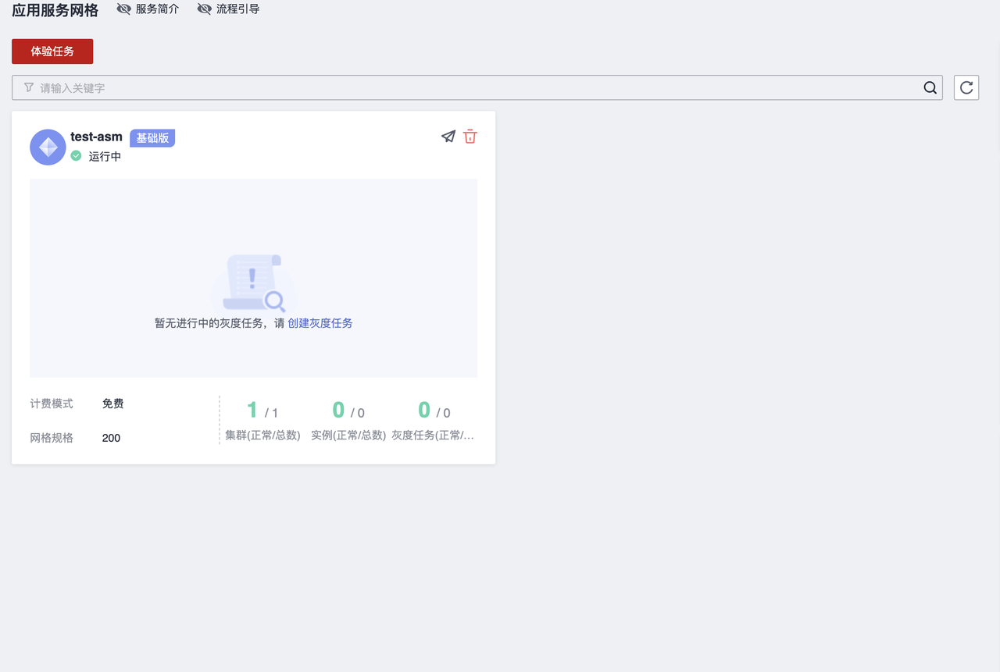

安装完成后，创建 `bookinfo` 的应用

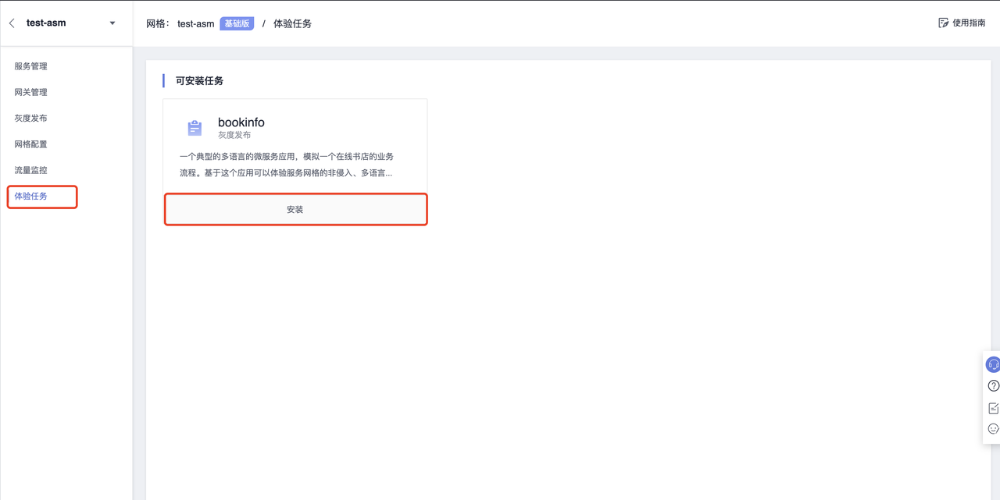

安装之前需要我们准备一个负载均衡，这里我已经准备好了，选择即可，对外端口选择80，镜像仓库地址选择 `docker.io/istio` ，安装即可

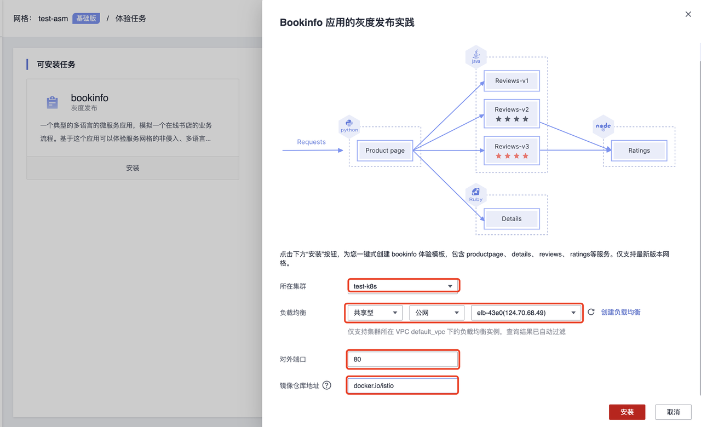

查看创建好的网关和服务

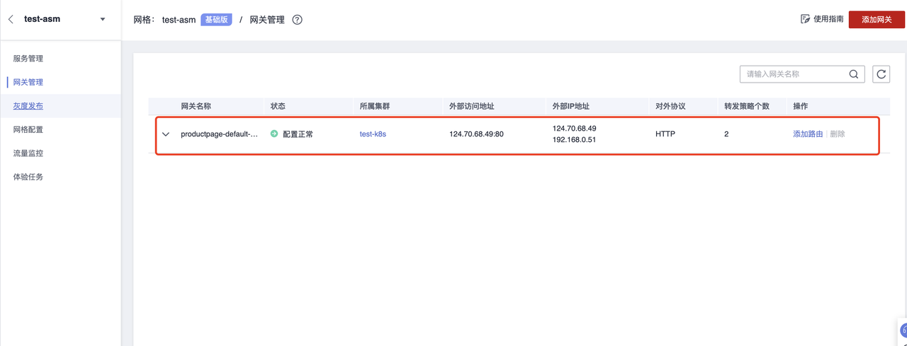

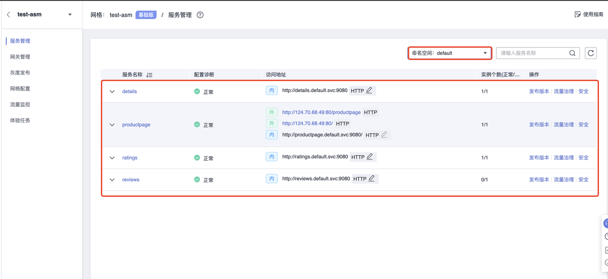

访问一下  `http://124.70.68.49/productpage`  看服务是否正常

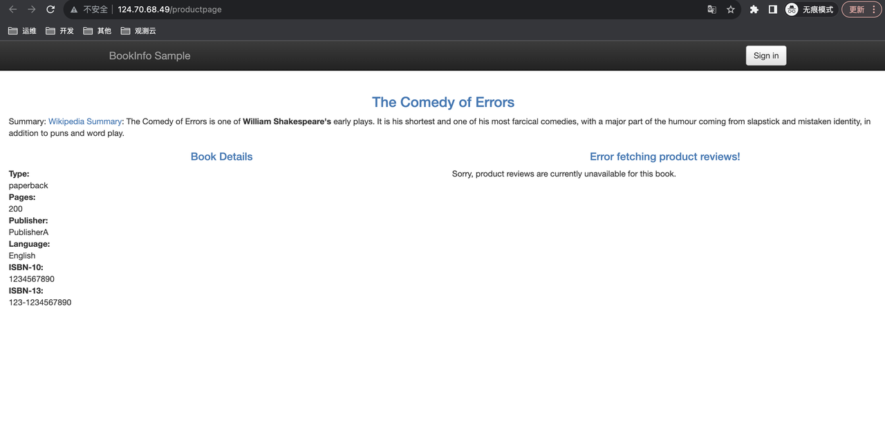

### 链路数据发送到观测云

#### 开启 OpenTelemetry 采集器

参考[`OpenTelemetry` 采集器接入文档](https://docs.guance.com/datakit/opentelemetry/)

- ConfigMap 增加

```shell
opentelemetry.conf: |
      [[inputs.opentelemetry]]
          [inputs.opentelemetry.http]
            enable = true
            http_status_ok = 200
            trace_api = "/otel/v1/trace"
            metric_api = "/otel/v1/metric"
          [inputs.opentelemetry.grpc]
            trace_enable = true
            metric_enable = true
            addr = "0.0.0.0:4317"
```

- 挂载 `opentelemetry.conf`

```shell
- mountPath: /usr/local/datakit/conf.d/opentelemetry/opentelemetry.conf
    name: datakit-conf
    subPath: opentelemetry.conf
```

从新部署 `datakit`

```shell
kubectl apply -f datakit.yaml
```

部署完成后，查看 monitor 中，是否开启了 `opentelemetry`

```shell
# kubectl exec -it -n datakit pods/datakit-lfb95 datakit monitor
```

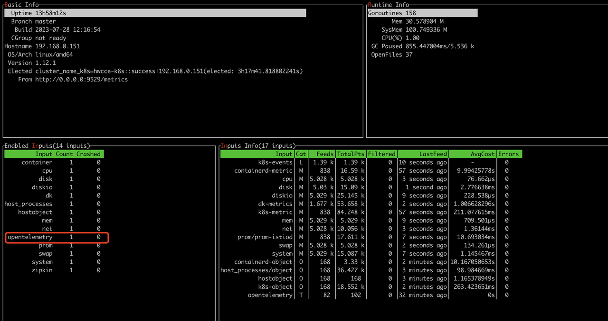

#### 修改 asm 的输出地址

为了方便测试，首先修改一下ASM的采样率

```shell
# kubectl edit -n istio-system cm istio-1-15-5-r4
...
sampling: 100   #该参数由原来的1改为100
...
```

修改 asm 输出到观测云

```shell
# kubectl edit -n monitoring cm otel-collector-conf
...
exporters:
      apm:
        address: "100.125.0.78:8923"
        project_id: f5f4c067d68b4b3aad86e173b18367bf
        cluster_id: 5f642ce9-4aca-11ee-9dbd-0255ac10024d
      otlp:   # 新增otlp输出
        endpoint: "http://datakit-service.datakit:4317"
        tls:
          insecure: true
        compression: none # 不开启gzip
...
traces/apm:
          receivers: [ zipkin ]
          processors: [ memory_limiter, batch ]
          exporters: [ otlp ]   #输出器修改为otlp
```

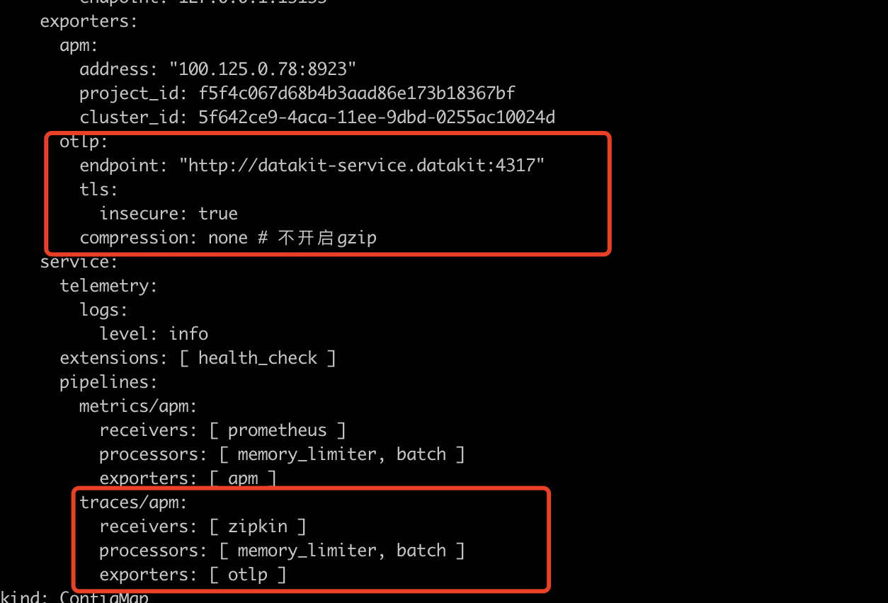

配置修改完后，我们访问几次 `http://124.70.68.49/productpage` 这个地址，然后去观测云空间查看链路

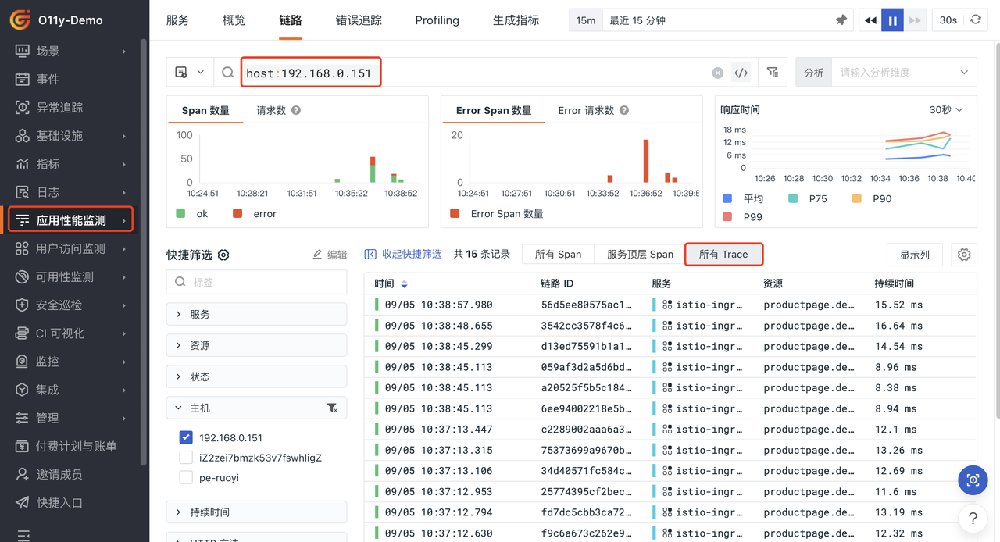

点击一条trace查看详细信息

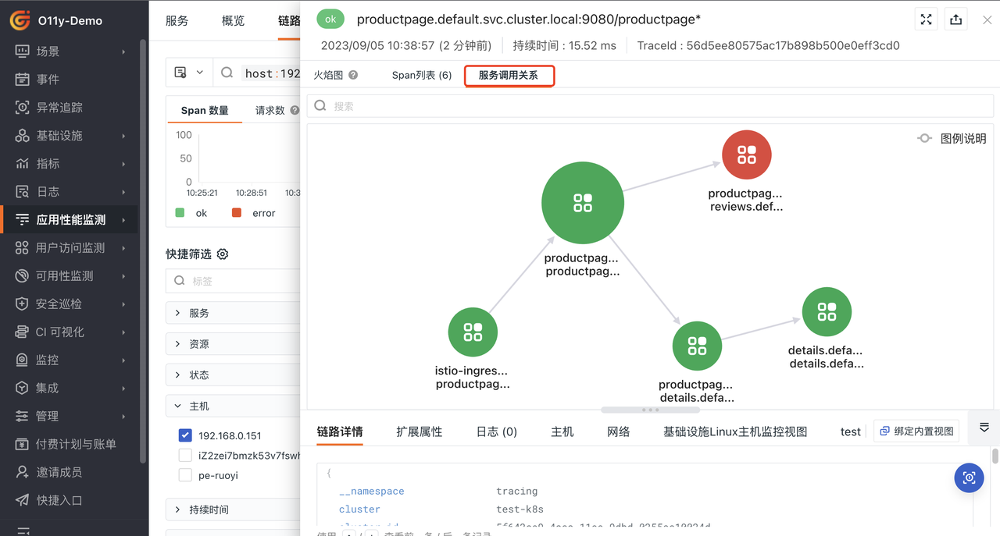

### 指标数据发送到观测云
#### 指标采集配置

1. DataKit开启 `Prometheus Exportter` 数据采集，可以参考[**Prometheus Exportter**](https://docs.guance.com/integrations/prom/#__tabbed_1_2)，configmap如下：


   ``` yaml
       prom.conf: |
         [[inputs.prom]]
           urls = ["http://istiod.istio-system:15014/metrics"] ##istiod地址
           uds_path = ""
           ignore_req_err = false
           source = "prom"
           measurement_prefix = ""
           measurement_name = "istio_prom"
   ```

2. 挂载配置文件


   ``` yaml
           - mountPath: /usr/local/datakit/conf.d/prom/prom.conf
             name: datakit-conf
             subPath: prom.conf
   ```

3. 重新部署DataKit


   ``` yaml
   Kubectl apply -f datakit.yml 
   ```
