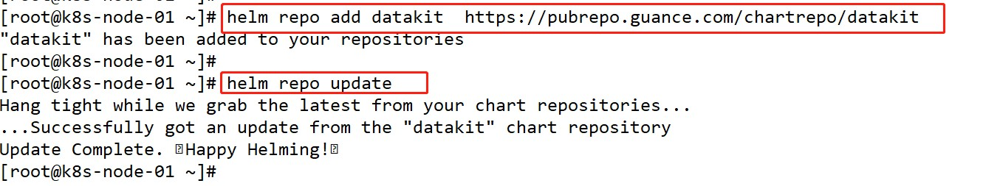
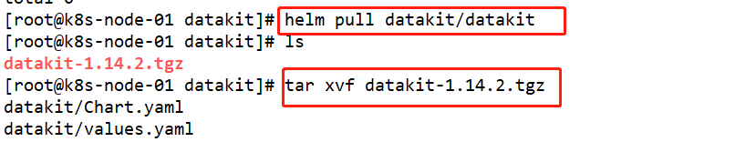
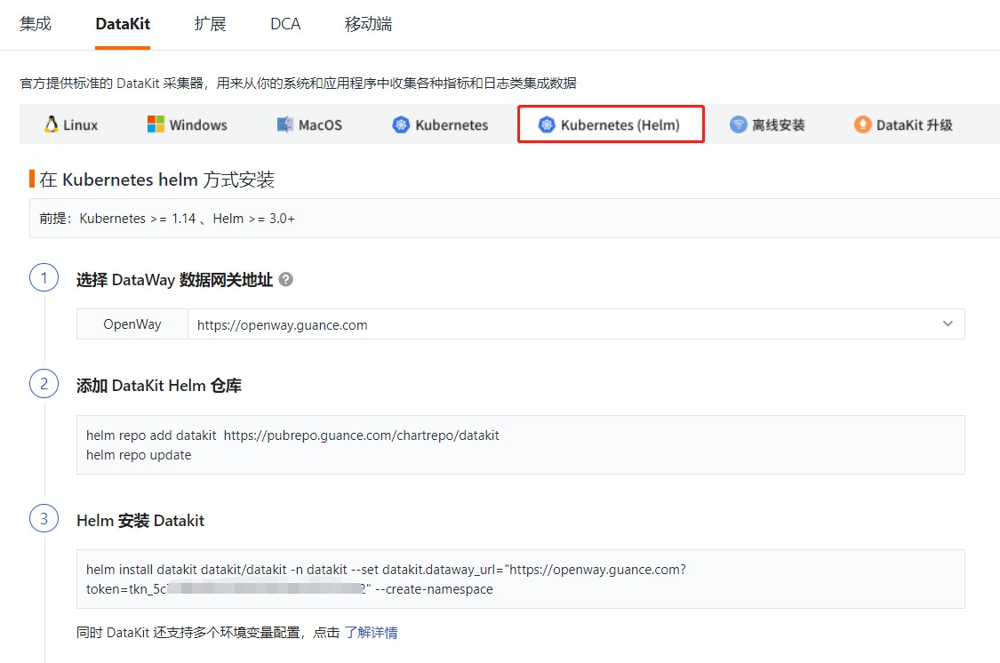
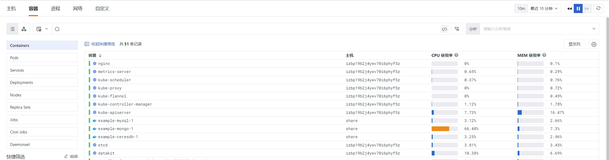
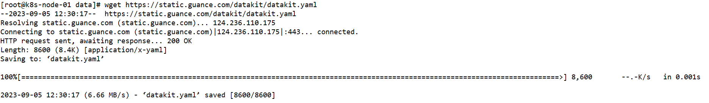
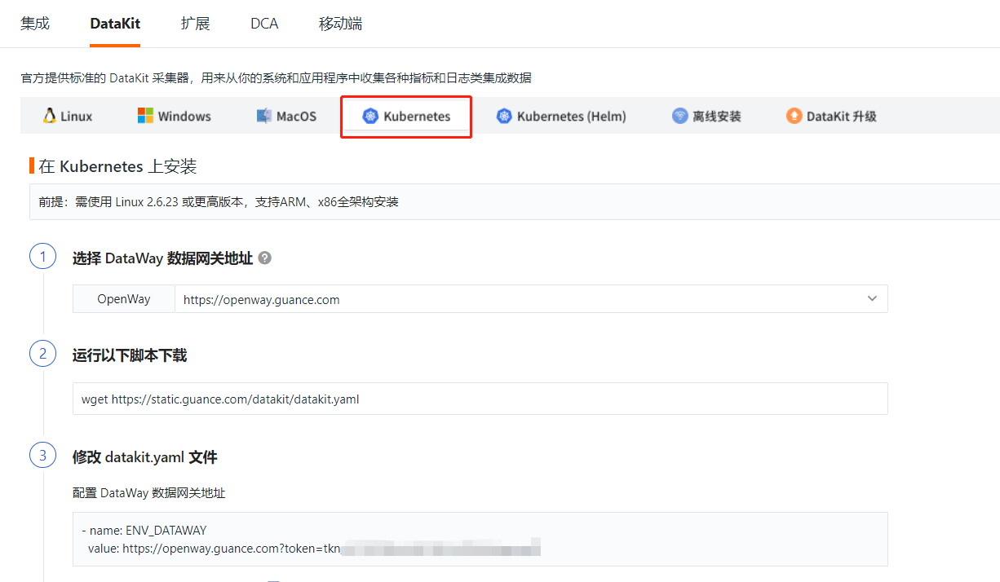
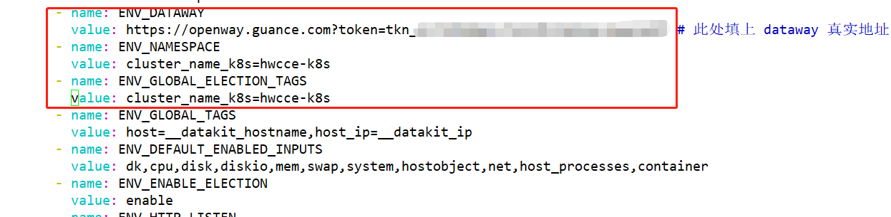
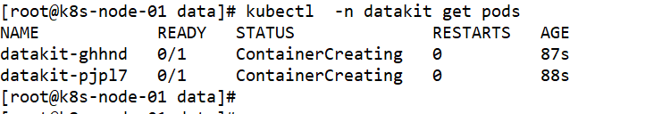

<!-- markdownlint-disable MD025 -->
# 使用观测云采集华为云CCE指标数据
<!-- markdownlint-enable -->

观测云支持对 CCE 中各类资源的运行状态和服务能力进行监测，包括 Containers、Pods、Services、Deployments、Clusters、Nodes、Replica Sets、Jobs、Cron Jobs 等。您可以在 Kubernetes 中通过 DaemonSet 方式安装 `DataKit`，进而完成对 Kubernetes 资源的数据采集。最终，在观测云中实时监测 Kubernetes 各类资源的运行情况。

## 配置 {#config}

### 准备工作

- 创建一个观测云账号
- 创建一个华为云CCE集群

### 部署流程

在 Kubernetes 中通过 DaemonSet 方式安装 `DataKit` 有两种方法：

- Helm 安装
- YAML 安装

#### **Helm 安装**

##### **前提条件**

- Kubernetes >= 1.14
- Helm >= 3.0+

##### 1. 添加 `Datakit` Helm 仓库

使用 Helm 安装 `Datakit` 采集器，需要先在服务器上安装Helm， Helm安装完成后，添加Datakit Helm 仓库。

```Bash
helm repo add datakit  https://pubrepo.guance.com/chartrepo/datakit 
helm repo update
```

> 添加完 `Datakit` Helm仓库后，必须执行 `helm repo update` 更新本地仓库。



##### 2. 下载 `Datakit` chart

```Bash
# 下载 datakit chart
helm pull datakit/datakit
# 解压 
tar xvf datakit-1.14.2.tgz
```



##### 3. 自定义 `Datakit` 安装参数

取消extraEnvs下 ENV_NAMESPACE 的注释，修改集群名称。

```YAML
extraEnvs:
#  - name: ENV_NAMESPACE # electoral
#    value: k8s
```

改为

```YAML
extraEnvs:
  - name: ENV_NAMESPACE # electoral
    value: cluster_name_k8s=hwcce-k8s
  - name: ENV_GLOBAL_ELECTION_TAGS
    value: cluster_name_k8s=hwcce-k8s
```

##### 4. Helm 安装 `Datakit`

修改 `datakit.dataway_url` 中 token 数据。

```Bash
helm install datakit -n datakit -f datakit/values.yaml  datakit --set datakit.dataway_url="https://openway.guance.com?token=tkn_1661b3cb5fc442719eae064edb979b5d" --create-namespace
```

token 可以在观测云工作空间的「集成」-「Datakit」获取。



token 替换后，执行 helm 安装 Datakit。


##### 5. 查看部署状态

Datakit 安装完成后，可以通过 `helm -n datakit ls` 查看部署状态。


##### 6. 在观测云工作空间查看和分析采集的K8S数据

`DataKit` 部署状态正常，可以在观测云工作空间「基础设施」-「容器」查看和分析采集的 K8S 数据。



##### 7. 添加仪表板

K8S 数据可以正常采集后，可以在观测云工作空间 「场景」-「仪表板」-  「新建仪表板」，搜索 Kubernetes 监控视图，可以看到如下仪表板。


#### YAML 安装

##### 1. 下载 YAML 文件

开启 Kubernetes 资源采集前，需要使用终端工具登录到服务器执行下面的脚本命令来下载 yaml 文件。

```Bash
wget https://static.guance.com/datakit/datakit.yaml
```



##### 2. 修改 `datakit.yaml` 文件

编辑 `datakit.yaml` 文件中数据网关 `dataway` 的配置，把 `token` 替换成工作空间的 `token`

``` yaml
1.  - name: ENV_DATAWAY
2.    value: https://openway.guance.com?token=<your-token> # 此处填上 dataway 真实地址
```

增加环境变量`ENV_NAMESPACE`设置集群名称，名称可以自定义，比如设置成`hwcce_k8s`：

``` yaml
1. - name: ENV_NAMESPACE 
     value: hwcce_k8s #此处填上 集群名称
```

增加环境变量`ENV_GLOBAL_ELECTION_TAGS`，设置选举类指标区分集群

``` yaml
1. - name: ENV_GLOBAL_ELECTION_TAGS
2.   value: cluster_name_k8s=hwcce_k8s #此处填上 集群名称
```

修改环境变量`ENV_GLOBAL_TAGS`，设置非选举类指标设置全局tag

``` yaml
1. - name: ENV_GLOBAL_TAGS
2.   value: host=__datakit_hostname,host_ip=__datakit_ip,cluster_name_k8s=hwcce_k8s #此处新增填上cluster_name_k8s 集群名称
```

`token` 可以在观测云工作空间的「集成」-「Datakit」获取。



替换修改后，保存 `datakit.yaml` 文件




##### 3. 安装 YAML 文件

`datakit.yaml` 文件的数据网关修改完成后，使用命令`kubectl apply -f datakit.yaml`安装 yaml 文件，其中`datakit.yaml`为文件名，以您保存的文件名为准。


##### 4. 查看 Datakit 运行状态

yaml 文件安装完后，会创建一个 `datakit` 的 DaemonSet 部署，可通过命令 `kubectl get pod -n datakit` 查看 `datakit` 的运行状态。



##### 5. 在观测云工作空间查看和分析采集的K8S数据


##### 6. 添加仪表板

K8S 数据可以正常采集后，可以在观测云工作空间 「场景」-「仪表板」- 「新建仪表板」，搜索 Kubernetes 监控视图，可以看到如下仪表板。


