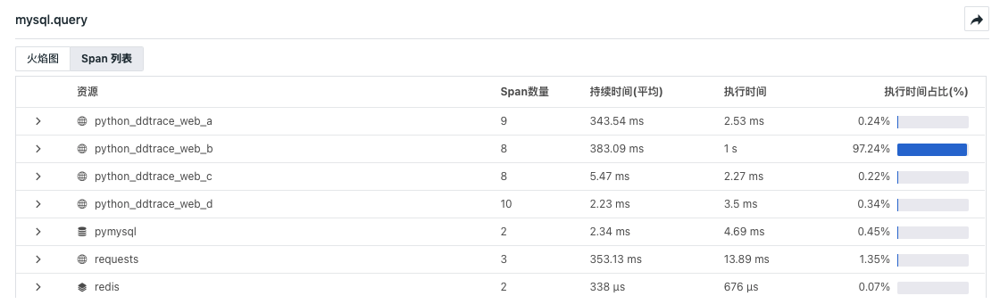
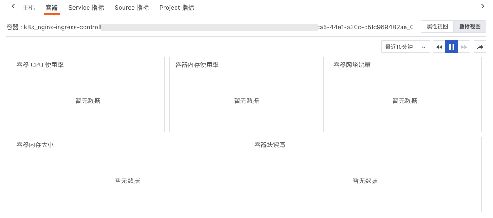
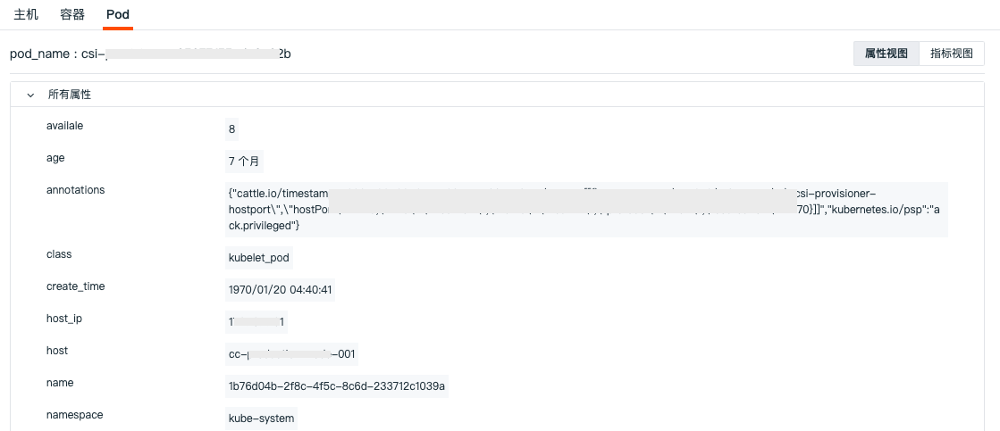
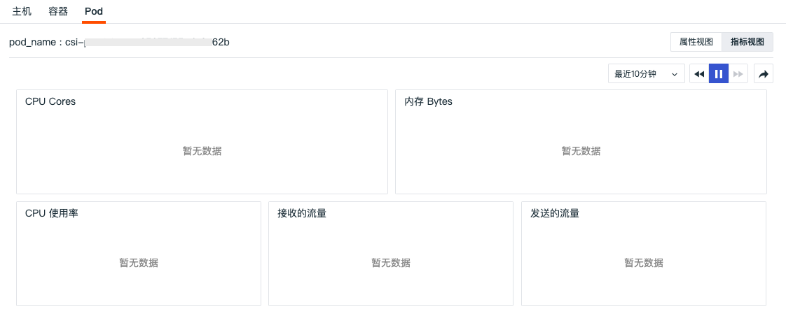
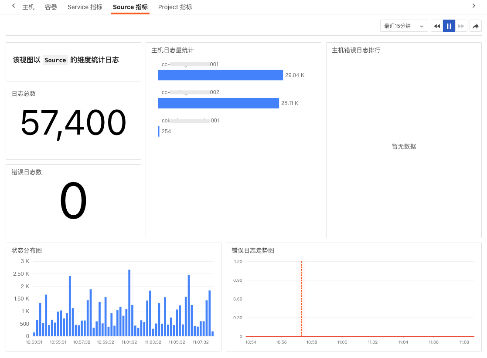

# 日志查看器
---


日志数据采集到观测云后，您可以在观测云控制台，通过**日志**查看工作空间内全部的日志内容。

若当前登录账号角色在**日志 > [数据访问](logdata-access.md#list)** 设置了【仅显示跟我相关的规则】，查询的日志内容会同步受其影响。


## 日志查看器模式

观测云日志查看器支持三种查看模式，包括**全部日志、聚类分析和图表分析**。

=== "全部日志"

    **全部日志**：基于采集的原始日志数据进行查看和分析。
    
    

=== "聚类分析"

    **聚类分析**：对原始日志数据的进行相似度计算分析。默认根据 `message` 字段进行聚类，也可根据需要自定义聚类字段。

    日志范围：根据右上方选择的时间范围固定当前时间段，并获取该时间段内 10000 条数据进行聚类分析，将近似度高的日志进行聚合，提取并统计共同的聚类。
    
    您可点击 icon :octicons-triangle-up-16: & :octicons-triangle-down-16: 对文档数量排序，默认倒序。
    
    点击聚类列表，即可划出当前所有的聚类列表，返回数据列表按照时间倒序排列，支持显示最近 50 条日志数据，可选择 1 行、3 行、10 行的方式显示。点击**关联日志**列表，可查看对应的日志详情。
    
    

=== "图表分析"

    选择右上角**分析**即可对原始日志数据基于<u>1-3 个标签</u>进行分组统计，以反映出日志数据在不同的分组下，不同时间的分布特征与趋势。
    
    观测云支持多种分组数据浏览方式：时序图、排行榜、饼图和矩形树图。
    
    > 更多详情，可参考 [查看器的分析模式](../getting-started/function-details/explorer-search.md#analysis)。
    
    
---
  
## 日志查询与分析

观测云支持通过多种操作对日志数据进行查询和分析：

### 日志统计

观测云会根据选择的时间范围自动划分若干时间点，通过堆积柱状图展示不同日志状态的数量，帮助进行统计分析。若对日志进行了筛选过滤，柱状图同步展示筛选后结果。

- 日志统计图支持通过鼠标悬浮至图表，点击导出按钮，即可导出到仪表板、笔记或粘贴板；
- 日志统计图支持自定义选择时间间隔。


### 时间控件

观测云查看器默认展示最近 15 分钟的日志数据，您也可以自定义数据展示的[时间范围](../getting-started/function-details/explorer-search.md#time)。

### 日志索引

观测云支持设置日志多索引，筛选符合条件的日志保存在不同的日志索引中，并通过为日志索引选择不同的数据存储策略，帮助用户节约日志数据存储费用。

在**日志 > 索引**设置索引以后，支持在查看器选择不同的索引查看对应的日志内容。

> 更多详情，可参考 [日志索引](multi-index.md)。


### 搜索与筛选

在日志查看器搜索栏，支持[多种搜索方式和筛选方式](../getting-started/function-details/explorer-search.md)。

输入搜索或筛选条件后，可查看查询的预览效果。您可以复制该条件，直接用于图表或查询工具。


### DQL 搜索 {#dql}

**前提**：DQL 搜索功能目前仅支持日志查看器使用。

在日志查看器，您可以通过点击搜索框内的切换按钮 :fontawesome-solid-code:，切换到 DQL 手动输入查询模式，可自定义输入筛选条件和搜索条件。

- 筛选条件：支持 `and / or` 任意组合，支持使用 `()` 括号表示执行搜索的优先级，支持 `=` 、`!=` 等操作符；
- 搜索条件：支持使用 DQL 函数 `query_string()` 字符串查询，如输入 `message = query_string()` 对日志内容进行搜索。

> 更多 DQL 语法，可参考 [DQL 定义](../dql/define.md)。

### 快捷筛选 {#filter}

在日志查看器快捷筛选，支持编辑[快捷筛选](../getting-started/function-details/explorer-search.md#quick-filter)，添加新的筛选字段。

**注意**：若快捷筛选的列出值受采样影响，显示采样率，并支持用户临时关闭采样。

### 自定义显示列

日志查看器默认显示 `time` 和 `message` 字段，其中 `time` 字段为固定字段无法删除。当鼠标放在查看器显示列上时，点击**设置**按钮，支持对显示列进行升序、降序、向左移动列、向右移动列、向左添加列、向右添加列、替换列、添加到快捷筛选、添加到分组、移除列等操作。

> 更多自定义显示列，可参考 [显示列说明](../getting-started/function-details/explorer-search.md#columns)。

### 新建监控器 {#new}

您可以在日志查看器通过该入口，直接跳转至监控器新建页面，为日志数据快速设置异常检测规则。


> 关于细节操作，可参考 [新建监控器](../monitoring/monitor/index.md#new)。

### Copy as cURL

日志查看器支持通过命令行形式来获取日志数据。在日志数据列表右侧**设置**，点击 **Copy as cURL** 即可复制 cURL 命令行，前往主机终端执行该命令，从可获取当前时间段内相关筛选及搜索条件下的日志数据。


<u>**示例**</u>

复制 cURL 命令行后，如下图所示：其中 `<Endpoint>` 需替换为域名，`<DF-API-KEY>` 需前往 [API 管理](../management/api-key/index.md) 更换为 **Key ID**。

> 关于更多相关参数说明，可参考 [DQL 数据查询](../open-api/query-data/query-data.md)。
> 
> 关于 API 更多信息，可参考 [Open API](../management/api-key/open-api.md)。

```shell
curl '<Endpoint>/api/v1/df/query_data?search_after=\[1680226330509,8572,"L_1680226330509_cgj4hqbrhi85kl1m6os0"\]&queries_body=%7B%22queries%22:\[%7B%22uuid%22:%222eb41760-cf6e-11ed-a983-7d559044c3fc%22,%22qtype%22:%22dql%22,%22query%22:%7B%22q%22:%22L::re(%60.*%60):(%60*%60)%7B+%60index%60+IN+\[%27default%27\]+%7D%22,%22highlight%22:true,%22limit%22:50,%22orderby%22:\[%7B%22time%22:%22desc%22%7D\],%22_funcList%22:\[\],%22funcList%22:\[\],%22disableMultipleField%22:false,%22disable_slimit%22:false,%22is_optimized%22:true,%22offset%22:0,%22search_after%22:\[1680226330509,8572,%22L_1680226330509_cgj4hqbrhi85kl1m6os0%22\],%22timeRange%22:\[1680187562081,1680230762081\],%22tz%22:%22Asia%2FShanghai%22%7D%7D\]%7D' \
- H 'DF-API-KEY: <DF-API-KEY>' \
- -compressed \
- -insecure
```


**注意**：仅**标准成员及以上**可进行复制命令行操作。

除该导出路径外，您还可采用[其他日志数据导出](#logexport)方式。

### 格式化配置

格式化配置可以让您隐藏敏感日志数据内容或者突出需要查看的日志数据内容，还可以通过替换原有日志内容进行快速筛选。

点击查看器列表右上角的**设置**，点击**格式化配置**，即可添加映射，输入以下内容，点击保存，即可把含 “DEGUB” 的原日志内容替换成您想显示的格式。

- 字段：如内容
- 匹配方式：如 match（目前支持`=`、`!=`、`match`、`not match`）
- 匹配内容：如 DEBUG
- 显示为内容：如 `******`

**注意**：仅管理员及以上可进行查看器格式化配置。


### 日志颜色高亮

为了让您能更快的的获取日志的重点数据信息，观测云采用不同的颜色高亮日志的不同内容，分成浅色和深色两种主题颜色。

**注意**：如果在搜索栏对日志进行搜索时，返回的列表仅保留匹配到的关键词的高亮显示。

| 日志内容 | 浅色主题 | 深色主题 |
| --- | --- | --- |
| 日期（日志发生的时间） | 黄色 | 浅黄色 |
| 关键字（HTTP协议相关，如GET） | 绿色 | 浅绿色 |
| 文本（带引号的字符串） | 蓝色 | 浅蓝色 |
| 默认（无任何标示的文本） | 黑色 | 灰色 |
| 数字（日志状态码等，如404） | 紫色 | 浅紫色 |


### 日志单行展开复制

点击 :material-chevron-down: 至某条日志内容，可展开查看日志的全部内容；

点击 :octicons-copy-16: 按钮可复制整条日志内容。日志内容展开时，若支持 JSON 展示，会将该条日志以 JSON 格式展示，若不支持则正常展示该日志内容。


### 日志多行浏览

观测云的日志数据列表默认为您展示日志的触发时间和内容。您可以在查看器**显示列**中选择日志显示 “1行”、“3行”、“10行”和全部来查看完整的日志内容。


### 日志数据导出 {#logexport}

在**日志**中，您可以先筛选出想要的日志数据，再通过 :fontawesome-solid-gear: 导出后进行查看和分析，支持导出到 CSV 文件或者仪表板和笔记。


如果需要导出某条日志数据，打开该条日志详情页，点击右上角 :material-tray-arrow-up: 图标即可。


## 日志详情

点击日志列表，即可划出当前日志的详情页查看日志的详细信息，包括日志产生的时间、主机、来源、服务、内容、扩展字段、查看上下文等多项信息。

### 查看完整日志

日志上报到观测云时，若数据超过 1M 大小，会按照 1M 标准切分，即一条日志 2.5M，会被分割为 3 条（1M/1M/0.5M）。切割后的日志您可以根据以下字段查看相关完整性：

| 字段               | 类型   | 描述                                                         |
| ------------------ | ------ | ------------------------------------------------------------ |
| `__truncated_id`     | string | 表示日志唯一标识，切分出多条日志，使用相同的__truncated_id，ID 前缀为 LT_xxx。 |
| `__truncated_count`  | number | 表示切分出的日志总条数。                                       |
| `__truncated_number` | number | 表示日志的切分顺序，从 0 开始，0 表示日志开始的那一条。        |

在日志详情页，若当前日志被切割成多条，则右上角会显示**查看完整日志**按钮，点击**查看完整日志**会打开新页并根据日志的切分顺序列出所有相关日志，同时页面会通过颜色标注跳转前选中的日志，帮助定位上下游。


### 查看上下文日志 {#up-down}

在日志详情页，您可以直接查看该条数据内容的**上下文日志**；点击 :fontawesome-solid-arrow-up-right-from-square: 即可跳转到查看器打开。


在日志详情页查看上下文打开新的日志查看器时，会以 `host`、`source`、`service`、`filename` 为筛选条件，查看当前日志时间前后的数据。


点击搜索框旁的编辑按钮，可以选择上下文日志检索范围的开始时间与结束时间。

**注意**：若第 10 条数据的时间与当前日志一致，则会检索不到当前日志。


### 属性字段

当鼠标点击属性字段进行快速筛选查看，支持查看与日志相关的主机、进程、链路、容器数据。

| 字段      | 说明        |
| ----------- | ------------------- |
| 筛选字段值      | 即添加该字段至日志查看器，查看与该字段相关的全部日志数据。        |
| 反向筛选字段值      | 即添加该字段至日志查看器，查看除了该字段以外其他的相关日志数据。        |
| 添加到显示列      | 添加该字段到查看器列表进行查看。        |
| 复制      | 即复制该字段至剪贴板。         |
| 查看相关容器      | 即查看与该主机相关全部容器。        |
| 查看相关进程      | 即查看与该主机相关全部进程。        |
| 查看相关链路      | 即查看与该主机相关全部链路。        |
| 查看相关巡检      | 即查看与该主机相关全部巡检数据。        |


### 日志内容 {#content}

- 日志内容根据 `message` 类型自动显示 JSON 和文本两种查看模式。若日志没有 `message` 字段，则不显示日志内容部分，日志内容支持展开收起，默认为展开状态，收起后仅显示 1 行的高度；

- 对于 `source = bpf_net_l4_log` 的日志，自动显示 JSON 和报文两种查看模式。报文模式显示客户端、服务端、时间等相关信息，支持切换查看绝对时间/相对时间，默认显示绝对时间，切换后该配置会保存至本地浏览器。


### 扩展字段

:material-numeric-1-circle-outline: 在搜索栏，可输入字段名称或值快速搜索定位；

:material-numeric-2-circle-outline: 勾选字段别名后，可在字段名后查看；您可按需选择。


:material-numeric-3-circle-outline: 当鼠标选中扩展字段，点击前面的下拉图标，显示**筛选字段值**、**反向筛选字段值**、**添加到显示列**和**复制**的小图标进行快速筛选查看。


### 关联分析

=== "主机"

    观测云支持您通过详情页下方的**主机**，查看相关主机（关联字段：`host`）的指标视图和属性视图。
    
    - 指标视图：可查看相关主机<u>在该日志结束前30分钟到日志结束后30分钟内</u>的性能指标状态，包括相关主机的 CPU、内存等性能指标视图。
    
    
    
    - 属性视图：帮助您回溯日志产生时主机对象的真实情况，支持查看相关主机<u>在对应时间内产生的最新一条对象数据</u>，包括主机的基本信息、集成运行情况。若开启云主机的采集，还可查看云厂商的信息。
    
    **注意**：观测云默认保存主机对象最近 48 小时的历史数据。未找到当前日志时间对应的主机历史数据时，您将无法查看关联主机的属性视图。
    
    

=== "链路"

    通过详情页下方的**链路**，您可以查看当前日志相关的链路（关联字段：`trace_id`）火焰图和 Span 列表，点击右上角的跳转按钮可直接对应的链路详情。
    
    > 更多关于链路火焰图和 Span 列表的介绍，可参考 [链路分析](../application-performance-monitoring/explorer.md)。
    
    - 火焰图：
    
    
    
    - Span 列表：
    
    


=== "容器"

    观测云支持您通过详情页下方的**容器**，查看相关容器（关联字段：`container_name`）的基本信息和<u>在选定时间组件范围内</u>的性能指标状态。
    
    - 属性视图：帮助您回溯日志产生时容器对象的真实情况，支持查看相关容器<u>在对应时间内产生最新的一条对象数据</u>，包括容器的基本信息、属性信息。
    
    
    
    - 指标视图：支持查看相关容器**在该日志结束前 30 分钟到日志结束后 30 分钟**的性能指标状态，包括容器 CPU、内存等性能指标视图。
    
    

=== "Pod"

    观测云支持您通过详情页下方的 **Pod**，查看相关 Pod（关联字段：`pod_name`）的属性视图和指标视图。
    
    - 属性视图：帮助您回溯日志产生时容器 Pod 对象的真实情况，支持查看相关容器 Pod <u>在对应时间内最新的一条对象数据</u>，包括 Pod 的基本信息、属性信息。
    
    
    
    - 指标视图：支持查看相关容器 Pod **在该日志结束前30分钟到日志结束后 30 分钟**的性能指标状态，包括 Pod CPU、内存等性能指标视图。
    
    

=== "指标"

    日志关联的指标按照关联的字段分成三个视图，分别为 `service`、`project`、`source`。
    
    - Service 指标：
    
    
    
    - Project 指标：
    
    
    
    - Source 指标：
    
    

=== "网络"

    观测云支持您通过详情页下方的**网络**，查看 48 小时内的网络数据连接情况。包括 Host 、Pod、Deployment 和 Service。
    
    > 更多详情，可参考 [网络](../infrastructure/network.md)。
    
    
    

    **匹配字段**
    
    在详情页中查看相关网络，需要匹配对应的关联字段，即在数据采集的时候需要配置对应的字段标签，否则无法在详情页中匹配查看关联的网络视图。

    - Host：匹配字段 `host`，支持点击右侧的**复制**按钮复制关联字段及其值。
    - Pod：匹配字段如下，支持点击右侧的**复制**按钮复制关联字段及其值。

    | **匹配字段优先级**  |
    | ------------------- |
    | namespace、pod_name |
    | namespace、pod      |
    | pod_name            |
    | pod                 |

    - Deployment：匹配字段如下，支持点击右侧的**复制**按钮复制关联字段及其值。

    | **匹配字段优先级**  |
    | ------------------- |
    | namespace、deployment_name |
    | namespace、deployment      |
    | deployment_name            |
    | deployment                 |

    ???+ abstract "BPF 日志"
     
        对于 `source = bpf_net_l4_log` 和 `source:bpf_net_l7_log` 的日志，支持查看**关联网络**（关联字段：`host`）。
        
        通过 `inner_traceid` 和 `l7_trace_id` 关联网络日志：
     
        - `inner_traceid` 字段，关联同一网卡的 4 层和 7 层网络；

        - `l7_trace_id` 字段，关联跨网卡的 4 层和 7 层网络。
    
        关联的网络视图：

        :material-numeric-1-circle-outline: `pod` 匹配 `src_k8s_pod_name`字段，显示 pod 内置视图。

        :material-numeric-2-circle-outline: `deployment` 匹配 `src_k8s_deployment_name` 字段，显示 deployment 内置视图。

    - Service：匹配字段如下，支持点击右侧的**复制**按钮复制关联字段及其值。

    | **匹配字段优先级**  |
    | ------------------- |
    | namespace、service_name |
    | namespace、service      |

    
    ???+ warning 

        - 若同时查询到 Host、Pod、Deployment、Service 的关联字段，进入详情页时则按照此顺序显示网络数据；
        - 若未查询到关联字段，则排在末端显示为灰色，点击提示**未匹配到网络视图**。

### 绑定内置视图

观测云支持设置绑定或者删除内置视图（用户视图）到日志详情页面。点击绑定内置视图，即可为当前日志详情页添加新的视图。

