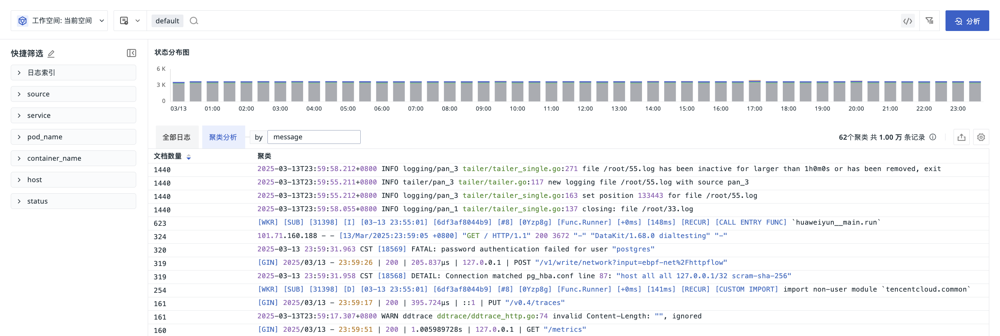

# 日志查看器
---

日志数据采集到<<< custom_key.brand_name >>>后，您可以在日志查看器查看工作空间内全部日志内容。

**注意**：若当前登录账号角色在**日志 > [数据访问](../management/logdata-access.md#list)** 设置了“仅显示跟我相关的规则”，查询的日志内容会同步受其影响。

## 查看模式

日志查看器支持三种查看模式，包括：

- [全部日志](#all)；
- [聚类分析](#cluster)；
- [图表分析](#charts)。

### 全部日志 {#all}

基于采集的原始日志数据进行查看和分析。
    

### 聚类分析 {#cluster}

日志查看器提供高效聚类功能，基于 `message` 字段对日志进行相似性分析，自动展示最近 50 条日志。

您也可自定义聚类字段。在时间控件中选择时间范围后，系统将分析该时段内的 10,000 条日志，并聚合相似条目。

在聚类分析列表，您可以通过以下操作对数据进行管理：

- 点击 :octicons-triangle-up-16: & :octicons-triangle-down-16: 对文档数量排序（默认倒序）；
    
- 点击 :octicons-gear-24:，选择显示 1 行、3 行、10 行或全部内容。
    
- 点击 :material-tray-arrow-up:，导出所有聚类日志数据。

### 图表分析 {#charts}

在查看器的**分析**模式下，系统基于 1-3 个标签对日志数据进行分组统计，展示不同时间下的分布特征和趋势。

支持时序图、排行榜、饼图和矩形树图四种图表形式。

您可通过以下操作来管理图表分析模式：

- 在图表下方，支持基于字段筛选查询；
- 时序图模式下，可选择面积图、折线图或柱状图；
- 针对显示的聚类数据：
    - 时序图模式下，可选择 `slimit` 为 5/10/20/50/100；
    - 排行榜/饼图/矩形树图模式下，可选择 `limit to` 最大或最小为 5/10/20/50/100；
- 点击 :material-list-box:，选择图例显示位置（隐藏、底部、右侧）；
- 点击 :art:，自定义图例颜色；
- 点击 :material-tray-arrow-up:，导出图表为 CSV 文件、导出到笔记或仪表板，或复制图表。
    

    

