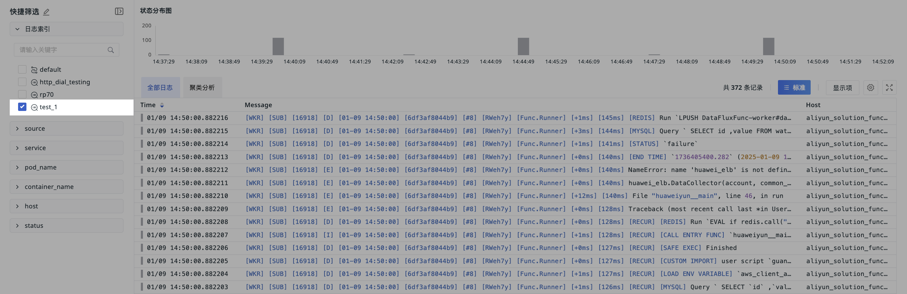

# 日志索引
---

<<< custom_key.brand_name >>>具备高级的日志索引功能，通过创建并管理多个索引，系统自动根据设定的筛选条件将日志数据归档到相应的索引中。此外，您还能为每个索引定制数据存储策略，以有效控制和降低存储成本，实现数据管理的灵活性与经济效益的双重优化。

在日志索引下，您可以：

:material-numeric-1-circle: [新建索引](#create)；    
:material-numeric-2-circle: [绑定外部索引](#binding-index)。

???+ warning "注意"

    默认情况下，日志多索引无法新建，**请联系<<< custom_key.brand_name >>>客户经理申请开通此功能**。

## 新建索引 {#create}

在<<< custom_key.brand_name >>>工作空间，点击**日志 > 索引 > 新建索引**。

1. 索引名称：自定义索引的名称；  
2. 添加过滤条件：支持 `in` 、`not in` 等筛选方式；
3. 配备数据存储策略：支持选择 3 天、7 天、14 天、30 天 和 60 天。
    - 注意：部署版用户在此处可自定义输入数据存储策略时长，范围：1d ~ 1800d。 

???+ warning "注意"

    1. 索引名称必须唯一，且必须以字母开头，并且只能包含小写字母、数字或”_“字符；不可修改，且已删除的索引名称不可再创建；
    2. 默认情况下，所有日志都存在一个名称为 `default` 的默认索引中，默认索引不允许修改和删除；  
    3. 设置日志多索引以后，日志会流入第一个匹配的索引中，同一条日志不会跨索引重复保存；  
    4. 日志多索引包括 `default` 索引在内，最多存在 6 个，即自定义索引最多能创建 5 个；
    5. 标准成员和只读成员只有查看权限，管理员和拥有者可以编辑、删除、拖拽排序。  

### 示例 {#example}

在日志索引，配置索引过滤条件为 `container_name` 为 `dataflux`。索引新建成功后，匹配这一筛选条件的日志数据上报时，会匹配流入第一个索引 `test_1`。

在索引列表，点击该索引即可跳转到日志查看器，查看对应的日志数据。或者您可以直接前往**日志 > 查看器**选择不同的索引查看对应的日志内容。

## 绑定外部索引 {#binding-index}

<<< custom_key.brand_name >>>支持绑定外部的索引数据，绑定成功后，您可以在<<< custom_key.brand_name >>>工作空间对外部索引数据进行查询和分析。

目前支持的外部索引包括：

:material-numeric-1-circle: [SLS Logstore](./sls.md)    
:material-numeric-2-circle: [Elasticsearch](./elasticsearch.md)          
:material-numeric-3-circle: [OpenSearch](./opensearch.md)          
:material-numeric-4-circle: [日志易](./logease.md)      
:material-numeric-5-circle: [火山引擎 TLS](./tls.md)          

**注意**：

- 绑定的索引仅支持删除（删除即为取消绑定），取消绑定后则无法查询该索引下的日志；
- 其他索引不能与日志索引重名，也不能与历史日志索引重名。

## 字段映射 {#mapping}

由于<<< custom_key.brand_name >>>和外部索引的标准字段可能不一致，在<<< custom_key.brand_name >>>中缺失部分字段可能会造成部分功能无法正常使用。

为了在<<< custom_key.brand_name >>>快捷查看和分析外部索引的日志数据，<<< custom_key.brand_name >>>提供字段映射的功能，在绑定外部索引时可直接为日志的字段进行映射。

1. `time`：日志的上报时间，SLS Logstore 默认映射 `date` 字段为 `time`，Elasticsearch、OpenSearch 可按照实际日志数据自行填写；若没有此字段，在日志查看器中数据将乱序展示。
2. `_docid`：日志的唯一 ID，映射后您可以查看绑定的日志详情，例如：您可以将原字段 `logid` 映射为 `_docid`。如果在这部分日志中，`logid` 的 `value` 不唯一，此时若不刷新详情页，则不会产生任何影响；若刷新了详情页，则取时间最早的一条日志展示。若没有此字段，日志详情页会有部分内容缺失。若映射字段不唯一，打开详情页时会取该 ID 对应的时间最早的一条日志进行展示。

3. `message`：日志的内容，映射后您可以查看绑定的日志内容，并且通过 `message` 字段聚类分析日志数据。

> 更多详情，可参考 [日志查看器聚类分析](../explorer.md)。

您也可以在外部索引列表，点击**修改**进入需要修改字段映射的索引，修改该索引的映射字段。

???+ warning "注意"

    - 每个索引的映射规则不相通，各自独立保存；
    - 若某条日志存在 `_docid` 字段，又映射了一个相同字段，则原日志中的 `_docid` 不生效。

## 管理索引 {#manag}

您可通过以下操作对索引列表进行管理。

:material-numeric-1-circle: 禁用/启用

- 禁用索引后，后续日志不会再进入该索引，会继续匹配流入其他索引进行保存，若无匹配其他索引，则保存在默认 `default` 索引中；
    
- 启用索引后，后续日志会重新进入该索引进行保存。

:material-numeric-2-circle: 编辑

点击**编辑**图标，即可编辑已经创建的日志索引。在下图中，当前索引 `index.da` 新建成功后，`source` 为 `datakit` 的日志数据上报时，会匹配流入到第一个符合的索引进行保存。

**注意**：变更存储策略会删除索引中的数据，请谨慎操作。

:material-numeric-3-circle: 操作审计：点击即可前往查看针对该索引的所有操作日志。

:material-numeric-4-circle: 删除

点击 :fontawesome-regular-trash-can: 图标，即可删除已经创建的日志索引。

**注意**：删除索引会同时删除该索引中的日志数据，若无其他匹配索引，后续上报的日志数据会保存在默认索引 `default` 中。

若当前被删除的索引已被授权给其他工作空间查询，删除后对方空间将不能再继续查询该索引。

删除日志索引后，您可按需创建同名索引。

:material-numeric-5-circle: 拖拽

点击 :fontawesome-solid-grip-vertical: 图标，即可上下拖拽已经创建的日志索引。

**注意**：日志会流入第一个匹配到的索引中，改变索引顺序可能会导致日志更改流向。

## 更多阅读

- [ :fontawesome-solid-arrow-right-long: &nbsp; **绑定 SLS Logstore 索引**](./sls.md)

- [ :fontawesome-solid-arrow-right-long: &nbsp; **绑定 Elasticsearch 索引**](./elasticsearch.md)

- [ :fontawesome-solid-arrow-right-long: &nbsp; **绑定 OpenSearch 索引**](./opensearch.md)

- [ :fontawesome-solid-arrow-right-long: &nbsp; **绑定日志易索引**](./logease.md)

- [ :fontawesome-solid-arrow-right-long: &nbsp; **绑定火山引擎 TLS 索引**](./tls.md)

- [ :fontawesome-solid-arrow-right-long: &nbsp; **日志查看器聚类分析**](../explorer.md#cluster)

