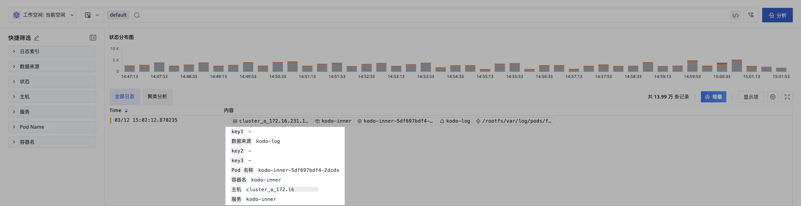
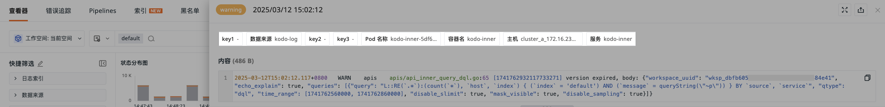

# 日志索引
---

<<< custom_key.brand_name >>>具备高级的日志索引功能，通过创建并管理多个索引，系统自动根据设定的筛选条件将日志数据归档到相应的索引中。此外，您还能为每个索引定制数据存储策略，以有效控制和降低存储成本，实现数据管理的灵活性与经济效益的双重优化。

在日志索引下，您可以：

- [新建索引](#create)；    
- [绑定外部索引](#binding-index)。

???+ warning "注意"

    默认情况下，日志多索引无法新建，**请联系<<< custom_key.brand_name >>>客户经理申请开通此功能**。

## 开始新建 {#create}

1. 进入**日志 > 索引 > 新建索引**页面；
2. 自定义索引的名称；  
3. 添加过滤条件：支持 `in` 、`not in` 等筛选方式；
4. 配置数据存储策略，选择标准存储时长、低频存储时长、归档存储时长；
5. 输入[关键字段](#key_key)。
    
???+ warning "注意"

    部署版用户在此处可自定义输入数据存储策略时长，范围：1d ~ 1800d。 

???+ abstract "索引规则"

    - 索引名称必须唯一，以字母开头，仅包含小写字母、数字或 “_” 字符，不可修改且已删除的索引名称不可再创建；
    - 默认索引：所有日志默认存入名为 `default` 的索引中，该索引仅支持修改关键字段； 
    - 日志流向：设置多索引后，日志流入第一个匹配的索引，同一条日志不会跨索引重复保存；  
    - 索引数量限制：包括 `default` 索引在内，最多存在 6 个索引，即自定义索引最多能创建 5 个；
    - 成员权限：标准成员和只读成员只有查看权限，管理员和拥有者可以编辑、删除、拖拽排序。

### 关键字段 {#key_key}

在索引的维度下设置专属关键字段，确保日志数据的展示不受显示列配置影响，最终呈现在日志查看器 > [堆叠模式](../manag-explorer.md#mode)，便于高效分辨和分析不同日志索引下的数据。

#### 定义规则

- 以逗号 `,` 作为分隔符；
- `message` 中列出字段为索引中所配置的关键字段，格式为 `key:value`，若 `value` 无值，则显示“-”；
- 索引中配置过关键字段的日志数据不受显示项影响，仅针对 `message` 列。

#### 显示示例

1. 定义 `default` 的关键字段为 `key1,source,key2,key3,pod_name,container_name,host,service`；
2. 在查看器，选中仅查看 `default` 索引的数据；
3. 效果如下图：

## 绑定外部索引 {#binding-index}

<<< custom_key.brand_name >>>支持绑定外部索引数据，绑定成功后可在工作空间查询和分析外部索引数据。

目前支持的外部索引包括：

:material-numeric-1-circle: [SLS Logstore](./sls.md)    
:material-numeric-2-circle: [Elasticsearch](./elasticsearch.md)          
:material-numeric-3-circle: [OpenSearch](./opensearch.md)          
:material-numeric-4-circle: [日志易](./logease.md)      
:material-numeric-5-circle: [火山引擎 TLS](./tls.md)          

**注意**：

- 绑定的索引仅支持删除，取消绑定后无法查询该索引下的日志；  
- 其他索引不能与日志索引重名，也不能与历史日志索引重名。

## 字段映射 {#mapping}

由于<<< custom_key.brand_name >>>和外部索引的标准字段可能不一致，为确保功能正常使用，提供字段映射功能。

为了在<<< custom_key.brand_name >>>快捷查看和分析外部索引的日志数据，<<< custom_key.brand_name >>>提供字段映射的功能，在绑定外部索引时可直接为日志的字段进行映射。

| 字段      | 说明        |
| ----------- | ----------- |
| `time`      | 日志志的上报时间，SLS Logstore 默认映射 `date` 字段为 `time`，Elasticsearch、OpenSearch 可按实际数据填写；若无此字段，日志查看器中数据将乱序展示。        |
| `_docid`      | 日志的唯一 ID。映射后可查看绑定日志详情。若原字段不唯一，刷新详情页后取时间最早的一条日志展示。若无此字段，日志详情页会有部分内容缺失。        |
| `message`      | 日志的内容。映射后可查看绑定日志内容，并通过 `message` 字段聚类分析日志数据。        |

> 更多详情，可参考 [日志查看器聚类分析](../explorer.md)。

您也可以在外部索引列表中点击**修改**，进入需要修改字段映射的索引进行修改。

???+ warning "注意"

    - 每个索引的映射规则不相通，各自独立保存；
    - 若某条日志存在 `_docid` 字段，又映射了相同字段，则原日志中的 `_docid` 不生效。

## 管理索引 {#manag}

您可通过以下操作对索引列表进行管理。

=== "禁用/启用"

    - 禁用索引后，后续日志不会再进入该索引，会继续匹配流入其他索引进行保存，若无匹配其他索引，则保存在默认 `default` 索引中；
        
    - 启用索引后，后续日志会重新进入该索引进行保存。

=== "编辑"

    点击**编辑**图标，可编辑已创建的日志索引。在下图中，当前索引 `index.da` 新建成功后，`source` 为 `datakit` 的日志数据上报时，会匹配流入到第一个符合的索引进行保存。

    **注意**：变更存储策略会删除索引中的数据，请谨慎操作。

    

=== "操作审计"

    点击可查看针对该索引的所有操作日志。

=== "删除"

    点击 :fontawesome-regular-trash-can: 图标，可删除已创建的日志索引。

    **注意**：删除后，该索引中的日志数据也会被删除，若无其他匹配索引，后续上报的日志数据会保存在默认索引 `default` 中。

    

    若被删除的索引已被授权给其他工作空间查询，删除后对方空间将不能再继续查询该索引。

    

    删除日志索引后，可按需创建同名索引。

=== "拖拽"

    点击 :fontawesome-solid-grip-vertical: 图标，可上下拖拽已创建的日志索引。

    **注意**：日志会流入第一个匹配到的索引中，改变索引顺序可能会导致日志更改流向。

## 更多阅读

- [ :fontawesome-solid-arrow-right-long: &nbsp; **绑定 SLS Logstore 索引**](./sls.md)

- [ :fontawesome-solid-arrow-right-long: &nbsp; **绑定 Elasticsearch 索引**](./elasticsearch.md)

- [ :fontawesome-solid-arrow-right-long: &nbsp; **绑定 OpenSearch 索引**](./opensearch.md)

- [ :fontawesome-solid-arrow-right-long: &nbsp; **绑定日志易索引**](./logease.md)

- [ :fontawesome-solid-arrow-right-long: &nbsp; **绑定火山引擎 TLS 索引**](./tls.md)

- [ :fontawesome-solid-arrow-right-long: &nbsp; **日志查看器聚类分析**](../explorer.md#cluster)

