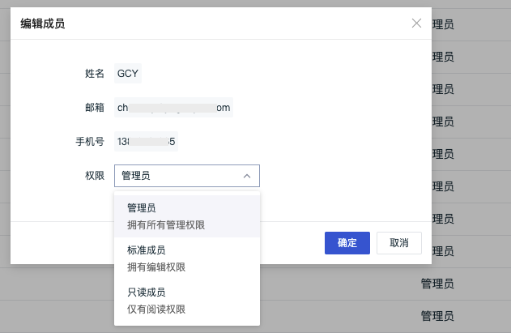
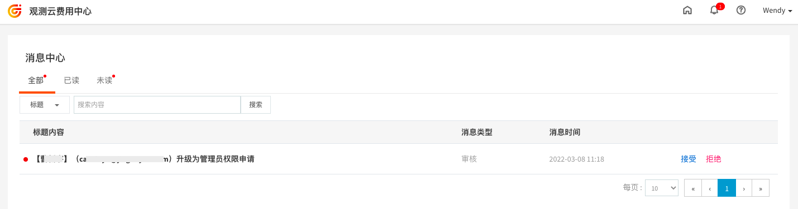
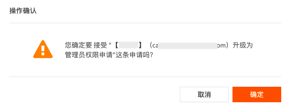
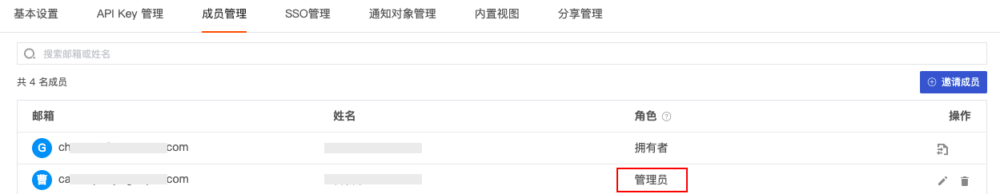

# 权限管理
---

观测云支持通过**成员管理**自定义成员的权限。目前支持定义四种成员身份，分别为“拥有者”、“管理员”、“标准成员”和“只读成员”。

## 成员身份

观测云目前支持四种成员身份，分别为“拥有者”、“管理员”、“标准成员”和“只读成员”。

| **角色** | **说明** |
| --- | --- |
| 拥有者 | 当前工作空间的拥有者，拥有最高操作权限，可以指定当前空间“管理员”并进行任意的空间配置管理，包括升级空间付费计划、解散当前空间。  **注意：** - 工作空间创建者默认为“拥有者” - 一个工作空间只能有一个“拥有者” - “拥有者”不可退出工作空间 - “拥有者”可以将权限转让给空间成员，成功转让后原“拥有者”降级为“管理员” - 若当前“拥有者”已不在工作空间，最早的管理员升级为“拥有者”  |
| 管理员 | 当前工作空间的管理者，可以设置用户权限为“只读成员”或“普通成员”，具有空间配置管理的权限，包括：访问当前工作空间的付费计划与清单；对工作空间的基本设置、成员管理、通知对象管理进行操作；对数据的采集、禁用/启用、编辑、删除等进行管理等；不包括升级空间付费计划、解散当前空间。  **注意**：管理员无法操作【危险操作】内容（调整存储策略和删除指标集） |
| 标准成员 | 具备查看、编辑、存储、分享工作空间数据的权限 |
| 只读成员 | 仅能够对工作空间的数据进行查看，无权对数据进行修改、编辑、储存等其他操作 |

## 修改权限

观测云支持在邀请成员时预先设定成员身份，或通过**管理 > 成员管理**更改成员身份。

- 当前工作空间“拥有者”可设定任意成员身份，或转移‘拥有者“身份至其他工作成员
   - “拥有者” 在给当前工作空间成员升级到 “管理员” 的时候，需要同时给观测云费用中心发送一条验证信息，若费用中心侧**接受**该验证，则该成员权限变更为“管理员”；若费用中心侧**拒绝**该验证，则该成员提权失败
   - “拥有者” 在给当前工作空间成员升级到 “只读成员”或“标准成员” 的时候，无需额外验证
- 当前工作空间“管理者”可定义“只读成员“和”标准成员“身份，无法修改其他管理员身份
- 若当前工作空间升级到商业版，升级到“管理员”需要拥有者在费用中心验证通过才能生效

### 商业版管理员提权审核示例

在观测云工作空间**管理 > 成员管理**，选择需要升到管理员的成员，点击右侧**编辑**按钮，在弹出的对话框中，“权限”选择为“管理员”，点击**确定**。

注意：观测云仅支持“拥有者”为当前工作空间成员赋予“管理员”权限。  提示权限验证：

- 若当前工作空间拥有者是观测云费用中心管理员，则可直接点击**前往费用中心审核**，免登录到观测云费用中心进行操作；
- 若当前工作空间拥有者不是观测云费用中心管理员，则需要通知观测云费用中心管理员 [登录费用中心](https://boss.guance.com/) 进行操作。

注意：观测云商业版提权工作空间成员到“管理员”，需要跳转到观测云费用中心审核；免费版无需到观测云费用中心审核。  在观测云费用中心的消息中心，点击**接受**。  在**操作确认**对话框，点击**确定**。  可以看到提权申请已经被接受。  返回观测云工作空间成员管理，即可看到工作空间成员已经为“管理员”。 

---

