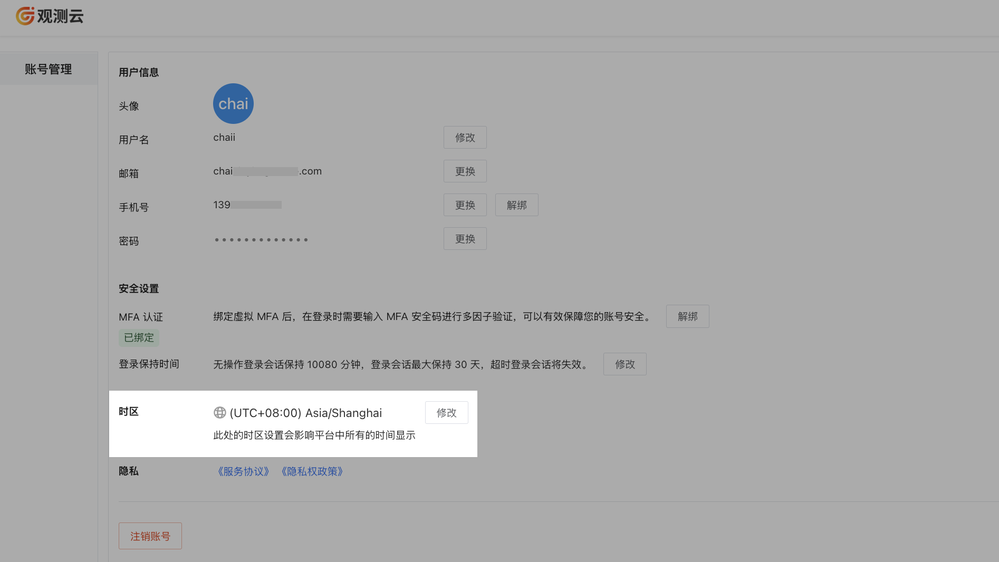

# 账号管理
---

观测云支持注册用户通过多站点的登录进入工作空间并享受相关服务。如需对当前账号进行管理和设置，您可通过点击左下角**账号 > 账号管理**，对当前账号进行管理和设置。

## 注册账号

您可以在 [观测云官网](https://www.guance.com/) ，**[立即注册](https://auth.guance.com/businessRegister)** 为观测云用户，更多注册详情可参考文档 [注册商业版](../billing/commercial-register.md)。

### 登录账号

注册完成后，您可以通过 [观测云官网](https://www.guance.com/) ，点击**登录**，选择您注册的站点，输入登录账号和密码，登录到观测云控制台。

???+ attention

    - 单个观测云站点下，仅支持绑定一个手机号码、一个邮箱，暂不支持港澳台和国外手机号码；
    - 不同站点的账号独立不互通，更多站点说明可参考 [站点说明](../billing/commercial-register.md#site)；
    - 支持选择 [单点登录](../management/sso/index.md) 到观测云。

### 新手引导

登录到观测云控制台后，观测云为新用户提供了一系列引导服务，您可通过“观测云产品介绍”和“观测云产品架构”小视频快速了解观测云；或者您可以点击 **[从安装 DataKit 开始](../datakit/datakit-install.md)** 即可安装配置第一个 DataKit。

### 修改账号用户信息

注册完成后，您可在工作空间，点击左侧**账号 > 账号管理**进行账号修改。

- 支持修改头像、用户名、邮箱、手机和密码；
- 支持绑定 [MFA 认证](#mfa)；
- 支持修改 [登录保持时间](#login-hold-time)；
- 支持修改 [时区](#zone)。

## SSO 账号 {#sso}

除了通过注册观测云账号登录以外，支持企业用户通过 SSO 单点登录的方式登录到观测云，进入工作空间后，点击左侧**账号 > 账号管理**，可对 SSO 账号进行修改。

- 支持修改头像、用户名；  
- 支持修改 [登录保持时间](#login-hold-time)。

???+ attention

    通过 SSO 登录的账号，默认使用 SSO 配置的登录保持时间，在账号管理修改后，使用修改后的登录保持时间。
    
    > 更多 SSO 配置详情可参考文档 [SSO 管理](../management/sso/index.md)

## 账号安全设置

### MFA 认证 {#mfa}

观测云提供 MFA 认证管理，帮助在账号用户名和密码之外再额外增加一层安全保护，开启 MFA 认证后，您在登录时需要进行二次校验，帮助您提高账户的安全性。更多详情可参考文档 [MFA 管理](mfa-management.md)。

### 登录保持时间 {#login-hold-time}

观测云支持为登录到工作空间的账号设置会话保持时间，包括工作空间注册的账号和 SSO 单点登录的账号。

注册账号可在工作空间，点击左下角**账号 > 账号管理**，在登录保持时间，点击修改默认的登录会话保持时间，包括无操作登录会话保持时间和登录会话最大保持时间，设置以后，超时登录会话会失效。

- 无操作登录会话保持时间：支持设置范围 180 ～ 1440 分钟，默认为 180 分钟；
- 登录会话最大保持时间：支持设置范围 0 ～ 7 天，其中 0 表示永不超时，默认为 7 天。

### 时区 {#zone}

观测云支持成员修改时区，从而切换到对应的工作空间时区查看数据。观测云默认跟随“浏览器时间”，即本地浏览器检测到的时间。

在工作空间，点击左下角**账号 > 账号管理 > 时区**，即可修改当前的时区。

**注意**：设置新的时区后，您当前账号所在的所有工作空间均按照设置后的时区进行显示，请谨慎操作。

您也可以在观测云提供的 [时间控件](../getting-started/function-details/explorer-search.md#time) 来快速修改时区。

#### 工作空间时区 {#workspace}

考虑到有时工作空间的数据基于一个时区上报，而当前工作空间的成员可能所处不同国家或地区，为保证各成员能在同一时区分析数据、排查故障。您可前往**工作空间管理 > 设置 > 高级设置 > 工作空间时区**为成员统一配置时区。配置完成后，当工作空间的其他成员选定了配置好的**工作空间时区**，其时区状态会跟随配置好的空间时区变化而变化。

???+ attention 

    - 仅当前工作空间的 Owner 及 Administrator 拥有工作空间时区配置权限；          
    - 当**工作空间时区**被设置后，不会自动更改成员所在工作空间的时区，需成员手动选择；   
    - 当工作空间的其他成员时区选定了**工作空间时区**，若工作空间时区被删除，成员时区会自动变为**浏览器时间**；    

