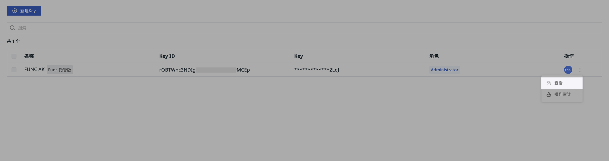

# API Key 管理
---

<<< custom_key.brand_name >>>支持通过调用 Open API 接口来获取和更新工作空间中的数据。在调用 API 接口之前，您需要先创建一个 API Key，用于身份认证。

> 关于 API 介绍，可参考 [OpenAPI](../../management/api-key/open-api.md)。

## 开始新建

1. 定义 Key 名称；
2. 选择当前 API Key 的角色；
3. 点击确定。

**注意**：若为该 API Key 选择了多个角色，最终权限将是所选角色权限的**合集**。

创建成功后，即可获取用于调用的 API Key ID 和密钥。

