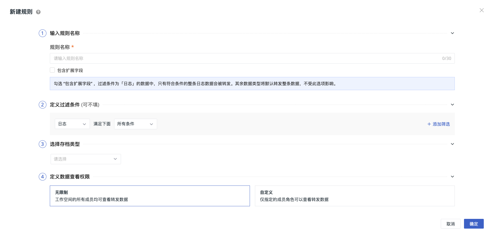
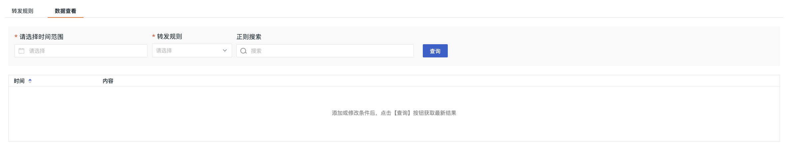

# 数据转发
---

支持将日志、应用性能、用户访问和事件数据保存到其对象存储，或转发到外部存储系统。您可以自由选择存储目标，并灵活管理数据转发。

规则生效后，在数据转发页面，您可以通过设置查询时间和数据转发规则，快速检索存储的数据，包括<<< custom_key.brand_name >>>备份日志、AWS S3、华为云 OBS、阿里云 OSS 和 Kafka 消息队列等。

## 前提条件

仅限商业版。

## 开始新建

进入**数据转发 > 转发规则 > 新建规则**页面。

???+ warning "注意"

    数据转发规则创建完成后，系统将每 5 分钟执行一次规则校验。  

### 输入规则名称

1. 规则名称：即当前数据转发规则的名称。   
2. 包含扩展字段：默认仅转发符合条件日志的 `message` 字段内容。若勾选 “包含扩展字段”，则符合条件的整条日志数据都会被转发。应用性能和用户访问数据默认转发整条数据，不受此选项影响。

???+ warning "注意"

    创建多个数据转发规则时，优先匹配勾选包含扩展字段的规则。若不同规则命中同一条数据，则优先按包含扩展字段的逻辑展示整条日志数据。     

### 定义过滤条件

1. 数据源：包含日志、应用性能、用户访问、事件数据。

2. 过滤条件：支持自定义条件间的运算逻辑，可选择**所有条件**、**任意条件**：

    - 所有条件：仅匹配所有过滤条件都满足的日志数据才会被保存到数据转发；

    - 任意条件：任意一个过滤条件满足即可被保存到数据转发。

**条件运算符见下表：**

| 条件运算符      | 匹配类型     | 
| ------------- | -------------- | 
| in、not in      | 精确匹配，支持多值（逗号隔开） | 
| match、not match | 模糊匹配，支持输入正则语法 | 

???+ warning "注意"

    不添加过滤条件即表示保存全部日志数据；支持添加多条过滤条件。

### 选择存档类型

???+ warning "注意"

    五种存档类型全站点开放。

为提供更加全面的数据转发存储方式，<<< custom_key.brand_name >>>支持五种存储路径。

:material-numeric-1-circle-outline: <<< custom_key.brand_name >>>：当选择数据转发存储对象为<<< custom_key.brand_name >>>，匹配到的日志数据将被保存到**<<< custom_key.brand_name >>>侧的 OSS、S3、OBS 对象存储**中。

:material-numeric-2-circle-outline: [AWS S3](./backup-aws.md)；

:material-numeric-3-circle-outline: [华为云 OBS](./backup-huawei.md)；

:material-numeric-4-circle-outline: [阿里云 OSS](./backup-ali.md)；

:material-numeric-5-circle-outline: [Kafka 消息队列](./backup-kafka.md)。

???+ warning "注意"

    当选择数据转发存储对象为<<< custom_key.brand_name >>>，日志数据最低存储默认为 180 天，规则一旦创建无法取消，存储期间会每天收取费用；您可以前往**管理 > 设置 > 变更数据存储策略**进行修改。

### 定义数据查看权限 {#permission}

为转发的数据设置查看权限，能有效提高数据安全性。

- 无限制：工作空间的所有成员均可查看转发数据；
- 自定义：指定可以查看转发数据的成员角色。

## 管理转发规则

所有被创建的数据转发规则，均可在转发规则列表中查看。您可通过以下操作来管理列表：

- 输入规则名称进行搜索； 

- 启用或禁用当前规则；

- 点击规则右侧的搜索、编辑或删除按钮，进行相应操作；

- 可选中多个规则进行批量操作。

???+ warning "注意"

    - 查看转发数据最多存在 1 小时延迟；          
    - 编辑模式下，访问类型和地区不可调整；选择<<< custom_key.brand_name >>>存储的规则，编辑和查看内容一致；           
    - 删除规则后，已转发的数据不会被删除，但不再产生新数据。

## 数据查看 {#explorer}

在数据查看页面，可依据时间范围和转发规则搜索查询最新数据结果。此处还可通过正则语法搜索。

系统会根据选中的时间按批次获取文件搜索匹配数据，每批返回 50 条。若首次查询未查到数据或返回不足 50 条，可手动点击 “继续查询” 直至扫描完成。

## 数据转发查询时长 {#query_time_change}

配置查询时长后，查看转发数据时，查询时间区间将会受到此处时长配置的影响。

1. 进入管理 > 空间设置 > 高级设置 > 配置查询时长；
2. 选择时长
3. 确定。

