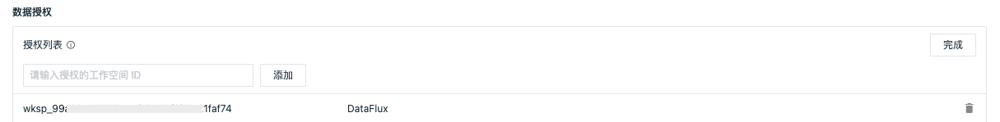

# 跨工作空间授权
---

观测云按照工作空间为单位，各个工作空间的数据相互独立，保障了数据的安全性。同时观测云支持跨空间数据授权的方式，<u>授权多个工作空间的数据给到当前的工作空间</u>，通过场景仪表板和笔记的图表组件进行查询和展示。您如果有多个工作空间，配置数据授权后，即可在一个工作空间查看所有工作空间的数据。

一个工作空间内查询同一站点下其他工作空间数据的功能，意味着用户可以在一个工作空间中，实现对同一站点内所有工作空间数据的统一汇总查询。需注意，此功能仅限于同一站点内的工作空间之间。

## 添加数据授权 {#site}

进入**管理 > 跨工作空间授权 > 授权给**，点击**添加授权**：

:material-numeric-1-circle-outline: 输入工作空间 ID：

我们假定一个场景，需要把工作空间 A 的数据授权给到工作空间 B（如：Guance）来查看。

在观测云工作空间 B（如：Guance），点击**管理 > 设置 > 工作空间 ID**，点击**复制**，即可获得其 ID。

:material-numeric-2-circle-outline: 选择数据范围：包含日志、应用性能、指标、基础对象、资源目录、事件、用户访问、安全巡检、网络、profile；支持多选。

- 日志索引：若您选择的数据范围中包含日志数据（即全部、日志这两种），可继续选择您需要授权查看的索引。

**注意**：此处的索引包含默认索引和所有日志索引。**不包含**外部索引。

<!--
:material-numeric-2-circle-outline: 选择角色：您可选择当前工作空间除 “拥有者” 以外的其他所有角色，被授权的工作空间在进行数据查看时，会根据选择的角色范围分配数据访问权限。

比如，工作空间 A 存在角色 1、角色 2，若将工作空间 A 的数据查看权限授权给工作空间 B 并指定为角色 1 和角色 2 下的权限范围，那么后续工作空间 B 的成员去查询 A 数据时，会根据 A 工作空间 的这两个角色被分配到的数据访问范围做数据列出和脱敏处理。
-->

添加完成以后，可以在**授权列表**查看已经被授权查看当前工作空间 A 数据的工作空间 B（如：Guance）。

若需要删除某条工作空间的数据授权，可点击其右侧的**删除**或选择**批量删除**。

## 数据联动

工作空间 B（如：Guance）获得数据授权后，可以打开**场景 > [仪表板](../scene/dashboard.md)** 或者 **[笔记](../scene/note.md)**，选择图表组件，在**高级设置 > 空间授权**选择被授权查看的工作空间 A（如下图），然后就可以通过 **[图表查询](../scene/visual-chart/chart-query.md)** 查看和分析被授权工作空间 A（如下图）的数据。

<!--
<u>场景仪表板示例说明：</u>

上面三个有数据展示的图表是查询了被授权工作空间A（如：开发-----）的数据；下面三个无数据展示的图表是查询当前工作空间B（如：DataFlux），由于该工作空间无数据，所以展示无数据。

-->

## 邮件通知

添加或删除数据授权，对应工作空间的拥有者和管理员会收到邮件通知。

## 审计事件

添加和删除数据授权都会产生审计事件。进入**管理 > 基本设置 > 安全 > 操作审计**，点击**查看**，即可查看当前工作空间所有的审计事件。

<!--

-->

