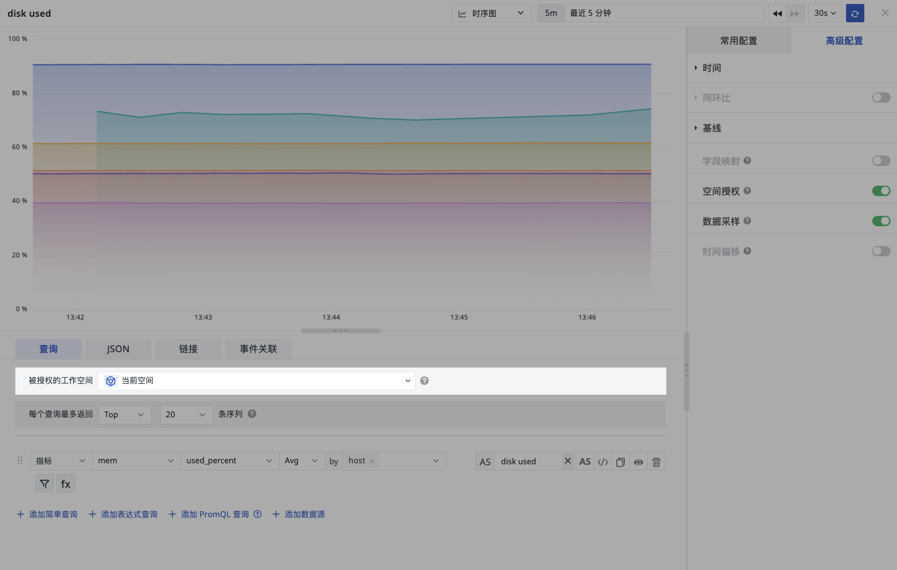
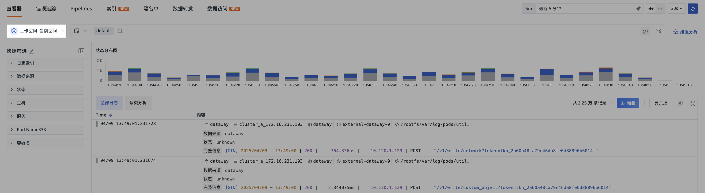
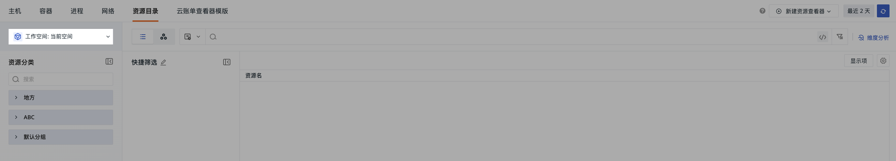

# 跨工作空间授权
---

<<< custom_key.brand_name >>>以工作空间为单位，各工作空间数据相互独立，确保数据安全。同时，支持跨工作空间数据授权，**可将多个工作空间的数据授权给当前工作空间**，通过场景仪表板和笔记的图表组件进行查询和展示。配置数据授权后，您可以在一个工作空间查看所有工作空间的数据。

在工作空间内查询同一站点下其他工作空间数据的功能，允许用户在一个工作空间中汇总查询同一站点内所有工作空间的数据。需注意，此功能仅限于同一站点内的工作空间之间。

???+ warning "注意"

    不支持同时多站点查询。

    
## 添加授权 {#site}

1. 进入**管理 > 跨工作空间授权 > 授权给**；
2. 点击**添加授权**；
3. 选择授权的站点；
4. 输入授权的工作空间 ID；
5. 框定数据范围；
6. 确认。

???+ abstract " 如何获取工作空间 ID"

    进入**管理 > 设置 > 工作空间 ID**，点击**复制**，即可获得工作空间 ID。

    

### 数据范围

包含云账单、日志、应用性能、指标、基础对象、资源目录、事件、用户访问、安全巡检、网络、profile；支持多选。

- 日志索引：若您选择的数据范围中包含日志数据（即选中“全部”、“日志”），可继续选择您需要授权查看的索引。

???+ warning "注意"

    此处的索引包含默认索引和所有日志索引。**不包含**外部索引。

## 查看授权

- 授权给：在本工作空间添加其他工作空间的授权；

- 可查看：在其他工作空间添加本工作空间的授权。

在授权列表，您可进行以下操作进行管理：

- 基于站点进行列表筛选；
- 输入工作空间名称或 ID 进行搜索定位；
- 删除某条工作空间的数据授权；
- 通过编辑按钮对授权规则进行再编辑；
- 添加或删除数据授权时，系统将生成审计事件，并向对应工作空间的拥有者和管理员发送邮件通知。

## 适用场景

成功添加跨工作空间授权后，您可以通过工作空间内的以下入口进行跨空间查询。

=== "仪表板"

    

    ---

=== "图表查询"

    

    ---

=== "内置视图"

    

    ---

=== "日志查看器"

    

    ---

=== "错误追踪"

    

    ---

=== "资源目录"

    

    ---

