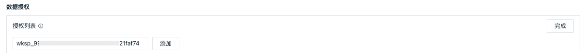

# 数据授权管理
---

观测云支持对数据进行授权查看和脱敏处理，实现对不同权限的工作空间成员数据查看的管理。

## 敏感字段屏蔽

数据采集上报到观测云工作空间以后，部分数据中存在的一些敏感信息字段，比如说 IP 地址、用户信息等，针对这部分信息可以通过配置敏感字段来做脱敏处理。

注意：

- 不同的数据类型，可以自定义配置该数据下的敏感字段（字段名区分大小写）。数据类型包含：日志、指标、基础对象、自定义对象、事件、应用性能、用户访问、安全巡检、网络、Profile。
- 字段配置脱敏后，字符串（string）类型字段数据返回显示 "***"，数值（number）类型字段数据返回显示 "-1"。
- 配置敏感字段仅支持观测云工作空间管理员及以上的成员进行操作，标准和只读成员仅支持查看配置的敏感字段。
- 配置了敏感字段后，仅支持当前工作空间内管理员及以上的成员权限查看原始数据，标准和只读成员在对应的查看器或者图表中无法查看脱敏前信息。

### 配置敏感字段

在观测云工作空间，点击「管理」-「数据权限管理」，在「敏感字段屏蔽」点击“配置”，即可添加敏感字段。

选择对应的数据类型后，在输入框输入需要脱敏的字段 ，点击“添加”，并点击“完成”，即可查看已经配置的敏感字段，如“host_ip”等。若需要删除已经配置的敏感字段，点击“配置”后，再次点击字段右侧的“删除”小图标即可。

敏感字段配置完成后，可通过启用/禁用来控制其生效。

### 查看脱敏效果

#### 在日志查看器查看脱敏效果

在数据授权管理配置了日志数据的敏感字段“host_ip”以后，工作空间标准成员和只读成员在日志查看器只能看到脱敏后的“host_ip”。

#### 在场景查看脱敏效果

在数据授权管理配置了日志数据的敏感字段“host_ip”以后，工作空间标准成员和只读成员在场景仪表板的日志流图中只能看到脱敏后的“host_ip”。

## 数据授权

观测云按照工作空间为单位，各个工作空间的数据相互独立，保障了数据的安全性。同时观测云支持数据授权的方式，授权多个工作空间的数据给到当前的工作空间，通过场景仪表板和笔记的图表组件进行查询和展示。您如果有多个工作空间，配置数据授权后，即可在一个工作空间查看所有工作空间的数据。

注意：数据授权支持一个站点内的多个工作空间进行授权查看数据，不同站点之间的账号和数据相互独立，无法使用数据授权给到不同站点的工作空间查看数据。

### 获取工作空间 ID

在添加数据授权之前，需要确认把哪个工作空间的数据授权给到哪一个工作空间查看。我们假定一个场景，需要把工作空间A（如：开发******）的数据授权给到工作空间B（如：DataFlux）来查看。

在观测云工作空间B（如：DataFlux），点击「管理」-「基本设置」-「工作空间 ID」，点击“复制”，即可获得当前工作空间的ID。

### 添加数据授权

在观测云工作空间A（如：开发******），点击「管理」-「数据权限管理」，在「数据授权」点击“配置”，即可添加数据授权。

在输入框粘贴复制的工作空间 ID ，点击“添加”，并点击“完成”。

添加完成以后，可以在“授权列表”查看已经被授权查看当前工作空间A（如：开发******）数据的工作空间B（如：DataFlux）。

若需要删除数据授权，可点击“配置”，选择需要删除的工作空间，点击其右侧的“删除”小图标即可。

### 数据共享查询与分析

工作空间B（如：DataFlux）获得数据授权后，可以打开「场景」-「[仪表板](../scene/dashboard.md)或者「[笔记](../scene/note.md)」，选择图表组件，在“设置”的“工作空间”选择被授权查看的工作空间A（如：开发******），然后就可以通过[图表查询](../scene/visual-chart/chart-query.md)查看和分析被授权工作空间A（如：开发******）的数据。

**场景仪表板示例说明：**

上面三个有数据展示的图表是查询了被授权工作空间A（如：开发******）的数据；下面三个无数据展示的图表是查询当前工作空间B（如：DataFlux），由于该工作空间无数据，所以展示无数据。

### 邮件通知

添加数据授权后，对应工作空间的拥有者和管理员会收到添加授权邮件通知。

删除数据授权，对应工作空间的拥有者和管理员会收到删除授权邮件通知。

### 审计事件

添加和删除数据授权都会产生审计事件。

在观测云工作空间，点击「管理」-「基本设置」-「安全-操作审计」，点击“查看”，即可查看当前工作空间所有的审计事件。

